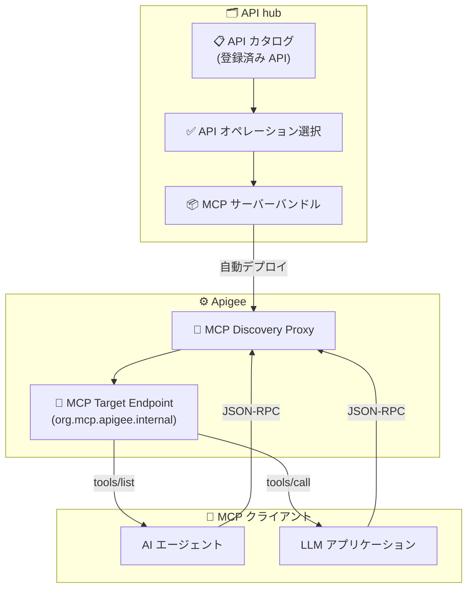

# Apigee API hub: Unified MCP Proxy Configuration in API hub (Preview)

**リリース日**: 2026-05-07

**サービス**: Apigee API hub

**機能**: Unified MCP Proxy Configuration in API hub (Preview)

**ステータス**: Public Preview

📊 [このアップデートのインフォグラフィックを見る](https://takech9203.github.io/google-cloud-news-summary/20260507-apigee-api-hub-mcp-proxy.html)

## 概要

Apigee API hub に、Model Context Protocol (MCP) ディスカバリプロキシを一元的に作成・デプロイできる新機能が Public Preview として追加されました。この機能により、API hub に登録されたカタログから特定の API オペレーションを選択し、それらを MCP サーバーとしてバンドルして、Apigee プロジェクト内にディスカバリプロキシとして自動デプロイできるようになります。

従来、Apigee で MCP エンドポイントを利用するには、手動で OpenAPI 仕様を記述し、MCP Discovery Proxy を個別に作成・設定する必要がありました。今回の Unified MCP Proxy Configuration により、API hub の GUI から直接 MCP プロキシを構成・デプロイできるようになり、AI エージェントアプリケーションが API を MCP ツールとして利用するまでの手順が大幅に簡素化されます。

この機能は、生成 AI とエージェント型アプリケーションの普及に伴い、既存の API 資産を AI エージェントから利用可能にしたい API プラットフォーム管理者や開発者にとって重要なアップデートです。

**アップデート前の課題**

- MCP 仕様を手動で Apigee 内に記述する必要があった
- OpenAPI 3.0.x 仕様ファイルを事前に準備し、個別に MCP Discovery Proxy を作成・デプロイする複数ステップの手動作業が必要だった
- API hub に登録済みの API カタログと MCP プロキシの管理が分離されており、一元管理ができなかった
- API オペレーションの選択とバンドルを手動で行う必要があり、運用負荷が高かった

**アップデート後の改善**

- API hub の UI から直接 MCP ディスカバリプロキシを作成・デプロイ可能になった
- 手動での MCP 仕様記述が不要になり、API hub のカタログから API オペレーションを選択するだけで MCP サーバーを構成できるようになった
- 選択した API オペレーションを MCP サーバーとして自動的にバンドル・デプロイする統合ワークフローが提供された
- API カタログと MCP プロキシの一元管理が API hub 内で完結するようになった

## アーキテクチャ図



API hub でカタログから API オペレーションを選択し、MCP サーバーとしてバンドルすると、Apigee に MCP Discovery Proxy として自動デプロイされます。MCP クライアント (AI エージェントや LLM アプリケーション) は、デプロイされたプロキシを通じて tools/list でツールを発見し、tools/call でツールを実行できます。

## サービスアップデートの詳細

### 主要機能

1. **統合 MCP プロキシ構成 (Unified MCP Proxy Configuration)**
   - API hub の UI から MCP ディスカバリプロキシを直接作成・デプロイ
   - 手動での MCP 仕様記述が不要
   - API hub カタログから API オペレーションを選択してバンドル

2. **自動デプロイメント**
   - 選択した API オペレーションを MCP サーバーとして自動パッケージング
   - Apigee プロジェクト内へのプロキシ自動デプロイ
   - デプロイ後は API hub に自動インポートされ MCP スタイルとして登録

3. **MCP ツール自動抽出**
   - デプロイされた MCP プロキシから OpenAPI 仕様をパースし MCP ツールを自動抽出
   - API hub 内で MCP スタイルでフィルタリング可能
   - セマンティック検索による自然言語での MCP ツール発見

4. **セキュリティ統合**
   - OAuth 2.1 / OpenID Connect (OIDC) 認証サポート
   - きめ細かい認可ポリシー (OAuth クライアント ID ベースのアクセス制御)
   - Protected Resource Metadata によるクライアント認証ディスカバリ

## 技術仕様

### MCP in Apigee の対応プロトコル

| 項目 | 詳細 |
|------|------|
| プロトコル | Model Context Protocol (MCP) |
| 通信方式 | JSON-RPC over HTTP/S |
| 対応メソッド | tools/list, tools/call |
| 認証 | OAuth 2.1, OpenID Connect (OIDC) |
| OpenAPI バージョン | 3.0.0, 3.0.1, 3.0.2, 3.0.3 |
| MCP ツール上限 | 1 組織あたり 1,000 ツール |

### 必要な IAM ロール

| ロール | 説明 |
|--------|------|
| `roles/apigee.admin` | MCP Discovery Proxy の作成・デプロイに必要 |
| `roles/serviceusage.serviceUsageAdmin` | Apigee API の有効化に必要 |

### 前提条件

- Apigee 組織がプロビジョニング済み (Subscription, Pay-as-you-go, Evaluation)
- API hub インスタンスが Google Cloud プロジェクトにプロビジョニング済み
- Apigee インスタンスが API hub サービスにアタッチ済み
- Comprehensive 環境へのデプロイ (MCP Discovery Proxy のデプロイ先)

## 設定方法

### 前提条件

1. Apigee 組織のプロビジョニング
2. API hub インスタンスのプロビジョニング
3. Apigee インスタンスと API hub の関連付け

### 手順

#### ステップ 1: 環境変数の設定

```bash
export PROJECT_ID=PROJECT_ID
export REGION=REGION
export RUNTIME_HOSTNAME=RUNTIME_HOSTNAME

gcloud auth login
gcloud config set project $PROJECT_ID
```

#### ステップ 2: API hub から MCP プロキシの作成

API hub の UI から、登録済みカタログの API オペレーションを選択し、MCP ディスカバリプロキシとしてバンドル・デプロイします。

#### ステップ 3: MCP サーバーの初期化確認

```bash
curl -X POST "https://MCP_ENDPOINT_URL/mcp" \
  -H "Content-Type: application/json" \
  -d '{
    "jsonrpc": "2.0",
    "id": 1,
    "method": "initialize",
    "params": {
      "protocolVersion": "2025-11-25"
    }
  }' \
  -H "Authorization: Bearer TOKEN"
```

#### ステップ 4: ツール一覧の確認

```bash
curl -X POST "https://MCP_ENDPOINT_URL/mcp" \
  -H "Content-Type: application/json" \
  -d '{
    "jsonrpc": "2.0",
    "id": 2,
    "method": "tools/list",
    "params": {}
  }' \
  -H "Authorization: Bearer TOKEN"
```

## メリット

### ビジネス面

- **Time-to-Value の短縮**: 既存 API 資産を迅速に AI エージェントから利用可能にし、エージェント型アプリケーションの開発を加速
- **運用コストの削減**: 手動での MCP 仕様記述・プロキシ設定が不要になり、API プラットフォーム管理者の運用負荷を軽減
- **API 資産の再活用**: 既に API hub に登録されている API カタログを、追加開発なしで AI エージェント向けに公開可能

### 技術面

- **一元管理**: API カタログと MCP プロキシの管理を API hub 内で統合
- **自動化されたワークフロー**: API オペレーション選択からデプロイまでの一連の作業を自動化
- **セマンティック検索との統合**: 自然言語クエリで MCP ツールを発見可能にし、開発者体験を向上
- **セキュリティの標準化**: OAuth 2.1 / OIDC による認証が標準で組み込まれ、セキュアなエージェントアクセスを実現

## デメリット・制約事項

### 制限事項

- 1 組織あたりの MCP ツール数は 1,000 に制限
- Apigee hybrid 組織では利用不可
- 対応する OpenAPI バージョンは 3.0.0 ~ 3.0.3 のみ (3.1.x は非対応)
- 複数デプロイリビジョンがある場合、最新デプロイリビジョンのツールのみが利用可能
- VPC-SC が有効な組織では API hub の API インサイトが MCP API に対して利用不可

### 考慮すべき点

- 本機能は Public Preview 段階であり、GA に向けて仕様が変更される可能性がある
- 一部リージョンではインフラストラクチャ容量の制限によりデプロイが失敗する可能性がある (asia-east2, asia-northeast3, asia-southeast2, australia-southeast1, europe-central2, europe-west12, europe-west9, me-central2, us-central2)
- MCP サーバーは現在 Server-Sent Events (SSE) ストリームをサポートしていない
- OAS ファイルは MCP 仕様スキーマに自動変換されない (既知の制限)

## ユースケース

### ユースケース 1: 社内 API カタログの AI エージェント公開

**シナリオ**: 大規模組織で数百の内部 API が API hub に登録されており、社内の AI アシスタントからこれらの API を利用可能にしたい。

**効果**: API hub から関連する API オペレーションを選択してバンドルするだけで、手動での MCP 仕様記述なしに AI エージェントが社内 API を発見・呼び出し可能になる。開発者は API hub のセマンティック検索で必要な MCP ツールを自然言語で発見できる。

### ユースケース 2: パートナー向け AI 連携エンドポイントの提供

**シナリオ**: パートナー企業の AI エージェントに対して、自社 API の一部を MCP エンドポイントとして公開したい。ただし、アクセスするパートナーごとに利用可能なオペレーションを制御する必要がある。

**効果**: API hub でパートナーごとに異なる API オペレーションセットを選択し、個別の MCP プロキシとしてデプロイ。OAuth 2.1 の認可ポリシーにより、パートナーのクライアント ID に基づいたきめ細かいアクセス制御を実現。

## 料金

MCP プロキシ自体に追加の個別料金は明示されていません。Apigee の既存料金体系 (Pay-as-you-go または Subscription) に基づき、以下が課金対象となります。

### 料金の構成要素

| 項目 | Pay-as-you-go 料金 |
|------|-------------------|
| Standard API Proxy calls | $20 / 100万コール (最初の5000万コールまで) |
| Extensible API Proxy calls | $100 / 100万コール (最初の5000万コールまで) |
| Comprehensive 環境 (必須) | $4.7 / 時間 / リージョン |
| プロキシデプロイ単位 (100超過分) | $0.04 / 時間 / リージョン |

API hub 自体は無料サービスです。詳細は [Apigee 料金ページ](https://cloud.google.com/apigee/pricing) を参照してください。

## 関連サービス・機能

- **Apigee**: MCP Discovery Proxy のランタイム環境を提供し、API プロキシとしてデプロイ・実行
- **API hub**: API カタログの一元管理、MCP プロキシの構成・デプロイの統合 UI を提供
- **Apigee Analytics**: MCP ツールの利用状況を可視化 (tools/list と tools/call のトラフィック分離分析)
- **Google Cloud MCP サーバー**: Google Cloud サービスへの MCP アクセスを提供する関連エコシステム
- **Vertex AI Agent Engine**: MCP エンドポイントを利用する AI エージェントの構築・実行基盤

## 参考リンク

- 📊 [インフォグラフィック](https://takech9203.github.io/google-cloud-news-summary/20260507-apigee-api-hub-mcp-proxy.html)
- [公式リリースノート](https://docs.cloud.google.com/release-notes#May_07_2026)
- [Manage MCP proxies ドキュメント](https://docs.cloud.google.com/apigee/docs/apihub/manage-mcp-proxies)
- [MCP in Apigee 概要](https://docs.cloud.google.com/apigee/docs/api-platform/apigee-mcp/apigee-mcp-overview)
- [MCP in Apigee クイックスタート](https://docs.cloud.google.com/apigee/docs/api-platform/apigee-mcp/apigee-mcp-quickstart)
- [API hub での MCP API 登録](https://docs.cloud.google.com/apigee/docs/apihub/register-mcp-apis)
- [Apigee 料金ページ](https://cloud.google.com/apigee/pricing)

## まとめ

Apigee API hub の Unified MCP Proxy Configuration は、既存の API 資産を AI エージェントから利用可能にするプロセスを大幅に簡素化する重要なアップデートです。手動での MCP 仕様記述が不要になり、API hub のカタログからの選択・バンドル・自動デプロイという統合ワークフローにより、エージェント型 AI アプリケーションの迅速な構築を支援します。現在 Public Preview のため、本番利用には GA を待つことが推奨されますが、早期に評価を開始し、既存 API カタログの AI エージェント対応を計画することをお勧めします。

---

**タグ**: #Apigee #APIHub #MCP #ModelContextProtocol #AIエージェント #APIManagement #Preview
