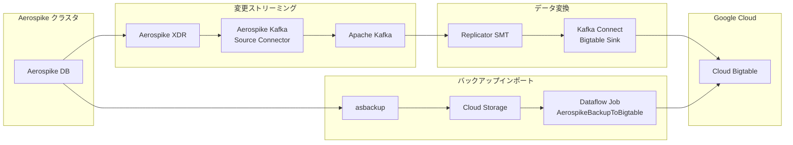

# Bigtable: Aerospike マイグレーションツール (Preview)

**リリース日**: 2026-05-07

**サービス**: Cloud Bigtable

**機能**: Aerospike マイグレーションツール

**ステータス**: Preview

[このアップデートのインフォグラフィックを見る](https://takech9203.github.io/google-cloud-news-summary/20260507-bigtable-aerospike-migration.html)

## 概要

Google Cloud は、Aerospike から Bigtable へのデータ移行を最小限またはゼロダウンタイムで実現するマイグレーションツールを Preview として公開しました。このツールセットは、オープンソースのアダプターライブラリ、Kafka Connect Bigtable sink コネクタ、および AerospikeBackupToBigtable Dataflow ジョブを組み合わせて構成されています。

Aerospike は高性能な NoSQL データベースとして広く利用されていますが、マネージドサービスへの移行ニーズの高まりに応え、Google Cloud はフルマネージドの Bigtable への移行パスを提供します。本ツールにより、変更データストリーミングとバックアップインポートを並行して実行し、データ整合性を保ちながらカットオーバーを行うことが可能になります。

対象ユーザーは、現在 Aerospike を運用しているデータベース管理者やソフトウェアエンジニアで、マネージドサービスへの移行を検討しているチームです。

**アップデート前の課題**

- Aerospike から Bigtable への移行には独自のカスタムツールを開発する必要があった
- ダウンタイムなしでの移行を実現するためのストリーミングレプリケーション機構が公式に提供されていなかった
- データモデルの違い（型付きビン vs. raw bytes）を橋渡しするアダプターが存在しなかった

**アップデート後の改善**

- 公式のオープンソースツールセットにより、最小限またはゼロダウンタイムでの移行が可能になった
- Kafka を介した変更データキャプチャ (CDC) により、リアルタイムレプリケーションが実現できるようになった
- アダプターライブラリがデータモデルの変換を自動処理するようになった
- Dataflow ジョブによるバックアップの並列インポートが可能になった

## アーキテクチャ図



この図は、Aerospike から Bigtable への2つの移行パスを示しています。上部のパスは Kafka を介したリアルタイム変更ストリーミング、下部のパスは asbackup ツールと Dataflow を使用したバックアップインポートです。両方のパスを並行して実行することで、ゼロダウンタイム移行が実現されます。

## サービスアップデートの詳細

### 主要機能

1. **変更データストリーミング (CDC)**
   - Aerospike XDR (Cross-Datacenter Replication) を使用して変更を Kafka にストリーミング
   - Aerospike Kafka Source (outbound) コネクタが JSON 形式でレコード更新を Kafka トピックに発行
   - Kafka Connect Bigtable sink コネクタがリアルタイムで Bigtable に書き込み

2. **バックアップインポート**
   - asbackup ツールで Aerospike の完全バックアップを作成
   - Cloud Storage にアップロード後、AerospikeBackupToBigtable Dataflow ジョブで並列インポート
   - 複数ファイルへの分割バックアップに対応し、並列処理が可能

3. **Replicator SMT (Single Message Transform)**
   - Kafka Connect 内で動作し、Aerospike 形式のメッセージを Bigtable 互換形式に変換
   - アダプターライブラリがオブジェクトシリアライゼーションとスキーママッピングを処理

4. **LUT ベースの整合性管理**
   - Last Update Time (LUT) をタイムスタンプとして使用し、競合解決を実現
   - `insert.mode=REPLACE_IF_NEWEST` 設定により、最新のレコードのみが適用される

## 技術仕様

### データ型サポート

| Aerospike 機能 | サポート状況 | 説明 |
|------|------|------|
| Hybrid Memory Architecture (HMA) | サポート | SSD ストレージ層または In-memory 層に移行 |
| スカラー型 (Int, Float, String, Bool) | サポート | Bigtable セルに移行 |
| リスト・マップ | サポート | マップは文字列キーが必要。アダプターライブラリが別カラムにシリアライズ |
| セカンダリインデックス | 部分サポート | 非同期セカンダリインデックスとして再実装が必要 |
| レコードレベル TTL | サポート | カラムファミリレベルまたはセル単位で設定 |
| UDF (ユーザー定義関数) | 非サポート | クライアントサイドのアプリケーションに移行が必要 |
| HyperLogLog | 非サポート | 移行プロセスではサポートされない |
| GeoJSON | 非サポート | 移行プロセスではサポートされない |

### スループット性能

| コンポーネント | レコード構造 | スループット | p99 レイテンシ |
|------|------|------|------|
| Replicator SMT | フラット | 最大 3,700 records/sec/vCPU | 300 ms |
| Replicator SMT | ネスト | 最大 2,600 records/sec/vCPU | 300 ms |
| Bigtable Sink | フラット | 最大 3,700 records/sec/vCPU | 74 ms |
| Bigtable Sink | ネスト | 最大 3,700 records/sec/vCPU | 100 ms |

※ JSON シリアライズされたレコードサイズが 1 KB の場合の推定値。Bigtable への書き込みリクエストには追加で約 600 ms のオーバーヘッドが発生。

## 設定方法

### 前提条件

1. Aerospike Enterprise Edition (XDR が必要なため。Community Edition の場合はオフライン移行のみ)
2. Apache Kafka クラスタ (自己管理またはオンプレミス)
3. Google Cloud プロジェクト (Bigtable、Cloud Storage、Dataflow が有効)
4. 適切な IAM ロールとネットワーク接続の設定

### 手順

#### ステップ 1: Aerospike XDR の設定

```
xdr {
  dc aerospike-kafka-source {
    connector true
    node-address-port <aerospike_connect_host> <aerospike_connect_port>
    namespace <your_namespace_to_replicate> {
    }
  }
}
```

Aerospike の XDR を有効にして、変更を Kafka Source コネクタにレプリケートします。

#### ステップ 2: Kafka Source コネクタの設定

```yaml
service:
  port: <port_to_run_on>
producer-props:
  bootstrap.servers:
    - <kafka_host>
format:
  mode: json
  metadata-key: metadata
routing:
  mode: static
  destination: <kafka_topic>
```

Aerospike Kafka Source (outbound) コネクタを設定し、JSON 形式でレコード更新を発行します。

#### ステップ 3: バックアップの作成とアップロード

```bash
# Aerospike バックアップの作成（複数ファイルに分割）
asbackup --namespace <namespace> --output-file-prefix <prefix> --file-limit <size_limit>

# Cloud Storage へのアップロード
gsutil -m cp <backup_files> gs://<bucket_name>/aerospike-backup/
```

変更ストリーム開始後にバックアップを作成し、Cloud Storage にアップロードします。

#### ステップ 4: Dataflow ジョブでバックアップをインポート

AerospikeBackupToBigtable Dataflow ジョブを実行して、バックアップデータを Bigtable にインポートします。並列処理のため、十分な Bigtable リソースをプロビジョニングしてください。

#### ステップ 5: Kafka Connect Bigtable Sink の設定と起動

```properties
connector.class=com.google.cloud.kafka.connect.bigtable.BigtableSinkConnector
gcp.bigtable.project.id=<project_id>
gcp.bigtable.instance.id=<instance_id>
insert.mode=REPLACE_IF_NEWEST
topics=<kafka_topic>
```

Sink コネクタを起動し、Kafka のバッファされた変更を Bigtable に適用します。

#### ステップ 6: カットオーバー

`consumer_lag` メトリクスを監視し、レプリケーションが安定した後にアプリケーショントラフィックを Bigtable に切り替えます。

## メリット

### ビジネス面

- **ゼロダウンタイム移行**: サービスを停止することなく Aerospike から Bigtable への移行が可能で、ビジネス継続性を維持
- **マネージドサービスへの移行**: インフラ管理の負荷を軽減し、運用コストを削減
- **スケーラビリティの向上**: Bigtable のオートスケーリングにより、トラフィックの変動に自動対応

### 技術面

- **オープンソースツール**: GitHub で公開されたツールセットにより、カスタマイズや拡張が容易
- **並列処理**: バックアップの分割インポートと Kafka を使ったストリーミングの並行実行により高スループットを実現
- **LUT ベースの整合性**: タイムスタンプベースの競合解決により、移行中のデータ整合性を確保

## デメリット・制約事項

### 制限事項

- UDF (ユーザー定義関数)、HyperLogLog、GeoJSON は移行非対応。これらの機能はアプリケーション側で再実装が必要
- Aerospike XDR は Enterprise Edition でのみ利用可能。Community Edition ではオフライン移行のみ対応
- セカンダリインデックスは直接移行されず、Bigtable の非同期セカンダリインデックスとして再実装が必要
- レコードキーは直接移行されず、レコードダイジェストが行キーとして使用される
- Kafka Connect Bigtable sink コネクタは自己管理の Kafka クラスタでのみサポート (Google Cloud Managed Service for Apache Kafka は現時点で非対応)

### 考慮すべき点

- 移行中は read-your-writes の厳密な一貫性が保証されない
- LUT はノードのシステムクロックに基づくため、厳密に単調増加しない可能性がある
- 移行パイプラインはデータの転送中チェックサムを実行しないため、エンドツーエンドのデータ整合性チェックが必要な場合は独自に実装が必要
- カットオーバー前にレプリケーションが安定するまで待機する必要がある

## ユースケース

### ユースケース 1: 高トラフィック AdTech プラットフォームの移行

**シナリオ**: リアルタイム入札システムで Aerospike を使用しているが、運用負荷軽減とコスト最適化のためにマネージドサービスへの移行を検討している。

**効果**: ゼロダウンタイムで移行が完了し、Bigtable のオートスケーリングにより入札リクエストのスパイクに自動対応。Enterprise Plus エディションの In-memory 層を使用することで、Aerospike と同等のサブミリ秒レイテンシを維持可能。

### ユースケース 2: IoT データプラットフォームのクラウド移行

**シナリオ**: オンプレミスの Aerospike クラスタで IoT センサーデータを管理しているが、データ量の増加に伴いスケーリングの限界に直面している。

**効果**: Bigtable の自動スケーリングとペタバイト級のストレージ容量により、データ増加に対する懸念が解消。Dataflow との統合により、既存のデータパイプラインとの連携も容易。

## 料金

本マイグレーションツール自体はオープンソースで無償ですが、移行プロセスおよび移行先で以下の Google Cloud サービスの料金が発生します。

| サービス | 料金の主な要素 |
|--------|-----------------|
| Cloud Bigtable (ノード) | オンデマンド: 約 $0.65/ノード/時間 (リージョンにより異なる) |
| Cloud Bigtable (SSD ストレージ) | リージョンにより異なる |
| Cloud Bigtable (CUD 1年) | オンデマンドから 20% 割引 |
| Cloud Bigtable (CUD 3年) | オンデマンドから 40% 割引 |
| Cloud Storage | バックアップデータの一時保存コスト |
| Dataflow | バックアップインポートジョブの実行コスト (vCPU、メモリ、ディスクに基づく) |

※ 最新の料金は [Bigtable 料金ページ](https://cloud.google.com/bigtable/pricing) を参照してください。

## 関連サービス・機能

- **Kafka Connect Bigtable sink コネクタ**: Kafka から Bigtable へのリアルタイムデータストリーミングを実現する専用コネクタ
- **Cloud Dataflow**: バックアップデータの並列インポートに使用される ETL サービス
- **Bigtable Enterprise Plus エディション**: In-memory 層によるサブミリ秒レイテンシを提供し、Aerospike のパフォーマンス特性に近い性能を実現
- **Bigtable In-memory 層**: レイテンシに敏感なワークロード向けの RAM ベースストレージ

## 参考リンク

- [インフォグラフィック](https://takech9203.github.io/google-cloud-news-summary/20260507-bigtable-aerospike-migration.html)
- [公式リリースノート](https://cloud.google.com/release-notes#May_07_2026)
- [Aerospike から Bigtable への移行ドキュメント](https://docs.cloud.google.com/bigtable/docs/migrate-aerospike-to-bigtable)
- [Bigtable for Aerospike users](https://docs.cloud.google.com/bigtable/docs/cloud-bigtable-for-aerospike-users)
- [Kafka Connect Bigtable sink コネクタ](https://docs.cloud.google.com/bigtable/docs/kafka-sink-connector)
- [移行ツール GitHub リポジトリ](https://github.com/GoogleCloudPlatform/cloud-bigtable-ecosystem/tree/main/aerospike-bigtable-migration-tools)
- [料金ページ](https://cloud.google.com/bigtable/pricing)

## まとめ

Aerospike マイグレーションツールの Preview 公開により、Aerospike ユーザーはゼロダウンタイムで Bigtable への移行が可能になりました。Kafka ベースの変更ストリーミングと Dataflow によるバックアップインポートを組み合わせた堅牢な移行アーキテクチャが提供されています。Aerospike から Bigtable への移行を検討しているチームは、まず非本番環境でテスト移行を実施し、データモデルの互換性とパフォーマンス要件を検証することを推奨します。

---

**タグ**: #Bigtable #Migration #Aerospike #NoSQL #Kafka #Dataflow #Preview #DatabaseMigration
