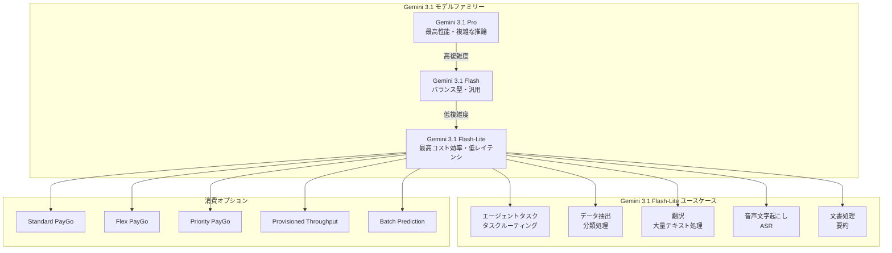

# Gemini Enterprise Agent Platform: Gemini 3.1 Flash-Lite が一般提供開始

**リリース日**: 2026-05-07

**サービス**: Gemini Enterprise Agent Platform

**機能**: Gemini 3.1 Flash-Lite is now generally available

**ステータス**: GA (General Availability)

[このアップデートのインフォグラフィックを見る](https://takech9203.github.io/google-cloud-news-summary/20260507-gemini-3-1-flash-lite-ga.html)

## 概要

Google Cloud は、Gemini ファミリーの中で最もコスト効率の高いモデルである Gemini 3.1 Flash-Lite を一般提供 (GA) として正式にリリースしました。2026年3月3日のパブリックプレビュー開始から約2か月を経て、本番環境での利用に適した安定版として提供されます。

Gemini 3.1 Flash-Lite は、大量のリクエストを低レイテンシかつ低コストで処理する必要があるユースケースに最適化されています。前世代の Gemini 2.0 Flash-Lite や Gemini 2.5 Flash-Lite と比較して品質が大幅に向上しており、Gemini 2.5 Flash と同等のパフォーマンスを主要な能力領域で達成しています。

高頻度のエージェントタスク、翻訳、データ抽出、分類処理、音声文字起こしなど、コストとスピードが最優先される大規模ワークロードを持つ開発者やエンタープライズユーザーが主な対象です。

**アップデート前の課題**

- Gemini 3.1 Flash-Lite はプレビュー段階であり、SLA の保証がなく本番環境での利用にリスクがあった
- プレビュー版はレート制限がより厳しく、大規模な本番デプロイメントに制約があった
- GA の安定したモデルエンドポイントが存在しなかったため、プロダクションパイプラインへの組み込みに慎重な判断が必要だった

**アップデート後の改善**

- GA リリースにより SLA が適用され、本番環境での利用が正式にサポートされるようになった
- Provisioned Throughput をはじめとする全ての消費オプションが利用可能になり、大規模デプロイメントに対応
- 安定したモデルエンドポイントが提供され、プロダクション環境への組み込みが容易になった

## アーキテクチャ図



Gemini 3.1 Flash-Lite は、モデルファミリーの中で最もコスト効率を重視したポジションに位置し、複数の消費オプションと幅広いユースケースに対応します。

## サービスアップデートの詳細

### 主要機能

1. **Gemini 2.5 Flash 相当の応答品質**
   - 前世代の Flash-Lite モデルから大幅な品質向上を実現
   - Gemini 2.5 Flash と同等のパフォーマンスを主要ベンチマークで達成
   - コスト効率を維持しながら、より高品質な出力を生成

2. **改善されたインストラクション・フォロー**
   - 複雑なチャットボットや指示の多いワークフローに対応
   - Gemini 2.5 Flash からの移行パスとして信頼性を確保
   - 構造化出力 (JSON スキーマ) への準拠精度が向上

3. **拡張されたシンキング (思考) サポート**
   - minimal、low、medium、high の4段階でシンキングレベルを制御可能
   - レスポンス品質とスピードのバランスをユースケースに応じて調整
   - コスト重視の場合は最小限の推論、精度重視の場合は高い推論レベルを選択

4. **改善された音声入力処理**
   - 自動音声認識 (ASR) タスクの品質が向上
   - 最大約8.4時間の音声入力に対応 (最大100万トークン)
   - 対応音声フォーマット: AAC, FLAC, MP3, M4A, MPEG, OGG, PCM, WAV, WebM

## 技術仕様

### モデル基本仕様

| 項目 | 詳細 |
|------|------|
| モデル ID | `gemini-3.1-flash-lite` |
| 最大入力トークン | 1,048,576 (約100万トークン) |
| 最大出力トークン | 65,535 |
| 入力タイプ | テキスト、コード、画像、音声、動画、PDF |
| 出力タイプ | テキスト |
| 知識カットオフ日 | 2025年1月 |
| リージョン | グローバル |

### 対応機能

| 機能 | サポート状況 |
|------|------|
| Grounding with Google Search | 対応 |
| コード実行 | 対応 |
| システムインストラクション | 対応 |
| Function calling | 対応 |
| 構造化出力 | 対応 |
| シンキング (思考) | 対応 |
| コンテキストキャッシュ (暗黙/明示) | 対応 |
| Vertex AI RAG Engine | 対応 |
| Chat completions (OpenAI 互換) | 対応 |
| Gemini Live API | 非対応 |
| Content Credentials (C2PA) | 非対応 |

### マルチメディア入力仕様

| 入力タイプ | 制限 |
|------|------|
| 画像 | 最大 3,000 枚/プロンプト、インライン: 7MB、GCS: 30MB |
| ドキュメント | 最大 3,000 ファイル/プロンプト、最大 1,000 ページ/ファイル |
| 動画 (音声あり) | 最大約45分 |
| 動画 (音声なし) | 最大約1時間 |
| 音声 | 最大約8.4時間 |

### パラメータ設定

| パラメータ | 範囲 | デフォルト |
|------|------|------|
| Temperature | 0.0 - 2.0 | 1.0 |
| topP | 0.0 - 1.0 | 0.95 |
| topK | 64 (固定) | 64 |
| candidateCount | 1 - 8 | 1 |

## 設定方法

### 前提条件

1. Google Cloud プロジェクトで課金が有効であること
2. Vertex AI API が有効化されていること

### 手順

#### ステップ 1: Vertex AI SDK のセットアップ

```bash
pip install google-cloud-aiplatform
```

#### ステップ 2: Python での基本的な呼び出し

```python
from google import genai
from google.genai import types

client = genai.Client()

response = client.models.generate_content(
    model="gemini-3.1-flash-lite",
    contents="Hello, how are you?",
)
print(response.text)
```

#### ステップ 3: シンキングレベルを指定した呼び出し

```python
response = client.models.generate_content(
    model="gemini-3.1-flash-lite",
    contents="Explain quantum computing in simple terms.",
    config=types.GenerateContentConfig(
        thinking_config=types.ThinkingConfig(thinking_level="medium")
    ),
)
print(response.text)
```

#### ステップ 4: 構造化出力 (JSON) の使用

```python
from pydantic import BaseModel, Field

class ReviewAnalysis(BaseModel):
    aspect: str = Field(description="The feature mentioned")
    sentiment_score: int = Field(description="1 to 5 (1=worst, 5=best)")
    is_return_risk: bool = Field(description="True if return mentioned")

response = client.models.generate_content(
    model="gemini-3.1-flash-lite",
    contents=["Analyze this review", "Great product but shipping was slow"],
    config={
        "response_mime_type": "application/json",
        "response_json_schema": ReviewAnalysis.model_json_schema(),
    },
)
print(response.text)
```

## メリット

### ビジネス面

- **大幅なコスト削減**: 入力 $0.25/100万トークン、出力 $1.50/100万トークンという低価格で、大規模ワークロードのコストを大幅に削減
- **スケーラビリティ**: Provisioned Throughput や Batch Prediction など複数の消費オプションにより、ビジネスの成長に合わせたスケーリングが容易
- **移行パスの明確化**: Gemini 2.0 Flash-Lite (2026年6月1日にシャットダウン予定) からの移行先として最適

### 技術面

- **低レイテンシ**: リアルタイムアプリケーションやインタラクティブなユーザー体験に適した高速応答
- **マルチモーダル対応**: テキスト、画像、動画、音声、PDF を統一的に処理可能
- **柔軟なシンキング制御**: 4段階のシンキングレベルにより、タスクの複雑度に応じた最適な推論コストの調整が可能
- **100万トークンのコンテキストウィンドウ**: 大量のドキュメントや長時間の音声を一度に処理可能

## デメリット・制約事項

### 制限事項

- Gemini Live API には非対応のため、リアルタイム音声対話には使用不可
- Content Credentials (C2PA) 非対応
- 画像生成 (Image generation) には非対応 (テキスト出力のみ)
- Computer Use には非対応

### 考慮すべき点

- 知識カットオフが2025年1月であるため、最新の情報については Grounding with Google Search の併用を推奨
- 高い推論精度が求められるタスクでは Gemini 3.1 Flash や Gemini 3.1 Pro の利用を検討すべき
- シンキングトークンも出力料金に含まれるため、高いシンキングレベルを使用するとコストが増加する

## ユースケース

### ユースケース 1: モデルルーティング (タスク分類)

**シナリオ**: 大規模チャットボットで、ユーザーの質問の複雑度に応じて適切なモデル (Flash または Pro) にルーティングする分類器として使用

**実装例**:
```python
CLASSIFIER_SYSTEM_PROMPT = """
You are a specialized Task Routing AI.
Choose between 'flash' (SIMPLE) or 'pro' (COMPLEX).
A task is COMPLEX if it requires 4+ steps or strategic planning.
A task is SIMPLE if it is specific and bounded.
"""

response = client.models.generate_content(
    model="gemini-3.1-flash-lite",
    contents=user_input,
    config={
        "system_instruction": CLASSIFIER_SYSTEM_PROMPT,
        "response_mime_type": "application/json",
        "response_json_schema": response_schema,
    },
)
```

**効果**: 低コストで高速な分類により、全体のシステムコストを最適化しながら応答品質を維持

### ユースケース 2: 大量テキストの翻訳処理

**シナリオ**: カスタマーレビュー、サポートチケット、チャットメッセージなどの大量テキストをリアルタイムで翻訳

**実装例**:
```python
response = client.models.generate_content(
    model="gemini-3.1-flash-lite",
    config={"system_instruction": "Only output the translated text"},
    contents=f"Translate the following text to Japanese: {text}",
)
```

**効果**: 高スループットかつ低コストで大量の翻訳リクエストを処理

### ユースケース 3: 音声文字起こしパイプライン

**シナリオ**: 録音データ、ボイスメモ、会議音声などの文字起こしを別途 Speech-to-Text パイプラインを構築せずに実現

**効果**: マルチモーダル入力対応により、音声ファイルを直接渡すだけで高精度な文字起こしが可能

## 料金

Gemini API (ai.google.dev) での料金体系は以下の通りです。Vertex AI での料金は公式料金ページを参照してください。

### Standard 料金

| 項目 | 料金 (100万トークンあたり) |
|------|------|
| 入力 (テキスト/画像/動画) | $0.25 |
| 入力 (音声) | $0.50 |
| 出力 (シンキングトークン含む) | $1.50 |
| コンテキストキャッシュ (テキスト/画像/動画) | $0.025 |
| コンテキストキャッシュ (音声) | $0.05 |
| コンテキストキャッシュ (ストレージ) | $1.00/時間 |

### Batch 料金

| 項目 | 料金 (100万トークンあたり) |
|------|------|
| 入力 (テキスト/画像/動画) | $0.125 |
| 入力 (音声) | $0.25 |
| 出力 (シンキングトークン含む) | $0.75 |

### Flex 料金

| 項目 | 料金 (100万トークンあたり) |
|------|------|
| 入力 (テキスト/画像/動画) | $0.125 |
| 入力 (音声) | $0.25 |
| 出力 (シンキングトークン含む) | $0.75 |

### 前世代モデルとの料金比較

| モデル | 入力料金 | 出力料金 |
|------|------|------|
| Gemini 3.1 Flash-Lite (GA) | $0.25 | $1.50 |
| Gemini 2.5 Flash-Lite (Preview) | $0.10 | $0.40 |
| Gemini 2.0 Flash-Lite (非推奨) | $0.075 | $0.30 |
| Gemini 2.5 Flash (GA) | $0.30 | $2.50 |

## 利用可能リージョン

Gemini 3.1 Flash-Lite はグローバルエンドポイントとして提供されています。Vertex AI では `global` リージョンで利用可能です。詳細なリージョン展開については [Deployments and endpoints](https://docs.cloud.google.com/vertex-ai/generative-ai/docs/learn/locations) を参照してください。

## 消費オプション

| オプション | 説明 |
|------|------|
| Standard PayGo | 使用量に応じた標準従量課金 |
| Flex PayGo | 柔軟な従量課金オプション |
| Priority PayGo | 優先アクセス付き従量課金 |
| Provisioned Throughput | 予約済みスループットで安定したパフォーマンスを保証 |
| Batch Prediction | 大量のリクエストを非同期でバッチ処理 (50%割引) |

## 関連サービス・機能

- **Gemini 3.1 Pro**: 最も高度な推論能力を持つモデル。複雑な問題解決やマルチソース分析に最適
- **Gemini 3.1 Flash**: バランス型モデル。Flash-Lite より高い推論能力が必要な場合に使用
- **Gemini 3.1 Flash Image**: 画像生成に特化したモデル。テキスト出力のみの Flash-Lite とは異なり画像出力が可能
- **Vertex AI RAG Engine**: Flash-Lite と組み合わせて、大規模ドキュメントの検索拡張生成を低コストで実現
- **Grounding with Google Search**: Flash-Lite の知識カットオフを補完し、最新情報に基づいた回答を生成

## 参考リンク

- [インフォグラフィック](https://takech9203.github.io/google-cloud-news-summary/20260507-gemini-3-1-flash-lite-ga.html)
- [公式リリースノート](https://cloud.google.com/release-notes#May_07_2026)
- [Gemini 3.1 Flash-Lite モデルカード (Vertex AI)](https://docs.cloud.google.com/vertex-ai/generative-ai/docs/models/gemini/3-1-flash-lite)
- [Gemini 3.1 Flash-Lite モデルカード (Google AI)](https://ai.google.dev/gemini-api/docs/models/gemini-3.1-flash-lite-preview)
- [料金ページ (Google AI)](https://ai.google.dev/gemini-api/docs/pricing)
- [料金ページ (Vertex AI)](https://docs.cloud.google.com/vertex-ai/generative-ai/pricing)

## まとめ

Gemini 3.1 Flash-Lite の GA リリースは、大量のLLMリクエストを低コストかつ低レイテンシで処理する必要があるエンタープライズワークロードにとって重要なマイルストーンです。Gemini 2.5 Flash 相当の品質を Flash-Lite の価格帯で実現しており、Gemini 2.0 Flash-Lite (2026年6月1日シャットダウン予定) からの移行を検討しているユーザーは、早期にGAエンドポイントへの切り替えを推奨します。

---

**タグ**: #GeminiEnterprise #Gemini3.1FlashLite #GA #VertexAI #LLM #コスト効率 #低レイテンシ #マルチモーダル #エージェント
