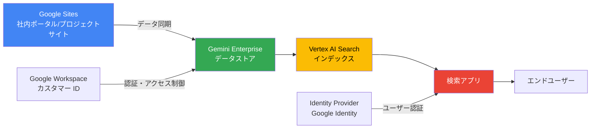

# Gemini Enterprise: Google Sites 用データストア (Preview)

**リリース日**: 2026-05-07

**サービス**: Gemini Enterprise

**機能**: Data store for Google Sites (Preview)

**ステータス**: Public Preview

:bar_chart: [このアップデートのインフォグラフィックを見る](https://takech9203.github.io/google-cloud-news-summary/20260507-gemini-enterprise-google-sites-data-store.html)

## 概要

Google Cloud は、Gemini Enterprise のデータストアコネクタとして Google Sites のサポートを Public Preview で提供開始しました。これにより、組織内の Google Sites に保存されたコンテンツを Gemini Enterprise の検索対象として接続し、企業内検索やナレッジマネジメントの範囲を拡大できます。

Google Sites は社内ポータル、プロジェクトサイト、チームの情報共有ページなどに広く利用されているため、このコネクタによって既存のナレッジ資産をAI検索に活用できるようになります。Gemini Enterprise は Google Workspace カスタマー ID を使用して Google Sites に接続し、データソースのアクセス制御を適用します。

**アップデート前の課題**

- Google Sites のコンテンツは Gemini Enterprise の検索対象外であり、別途手動で情報を探す必要があった
- 社内ポータルやプロジェクトサイトの情報が AI 検索に統合されておらず、ナレッジの分断が生じていた
- Google Sites の情報を検索可能にするには、コンテンツを別のデータソースにコピーする手間が必要だった

**アップデート後の改善**

- Google Sites のコンテンツを直接 Gemini Enterprise のデータストアとして接続可能になった
- 社内ポータルやプロジェクトサイトの情報を AI 検索の対象に含められるようになった
- データソースのアクセス制御により、権限のあるユーザーのみが検索結果にアクセスできる

## アーキテクチャ図

この図は、Google Sites から Gemini Enterprise データストアへのデータフローと、エンドユーザーが検索アプリを通じてコンテンツにアクセスする際の認証・アクセス制御の仕組みを示しています。

## サービスアップデートの詳細

### 主要機能

1. **Google Sites コネクタ**
   - Google Cloud コンソールから Google Sites をデータソースとして選択し、データストアを作成可能
   - Google Workspace カスタマー ID を使用して Google Sites に自動接続
   - リージョン選択とデータコネクタの命名が可能

2. **データソースアクセス制御**
   - Google Identity によるアクセス制御を適用
   - ユーザーが権限を持つコンテンツのみが検索結果に表示される
   - Identity Provider の設定が必要

3. **検索アプリとの統合**
   - 作成したデータストアを検索アプリに接続可能
   - 他のデータソース (Google Drive、サードパーティなど) の検索結果とブレンドして表示
   - 検索結果のプレビュー機能に対応

## 技術仕様

### セキュリティコントロールに関する注意事項

| セキュリティコントロール | 注意事項 |
|------|------|
| Data Residency (DRZ) | Gemini Enterprise はGoogle Cloud 内でのみデータ常駐を保証。Google Sites のデータ常駐については Google Workspace のコンプライアンスガイダンスを参照 |
| Customer-managed encryption keys (CMEK) | CMEK は Google Cloud 内のデータのみ暗号化。Cloud KMS は Google Sites に保存されたデータには適用されない |
| Access Transparency | Google Cloud プロジェクトでのアクションをログ記録。Google Workspace の Access Transparency ログも別途確認が必要 |

### 前提条件

| 項目 | 詳細 |
|------|------|
| アカウント | Google Workspace インスタンスと同じアカウントで Google Cloud コンソールにサインイン |
| Google Workspace 設定 | 他の Google 製品の Google Workspace スマート機能を有効化する必要あり |
| Identity Provider | データソースアクセス制御のために Identity Provider を設定済みであること |
| 利用資格 | 現在はアローリスト制。アカウントチームまたはセールスチームに連絡が必要 |

## 設定方法

### 前提条件

1. Google Workspace スマート機能を有効化する
2. Identity Provider を設定する
3. アローリストへの追加をアカウントチームまたはセールスチームに依頼する

### 手順

#### ステップ 1: Google Cloud コンソールで Gemini Enterprise を開く

Google Cloud コンソールにアクセスし、Gemini Enterprise ページに移動します。Google Workspace インスタンスと同じアカウントでサインインしていることを確認してください。

#### ステップ 2: データストアを作成する

1. Data Stores ページに移動
2. **Create Data Store** をクリック
3. データソース選択ページで **Google Sites** を選択
4. データコネクタのリージョンを選択
5. データコネクタの名前を入力
6. **Create** をクリック

#### ステップ 3: 検索アプリに接続する

データストア作成後、検索アプリを作成してデータストアを接続します。詳細は公式ドキュメントの「Create a search app」を参照してください。

## メリット

### ビジネス面

- **ナレッジの統合検索**: 社内の Google Sites に散在する情報を一元的に検索可能にし、情報アクセスの効率を向上
- **既存資産の活用**: 追加のコンテンツ移行なしに、既存の Google Sites コンテンツを AI 検索に活用可能
- **セキュリティの維持**: アクセス制御により、権限のないコンテンツへのアクセスを防止

### 技術面

- **シンプルな設定**: Google Cloud コンソールから数ステップでデータストアを作成可能
- **自動認証**: Google Workspace カスタマー ID による自動接続で追加の認証設定が不要
- **他データソースとの統合**: Google Drive や サードパーティコネクタと併用し、横断検索を実現

## デメリット・制約事項

### 制限事項

- Public Preview のため、「Pre-GA Offerings Terms」が適用される。限定的なサポートとなる場合がある
- 現在はアローリスト制であり、利用にはアカウントチームまたはセールスチームへの連絡が必要
- CMEK (顧客管理暗号鍵) は Google Sites に保存されたデータには適用されない

### 考慮すべき点

- Data Residency は Google Cloud 内でのみ保証されるため、Google Sites 側のデータ常駐要件は別途確認が必要
- Google Workspace スマート機能の有効化が前提条件として必要
- Access Transparency ログは Google Cloud と Google Workspace の両方を確認する必要がある

## ユースケース

### ユースケース 1: 社内ポータルのナレッジ検索

**シナリオ**: 大規模な組織で各部門が Google Sites を使って社内ポータルを運営しており、従業員が必要な情報を見つけるのに時間がかかっている。

**効果**: Gemini Enterprise に Google Sites データストアを接続することで、全部門のポータルを横断して AI 検索が可能になり、情報発見の時間を大幅に短縮できる。

### ユースケース 2: プロジェクトドキュメントの一元検索

**シナリオ**: 複数のプロジェクトチームが Google Sites でプロジェクト情報を管理しており、過去のプロジェクトの知見を参照したい場合に、どのサイトに情報があるか分からない。

**効果**: Google Sites と Google Drive の両方をデータストアとして接続し、検索アプリを通じてプロジェクト関連ドキュメントを一元的に検索。アクセス制御により、権限のあるプロジェクト情報のみが表示される。

## 料金

Gemini Enterprise の利用にはサブスクリプション (ライセンス) が必要です。月額または年間のサブスクリプションが選択可能です。エディションごとにストレージ容量が異なります。

| エディション | ストレージ/ユーザー/月 |
|--------|-----------------|
| Business (1-300 ユーザー) | 25 GiB (プール制) |
| Standard (1 ユーザー以上) | 30 GiB (プール制) |
| Plus (1 ユーザー以上) | 75 GiB (プール制) |
| Frontline (150 ユーザー以上) | 2 GiB (プール制) |

Google Sites コネクタの追加料金に関する具体的な情報は、現時点の公式ドキュメントでは確認できていません。詳細はアカウントチームにお問い合わせください。

## 関連サービス・機能

- **Google Drive データストア**: 同様のコネクタで Google Drive のコンテンツも検索可能
- **Vertex AI Search**: Gemini Enterprise のバックエンドとして検索インデックスを提供
- **Google Workspace**: Google Sites のデータ元となるプラットフォーム
- **Identity Provider 設定**: データソースアクセス制御に必要な認証基盤

## 参考リンク

- :bar_chart: [インフォグラフィック](https://takech9203.github.io/google-cloud-news-summary/20260507-gemini-enterprise-google-sites-data-store.html)
- [公式リリースノート](https://cloud.google.com/release-notes#May_07_2026)
- [Google Sites コネクタ ドキュメント](https://docs.cloud.google.com/gemini/enterprise/docs/connectors/connect-sites)
- [コネクタ概要](https://docs.cloud.google.com/gemini/enterprise/docs/connectors/introduction-to-connectors-and-data-stores)
- [Identity Provider 設定](https://docs.cloud.google.com/gemini/enterprise/docs/configure-identity-provider)
- [ライセンス管理](https://docs.cloud.google.com/gemini/enterprise/docs/licenses)
- [エディション比較](https://docs.cloud.google.com/gemini/enterprise/docs/editions)

## まとめ

Google Sites 用データストアの Public Preview 提供により、Gemini Enterprise の企業内検索がさらに拡充されました。社内の Google Sites に蓄積されたナレッジを AI 検索に活用したい組織は、アカウントチームに連絡してアローリストへの追加を依頼し、早期にこの機能を評価することを推奨します。

---

**タグ**: #GeminiEnterprise #GoogleSites #DataStore #Connector #Preview #EnterpriseSearch #GoogleWorkspace
