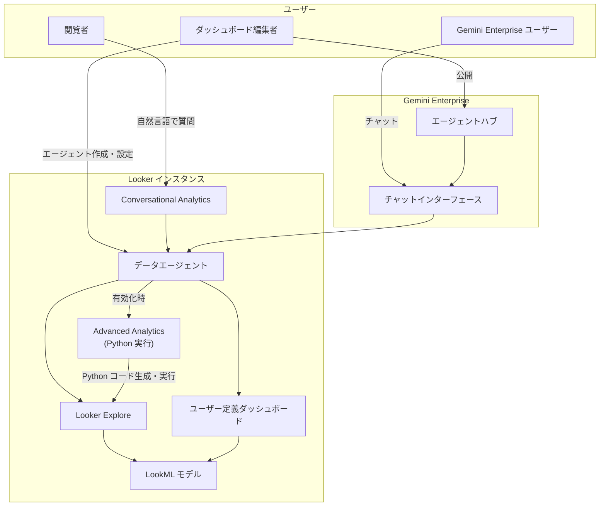

# Looker: Looker 26.8 リリース

**リリース日**: 2026-05-07

**サービス**: Looker

**機能**: Looker 26.8 Release

**ステータス**: Mixed (GA, Preview, Changes, Fixes)

[このアップデートのインフォグラフィックを見る](https://takech9203.github.io/google-cloud-news-summary/20260507-looker-26-8-release.html)

## 概要

Looker 26.8 は、Conversational Analytics のデータエージェント機能の拡張、ダッシュボードタイルダウンロードの行・列制限設定の GA、Snowflake 接続での approximate パラメータサポートなど、複数の重要なアップデートを含むリリースです。

今回のリリースでは、AI を活用した対話型分析機能 (Conversational Analytics) の強化が中心テーマとなっています。ダッシュボードベースのデータエージェント作成が Preview として追加され、既存のエージェントを Gemini Enterprise に公開する機能も Preview で利用可能になりました。また、Advanced Analytics 機能 (旧 Code Interpreter) が GA となり、Python コード実行による高度な分析が正式に本番環境で利用可能になりました。

対象ユーザーは、Looker を利用するデータアナリスト、BI 開発者、ダッシュボード管理者、および組織内で自然言語による分析環境を提供したい管理者です。

**アップデート前の課題**

- ダッシュボードタイルのダウンロード時に行数・列数の既定値を編集者が設定できず、閲覧者が毎回手動で調整する必要があった
- ダッシュボードに対する Conversational Analytics のデータエージェントを作成できず、ダッシュボード上での対話型分析が限定的だった
- Advanced Analytics (Code Interpreter) が Preview 段階であり、本番ワークロードでの利用にはリスクがあった
- Conversational Analytics で Development Mode のコンテンツに対するクエリがサポートされておらず、開発中の LookML 変更をテストできなかった

**アップデート後の改善**

- ダッシュボード編集者がタイルダウンロードの行・列制限のデフォルト値を設定可能になり、閲覧者のダウンロード体験が改善 (GA)
- ユーザー定義ダッシュボード上で Conversational Analytics データエージェントを作成・使用可能になった (Preview)
- データエージェントを Gemini Enterprise に公開し、Looker 外のユーザーにも分析機能を提供可能になった (Preview)
- Advanced Analytics が GA となり、Python コード実行による時系列予測や統計分析が本番で利用可能に
- Conversational Analytics が Development Mode の Explore クエリをサポートし、開発中のモデル変更をテスト可能に

## アーキテクチャ図

Conversational Analytics のデータエージェントは、ユーザーの自然言語クエリを受け取り、LookML スキーマとエージェント指示に基づいて Explore クエリを構成します。Gemini Enterprise への公開により、Looker インターフェースに不慣れなユーザーにもデータ分析が提供されます。

## サービスアップデートの詳細

### 主要機能

1. **ダッシュボードタイルダウンロードの行・列制限設定 (GA)**
   - ダッシュボード編集者がタイルごとにダウンロード時のデフォルト行数・列数を設定可能
   - 閲覧者はダウンロード時にこれらの値を編集可能
   - ダウンロード体験の一貫性と制御性が向上

2. **ダッシュボードデータエージェント (Preview)**
   - ユーザー定義ダッシュボード上で Conversational Analytics データエージェントを作成・使用可能
   - ダッシュボードから「Chat with this dashboard」を選択してエージェントを起動
   - エージェントは Production Mode のコンテンツを使用してクエリを実行
   - カスタム指示やコンテキストの設定が可能

3. **Gemini Enterprise へのエージェント公開 (Preview)**
   - 作成したデータエージェントを Gemini Enterprise に公開可能
   - Looker に不慣れなユーザーも Gemini Enterprise 上でエージェントとチャット可能
   - `publish_agent_externally` 権限が必要 (`save_agents` 権限を持つユーザーに自動付与)
   - Google Cloud コンソールの Gemini Enterprise ページで IAM によるアクセス管理

4. **Advanced Analytics の GA 化 (旧 Code Interpreter)**
   - 自然言語の質問を Python コードに変換し、安全なサンドボックス内で実行
   - 時系列予測、高度な統計分析、カスタムビジュアライゼーションが可能
   - Looker (original) は 25.18 以降、Looker (Google Cloud core) でも利用可能
   - Explore データエージェントでのみ利用可能 (ダッシュボードエージェントでは非対応)

5. **Snowflake 接続での approximate パラメータサポート**
   - Snowflake 接続において `approximate` パラメータが利用可能に
   - 概算クエリにより大規模データセットでのパフォーマンス向上が期待

6. **Conversational Analytics の Development Mode サポート**
   - Conversational Analytics が Looker Explore の Development Mode でのクエリをサポート
   - LookML 開発者が開発中のモデル変更を Conversational Analytics でテスト可能に

## 技術仕様

### 権限設定

| 権限 | 用途 |
|------|------|
| `access_data` | データアクセスの基本権限 |
| `gemini_in_looker` | Conversational Analytics へのアクセス |
| `chat_with_agent` | データエージェントとのチャット |
| `chat_with_explore` | Explore との直接チャット |
| `save_agents` | エージェントの作成・編集・共有 |
| `publish_agent_externally` | Gemini Enterprise への公開 (26.6 で追加) |
| `see_user_dashboards` | ダッシュボードエージェント利用時に必要 |

### Gemini Enterprise 公開のワークフロー

| ステップ | 担当ロール | 操作 |
|----------|-----------|------|
| 1. エージェント公開 | Data agent editor (Looker) | Looker 内でエージェントを公開 |
| 2. アクセス付与 | Discovery Engine Admin (IAM) | Google Cloud コンソールでアクセスを許可 |
| 3. チャット利用 | Discovery Engine User (IAM) | Gemini Enterprise でチャット |

### 前提条件 (Gemini Enterprise 公開)

1. Looker 管理者が Admin パネルの「Gemini in Looker」ページで「Publish to Gemini Enterprise」設定を有効化
2. `publish_agent_externally` 権限を含むロールが付与されていること
3. エージェントの編集権限 (Manage access; Edit) を保持していること

## デプロイスケジュール

| 対象環境 | デプロイ開始日 | 備考 |
|----------|--------------|------|
| Looker (original) | 2026年5月10日 (日) | 段階的デプロイ |
| Looker (Google Cloud core) | 2026年5月11日 (月) | 段階的デプロイ |
| 全環境完了 | 2026年5月25日 (日) | 最終デプロイ完了 |

## メリット

### ビジネス面

- **データ民主化の加速**: Gemini Enterprise へのエージェント公開により、Looker ライセンスを持たないユーザーにもデータ分析を提供可能
- **ダッシュボード体験の向上**: ダウンロード制限のデフォルト設定により、閲覧者の操作負荷を軽減
- **対話型分析の拡充**: ダッシュボードレベルでの自然言語クエリにより、BI スキルに依存しないデータ活用が可能

### 技術面

- **開発ワークフローの改善**: Development Mode での Conversational Analytics テストにより、LookML 変更のフィードバックループが短縮
- **高度な分析の本番利用**: Advanced Analytics の GA 化により、Python ベースの統計分析や予測を安心して本番で利用可能
- **パフォーマンス最適化**: Snowflake 接続での approximate パラメータにより、大規模データセットでのクエリ高速化

## デメリット・制約事項

### 制限事項

- ダッシュボードデータエージェントは LookML ダッシュボードでは利用不可 (ユーザー定義ダッシュボードのみ)
- ダッシュボードデータエージェントでは Advanced Analytics が非対応
- ダッシュボードデータエージェントは他ユーザーとの共有不可
- Conversational Analytics は 1 クエリあたり最大 5,000 行の制限あり
- Gemini Enterprise への公開は Preview であり、サポートが限定的
- CMEK または VPC Service Controls を使用する Looker (Google Cloud core) インスタンスでは Gemini 機能が非対応

### 考慮すべき点

- Advanced Analytics が生成する Python コードは安全なサンドボックス内で実行されるが、ローカル環境での実行はセキュリティリスクがある
- Gemini Enterprise 連携にはフィードバック段階の機能が含まれ、バグ報告は geintegration-feedback@google.com へ
- AI 生成の分析結果は事実と異なる場合があるため、重要な意思決定前には検証が推奨

## ユースケース

### ユースケース 1: 経営ダッシュボードの自然言語分析

**シナリオ**: 営業マネージャーが四半期売上ダッシュボードに対して「前四半期比で最も成長した地域はどこか」と自然言語で質問する。

**効果**: ダッシュボードデータエージェントが Production Mode のデータに基づいて即座に回答を生成し、追加の分析スキルなしでインサイトを獲得可能。

### ユースケース 2: Gemini Enterprise を通じた全社データ活用

**シナリオ**: データチームが「売上分析エージェント」を作成し Gemini Enterprise に公開。マーケティング部門や財務部門のメンバーが Gemini Enterprise 上で自然言語質問を行う。

**効果**: Looker の操作に不慣れなビジネスユーザーでも、中央のハブから適切なエージェントを選択してデータ分析が可能。組織全体のデータリテラシー向上に寄与。

### ユースケース 3: LookML 開発中の Conversational Analytics テスト

**シナリオ**: LookML 開発者が新しいフィールドや計算を追加後、Development Mode で Conversational Analytics を使用してエージェントの応答品質を検証する。

**効果**: 本番デプロイ前にエージェントの挙動を確認でき、LookML 変更が Conversational Analytics に与える影響を事前に把握可能。

## 料金

Looker の料金体系はエディション (Standard、Enterprise、Embed) によって異なります。Conversational Analytics を含む Gemini in Looker 機能は、Looker ライセンスに含まれます。詳細な料金については [Looker (Google Cloud core) pricing](https://cloud.google.com/looker/pricing) を参照してください。

Gemini Enterprise への公開機能を利用する場合、Gemini Enterprise のライセンスが別途必要です。

## バグ修正

本リリースには 20 件以上のバグ修正が含まれています。詳細は公式リリースノートを参照してください。

## 関連サービス・機能

- **Gemini Enterprise**: データエージェントの公開先となる Google Cloud の AI プラットフォーム
- **Gemini for Google Cloud**: Conversational Analytics を支える AI 基盤
- **BigQuery**: Looker の主要なデータウェアハウス接続先
- **Snowflake**: approximate パラメータサポートが追加されたデータウェアハウス
- **Looker Studio**: Google Cloud のもう一つの BI ツール

## 参考リンク

- [インフォグラフィック](https://takech9203.github.io/google-cloud-news-summary/20260507-looker-26-8-release.html)
- [公式リリースノート](https://cloud.google.com/release-notes#May_07_2026)
- [Conversational Analytics ドキュメント](https://docs.cloud.google.com/looker/docs/conversational-analytics-overview)
- [データエージェント ドキュメント](https://docs.cloud.google.com/looker/docs/conversational-analytics-looker-data-agents)
- [ダッシュボードデータエージェント ドキュメント](https://docs.cloud.google.com/looker/docs/conversational-analytics-looker-data-agents-dashboards)
- [Advanced Analytics (Code Interpreter) ドキュメント](https://docs.cloud.google.com/looker/docs/conversational-analytics-looker-advanced-analytics)
- [Looker 料金ページ](https://cloud.google.com/looker/pricing)

## まとめ

Looker 26.8 は、Conversational Analytics エコシステムの大幅な拡張を含む重要なリリースです。Advanced Analytics の GA 化により AI 駆動の高度な分析が本番環境で信頼性を持って利用可能となり、ダッシュボードエージェントと Gemini Enterprise 連携により、データ分析のアクセシビリティが組織全体に拡大します。Looker 管理者は、新しい権限設定の確認と Gemini Enterprise 連携の評価を推奨します。

---

**タグ**: #Looker #ConversationalAnalytics #DataAgents #GeminiEnterprise #AdvancedAnalytics #CodeInterpreter #Snowflake #BI #AI #GA #Preview
