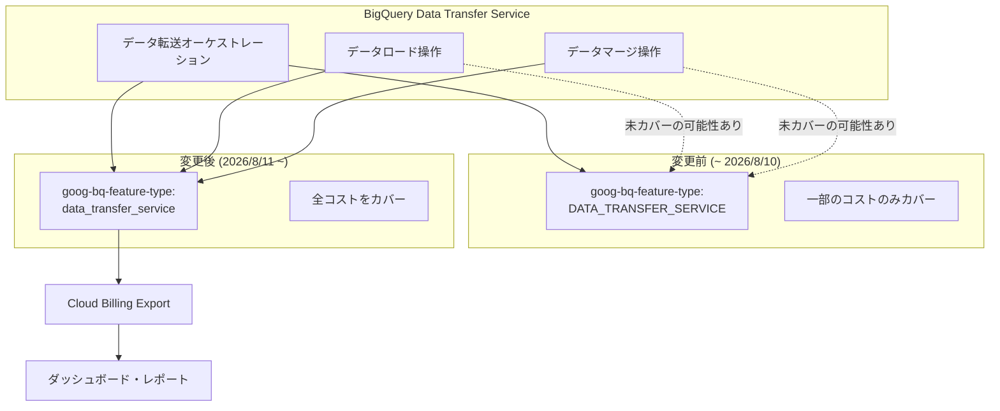

# BigQuery Data Transfer Service: 課金ラベルの更新

**リリース日**: 2026-05-08

**サービス**: BigQuery Data Transfer Service

**機能**: 課金ラベル (goog-bq-feature-type) の小文字化とスコープ拡張

**ステータス**: アナウンス (2026年8月11日より適用)

📊 [このアップデートのインフォグラフィックを見る](https://takech9203.github.io/google-cloud-news-summary/20260508-bigquery-data-transfer-service-billing-label.html)

## 概要

2026年8月11日より、BigQuery Data Transfer Service の SKU に付与される課金ラベル `goog-bq-feature-type` の値が、従来の大文字表記 `DATA_TRANSFER_SERVICE` から小文字表記 `data_transfer_service` に変更されます。

この変更は単なる表記の統一にとどまらず、ラベルのスコープが拡張され、BigQuery Data Transfer Service に関連するすべてのコスト (データ転送オーケストレーション、データロード操作、データマージ操作) がこのラベルでカバーされるようになります。これにより、Data Transfer Service 関連のコストをより統一的かつ完全に把握できるようになります。

**アップデート前の課題**

- 課金ラベルの値が大文字表記 (`DATA_TRANSFER_SERVICE`) であり、他の BigQuery 機能ラベル (例: `BQ_STUDIO_NOTEBOOK`, `SPARK_PROCEDURE`) との命名規則が統一されていなかった
- ラベルのスコープが限定的で、Data Transfer Service に関連するすべてのコスト (データロードやマージ操作など) がカバーされていなかった
- コスト分析時に Data Transfer Service の全体像を把握するために複数のフィルタや追加のクエリが必要だった

**アップデート後の改善**

- ラベル値が小文字 (`data_transfer_service`) に統一され、命名規則の一貫性が向上
- データ転送オーケストレーション、データロード操作、データマージ操作のすべてが1つのラベルでカバーされる
- コスト分析においてより完全なビューが得られ、Data Transfer Service の総コストを正確に把握可能

## アーキテクチャ図



BigQuery Data Transfer Service のすべてのコスト要素が新しい小文字ラベルでカバーされ、Cloud Billing Export を通じてダッシュボードやレポートに統一的に反映されるようになります。

## サービスアップデートの詳細

### 主要機能

1. **ラベル値の小文字化**
   - 変更前: `goog-bq-feature-type: DATA_TRANSFER_SERVICE` (大文字)
   - 変更後: `goog-bq-feature-type: data_transfer_service` (小文字)
   - 適用日: 2026年8月11日

2. **ラベルスコープの拡張**
   - データ転送オーケストレーション: 転送スケジュールの管理と実行に関するコスト
   - データロード操作: データソースから BigQuery へのデータ読み込みに関するコスト
   - データマージ操作: 差分更新やアップサートなどのマージ処理に関するコスト

3. **移行期間中の対応**
   - 両方のラベル値を課金エクスポートやダッシュボードのクエリに含めることで、中断のないコスト可視性を確保

## 技術仕様

### ラベル変更の詳細

| 項目 | 変更前 | 変更後 |
|------|--------|--------|
| ラベルキー | `goog-bq-feature-type` | `goog-bq-feature-type` (変更なし) |
| ラベル値 | `DATA_TRANSFER_SERVICE` | `data_transfer_service` |
| 適用開始日 | - | 2026年8月11日 |
| カバー範囲 | 一部のコスト | 全コスト (オーケストレーション、ロード、マージ) |

### Cloud Billing Export でのクエリ例

移行期間中は両方のラベル値を含むクエリを使用してください。

```sql
SELECT
  invoice.month,
  SUM(cost) AS total_cost,
  SUM(IFNULL((SELECT SUM(c.amount) FROM UNNEST(credits) c), 0)) AS total_credits
FROM
  `project.dataset.gcp_billing_export_v1_XXXXXX`
WHERE
  EXISTS(
    SELECT 1 FROM UNNEST(labels) l
    WHERE l.key = 'goog-bq-feature-type'
      AND l.value IN ('DATA_TRANSFER_SERVICE', 'data_transfer_service')
  )
GROUP BY
  invoice.month
ORDER BY
  invoice.month DESC;
```

## 設定方法

### 前提条件

1. Cloud Billing Export が BigQuery に設定されていること
2. 課金データを含む BigQuery データセットへの読み取りアクセス権があること

### 手順

#### ステップ 1: 既存のクエリやダッシュボードの確認

現在 `DATA_TRANSFER_SERVICE` でフィルタリングしているクエリを特定します。

```sql
-- 現在のラベル値を確認するクエリ
SELECT DISTINCT l.value
FROM `project.dataset.gcp_billing_export_v1_XXXXXX`,
  UNNEST(labels) l
WHERE l.key = 'goog-bq-feature-type'
  AND l.value LIKE '%TRANSFER%' OR l.value LIKE '%transfer%';
```

#### ステップ 2: クエリの更新

フィルタ条件を両方のラベル値に対応するよう更新します。

```sql
-- 更新後のフィルタ条件
WHERE EXISTS(
  SELECT 1 FROM UNNEST(labels) l
  WHERE l.key = 'goog-bq-feature-type'
    AND l.value IN ('DATA_TRANSFER_SERVICE', 'data_transfer_service')
)
```

#### ステップ 3: ダッシュボードの更新

Cloud Billing レポートや Looker Studio などのダッシュボードで使用しているフィルタも同様に更新してください。

## メリット

### ビジネス面

- **コスト可視性の向上**: Data Transfer Service に関連するすべてのコストが1つのラベルで把握でき、正確なコスト配分が可能に
- **FinOps の効率化**: 統一されたラベルにより、コスト分析やチャージバックのプロセスが簡素化

### 技術面

- **命名規則の統一**: 小文字表記への統一により、他のシステムラベルとの一貫性が向上
- **完全なコストカバレッジ**: オーケストレーション、ロード、マージの全操作が網羅され、コスト漏れのない分析が可能

## デメリット・制約事項

### 制限事項

- 2026年8月11日以降、旧ラベル値 (`DATA_TRANSFER_SERVICE`) は新しい SKU に付与されなくなる
- 過去の課金データには旧ラベル値が残るため、時系列分析では両方のラベル値を考慮する必要がある

### 考慮すべき点

- 既存のすべての課金レポート、ダッシュボード、アラートのクエリを8月11日までに更新する必要がある
- 自動化スクリプトやカスタムツールでラベル値をハードコードしている場合は修正が必要
- Cloud Billing レポートのフィルタ設定も確認・更新が必要

## ユースケース

### ユースケース 1: FinOps チームのコスト配分

**シナリオ**: FinOps チームが月次で各チームの BigQuery Data Transfer Service コストをチャージバックしている

**実装例**:
```sql
SELECT
  project.id AS project_id,
  invoice.month,
  SUM(cost) + SUM(IFNULL((SELECT SUM(c.amount) FROM UNNEST(credits) c), 0)) AS net_cost
FROM
  `billing_project.billing_dataset.gcp_billing_export_v1_XXXXXX`
WHERE
  EXISTS(
    SELECT 1 FROM UNNEST(labels) l
    WHERE l.key = 'goog-bq-feature-type'
      AND l.value IN ('DATA_TRANSFER_SERVICE', 'data_transfer_service')
  )
GROUP BY
  project.id, invoice.month;
```

**効果**: Data Transfer Service のオーケストレーション、ロード、マージすべてのコストを正確にチーム別に配分可能

### ユースケース 2: コスト異常検知アラート

**シナリオ**: Data Transfer Service のコストが急増した場合にアラートを発行するモニタリングを構築している

**効果**: ラベルスコープの拡張により、従来見逃されていた可能性のあるコスト増加 (データロードやマージ操作由来) も検知可能に

## 料金

今回のアップデートは課金ラベルの変更のみであり、BigQuery Data Transfer Service の料金体系自体に変更はありません。Data Transfer Service の料金については [BigQuery 料金ページ](https://cloud.google.com/bigquery/pricing) を参照してください。

## 関連サービス・機能

- **Cloud Billing Export**: 課金データを BigQuery にエクスポートし、ラベルを含む詳細なコスト分析が可能
- **Cloud Billing レポート**: Google Cloud コンソールでラベルによるフィルタリングとグルーピングが可能
- **BigQuery**: Data Transfer Service で転送されたデータの保存先であり、課金データ分析の基盤
- **Looker Studio**: 課金データの可視化ダッシュボード構築に利用可能

## 参考リンク

- 📊 [インフォグラフィック](https://takech9203.github.io/google-cloud-news-summary/20260508-bigquery-data-transfer-service-billing-label.html)
- [公式リリースノート](https://docs.cloud.google.com/release-notes#May_08_2026)
- [BigQuery Data Transfer Service ドキュメント](https://docs.cloud.google.com/bigquery/docs/dts-introduction)
- [Cloud Billing Export 設定ガイド](https://docs.cloud.google.com/billing/docs/how-to/export-data-bigquery-setup)
- [BigQuery 料金ページ](https://cloud.google.com/bigquery/pricing)
- [BigQuery ラベルの概要](https://docs.cloud.google.com/bigquery/docs/labels-intro)

## まとめ

BigQuery Data Transfer Service の課金ラベルが2026年8月11日に小文字化・スコープ拡張されます。コスト可視性の向上という明確なメリットがある一方、既存のクエリやダッシュボードの更新が必要です。8月11日の適用日までに、課金エクスポート、ダッシュボード、レポートクエリを更新し、旧ラベル (`DATA_TRANSFER_SERVICE`) と新ラベル (`data_transfer_service`) の両方を含むように対応してください。

---

**タグ**: #BigQuery #DataTransferService #Billing #CostManagement #FinOps #Labels
