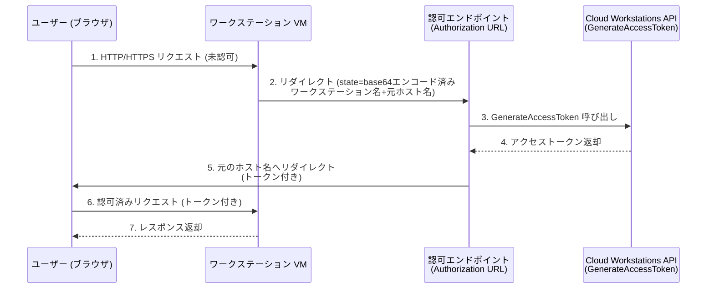

# Cloud Workstations: ワークステーションクラスタの認可 URL 設定

**リリース日**: 2026-05-08

**サービス**: Cloud Workstations

**機能**: Workstation Authorization URL (ワークステーション認可 URL)

**ステータス**: Feature (新機能)

📊 [このアップデートのインフォグラフィックを見る](https://takech9203.github.io/google-cloud-news-summary/20260508-cloud-workstations-authorization-url.html)

## 概要

Cloud Workstations にワークステーションクラスタレベルで認可 URL (Authorization URL) を設定できる新機能が追加されました。この機能により、ワークステーション VM が受信した未認可の HTTP/HTTPS リクエストを、指定した認可エンドポイントにリダイレクトし、アクセストークンの取得と元のホスト名への再リダイレクトを自動的に処理できるようになります。

この機能は、ワークステーションへのアクセスにおけるカスタム認証フローを実装したい組織に特に有用です。従来のデフォルト認証メカニズムに加えて、独自の認可エンドポイントを指定することで、組織のセキュリティポリシーに準拠した柔軟な認証制御が可能になります。

**アップデート前の課題**

- ワークステーションへの未認可リクエストに対するリダイレクト先をカスタマイズできなかった
- 組織独自の認証プロバイダーを利用した認証フローの統合が困難だった
- クラスタ全体で統一された認可ポリシーを適用するにはアプリケーション側での実装が必要だった

**アップデート後の改善**

- ワークステーションクラスタレベルで認可 URL を設定し、未認可リクエストの自動リダイレクトが可能になった
- カスタム認証エンドポイントとの統合により、組織のセキュリティ要件に準拠したアクセス制御が実現可能になった
- クラスタ内の全ワークステーション VM に対して一括で認可ポリシーを適用できるようになった

## アーキテクチャ図



未認可リクエストを受信したワークステーション VM は、設定された認可 URL にリダイレクトします。認可エンドポイントがアクセストークンを取得し、元のホスト名にトークン付きでリダイレクトすることで認証が完了します。

## サービスアップデートの詳細

### 主要機能

1. **ワークステーション認可 URL (`workstationAuthorizationUrl`)**
   - ワークステーションクラスタリソースに追加された新しいオプションフィールド
   - 未認可の HTTP/HTTPS リクエストを指定したエンドポイントにリダイレクト
   - リダイレクト時に `state` クエリパラメータとして、対象ワークステーション名と元のリクエストホスト名を base64 エンコードして送信

2. **トークン取得とリダイレクトのフロー**
   - 認可エンドポイントは `GenerateAccessToken` API を使用してアクセストークンを取得
   - トークン取得後、元のホスト名にトークンを付与してリダイレクト
   - クラスタ内の全ワークステーション VM に対して一括適用

3. **クラスタレベルでの一元管理**
   - ワークステーションクラスタの作成時または更新時に設定可能
   - REST API の `patch` メソッドで既存クラスタに追加設定可能
   - 設定はオプションであり、未設定の場合はデフォルトの認証動作を維持

## 技術仕様

### API フィールド

| 項目 | 詳細 |
|------|------|
| フィールド名 | `workstationAuthorizationUrl` |
| データ型 | `string` |
| リソース | `WorkstationCluster` |
| 必須/任意 | Optional (任意) |
| API バージョン | v1 / v1beta |

### WorkstationCluster リソース JSON 構造

```json
{
  "name": "projects/PROJECT_ID/locations/REGION/workstationClusters/CLUSTER_NAME",
  "displayName": "My Cluster",
  "network": "projects/PROJECT_ID/global/networks/NETWORK_NAME",
  "subnetwork": "projects/PROJECT_ID/regions/REGION/subnetworks/SUBNET_NAME",
  "workstationAuthorizationUrl": "https://auth.example.com/authorize"
}
```

### リダイレクト時のパラメータ

| パラメータ | 説明 |
|-----------|------|
| `state` | base64 エンコードされた JSON。対象ワークステーション名と元のリクエストホスト名を含む |

## 設定方法

### 前提条件

1. Cloud Workstations Admin IAM ロール (`roles/workstations.admin`) を持つアカウント
2. 既存のワークステーションクラスタ、またはクラスタ新規作成時に設定
3. 認可エンドポイントが公開されていること

### 手順

#### ステップ 1: 既存クラスタに認可 URL を設定 (REST API)

```bash
curl -X PATCH \
  "https://workstations.googleapis.com/v1/projects/PROJECT_ID/locations/REGION/workstationClusters/CLUSTER_NAME?updateMask=workstationAuthorizationUrl" \
  -H "Authorization: Bearer $(gcloud auth print-access-token)" \
  -H "Content-Type: application/json" \
  -d '{
    "workstationAuthorizationUrl": "https://auth.example.com/authorize"
  }'
```

ワークステーションクラスタの `workstationAuthorizationUrl` フィールドに認可エンドポイントの URL を指定します。

#### ステップ 2: Google Cloud コンソールから設定

Google Cloud コンソールの Cloud Workstations > Cluster management ページからクラスタを作成または編集する際に、認可 URL を指定できます。

## メリット

### ビジネス面

- **セキュリティコンプライアンス強化**: 組織独自の認証プロバイダーやシングルサインオン (SSO) との統合が容易になり、セキュリティポリシーへの準拠が向上
- **管理負荷の軽減**: クラスタレベルで認可ポリシーを一元管理できるため、個別ワークステーションごとの設定が不要

### 技術面

- **柔軟な認証フロー**: カスタム認可エンドポイントにより、企業の既存 IdP (Identity Provider) との連携が可能
- **透過的なトークン管理**: リダイレクトベースのフローにより、ユーザーは明示的なトークン管理を意識せずに利用可能
- **クラスタ全体への一括適用**: 設定一つで全ワークステーション VM に認可ポリシーが適用される

## デメリット・制約事項

### 制限事項

- 認可エンドポイントはユーザー自身で構築・運用する必要がある
- `GenerateAccessToken` API で生成されたトークンは有効期限内は失効不可

### 考慮すべき点

- 認可エンドポイントの可用性がワークステーションへのアクセス可能性に直接影響する
- ネットワークポリシーにより認可エンドポイントへのリダイレクトがブロックされる環境では利用できない可能性がある
- カスタム認可エンドポイントの実装には `state` パラメータの適切な処理と `GenerateAccessToken` API の呼び出しロジックが必要

## ユースケース

### ユースケース 1: 企業の SSO プロバイダーとの統合

**シナリオ**: 企業が独自の SSO (SAML/OIDC) プロバイダーを運用しており、ワークステーションへのアクセスにも同一の認証フローを適用したい場合。

**効果**: ユーザーが未認証状態でワークステーションにアクセスした際、企業の SSO ログインページにリダイレクトされ、認証後にワークステーションへのアクセストークンが自動取得される。ユーザー体験を損なうことなく、統一された認証ポリシーが適用される。

### ユースケース 2: カスタムアクセス制御の実装

**シナリオ**: 開発チームごとに異なるアクセスレベルを設定し、ワークステーションへのアクセス時に追加の認可チェック (時間帯制限、IP アドレス制限など) を実施したい場合。

**効果**: 認可エンドポイントで追加のビジネスロジックを実装することで、IAM ロールだけでは実現困難な細粒度のアクセス制御が可能になる。

## 関連サービス・機能

- **Cloud Workstations GenerateAccessToken API**: 認可エンドポイントがワークステーションへのアクセストークンを取得するために使用する API
- **Cloud Workstations Launcher URL (`workstationLaunchUrl`)**: 停止中のワークステーションに対するリクエストのリダイレクト先を指定する類似機能
- **Identity-Aware Proxy (IAP)**: Google Cloud のアプリケーションレベル認証プロキシ
- **Cloud Identity / Workforce Identity Federation**: 外部 IdP との統合に利用可能な認証基盤

## 参考リンク

- 📊 [インフォグラフィック](https://takech9203.github.io/google-cloud-news-summary/20260508-cloud-workstations-authorization-url.html)
- [公式リリースノート](https://docs.cloud.google.com/release-notes#May_08_2026)
- [Cloud Workstations 認証ドキュメント](https://docs.cloud.google.com/workstations/docs/authentication)
- [WorkstationCluster REST API リファレンス](https://docs.cloud.google.com/workstations/docs/reference/rest/v1/projects.locations.workstationClusters)
- [ワークステーションクラスタの作成](https://docs.cloud.google.com/workstations/docs/create-cluster)

## まとめ

Cloud Workstations の認可 URL 設定機能により、ワークステーションクラスタレベルでカスタム認証フローを実装できるようになりました。この機能は、企業の既存認証基盤との統合や、より柔軟なアクセス制御ポリシーの適用を可能にします。Cloud Workstations を利用する組織で独自の認証要件がある場合は、ワークステーションクラスタの `workstationAuthorizationUrl` フィールドの設定を検討してください。

---

**タグ**: #CloudWorkstations #Authentication #Authorization #Security #WorkstationCluster #AccessControl
