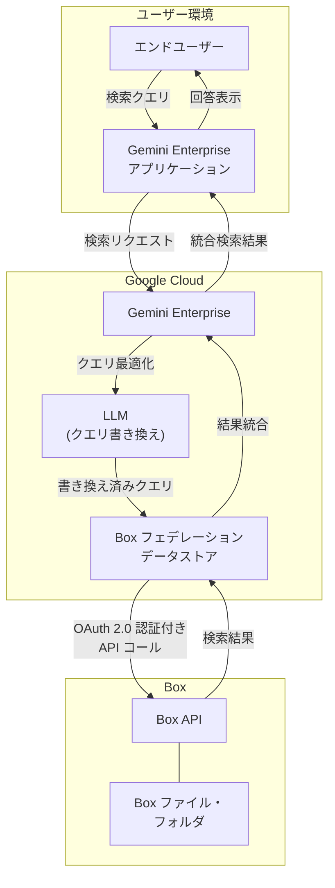

# Gemini Enterprise: Box データストア (データフェデレーション) が GA

**リリース日**: 2026-05-08

**サービス**: Gemini Enterprise

**機能**: Box データストア (データフェデレーション接続)

**ステータス**: GA (一般提供)

[このアップデートのインフォグラフィックを見る](https://takech9203.github.io/google-cloud-news-summary/20260508-gemini-enterprise-box-data-federation-ga.html)

## 概要

Gemini Enterprise において、データフェデレーションを使用した Box データソースとの接続が一般提供 (GA) となりました。データフェデレーションにより、Gemini Enterprise は Box のデータをコピーせずに、Box API を通じて直接情報を検索・取得できます。

データフェデレーションのアプローチでは、外部データソースへの即時アクセスが可能であり、データのインジェスト (取り込み) を待つ必要がありません。これにより、企業が Box に保存しているドキュメントやファイルを、Gemini Enterprise の検索・AI 機能を通じてリアルタイムに活用できるようになります。

この機能は、Box をコンテンツ管理プラットフォームとして利用しながら、Google Cloud の AI 検索機能を統合的に活用したい企業ユーザーを対象としています。

**アップデート前の課題**

- Box データを Gemini Enterprise で検索するにはデータインジェスト (コピー) が必要で、同期完了まで数時間かかる場合があった
- データフェデレーション機能はプレビュー段階であり、本番環境での利用には制限があった
- プレビュー利用にはアローリスト (許可リスト) への登録が必要だった

**アップデート後の改善**

- データフェデレーションが GA となり、本番環境でのサポートが保証される
- Box のデータをコピーすることなく、API 経由でリアルタイム検索が可能
- インジェスト不要のため、データストレージコストの削減とデータ鮮度の向上を実現

## アーキテクチャ図

Gemini Enterprise がデータフェデレーションを通じて Box API に直接クエリを送信し、結果を他のデータソースとブレンドして返す仕組みを示しています。

## サービスアップデートの詳細

### 主要機能

1. **リアルタイムフェデレーション検索**
   - Gemini Enterprise が Box API に直接クエリを送信し、リアルタイムで検索結果を取得
   - データのコピーやインジェストが不要で、常に最新のデータにアクセス可能

2. **LLM によるクエリ最適化**
   - 検索クエリを LLM が書き換え、Box API に最適化された形式で送信
   - セッションのクエリ履歴を活用し、精度の高い検索結果を実現

3. **複数データソースとのブレンド検索**
   - Box の検索結果を他の接続済みデータソース (Google Drive、Confluence など) の結果と統合
   - 一つのインターフェースから複数のデータソースを横断的に検索可能

4. **ユーザー認可とアクセス制御**
   - OAuth 2.0 によるユーザーレベルの認証
   - Box 側のアクセス権限に基づいたセキュアな検索結果を提供

## 技術仕様

### 認証設定

| 項目 | 詳細 |
|------|------|
| 認証方式 | OAuth 2.0 (User Authentication) |
| 必要な認証情報 | Client ID、Client Secret |
| リダイレクト URI | `https://vertexaisearch.cloud.google.com/console/oauth/default_oauth.html`、`https://vertexaisearch.cloud.google.com/oauth-redirect` |
| 必要なスコープ | Read all files and folders stored in Box、Write all files and folders stored in Box |
| インパーソネーションモード | Admin または User |

### 必要な IAM ロール

| ロール | 説明 |
|------|------|
| `roles/discoveryengine.editor` | Discovery Engine Editor - データストア作成に必要 |

## 設定方法

### 前提条件

1. Box Developer Console への管理者アクセス権
2. Google Cloud プロジェクトの作成と Gemini Enterprise の有効化
3. Discovery Engine Editor ロール (`roles/discoveryengine.editor`) の付与

### 手順

#### ステップ 1: Box OAuth 2.0 アプリケーションの登録

1. [Box Developer Console](https://app.box.com/developers/console) に管理者アカウントでサインイン
2. **Create Platform App** > **Custom App** を選択
3. 認証方式として **User Authentication (OAuth 2.0)** を選択
4. アプリ作成後、**Client ID** と **Client Secret** をコピー
5. OAuth 2.0 Redirect URIs に以下を追加:
   - `https://vertexaisearch.cloud.google.com/console/oauth/default_oauth.html`
   - `https://vertexaisearch.cloud.google.com/oauth-redirect`
6. アプリケーションスコープを設定:
   - Read all files and folders stored in Box
   - Write all files and folders stored in Box
7. **Save Changes** をクリック

#### ステップ 2: Gemini Enterprise でフェデレーションデータストアを作成

1. Google Cloud コンソールで **Gemini Enterprise** ページに移動
2. ナビゲーションメニューから **Data Stores** をクリック
3. **Create Data Store** をクリック
4. データソース選択画面で **Box** を検索し、**Federated search** を選択
5. 認証設定で Client ID と Client Secret を入力し、**Login** で認証
6. インパーソネーションモード (Admin または User) を選択
7. 検索対象のエンティティを選択
8. マルチリージョン (global、us、eu) を選択
9. データコネクタ名を入力
10. 暗号化設定 (Google マネージド暗号鍵または Cloud KMS 鍵) を選択
11. 課金プラン (General pricing または Configurable pricing) を選択
12. **Create** をクリック

#### ステップ 3: ユーザー認可

1. データソース管理パネルで Box データソースの横にある **Authorize** をクリック
2. Box 認証サーバーにリダイレクトされるのでサインイン
3. **Grant access** をクリックしてアクセスを許可

## メリット

### ビジネス面

- **即時データアクセス**: インジェスト処理を待つことなく、Box のデータにリアルタイムでアクセス可能
- **統合検索体験**: Box を含む複数のデータソースを一つのインターフェースから横断検索
- **データガバナンスの維持**: データが Box 上に留まるため、データの所在管理が容易

### 技術面

- **ストレージコスト削減**: データのコピーが不要なため、Gemini Enterprise 側のストレージコストが発生しない
- **データ鮮度の保証**: 常に Box の最新データを検索するため、同期遅延の問題がない
- **迅速な導入**: インジェスト処理不要により、セットアップ後すぐに利用開始可能

## デメリット・制約事項

### 制限事項

- フェデレーション検索はデータがインデックス化されないため、インジェスト方式と比較して検索品質が低い場合がある
- クエリ文字列がサードパーティ (Box API) に送信されるため、Box のサービス利用規約およびプライバシーポリシーが適用される
- 複数のフェデレーション検索データソースが有効な場合、クエリが全てのデータソースに送信される可能性がある

### 考慮すべき点

- LLM によるクエリ書き換えにより、セッション内のクエリ履歴の一部が Box API に送信される場合がある
- Box 側のアクセス権限に依存するため、適切な Box 側の権限設定が必要
- CMEK (顧客管理暗号鍵) を使用する場合、global ロケーションでは利用不可であり、US または EU マルチリージョンを選択する必要がある

## ユースケース

### ユースケース 1: 企業内ナレッジ統合検索

**シナリオ**: 大企業において、部門ごとに Box、Google Drive、Confluence など異なるツールに情報が分散している状況で、全社横断の統合検索を実現したい。

**効果**: 従業員は Gemini Enterprise の単一インターフェースから、Box に保存された契約書、提案書、技術文書を含む全てのデータソースを同時に検索でき、情報探索時間を大幅に削減できる。

### ユースケース 2: コンプライアンスドキュメントの即時検索

**シナリオ**: 規制対応チームが Box に保存されている大量のコンプライアンス関連文書から、特定のポリシーや規制要件を素早く検索する必要がある。

**効果**: データフェデレーションにより常に最新の Box データにアクセスできるため、文書の更新直後から検索可能となり、コンプライアンス対応の迅速化を実現できる。

## 料金

Gemini Enterprise のデータストアには **General pricing** と **Configurable pricing** の2つの課金プランが用意されています。詳細な料金については、[Gemini Enterprise のライセンスページ](https://docs.cloud.google.com/gemini/enterprise/docs/licenses)を参照してください。

## 利用可能リージョン

| リージョン | 説明 |
|-----------|------|
| global | グローバル (全機能利用可能、推奨) |
| us | 米国マルチリージョン (DRZ・MLP サポート) |
| eu | EU マルチリージョン (DRZ・MLP サポート) |

CMEK (顧客管理暗号鍵) を使用する場合は、US または EU マルチリージョンの選択が必要です。セキュリティや規制上の理由がない場合は、レスポンスタイムと全機能利用の観点から global ロケーションが推奨されます。

## 関連サービス・機能

- **Gemini Enterprise データインジェスション (Box)**: データを Gemini Enterprise にコピーして検索するアプローチ。検索品質が高いが同期に時間がかかる
- **Vertex AI Search**: Gemini Enterprise の基盤となる検索エンジン (Discovery Engine)
- **Cloud KMS**: データストアのカスタマー管理暗号鍵による暗号化
- **Google Drive フェデレーション**: 同様のフェデレーション方式で Google Drive データを検索可能

## 参考リンク

- [インフォグラフィック](https://takech9203.github.io/google-cloud-news-summary/20260508-gemini-enterprise-box-data-federation-ga.html)
- [公式リリースノート](https://docs.cloud.google.com/release-notes#May_08_2026)
- [Box データストアのセットアップ](https://docs.cloud.google.com/gemini/enterprise/docs/connectors/box/set-up-data-store)
- [Box 接続ガイド](https://docs.cloud.google.com/gemini/enterprise/docs/connect-box)
- [Gemini Enterprise ロケーション](https://docs.cloud.google.com/gemini/enterprise/docs/locations)
- [コネクタとデータストアの概要](https://docs.cloud.google.com/gemini/enterprise/docs/connectors/introduction-to-connectors-and-data-stores)

## まとめ

Gemini Enterprise の Box データフェデレーションが GA となったことで、企業は Box に保存されたコンテンツをコピーすることなく、リアルタイムで AI 検索の対象にすることが可能になりました。既に Box を利用している組織は、本番環境での安定したサポートのもとで統合検索を構築できます。導入を検討する場合は、Box Developer Console での OAuth 2.0 アプリ登録から始め、フェデレーション方式とインジェスト方式の特性を比較した上で適切なアプローチを選択してください。

---

**タグ**: #GeminiEnterprise #Box #DataFederation #GA #コネクタ #フェデレーション検索 #サードパーティ連携 #VertexAISearch
