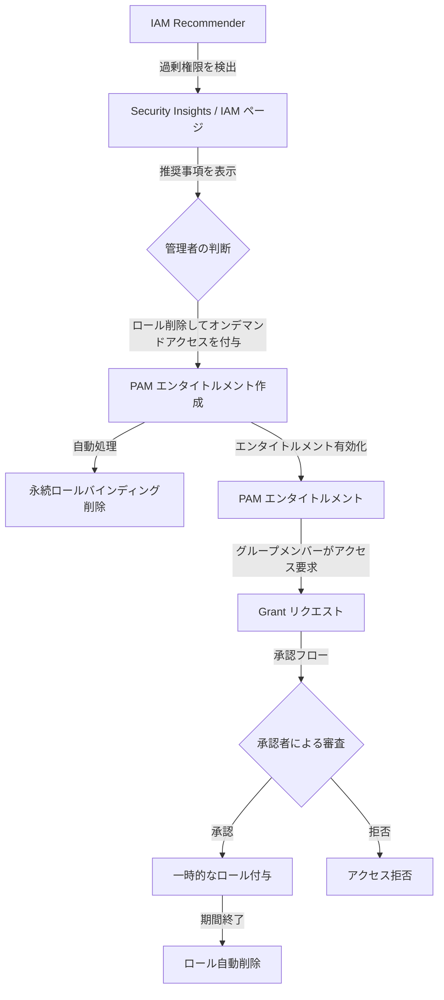

# Identity and Access Management: IAM Recommender による Google グループの過剰権限を Privileged Access Manager で修正

**リリース日**: 2026-05-08

**サービス**: Identity and Access Management (IAM)

**機能**: IAM Recommender と Privileged Access Manager (PAM) の統合によるグループ権限修正

**ステータス**: Preview

📊 [このアップデートのインフォグラフィックを見る](https://takech9203.github.io/google-cloud-news-summary/20260508-iam-pam-group-remediation.html)

## 概要

Google Cloud の IAM Recommender が、Google グループに対する過剰な権限を検出した際に、永続的なロールバインディングを削除し、Privileged Access Manager (PAM) のオンデマンドエンタイトルメントに移行することで修正できるようになりました。この機能は Preview として提供されています。

従来、IAM Recommender が過剰権限を検出した場合、管理者はロールの削除または縮小しか選択肢がありませんでした。しかし、まれに必要となる重要なタスクのためにアクセスが必要なケースでは、永続的にロールを削除することはリスクを伴います。今回のアップデートにより、永続的なアクセスを完全に削除するのではなく、必要な時にのみ一時的にアクセスを付与する Just-in-Time (JIT) アクセスモデルへの移行が可能になりました。

**アップデート前の課題**

- IAM Recommender がグループの過剰権限を検出しても、ロールの削除または縮小のみが修正手段だった
- 永続的なロール削除は、まれに必要となる重要タスクの実行を阻害するリスクがあった
- 最小権限の原則を実現しながら、緊急時のアクセスを確保する仕組みが統合されていなかった

**アップデート後の改善**

- IAM Recommender の推奨事項から直接 PAM エンタイトルメントを作成し、永続ロールを一時的なオンデマンドアクセスに移行可能
- 最小権限の原則を維持しつつ、必要時に一時的なアクセスを要求できる仕組みを提供
- Security Insights ページまたは IAM ページから数クリックで修正を適用可能

## アーキテクチャ図

IAM Recommender が過剰権限を検出し、管理者が PAM への移行を選択すると、永続ロールが削除され、代わりに PAM エンタイトルメントが作成されます。グループメンバーは必要時にオンデマンドでアクセスを要求できます。

## サービスアップデートの詳細

### 主要機能

1. **IAM Recommender と PAM の統合ワークフロー**
   - IAM Recommender がグループの過剰権限を検出すると、「ロールを削除してオンデマンドアクセスを付与する」オプションが表示される
   - 推奨事項に基づいてロールとリソースが自動入力された PAM エンタイトルメント作成フォームが提供される
   - デフォルトのアクセス期間は 8 時間に設定される

2. **Security Insights ページからの修正**
   - 「Top groups with excess permissions」ウィジェットからグループの過剰権限を特定
   - Insights 列のリンクから推奨事項を確認
   - 「Remove role and grant on-demand access to the role」を選択して PAM エンタイトルメントを作成

3. **IAM ページからの修正**
   - IAM ページのプリンシパル一覧から Security insights 列を確認
   - 推奨事項から直接 PAM エンタイトルメントの作成画面に遷移
   - エンタイトルメント作成後、1-2 分でアクセス変更が反映

4. **推奨事項の取り消し (Revert)**
   - 適用した推奨事項を取り消すことが可能
   - 取り消し時には元の IAM バインディングが復元され、作成された PAM エンタイトルメントが削除される

## 技術仕様

### 必要なロールと権限

| 操作 | 必要なロール |
|------|------|
| ロール推奨事項の表示 | Recommender IAM Admin (`roles/recommender.iamAdmin`) または Recommender IAM Viewer (`roles/recommender.iamViewer`) |
| PAM エンタイトルメントの作成 | Privileged Access Manager Admin (`roles/privilegedaccessmanager.admin`) |
| リソースの IAM ポリシー変更 | Project IAM Admin (`roles/resourcemanager.projectIamAdmin`) |

### 必要な権限の詳細

| 権限 | 用途 |
|------|------|
| `recommender.iamPolicyInsights.list` | ポリシーインサイトの一覧表示 |
| `recommender.iamPolicyRecommendations.list` | ロール推奨事項の一覧表示 |
| `privilegedaccessmanager.entitlements.create` | PAM エンタイトルメントの作成 |
| `privilegedaccessmanager.entitlements.list` | PAM エンタイトルメントの一覧表示 |
| `resourcemanager.projects.setIamPolicy` | IAM ポリシーの変更 (永続ロール削除) |

## 設定方法

### 前提条件

1. Privileged Access Manager が対象リソース (プロジェクト、フォルダ、または組織) でオンボーディングおよび有効化されていること
2. 上記の必要なロールと権限が付与されていること

### 手順

#### ステップ 1: Privileged Access Manager のセットアップ

Google Cloud コンソールで Privileged Access Manager ページに移動し、対象リソースを選択して「Set up PAM」をクリックします。Privileged Access Manager Service Agent にロールを付与して有効化を完了します。

#### ステップ 2: Security Insights ページから修正を適用

1. Google Cloud コンソールで IAM & Admin > Security Insights ページに移動
2. 「Top groups with excess permissions」ウィジェットで対象グループを確認
3. Insights 列のリンクをクリック
4. 「View recommendation」をクリック
5. 「Remove role and grant on-demand access to the role」を選択
6. エンタイトルメントの詳細を入力し「Apply」をクリック

#### ステップ 3: (代替) IAM ページから修正を適用

1. Google Cloud コンソールで IAM ページに移動
2. プリンシパル一覧から対象グループを確認
3. Security insights 列のインサイトをクリック
4. 「Remove role and grant on-demand access to the role」を選択
5. エンタイトルメントの詳細を入力し「Apply」をクリック

## メリット

### ビジネス面

- **最小権限の原則の実現**: 永続的な過剰権限を排除しながら、必要時のアクセスを確保できる
- **運用リスクの低減**: 永続ロール削除による業務影響のリスクなく、権限の最適化が可能
- **監査対応の強化**: 誰がいつ、なぜアクセスを要求・承認したかの完全な監査ログを保持

### 技術面

- **統合ワークフロー**: IAM Recommender から PAM エンタイトルメント作成まで一貫したコンソール操作で完結
- **自動入力**: 推奨事項に基づいてロールとリソースが自動入力されるため、設定ミスを低減
- **取り消し可能**: 問題が発生した場合に推奨事項の適用を取り消して元のバインディングを復元可能

## デメリット・制約事項

### 制限事項

- Preview 機能のため、限定的なサポートとなる可能性がある
- Google グループのプリンシパルのみが対象 (個別ユーザーやサービスアカウントへの推奨は対象外)
- PAM が対象リソースで事前にオンボーディングされている必要がある
- アクセス変更の反映に 1-2 分を要する

### 考慮すべき点

- グループメンバーは、従来の永続アクセスではなくオンデマンドでアクセスを要求する必要があるため、運用フローの変更が必要
- エンタイトルメントの承認者設定を適切に行わないと、承認待ちによる業務遅延が発生する可能性がある
- PAM が管理するロールバインディングを手動で変更すると、PAM が正常に動作しない可能性がある

## ユースケース

### ユースケース 1: 開発チームの本番環境アクセス制御

**シナリオ**: 開発者グループに本番環境の Editor ロールが永続的に付与されているが、実際にアクセスが必要なのはデプロイ時やトラブルシューティング時のみ。IAM Recommender が過剰権限として検出。

**効果**: Editor ロールを PAM エンタイトルメントに移行し、デプロイ時にのみ一時的なアクセスを要求させることで、常時の攻撃面を縮小しつつ必要な業務を妨げない。

### ユースケース 2: セキュリティ監査対応

**シナリオ**: セキュリティ監査で複数の Google グループに過剰な権限が付与されていることが指摘された。しかし、永続的にロールを削除すると、四半期ごとの重要な運用タスクが実行できなくなるリスクがある。

**効果**: PAM への移行により、監査要件である最小権限を満たしつつ、四半期ごとのタスク実行時にオンデマンドでアクセスを取得できる仕組みを確立。承認ログにより監査証跡も確保。

## 関連サービス・機能

- **IAM Recommender (Policy Intelligence)**: 過剰権限の検出と推奨事項の生成を担当
- **Privileged Access Manager (PAM)**: 一時的な特権アクセスの管理基盤
- **Security Command Center**: Enterprise または Premium ティアでマルチレベル承認などの高度な PAM 機能を利用可能
- **Cloud Audit Logs**: PAM のエンタイトルメントおよびグラント操作の監査ログを記録

## 参考リンク

- 📊 [インフォグラフィック](https://takech9203.github.io/google-cloud-news-summary/20260508-iam-pam-group-remediation.html)
- [公式リリースノート](https://docs.cloud.google.com/release-notes#May_08_2026)
- [Remediate excessive permissions with Privileged Access Manager](https://docs.cloud.google.com/iam/docs/pam-remediate-iam-recommendations)
- [Privileged Access Manager 概要](https://docs.cloud.google.com/iam/docs/pam-overview)
- [PAM のセットアップと権限](https://docs.cloud.google.com/iam/docs/pam-permissions-and-setup)
- [エンタイトルメントの作成](https://docs.cloud.google.com/iam/docs/pam-create-entitlements)
- [ロール推奨事項の概要](https://docs.cloud.google.com/policy-intelligence/docs/role-recommendations-overview)

## まとめ

今回のアップデートにより、IAM Recommender と Privileged Access Manager が統合され、Google グループの過剰権限を安全に修正する新しいワークフローが Preview として利用可能になりました。永続的なロール削除のリスクを回避しながら最小権限の原則を実現できるため、セキュリティ体制の強化を検討している組織は、まず Privileged Access Manager のオンボーディングを完了し、Security Insights ページから過剰権限のあるグループを確認することを推奨します。

---

**タグ**: #IAM #PrivilegedAccessManager #PAM #PolicyIntelligence #IAMRecommender #最小権限 #セキュリティ #Preview #JIT #グループ管理
