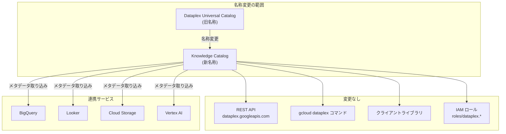

# Looker / Dataplex: Dataplex Universal Catalog から Knowledge Catalog への名称変更

**リリース日**: 2026-05-08

**サービス**: Looker / Dataplex

**機能**: Dataplex Universal Catalog の Knowledge Catalog への名称変更

**ステータス**: 一般提供 (GA)

📊 [このアップデートのインフォグラフィックを見る](https://takech9203.github.io/google-cloud-news-summary/20260508-looker-dataplex-knowledge-catalog-rename.html)

## 概要

Google Cloud は、Dataplex Universal Catalog の名称を「Knowledge Catalog」に変更しました。この名称変更は、従来のパッシブなメタデータレジストリから、AI を活用したアクティブなコンテキストグラフへの進化を反映するものです。

Knowledge Catalog は、Gemini を活用したデータカタログであり、構造化データおよび非構造化データからセマンティクスを自動的に抽出し、AI エージェントにエンタープライズの真実を提供する動的なコンテキストグラフを構築します。生成 AI の採用が加速する中、AI エージェントが正確でグラウンデッドなレスポンスを提供するために必要な深いビジネスコンテキストを提供することを目的としています。

重要なのは、API、クライアントライブラリ、CLI (`gcloud dataplex` コマンドグループ)、IAM の名称は変更されないという点です。既存のデプロイ、設定、メタデータはそのまま動作し続け、手動の移行やダウンタイムは発生しません。

**アップデート前の課題**

- 「Universal Catalog」という名称が、AI を活用したガバナンスとコンテキスト管理という製品の方向性を十分に反映していなかった
- 従来のパッシブなメタデータカタログという印象を与えていた
- 生成 AI エージェントとの連携における製品の価値が名称から伝わりにくかった

**アップデート後の改善**

- 「Knowledge Catalog」という名称により、AI 駆動のコンテキストグラフとしての位置づけが明確になった
- データガバナンスと生成 AI 機能の統合というビジョンがより的確に伝わるようになった
- 既存の API、CLI、クライアントライブラリは変更なしでそのまま利用可能

## アーキテクチャ図

名称のみが変更され、API エンドポイント、CLI コマンド、IAM ロール、連携サービスとの接続はすべてそのまま維持されます。

## サービスアップデートの詳細

### 主要変更点

1. **製品名の変更**
   - 「Dataplex Universal Catalog」から「Knowledge Catalog」への名称変更
   - Google Cloud コンソール、ドキュメント、マーケティング資料に反映

2. **変更されない項目**
   - REST API エンドポイント (`dataplex.googleapis.com`)
   - RPC API
   - `gcloud dataplex` コマンドグループ
   - クライアントライブラリ
   - IAM ロール名 (`roles/dataplex.viewer`、`roles/dataplex.editor` など)
   - 既存のメタデータ、アスペクト、設定

3. **Knowledge Catalog の主な機能**
   - AI を活用したコンテキストの自動キュレーション
   - 検証済みサンプルクエリの生成
   - Model Context Protocol (MCP) によるローカル/リモート統合
   - 非構造化データのデータインサイト
   - メタデータ変更フィードによるリアルタイム通知

## 技術仕様

### API とツールの対応表

| 項目 | 名称変更前 | 名称変更後 |
|------|-----------|-----------|
| 製品名 | Dataplex Universal Catalog | Knowledge Catalog |
| REST API | `dataplex.googleapis.com` | `dataplex.googleapis.com`（変更なし） |
| CLI コマンド | `gcloud dataplex` | `gcloud dataplex`（変更なし） |
| IAM ロール | `roles/dataplex.*` | `roles/dataplex.*`（変更なし） |
| クライアントライブラリ | Cloud Dataplex | Cloud Dataplex（変更なし） |

### Looker との連携

Looker (Google Cloud core) は Knowledge Catalog と統合されており、以下のメタデータが自動的に取り込まれます:

- Looker インスタンス
- ダッシュボード / ダッシュボード要素
- Look
- LookML プロジェクト / モデル / Explore / ビュー

この統合はデフォルトで有効化されており、名称変更による影響はありません。

## メリット

### ビジネス面

- **ブランディングの明確化**: 製品の AI 駆動ガバナンスとしての位置づけが名称から直感的に伝わる
- **移行コストゼロ**: 既存の構成やワークフローを変更する必要がない

### 技術面

- **後方互換性の完全維持**: API、CLI、IAM のすべてのインターフェースが既存のまま動作
- **ダウンタイムなし**: 手動の移行作業やデータ移動が不要

## デメリット・制約事項

### 考慮すべき点

- ドキュメントやチュートリアル内の旧名称「Dataplex Universal Catalog」への参照は段階的に更新される可能性がある
- 社内ドキュメントや Wiki で旧名称を使用している場合は、混乱を避けるために更新を推奨
- Google Cloud コンソールの UI が「Knowledge Catalog」に変更されるため、既存のスクリーンショットベースの手順書は更新が必要

## 関連サービス・機能

- **BigQuery**: Knowledge Catalog に自動的にメタデータが取り込まれる主要なデータソース
- **Looker (Google Cloud core)**: ダッシュボードや LookML メタデータが Knowledge Catalog に統合される (Preview)
- **Vertex AI**: モデル、データセット、特徴量グループのメタデータが取り込まれる
- **Cloud Storage**: 非構造化データの自動ディスカバリと Knowledge Catalog への登録
- **Model Context Protocol (MCP)**: AI エージェントが Knowledge Catalog のツールを発見し適応的に利用するためのオープンスタンダード

## 参考リンク

- 📊 [インフォグラフィック](https://takech9203.github.io/google-cloud-news-summary/20260508-looker-dataplex-knowledge-catalog-rename.html)
- [公式リリースノート](https://docs.cloud.google.com/release-notes#May_08_2026)
- [Knowledge Catalog の概要](https://docs.cloud.google.com/dataplex/docs/introduction)
- [Knowledge Catalog の詳細（カタログ概要）](https://docs.cloud.google.com/dataplex/docs/catalog-overview)
- [Data Catalog から Knowledge Catalog への移行](https://docs.cloud.google.com/dataplex/docs/transition-to-dataplex-catalog)
- [Looker と Knowledge Catalog の統合](https://docs.cloud.google.com/looker/docs/looker-core-dataplex)
- [Knowledge Catalog FAQ](https://docs.cloud.google.com/dataplex/docs/faq)
- [Knowledge Catalog REST API](https://docs.cloud.google.com/dataplex/docs/reference/rest)

## まとめ

Dataplex Universal Catalog から Knowledge Catalog への名称変更は、製品の AI 駆動ガバナンスプラットフォームとしての進化を反映したブランディングの変更です。技術的な影響はなく、API、CLI、IAM ロールはすべてそのまま動作するため、既存ユーザーは追加のアクション不要で引き続き利用できます。社内ドキュメントで旧名称を参照している場合は、チーム内の混乱を防ぐために名称の更新を推奨します。

---

**タグ**: #Looker #Dataplex #KnowledgeCatalog #UniversalCatalog #名称変更 #データカタログ #メタデータ管理 #データガバナンス #AI
