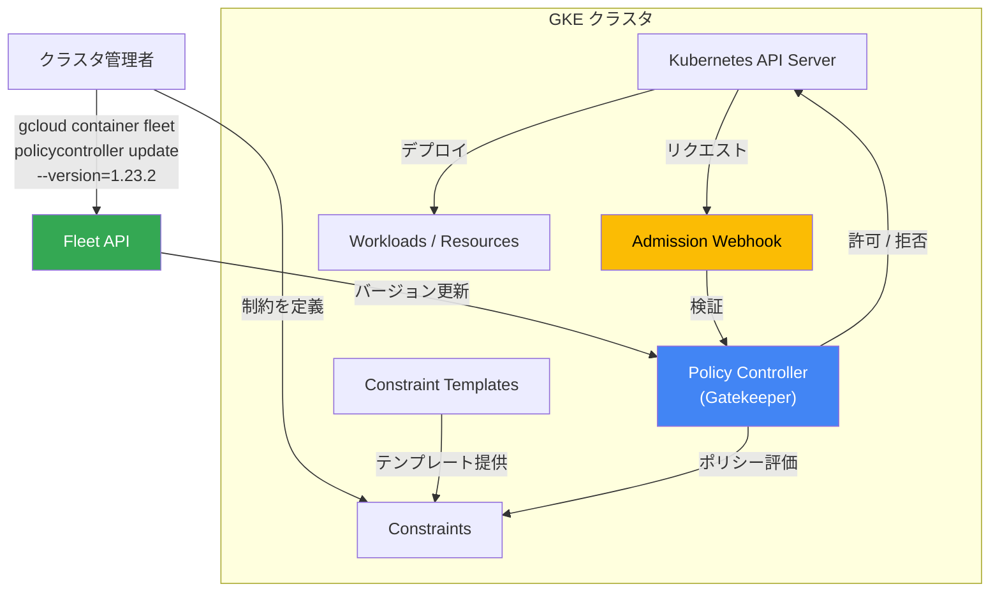

# Policy Controller: バージョン 1.23.2 リリース

**リリース日**: 2026-05-08

**サービス**: Policy Controller

**機能**: バージョン 1.23.2 アップデート

**ステータス**: 利用可能

📊 [このアップデートのインフォグラフィックを見る](https://takech9203.github.io/google-cloud-news-summary/20260508-policy-controller-v1-23-2.html)

## 概要

Policy Controller バージョン 1.23.2 がリリースされた。Policy Controller は Google Kubernetes Engine (GKE) クラスタに対してプログラマティックなポリシーの適用と強制を行うサービスであり、セキュリティ、コンプライアンス、ベストプラクティスの管理を支援する。OPA (Open Policy Agent) Gatekeeper をベースとしており、Google Cloud と完全に統合されている。

本バージョンは 1.23 系のパッチリリース (1.23.0 -> 1.23.1 -> 1.23.2) であり、安定性やセキュリティの改善が含まれると考えられる。なお、リリースノートには具体的な変更内容の詳細は記載されていない。

Policy Controller は 2025 年 9 月より GKE Enterprise を必要とせず、標準の GKE で利用可能となっている。現在の推奨バージョンは 1.23 系であり、本パッチリリースへのアップデートが推奨される。

## アーキテクチャ図



Policy Controller は GKE クラスタ内の Admission Webhook として動作し、Kubernetes API へのリクエストをポリシーに基づいて検証する。Fleet API を通じてバージョン管理が行われる。

## サービスアップデートの詳細

### 主要機能 (Policy Controller 全般)

1. **Admission Control (入場制御)**
   - Kubernetes API へのリクエストをリアルタイムで検証
   - 非準拠のリソース作成を拒否またはワーニング通知
   - audit モードと enforce モードの切り替えが可能

2. **ポリシーバンドル**
   - CIS GKE Benchmark v1.5、NIST SP 800-53 Rev.5、PCI-DSS v3.2.1/v4.0 など業界標準に対応
   - Pod Security Standards (Baseline/Restricted) のサポート
   - Cost and Reliability バンドルによるコスト最適化ポリシー

3. **Constraint Template Library**
   - プリビルドのポリシーテンプレートを多数提供
   - カスタム Constraint Template の作成もサポート
   - Rego 言語によるポリシーロジックのカスタマイズ

### バージョン履歴 (1.23 系)

| バージョン | リリース日 | 内容 |
|-----------|-----------|------|
| 1.23.0 | 2026-02-23 | メジャーアップデート |
| 1.23.1 | 2026-04-10 | パッチリリース |
| 1.23.2 | 2026-05-08 | パッチリリース (本リリース) |

## 設定方法

### 前提条件

1. Google Cloud CLI がインストールされていること
2. `anthospolicycontroller.googleapis.com` API が有効化されていること
3. クラスタが Fleet に登録されていること
4. Kubernetes 1.14.x 以降のクラスタであること

### 手順

#### ステップ 1: 現在のバージョンを確認

```bash
kubectl get deployments -n gatekeeper-system gatekeeper-controller-manager \
  -o="jsonpath={.spec.template.spec.containers[0].image}"
```

#### ステップ 2: Policy Controller をアップデート (gcloud CLI)

```bash
gcloud container fleet policycontroller update \
  --version=1.23.2 \
  --memberships=MEMBERSHIP_NAME
```

`MEMBERSHIP_NAME` はクラスタ登録時に設定したメンバーシップ名に置き換える。メンバーシップ名は以下で確認できる。

```bash
gcloud container fleet memberships list
```

#### ステップ 3: Google Cloud Console からアップデート (代替手段)

1. Google Cloud Console で **Posture Management > Policy** に移動
2. **Settings** タブでアップデート対象のクラスタの **Edit configuration** を選択
3. **Edit Policy Controller configuration** メニューを展開
4. **Version** ドロップダウンから `1.23.2` を選択
5. **Save changes** をクリック

## メリット

### セキュリティ面

- **最新パッチの適用**: パッチリリースにより既知の脆弱性や不具合が修正される
- **推奨バージョンの維持**: Google が推奨する 1.23 系の最新版を使用することでサポートを最大限活用できる

### 運用面

- **シンプルなアップデート**: gcloud CLI または Console から簡単にバージョンアップが可能
- **Config Controller 利用時の自動更新**: Config Controller を使用している場合は自動的にアップグレードされる

## デメリット・制約事項

### 制限事項

- OSS の OPA Gatekeeper が既にインストールされている場合、事前にアンインストールが必要
- 管理クラスタ (Admin Cluster) へのインストールは不可 (ユーザークラスタのみ)
- カスタム Constraint Template やカスタム YAML 設定に関する問題は Google サポート対象外

### 考慮すべき点

- アップグレード中は Policy Controller の Webhook が一時的に無効化される (クラスタ操作への影響を防ぐため)
- アップグレード完了後、監査ログで非準拠リソースが記録される

## ユースケース

### ユースケース 1: セキュリティコンプライアンスの強制

**シナリオ**: 金融機関が PCI-DSS 準拠を求められており、GKE クラスタ上のワークロードが常に規制要件を満たしていることを保証したい。

**効果**: Policy Controller の PCI-DSS バンドルを使用して、非準拠のデプロイメントを自動的にブロックし、継続的なコンプライアンスを維持できる。

### ユースケース 2: コンテナイメージの出所制限

**シナリオ**: 組織内で承認されたコンテナレジストリ (Artifact Registry) からのみイメージのプルを許可したい。

**効果**: K8sAllowedRepos 制約を使用して、未承認のレジストリからのイメージプルを防止し、サプライチェーンセキュリティを強化できる。

## 料金

Policy Controller は GKE の一部として利用可能。詳細は [GKE の料金ページ](https://cloud.google.com/kubernetes-engine/pricing) を参照。

## 関連サービス・機能

- **Config Sync**: ポリシーを Git リポジトリから複数クラスタに一元的に配布・同期
- **Config Controller**: Policy Controller を含むマネージドサービス (自動アップグレード対応)
- **Cloud Monitoring**: Policy Controller のメトリクスと監査結果の監視
- **Fleet Management**: 複数クラスタにまたがるポリシーの一元管理

## 参考リンク

- [インフォグラフィック](https://takech9203.github.io/google-cloud-news-summary/20260508-policy-controller-v1-23-2.html)
- [Policy Controller リリースノート](https://docs.cloud.google.com/kubernetes-engine/policy-controller/docs/release-notes)
- [Policy Controller 概要](https://docs.cloud.google.com/kubernetes-engine/policy-controller/docs/overview)
- [Policy Controller のインストール](https://docs.cloud.google.com/kubernetes-engine/policy-controller/docs/how-to/installing-policy-controller)
- [Policy Controller バンドル一覧](https://docs.cloud.google.com/kubernetes-engine/policy-controller/docs/concepts/policy-controller-bundles)
- [GKE 料金](https://cloud.google.com/kubernetes-engine/pricing)
- [Google Cloud Release Notes (2026-05-08)](https://docs.cloud.google.com/release-notes#May_08_2026)

## まとめ

Policy Controller 1.23.2 は 1.23 系の最新パッチリリースであり、安定性とセキュリティの向上が期待される。Google が推奨するバージョン 1.23 系を使用しているユーザーは、`gcloud container fleet policycontroller update` コマンドまたは Google Cloud Console からアップデートを実施することが推奨される。

---

**タグ**: #PolicyController #GKE #Kubernetes #Security #Compliance #OPA #Gatekeeper #VersionUpdate
