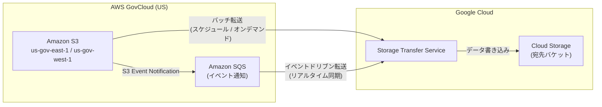

# Storage Transfer Service: AWS GovCloud (US) リージョンのサポート

**リリース日**: 2026-05-08

**サービス**: Storage Transfer Service

**機能**: AWS GovCloud (US) リージョン対応

**ステータス**: GA (一般提供)

📊 [このアップデートのインフォグラフィックを見る](https://takech9203.github.io/google-cloud-news-summary/20260508-storage-transfer-service-aws-govcloud.html)

## 概要

Storage Transfer Service が AWS GovCloud (US) リージョン (us-gov-east-1 および us-gov-west-1) をサポートするようになりました。これにより、AWS GovCloud リージョンに配置された Amazon S3 バケットから Google Cloud Storage へのデータ転送が可能になります。

GovCloud は米国政府機関や規制対象の業界向けに設計された AWS の分離リージョンであり、FedRAMP High、ITAR、CJIS などの厳格なコンプライアンス要件に対応しています。今回のアップデートにより、これらの規制環境のデータを Google Cloud に転送するワークフローが大幅に簡素化されます。

バッチ転送とイベントドリブン転送の両方がサポートされており、一括移行から継続的なデータ同期まで幅広いユースケースに対応可能です。

**アップデート前の課題**

- AWS GovCloud リージョンの S3 バケットから Storage Transfer Service を使用した直接転送ができなかった
- GovCloud 環境のデータを Google Cloud に移行するには、カスタムスクリプトやサードパーティツールが必要だった
- GovCloud 特有の ARN 形式 (`arn:aws-us-gov:`) に対応した転送設定ができなかった

**アップデート後の改善**

- us-gov-east-1 と us-gov-west-1 リージョンの S3 バケットからの直接転送が可能になった
- バッチ転送とイベントドリブン転送の両方を GovCloud リージョンで利用可能
- フェデレーテッドアイデンティティによる認証が GovCloud ARN 形式に対応

## アーキテクチャ図



AWS GovCloud リージョンの S3 バケットから Google Cloud Storage へのデータ転送フローを示しています。バッチ転送はスケジュールまたはオンデマンドで実行され、イベントドリブン転送は SQS キューを介してリアルタイムに同期されます。

## サービスアップデートの詳細

### 主要機能

1. **GovCloud リージョンのバッチ転送**
   - us-gov-east-1 および us-gov-west-1 リージョンの S3 バケットから一括データ転送が可能
   - スケジュール設定による定期的な転送や、オンデマンドの一回限りの転送に対応

2. **GovCloud リージョンのイベントドリブン転送**
   - Amazon S3 Event Notifications と Amazon SQS を使用したリアルタイムのデータ同期
   - ソースバケットでオブジェクトが追加または変更されると自動的に転送が実行される

3. **GovCloud 対応の認証方式**
   - アクセスキー認証
   - フェデレーテッドアイデンティティ (AWS IAM ロール) による認証 (`arn:aws-us-gov:iam::` 形式)
   - Secret Manager によるクレデンシャル管理

## 技術仕様

### GovCloud ARN 形式

GovCloud リージョンでは標準リージョンと異なる ARN 形式を使用します。

| 項目 | 標準リージョン | GovCloud リージョン |
|------|------|------|
| IAM ロール ARN | `arn:aws:iam::ACCOUNT:role/ROLE` | `arn:aws-us-gov:iam::ACCOUNT:role/ROLE` |
| S3 バケット ARN | `arn:aws:s3:::BUCKET` | `arn:aws-us-gov:s3:::BUCKET` |
| SQS キュー ARN | `arn:aws:sqs:REGION:ACCOUNT:QUEUE` | `arn:aws-us-gov:sqs:REGION:ACCOUNT:QUEUE` |

### 必要な権限

| 権限 | 説明 | 用途 |
|------|------|------|
| `s3:ListBucket` | バケット内のオブジェクト一覧取得 | 常に必要 |
| `s3:GetObject` | オブジェクトの読み取り | 現行バージョン転送時に必要 |
| `s3:GetObjectVersion` | 特定バージョンのオブジェクト読み取り | マニフェストでバージョン指定時に必要 |
| `s3:DeleteObject` | オブジェクトの削除 | 転送後にソース削除する場合に必要 |

### GovCloud 用 IAM ポリシー設定例

```json
{
  "Version": "2012-10-17",
  "Statement": [
    {
      "Effect": "Allow",
      "Action": [
        "s3:GetObject",
        "s3:ListBucket"
      ],
      "Resource": [
        "arn:aws-us-gov:s3:::S3_BUCKET_NAME/*",
        "arn:aws-us-gov:s3:::S3_BUCKET_NAME"
      ]
    }
  ]
}
```

## 設定方法

### 前提条件

1. Google Cloud プロジェクトで Storage Transfer Service API が有効化されていること
2. AWS GovCloud アカウントと S3 バケットへのアクセス権限
3. 宛先となる Cloud Storage バケットが作成済みであること

### 手順

#### ステップ 1: AWS GovCloud での IAM ロール作成 (フェデレーテッドアイデンティティ使用時)

AWS GovCloud コンソールで IAM ロールを作成し、以下のトラストポリシーを設定します。

```json
{
  "Version": "2012-10-17",
  "Statement": [
    {
      "Effect": "Allow",
      "Principal": {
        "Federated": "accounts.google.com"
      },
      "Action": "sts:AssumeRoleWithWebIdentity",
      "Condition": {
        "StringEquals": {
          "accounts.google.com:sub": "SUBJECT_ID"
        }
      }
    }
  ]
}
```

`SUBJECT_ID` は Storage Transfer Service の Google マネージドサービスアカウントの subjectID に置き換えます。

#### ステップ 2: 転送ジョブの作成 (gcloud CLI)

```bash
# 認証情報ファイルの作成
cat > arn-file.json << 'EOF'
{
  "roleArn": "arn:aws-us-gov:iam::AWS_ACCOUNT:role/AWS_ROLE_NAME"
}
EOF

# 転送ジョブの作成
gcloud transfer jobs create \
  s3://SOURCE_BUCKET \
  gs://DESTINATION_BUCKET \
  --source-creds-file=arn-file.json
```

#### ステップ 3: イベントドリブン転送の設定 (オプション)

イベントドリブン転送を使用する場合は、AWS GovCloud で SQS キューを作成し、S3 Event Notifications を設定します。

SQS キューの ARN は以下の形式です:
```
arn:aws-us-gov:sqs:us-gov-east-1:ACCOUNT_ID:QUEUE_NAME
```

## メリット

### ビジネス面

- **コンプライアンス要件への対応**: FedRAMP、ITAR などの規制要件を満たしつつ、Google Cloud のサービスを活用したデータ分析や機械学習が可能に
- **マルチクラウド戦略の強化**: 政府機関や規制対象業界のワークロードにおいて、AWS GovCloud と Google Cloud 間のデータ移動が容易に
- **運用コストの削減**: カスタムスクリプトやサードパーティツールが不要になり、マネージドサービスとして転送を管理可能

### 技術面

- **エージェントレス転送**: ソフトウェアのインストールやインフラ管理が不要
- **イベントドリブン対応**: ニアリアルタイムのデータ同期が可能で、分析パイプラインの即応性が向上
- **フェデレーテッドアイデンティティ対応**: 長期間有効なアクセスキーを使用せずにセキュアな認証が可能

## デメリット・制約事項

### 制限事項

- マネージドプライベートネットワーク経由の転送は GovCloud リージョン (us-gov-east-1, us-gov-west-1) では対応リージョン一覧に含まれていない
- オブジェクトの削除はイベントドリブン転送では検知されない (ソースでの削除が宛先に反映されない)
- Storage Transfer Service には転送パフォーマンスやレイテンシに関する SLA が提供されていない

### 考慮すべき点

- GovCloud アカウントへのアクセスには専用の AWS GovCloud 認証情報が必要
- AWS からの下り (egress) 料金が発生する (マネージドプライベートネットワークが利用できないため)
- GovCloud 環境固有のネットワーク制限やセキュリティポリシーとの整合性確認が必要

## ユースケース

### ユースケース 1: 政府機関のデータ分析基盤移行

**シナリオ**: 米国政府機関が AWS GovCloud に保管しているデータを Google Cloud の BigQuery や Vertex AI で分析するために移行する場合

**効果**: FedRAMP High 準拠の環境からデータを安全に転送し、Google Cloud の分析・AI サービスを活用可能

### ユースケース 2: 規制対象データの継続的バックアップ

**シナリオ**: 防衛産業や医療機関が ITAR/HIPAA 規制対象のデータを AWS GovCloud から Google Cloud にイベントドリブン転送で継続的にバックアップする場合

**効果**: ニアリアルタイムのクロスクラウドバックアップにより、DR/HA 要件を満たしつつデータの冗長性を確保

### ユースケース 3: マルチクラウドデータパイプライン

**シナリオ**: AWS GovCloud で生成されたセンサーデータや IoT データを Google Cloud の Dataflow や Pub/Sub に取り込み、リアルタイム処理する場合

**効果**: イベントドリブン転送により、データ生成から Google Cloud での処理開始までの遅延を最小化

## 利用可能リージョン

Storage Transfer Service がソースとしてサポートする AWS GovCloud リージョン:

| リージョン | 説明 |
|------|------|
| us-gov-east-1 | AWS GovCloud (US-East) |
| us-gov-west-1 | AWS GovCloud (US-West) |

宛先の Cloud Storage バケットは任意の Google Cloud リージョンに配置可能です。

## 関連サービス・機能

- **Cloud Storage**: データの宛先として使用される Google Cloud のオブジェクトストレージ
- **Secret Manager**: AWS アクセスキーを安全に保管・管理するためのシークレット管理サービス
- **Cloud Logging**: 転送ジョブの実行ログを記録・監視するためのログサービス
- **Cloud Monitoring**: 転送ジョブの進捗やパフォーマンスを監視するためのモニタリングサービス
- **VPC Service Controls**: 転送先バケットのセキュリティ境界を設定するためのアクセス制御

## 参考リンク

- 📊 [インフォグラフィック](https://takech9203.github.io/google-cloud-news-summary/20260508-storage-transfer-service-aws-govcloud.html)
- [公式リリースノート](https://docs.cloud.google.com/release-notes#May_08_2026)
- [Configure access to a source: Amazon S3](https://docs.cloud.google.com/storage-transfer/docs/source-amazon-s3)
- [Event-driven transfers from AWS S3](https://docs.cloud.google.com/storage-transfer/docs/event-driven-aws)
- [Create transfers (S3 to Cloud Storage)](https://docs.cloud.google.com/storage-transfer/docs/create-transfers/agentless/s3)
- [Storage Transfer Service の料金](https://cloud.google.com/storage-transfer/pricing)

## まとめ

Storage Transfer Service の AWS GovCloud 対応により、米国政府機関や規制対象業界のお客様が GovCloud 環境のデータを Google Cloud に直接転送できるようになりました。バッチ転送とイベントドリブン転送の両方に対応しており、一括移行から継続的なデータ同期まで柔軟なワークフローを構築可能です。GovCloud 環境のデータを Google Cloud の分析・AI サービスで活用したい場合は、フェデレーテッドアイデンティティによるセキュアな認証設定から始めることを推奨します。

---

**タグ**: #StorageTransferService #AWS #GovCloud #DataMigration #S3 #EventDrivenTransfer #Compliance #FedRAMP #マルチクラウド
