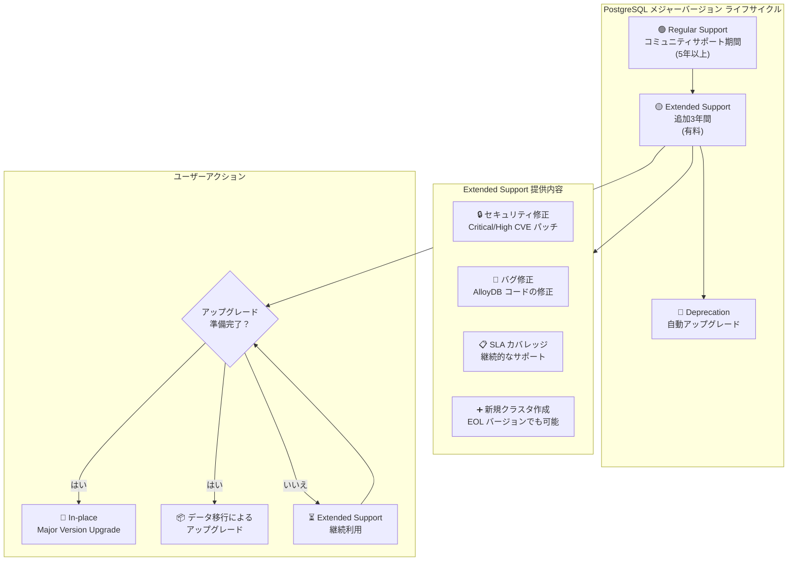

# AlloyDB for PostgreSQL: Extended Support for EOL メジャーバージョン

**リリース日**: 2026-05-11

**サービス**: AlloyDB for PostgreSQL

**機能**: Extended Support (延長サポート)

**ステータス**: Announcement

📊 [このアップデートのインフォグラフィックを見る](https://takech9203.github.io/google-cloud-news-summary/20260511-alloydb-extended-support.html)

## 概要

AlloyDB for PostgreSQL が、PostgreSQL コミュニティによって End-of-Life (EOL) に達したメジャーバージョンを実行するクラスタに対して、Extended Support (延長サポート) を提供開始した。Extended Support は、レギュラーサポート終了後に追加で3年間のサポートを提供し、メジャーバージョンアップグレードの計画と実行に十分な時間的猶予を与える。

この機能は、PostgreSQL のメジャーバージョンが EOL に達した際に、既存の AlloyDB クラスタを即座にアップグレードする必要がないよう設計されている。エンタープライズ環境において、大規模なデータベースのメジャーバージョンアップグレードは慎重な計画、テスト、実行が必要であり、Extended Support はこのプロセスを安全に進めるための時間を確保する。

対象ユーザーは、AlloyDB for PostgreSQL を本番環境で運用しているすべてのユーザーであり、特に複数のクラスタを管理するエンタープライズ組織や、アプリケーションの互換性テストに十分な時間が必要な大規模システムを運用するチームにとって重要なアナウンスである。

**アップデート前の課題**

- PostgreSQL メジャーバージョンが EOL に達した場合、サポートが即座に終了し、セキュリティパッチや修正が受けられなくなるリスクがあった
- 大規模な本番データベースのメジャーバージョンアップグレードには十分な計画・テスト期間が必要だが、EOL のタイムラインに追われる可能性があった
- EOL バージョンを使い続けることでセキュリティリスクを抱えるか、急いでアップグレードして互換性問題を起こすかのジレンマがあった

**アップデート後の改善**

- EOL に達した PostgreSQL メジャーバージョンでも、追加で3年間のセキュリティパッチ (Critical/High CVE) と製品バグ修正が提供される
- SLA カバレッジが継続され、新しいクラスタの作成も引き続き可能
- メジャーバージョンアップグレードを計画的に実行するための十分な猶予が確保される
- 自動登録により、追加の設定作業なしで Extended Support が適用される

## アーキテクチャ図



AlloyDB の Extended Support は、PostgreSQL メジャーバージョンのライフサイクルにおいて、Regular Support 終了後に3年間の追加サポート期間を提供する。この期間中にユーザーはメジャーバージョンアップグレードを計画・実行できる。

## サービスアップデートの詳細

### 主要機能

1. **自動登録**
   - PostgreSQL メジャーバージョンが AlloyDB の EOL 日 (コミュニティ EOL の3ヶ月後) に達すると、該当クラスタは自動的に Extended Support に登録される
   - ユーザー側での追加設定は不要
   - 登録3ヶ月前から Google Cloud コンソールとメール通知で事前に通知される

2. **セキュリティおよびバグ修正の継続**
   - Critical および High 重大度の CVE に対するセキュリティパッチを継続提供
   - AlloyDB 管理コードのバグ修正を継続提供
   - SLA カバレッジを維持

3. **新規クラスタ作成のサポート**
   - Extended Support 期間中のメジャーバージョンでも新しい AlloyDB クラスタを作成可能
   - 既存のワークフローやテスト環境の構築に支障がない

4. **オプトアウト (脱退) 機能**
   - いつでもメジャーバージョンアップグレードを実行して Extended Support から脱退可能
   - In-place Major Version Upgrade またはデータ移行によるアップグレードに対応
   - アップグレード完了後、Extended Support の追加料金は停止される

5. **Extended Support 終了後の自動アップグレード**
   - 3年間の Extended Support 期間終了後、AlloyDB はクラスタをデフォルトのメジャーバージョンに自動的にアップグレード
   - 定期メンテナンスの一部として実行される
   - 12ヶ月前に事前通知が送信される

## 技術仕様

### メジャーバージョンサポートタイムライン

| PostgreSQL バージョン | AlloyDB Regular Support 開始 | AlloyDB Omni GA 日 | Extended Support 開始 | Deprecation 日 |
|------|------|------|------|------|
| PostgreSQL 18 | 2026年3月18日 | 2026年4月9日 | - | - |
| PostgreSQL 17 | 2025年9月22日 | 2025年12月15日 | 2030年2月1日 | 2033年2月1日 |
| PostgreSQL 16 | 2024年10月23日 | 2025年4月8日 | 2029年2月1日 | 2032年2月1日 |
| PostgreSQL 15 | 2024年1月19日 | 2023年10月11日 | 2028年2月1日 | 2031年2月1日 |
| PostgreSQL 14 | 2022年12月12日 | N/A | 2027年2月1日 | 2030年2月1日 |

### Extended Support の制限事項

| 項目 | 詳細 |
|------|------|
| 最大期間 | 3年間 |
| 新機能の提供 | なし (Regular Support 終了後に実装された新機能は利用不可) |
| 料金 | 通常のクラスタ料金に加えて追加料金が発生 |
| 登録方法 | 自動 (EOL 到達時に全対象クラスタが自動登録) |
| 脱退方法 | メジャーバージョンアップグレードの実行 |

### アップグレードパス

| ソースバージョン | アップグレード先 |
|------|------|
| POSTGRES_14 | POSTGRES_15, 16, 17, 18 |
| POSTGRES_15 | POSTGRES_16, 17, 18 |
| POSTGRES_16 | POSTGRES_17, 18 |
| POSTGRES_17 | POSTGRES_18 |

## 設定方法

### Extended Support への登録

Extended Support は自動登録のため、ユーザー側での操作は不要。以下の流れで自動的に適用される:

1. PostgreSQL コミュニティがメジャーバージョンの EOL を宣言
2. コミュニティ EOL の3ヶ月後に AlloyDB の EOL 日を迎える
3. 対象クラスタが自動的に Extended Support に登録される
4. 追加料金の課金が開始される

### Extended Support からのオプトアウト (アップグレード)

#### ステップ 1: 現在のバージョンを確認

```bash
gcloud alloydb clusters describe CLUSTER_ID --region=REGION
```

#### ステップ 2: In-place Major Version Upgrade の実行

```bash
gcloud alloydb clusters upgrade CLUSTER_ID \
  --region=REGION \
  --version=POSTGRES_18 \
  --async
```

**注意事項**:
- アップグレード前にクラスタのクローンを作成してテストすることを推奨
- プライマリインスタンスのダウンタイムは通常20分～1時間
- 全体のアップグレード時間はデータベースサイズに依存 (40分～48時間)

#### ステップ 3: アップグレード状況の確認

Google Cloud コンソールのクラスタ詳細ページの「Upgrade Status」から進捗を確認可能。

## メリット

### ビジネス面

- **計画的なアップグレード**: EOL に追われることなく、十分な時間をかけてアップグレード計画を立案・実行できる
- **リスク軽減**: 急いだアップグレードによるアプリケーション障害のリスクを低減
- **コンプライアンス維持**: Extended Support 期間中もセキュリティパッチが提供されるため、セキュリティ要件を満たし続けられる
- **SLA 保証の継続**: ビジネスクリティカルなワークロードに対する SLA カバレッジが維持される

### 技術面

- **セキュリティパッチの継続**: Critical/High CVE に対するパッチが引き続き提供される
- **柔軟なアップグレードパス**: In-place アップグレードまたはデータ移行の2つの方法から選択可能
- **複数バージョンスキップ**: 例えば PostgreSQL 14 から直接 18 へのアップグレードが可能
- **自動フェイルオーバー継続**: 高可用性構成のクラスタは Extended Support 期間中もフェイルオーバー機能が維持される

## デメリット・制約事項

### 制限事項

- Extended Support は有料サービスであり、通常のクラスタ料金に加えて追加コストが発生する
- Extended Support 期間中は、Regular Support 終了後に実装された AlloyDB の新機能やサービス改善は利用できない
- 3年間の Extended Support 期間終了後はデフォルトバージョンへの強制アップグレードが実行される

### 考慮すべき点

- Extended Support の追加料金を長期間支払い続けるよりも、早めのアップグレードがコスト効率が良い場合がある
- 自動登録のため、意図せず追加料金が発生する可能性がある (事前通知は3ヶ月前に行われる)
- Extended Support 期間中に新しい PostgreSQL 機能を活用したい場合は、アップグレードが必要
- 3年後の自動アップグレードはメンテナンスウィンドウ中に実行されるため、大規模なデータベースでは事前の計画が重要

## ユースケース

### ユースケース 1: エンタープライズ基幹システムの段階的アップグレード

**シナリオ**: 大手金融機関が AlloyDB (PostgreSQL 14) で基幹取引システムを運用。PostgreSQL 14 の Extended Support 開始 (2027年2月1日) に向けて、数百のアプリケーションの互換性テストと段階的な移行計画が必要。

**効果**: Extended Support により3年間の猶予が確保され、四半期ごとのアプリケーションテストサイクルに合わせた段階的なアップグレード計画を安全に実行できる。

### ユースケース 2: マルチリージョン環境での計画的ローリングアップグレード

**シナリオ**: グローバル EC サイトが複数リージョンで AlloyDB クラスタを運用。各リージョンのクラスタを順番にアップグレードしてリスクを最小化したい。

**効果**: Extended Support 期間中に、リージョンごとにアップグレードをスケジュールし、1つのリージョンで問題が発生した場合のロールバック計画を含む段階的な展開が可能になる。

### ユースケース 3: サードパーティ製品の互換性確認待ち

**シナリオ**: SaaS プロバイダが AlloyDB 上でアプリケーションを提供しているが、利用しているサードパーティ拡張機能やORM フレームワークが新しい PostgreSQL バージョンへの対応完了を待つ必要がある。

**効果**: Extended Support を利用して、サードパーティのアップデートサイクルに合わせたアップグレードスケジュールを設定できる。

## 料金

Extended Support は有料サービスであり、通常のクラスタ料金に追加で課金される。具体的な追加料金については、公式の料金ページを参照のこと。

なお、Extended Support の追加課金を回避するには、Extended Support 期間開始前にクラスタをアップグレードすることが推奨される。CUD (Committed Use Discounts) を利用している場合、Extended Support の追加料金に CUD は適用されない点に注意が必要。

詳細な料金情報: [AlloyDB for PostgreSQL 料金ページ](https://cloud.google.com/alloydb/pricing)

## 関連サービス・機能

- **Database Migration Service (DMS)**: AlloyDB へのデータ移行や、メジャーバージョンアップグレード時のデータ移行に利用可能。Quick-start migrations 機能により、Cloud SQL for PostgreSQL や Compute Engine 上のセルフマネージド DB からの軽量な移行フローを提供
- **AlloyDB In-place Major Version Upgrade**: Extended Support からのオプトアウト時に使用。クラスタ名、IP アドレス、データベースフラグなどの設定を維持したままバージョンアップグレードが可能
- **AlloyDB Omni**: オンプレミスやマルチクラウド環境で AlloyDB を実行するオプション。Extended Support のタイムラインは AlloyDB for PostgreSQL とは異なる場合がある
- **Cloud Monitoring / Cloud Logging**: Extended Support 期間中のクラスタの健全性監視やアップグレード計画の策定に活用

## 参考リンク

- 📊 [インフォグラフィック](https://takech9203.github.io/google-cloud-news-summary/20260511-alloydb-extended-support.html)
- [公式リリースノート](https://docs.cloud.google.com/release-notes#May_11_2026)
- [Extended Support ドキュメント](https://docs.cloud.google.com/alloydb/docs/extended-support)
- [データベースバージョンポリシー](https://docs.cloud.google.com/alloydb/docs/db-version-policies)
- [In-place Major Version Upgrade](https://docs.cloud.google.com/alloydb/docs/major-version-upgrade-inplace-overview)
- [クラスタのメジャーバージョンアップグレード](https://docs.cloud.google.com/alloydb/docs/cluster-upgrade)
- [料金ページ](https://cloud.google.com/alloydb/pricing)

## まとめ

AlloyDB for PostgreSQL の Extended Support は、EOL に達した PostgreSQL メジャーバージョンのクラスタに対して3年間の追加サポートを提供する重要な機能である。エンタープライズ環境では、メジャーバージョンアップグレードの計画・テスト・実行に十分な時間が必要であり、本機能はそのための安全なバッファを提供する。ただし有料サービスであるため、長期的なコスト最適化の観点からは早めのアップグレード計画を策定し、Extended Support 開始前にアップグレードを完了させることが推奨される。

---

**タグ**: #AlloyDB #PostgreSQL #ExtendedSupport #DatabaseManagement #VersionUpgrade #EOL #エンタープライズ
