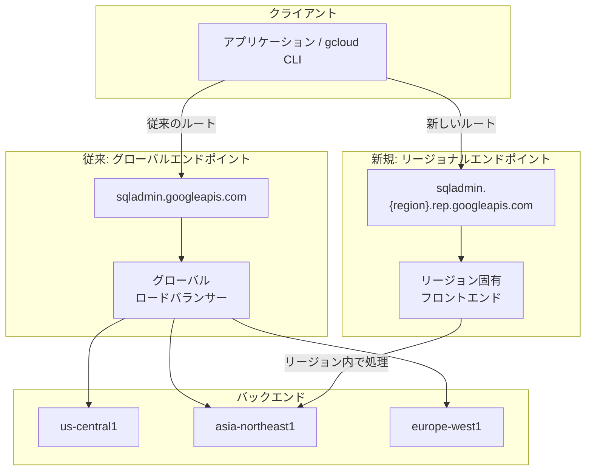

# Cloud SQL: Admin API リージョナルエンドポイント対応

**リリース日**: 2026-05-11

**サービス**: Cloud SQL for MySQL, Cloud SQL for PostgreSQL, Cloud SQL for SQL Server

**機能**: Cloud SQL Admin API リージョナルエンドポイント

**ステータス**: Preview

📊 [このアップデートのインフォグラフィックを見る](https://takech9203.github.io/google-cloud-news-summary/20260511-cloud-sql-regional-endpoints.html)

## 概要

Cloud SQL for MySQL、PostgreSQL、SQL Server において、Cloud SQL Admin API のリージョナルエンドポイントが Preview として利用可能になった。この機能により、API リクエストを特定リージョンのフロントエンドインフラストラクチャに直接ルーティングできるようになり、データの地域性（Data Locality）が向上し、厳格なコンプライアンス要件への対応が可能になる。

従来の Cloud SQL Admin API はグローバルエンドポイント（`sqladmin.googleapis.com`）のみで提供されており、API リクエストはグローバルロードバランサーを経由して適切なリージョンに到達していた。今回のアップデートにより、`sqladmin.{region}.rep.googleapis.com` 形式のリージョナルエンドポイントを使用して、特定リージョンのフロントエンドで直接リクエストを処理できるようになった。

この機能は、データレジデンシー規制が厳しい業界（金融、医療、政府機関など）や、特定の地域にデータを留める必要がある組織にとって重要なアップデートである。ただし、バックエンドの依存関係にはグローバルコンポーネントが残る可能性がある点に留意が必要。

**アップデート前の課題**

- Cloud SQL Admin API のリクエストはすべてグローバルエンドポイント経由でルーティングされ、フロントエンドレベルでのデータ地域制御ができなかった
- API リクエストの転送中データ（in-transit data）がどのリージョンのフロントエンドで処理されるか保証されなかった
- データレジデンシー規制の厳しい環境では、API 管理レイヤーでの地域制御が不足していた

**アップデート後の改善**

- リージョナルエンドポイントを使用することで、API リクエストが指定リージョンのフロントエンドインフラストラクチャで処理されることが保証される
- 転送中データのデータレジデンシーが向上し、厳格なコンプライアンス要件に対応可能になった
- リージョン単位でのリソース管理が強化され、`Instance.List` が指定リージョンのインスタンスのみ返すなど、より厳密な動作が可能になった

## アーキテクチャ図



従来はグローバルロードバランサーを経由していた API リクエストが、リージョナルエンドポイントにより指定リージョンのフロントエンドで直接処理されるようになった。

## サービスアップデートの詳細

### 主要機能

1. **リージョナルエンドポイントによる API ルーティング**
   - `sqladmin.{region}.rep.googleapis.com` 形式のエンドポイントを使用して、特定リージョンに API リクエストをルーティング
   - リクエストは指定リージョンのフロントエンドインフラストラクチャで処理される
   - 認証方式（Bearer トークンなど）、API パス、リクエストボディ、API バージョンは変更なし

2. **厳密なリージョンマッチング**
   - リージョナルエンドポイントは厳密なリージョン境界を強制する
   - `INSERT`、`UPDATE`、`PATCH`、`DELETE`、`GET` リクエストのターゲットリソースのリージョンとエンドポイントのリージョンが一致しない場合、4xx エラーで拒否される

3. **Instance.List のリージョンスコープ動作**
   - グローバルエンドポイント: すべてのリージョンのインスタンスを返す
   - リージョナルエンドポイント: 指定リージョン内のインスタンスのみを返す

4. **バックアップとディザスタリカバリ**
   - バックアップに関してはグローバルエンドポイントと同じ動作
   - クロスリージョンリストアなど DR シナリオでのバックアップアクセスが可能
   - ただし、バックアップはグローバルリソースとして扱われるため、バックアップアクセスにはグローバルエンドポイントの使用が推奨される
   - `BackupRuns` はインスタンスのリージョンのリージョナルエンドポイントから提供される

## 技術仕様

### エンドポイント形式

| タイプ | URL 形式 | 例 | ユースケース |
|--------|----------|-----|------------|
| グローバル | `sqladmin.googleapis.com` | `sqladmin.googleapis.com` | 複数リージョンにまたがるリソースのグローバル管理 |
| リージョナル | `sqladmin.{region}.rep.googleapis.com` | `sqladmin.us-central1.rep.googleapis.com` | フロントエンドレベルでの厳格なデータレジデンシー |

### 対応 API バージョン

| バージョン | リクエスト例 |
|-----------|-------------|
| v1 | `GET https://sqladmin.{region}.rep.googleapis.com/v1/projects/{project}/instances` |
| v1beta4 | `GET https://sqladmin.{region}.rep.googleapis.com/sql/v1beta4/projects/{project}/instances` |

## 設定方法

### 前提条件

1. Cloud SQL Admin API が有効化されていること
2. 適切な IAM ロール（Cloud SQL Admin など）が付与されていること
3. パブリックネットワーク経由でのアクセスが可能であること（プライベート接続は未対応）

### 手順

#### ステップ 1: curl を使用した直接呼び出し

```bash
# グローバルエンドポイント（従来）
curl -H "Authorization: Bearer $(gcloud auth print-access-token)" \
  https://sqladmin.googleapis.com/v1/projects/{project}/instances

# リージョナルエンドポイント（新規）
curl -H "Authorization: Bearer $(gcloud auth print-access-token)" \
  https://sqladmin.us-central1.rep.googleapis.com/v1/projects/{project}/instances
```

グローバル URL を `sqladmin.{region}.rep.googleapis.com` に置き換えるだけで、認証やリクエスト形式の変更は不要。

#### ステップ 2: gcloud CLI でのオーバーライド設定

```bash
# リージョナルエンドポイントを設定
gcloud config set api_endpoint_overrides/sql \
  https://sqladmin.us-central1.rep.googleapis.com/

# グローバルエンドポイントに戻す場合
gcloud config unset api_endpoint_overrides/sql
```

#### ステップ 3: Terraform でのオーバーライド設定

```bash
# 環境変数で Cloud SQL のカスタムエンドポイントを指定
export GOOGLE_SQL_CUSTOM_ENDPOINT="https://sqladmin.us-central1.rep.googleapis.com/sql"
```

## メリット

### ビジネス面

- **コンプライアンス対応の強化**: GDPR、各国データ保護法などの厳格なデータレジデンシー要件に対し、API 管理レイヤーレベルでの地域制御が可能
- **監査対応の容易化**: API リクエストが特定リージョンのフロントエンドで処理されることが保証されるため、監査証跡の明確化に寄与
- **規制産業への対応**: 金融、医療、政府機関など、データの地域性に厳格な要件を持つ組織での Cloud SQL 採用障壁が低下

### 技術面

- **データ地域性の向上**: 転送中データがリージョン固有のフロントエンドインフラストラクチャで処理される
- **既存コードの最小変更**: エンドポイント URL の変更のみで対応可能。認証、API パス、リクエストボディの変更は不要
- **リージョナル信頼性の向上**: リージョン固有のフロントエンドへの直接ルーティングにより、グローバルロードバランサー障害の影響を軽減

## デメリット・制約事項

### 制限事項

- **Preview ステータス**: Pre-GA 提供条件が適用され、サポートが限定的な可能性がある
- **パブリック接続のみ対応**: VPC やプライベートネットワーク接続からのリージョナルエンドポイントへのアクセスは未対応
- **マルチリージョナルエンドポイント未対応**: `sqladmin.us.rep.googleapis.com` のようなマルチリージョナル形式はサポートされていない
- **Cloud SQL リモート MCP サーバー非対応**: リージョナルエンドポイントから Cloud SQL リモート MCP サーバーへの接続は不可。グローバルエンドポイント（`https://sqladmin.googleapis.com/mcp`）を使用する必要がある
- **バックエンドのグローバル依存**: フロントエンドはリージョン限定だが、バックエンド処理にはグローバルコンポーネントが残る場合がある

### 考慮すべき点

- リージョナルエンドポイント使用時は、リクエスト内のリソースリージョンとエンドポイントリージョンの一致が必要（不一致は 4xx エラー）
- `Instance.List` の動作が変わるため、複数リージョンのインスタンスを一覧する場合はグローバルエンドポイントの使用が必要
- バックアップはグローバルリソースとして扱われるため、DR シナリオではグローバルエンドポイントの使用が推奨される
- gcloud CLI や Terraform での使用は手動オーバーライド設定が必要（ネイティブ統合は未提供）

## ユースケース

### ユースケース 1: EU データレジデンシー規制への対応

**シナリオ**: EU 域内の顧客データを管理する金融機関が、GDPR 要件に基づき Cloud SQL の管理 API リクエストも EU リージョン内で処理したい。

**実装例**:
```bash
# EU リージョンのエンドポイントを使用
gcloud config set api_endpoint_overrides/sql \
  https://sqladmin.europe-west3.rep.googleapis.com/

# インスタンスの作成・管理はすべて EU 内で処理される
gcloud sql instances list
```

**効果**: API リクエストのフロントエンド処理が europe-west3 リージョン内に限定され、転送中データの EU 域外流出リスクが軽減される。

### ユースケース 2: 日本国内データ主権要件への対応

**シナリオ**: 日本の政府系システムで、管理操作を含むすべてのデータ処理を日本国内で完結させたい。

**実装例**:
```bash
# 東京リージョンのエンドポイントを使用
curl -H "Authorization: Bearer $(gcloud auth print-access-token)" \
  https://sqladmin.asia-northeast1.rep.googleapis.com/v1/projects/my-project/instances
```

**効果**: Cloud SQL インスタンスの管理 API リクエストが asia-northeast1（東京）のフロントエンドで処理され、日本国内でのデータ処理が実現される。

## 利用可能リージョン

40 以上のリージョンで利用可能。主要リージョンは以下の通り:

| 地域 | リージョン | エンドポイント |
|------|-----------|---------------|
| 日本 (東京) | asia-northeast1 | `sqladmin.asia-northeast1.rep.googleapis.com` |
| 日本 (大阪) | asia-northeast2 | `sqladmin.asia-northeast2.rep.googleapis.com` |
| 米国 (アイオワ) | us-central1 | `sqladmin.us-central1.rep.googleapis.com` |
| 米国 (バージニア) | us-east4 | `sqladmin.us-east4.rep.googleapis.com` |
| 欧州 (フランクフルト) | europe-west3 | `sqladmin.europe-west3.rep.googleapis.com` |
| 欧州 (ロンドン) | europe-west2 | `sqladmin.europe-west2.rep.googleapis.com` |
| アジア (シンガポール) | asia-southeast1 | `sqladmin.asia-southeast1.rep.googleapis.com` |
| オーストラリア (シドニー) | australia-southeast1 | `sqladmin.australia-southeast1.rep.googleapis.com` |
| 中東 (ダンマーム) | me-central2 | `sqladmin.me-central2.rep.googleapis.com` |

その他にも africa-south1、asia-east1/2、asia-south1/2、northamerica-northeast1/2、southamerica-east1/west1 など多数のリージョンに対応している。

## 関連サービス・機能

- **VPC Service Controls**: Cloud SQL Admin API のサービス境界を定義し、データのエクスポート/インポートを制限する既存のデータ保護機能。リージョナルエンドポイントと組み合わせることで、より包括的なデータレジデンシー制御が可能
- **Organization Policy (リソースロケーション制約)**: 組織ポリシーの `constraints/gcp.resourceLocations` を使用して、リソース作成可能なリージョンを制限。リージョナルエンドポイントと併用で API レイヤーからリソースレイヤーまで一貫したリージョン制御を実現
- **Cloud SQL データレジデンシー**: 保存データ（at-rest）のリージョン制御、バックアップの保存場所指定など既存のデータレジデンシー機能。今回のアップデートで転送中データ（in-transit）の制御が加わり、End-to-End のデータレジデンシーに近づいた
- **`constraints/gcp.restrictEndpointUsage` 組織ポリシー**: グローバルエンドポイントの使用をブロックし、リージョナルエンドポイントの使用を強制する制約

## 参考リンク

- 📊 [インフォグラフィック](https://takech9203.github.io/google-cloud-news-summary/20260511-cloud-sql-regional-endpoints.html)
- [公式リリースノート](https://docs.cloud.google.com/release-notes#May_11_2026)
- [Cloud SQL リージョナルエンドポイント ドキュメント (MySQL)](https://docs.cloud.google.com/sql/docs/mysql/admin-api/rep)
- [Cloud SQL データレジデンシー概要](https://docs.cloud.google.com/sql/docs/mysql/data-residency-overview)
- [VPC Service Controls と Cloud SQL](https://docs.cloud.google.com/sql/docs/mysql/admin-api/configure-service-controls)
- [リージョナルサービスエンドポイント一覧](https://docs.cloud.google.com/docs/security/compliance/regional-service-endpoints)
- [料金ページ](https://cloud.google.com/sql/pricing)

## まとめ

Cloud SQL Admin API のリージョナルエンドポイント対応は、データレジデンシー要件の厳しい環境における Cloud SQL の採用をさらに容易にする重要なアップデートである。既存の API 呼び出しをエンドポイント URL の変更のみで移行できるため、導入コストが低い点も魅力的だ。ただし、Preview ステータスであること、プライベート接続が未対応であること、バックエンドにグローバル依存が残る可能性がある点を考慮し、本番環境への適用は GA 昇格を待つことを推奨する。

---

**タグ**: #CloudSQL #MySQL #PostgreSQL #SQLServer #DataResidency #RegionalEndpoints #AdminAPI #Compliance #Preview
