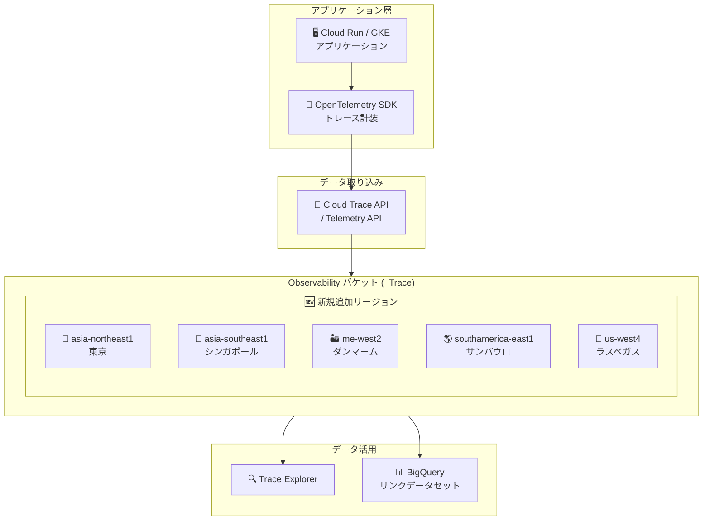

# Cloud Trace: Observability バケットのサポートリージョン拡大

**リリース日**: 2026-05-11

**サービス**: Cloud Trace (Google Cloud Observability)

**機能**: Observability バケットの新リージョンサポート

**ステータス**: GA

📊 [このアップデートのインフォグラフィックを見る](https://takech9203.github.io/google-cloud-news-summary/20260511-cloud-trace-observability-bucket-locations.html)

## 概要

Google Cloud Observability は、トレースデータを保存する Observability バケットのサポートロケーションを 5 つの新リージョンに拡大した。今回追加されたリージョンは、asia-northeast1 (東京)、asia-southeast1 (シンガポール)、me-west2 (ダンマーム)、southamerica-east1 (サンパウロ)、us-west4 (ラスベガス) である。

この拡張により、アジア太平洋、中東、南米、米国西部に拠点を持つ組織が、自地域内でトレースデータを保存できるようになる。データレジデンシー要件やコンプライアンス規制への対応が容易になり、特に日本のユーザーにとっては asia-northeast1 (東京) の追加が大きな意味を持つ。

Observability バケットは Cloud Trace のスパンデータを格納するリージョナルリソースであり、バケットの場所を指定することで、データが保存される物理的なロケーションを制御できる。組織、フォルダ、プロジェクトレベルでデフォルトのストレージロケーションを設定可能で、CMEK (顧客管理暗号鍵) との組み合わせも可能である。

**アップデート前の課題**

- asia-northeast1 (東京) でトレースデータを保存できず、日本国内でのデータレジデンシー要件を満たせなかった
- asia-southeast1 (シンガポール) が未サポートで、東南アジアのワークロードに対して近接リージョンでのデータ保存ができなかった
- 南米のユーザーは southamerica-west1 (サンティアゴ) のみ利用可能で、ブラジル国内でのデータ保存ができなかった
- 中東地域で me-central1 (ドーハ) と me-central2 (ダンマーム) のみサポートされていた
- 米国西部では us-west1、us-west2、us-west3 のみで、us-west4 (ラスベガス) が利用できなかった

**アップデート後の改善**

- 東京リージョンでトレースデータを保存可能になり、日本のデータレジデンシー要件に対応可能
- シンガポールリージョンの追加により、東南アジアのワークロードに最適なデータ保存が可能
- サンパウロリージョンの追加で、ブラジル国内でのトレースデータ保存に対応
- me-west2 の追加で中東地域のカバレッジが拡大
- us-west4 の追加で米国西部のリージョン選択肢が増加

## アーキテクチャ図



アプリケーションから送信されたトレースデータは、Cloud Trace API / Telemetry API を通じて Observability バケットに保存される。今回のアップデートにより、5 つの新リージョンでデータを保存できるようになった。

## サービスアップデートの詳細

### 主要機能

1. **5 つの新リージョンサポート**
   - asia-northeast1 (東京): 日本国内でのトレースデータ保存
   - asia-southeast1 (シンガポール): 東南アジア地域でのデータ保存
   - me-west2 (ダンマーム): 中東地域のカバレッジ拡大
   - southamerica-east1 (サンパウロ): 南米ブラジルでのデータ保存
   - us-west4 (ラスベガス): 米国西部の選択肢拡大

2. **データレジデンシー制御**
   - 組織、フォルダ、プロジェクトレベルでデフォルトのストレージロケーションを設定可能
   - リソース階層に沿って設定が継承される (子が独自設定を持つ場合を除く)
   - 新規作成される Observability バケットにのみ適用 (既存バケットは影響なし)

3. **CMEK (顧客管理暗号鍵) との統合**
   - 各ロケーションに対して Cloud KMS キーを設定可能
   - データの暗号化を顧客側で管理することで、より厳格なセキュリティ要件に対応

## 技術仕様

### Observability バケットのストレージモデル

| 項目 | 詳細 |
|------|------|
| バケット名 | `_Trace` (システムが自動作成) |
| データセット名 | `Spans` |
| ビュー名 | `_AllSpans` (全データを含む) |
| リソースタイプ | リージョナルリソース |
| 暗号化 | デフォルト暗号化 / CMEK 対応 |
| データ保持 | データ保持ポリシーに基づく |

### 今回追加されたリージョン

| リージョン | 場所 | 地域 |
|-----------|------|------|
| asia-northeast1 | 東京 | アジア太平洋 |
| asia-southeast1 | シンガポール | アジア太平洋 |
| me-west2 | ダンマーム | 中東 |
| southamerica-east1 | サンパウロ | 南米 |
| us-west4 | ラスベガス | 米州 |

## 設定方法

### 前提条件

1. gcloud CLI バージョン 563.0.0 以降がインストールされていること
2. 対象の組織、フォルダ、またはプロジェクトに対する適切な IAM 権限
3. CMEK を使用する場合は Cloud KMS キーの作成と権限付与が完了していること

### 手順

#### ステップ 1: デフォルトストレージロケーションの設定

```bash
# プロジェクトのデフォルトストレージロケーションを東京に設定
gcloud beta observability settings update \
  --default-storage-location=asia-northeast1 \
  --update-mask=default-storage-location \
  --location=global \
  --project=PROJECT_ID
```

組織レベルで設定する場合は `--project` の代わりに `--organization=ORGANIZATION_ID` を使用する。

#### ステップ 2: CMEK を使用する場合の追加設定

```bash
# サービスアカウントに Cloud KMS キーへのアクセス権を付与
gcloud kms keys add-iam-policy-binding KMS_KEY_NAME \
  --project=KMS_PROJECT_ID \
  --member=serviceAccount:SERVICE_ACCT_NAME@gcp-sa-observability.iam.gserviceaccount.com \
  --role=roles/cloudkms.cryptoKeyEncrypterDecrypter \
  --location=asia-northeast1 \
  --keyring=KMS_KEY_RING
```

#### ステップ 3: 設定の確認

```bash
# 現在の Observability 設定を確認
gcloud beta observability settings describe \
  --location=global \
  --project=PROJECT_ID
```

## メリット

### ビジネス面

- **日本のコンプライアンス要件への対応**: 個人情報保護法やデータローカライゼーション要件に基づき、トレースデータを日本国内に保存可能
- **グローバル展開の容易化**: アジア太平洋、中東、南米の各リージョンでデータレジデンシー要件を満たしやすくなる
- **レイテンシの改善可能性**: データが近接リージョンに保存されることで、Trace Explorer でのクエリ応答時間が改善される可能性がある

### 技術面

- **データ主権の強化**: トレースデータの物理的な保存場所を厳密に制御可能
- **リソース階層での一元管理**: 組織レベルの設定が自動的に下位リソースに継承される
- **CMEK との組み合わせ**: 各リージョンごとに暗号鍵を設定し、きめ細かいセキュリティ制御を実現

## デメリット・制約事項

### 制限事項

- Observability バケットは変更・削除できない
- データセットの作成・削除・変更は不可
- ビューの作成・削除・変更は不可
- Google Cloud コンソールからバケット、データセット、ビュー、リンクの一覧表示ができない
- デフォルト設定は新規リソースにのみ適用され、既存の Observability バケットには影響しない

### 考慮すべき点

- CMEK 使用時、キーが利用不可になるとデータのクエリが不可能になり、直近 3 時間のバッファを超えるデータが破棄される可能性がある
- CMEK キーは 48 時間のうち少なくとも 24 時間連続で利用可能である必要がある
- データレジデンシー要件がある場合、Gemini Cloud Assist のようなグローバルロケーションにクエリ結果を保存するサービスは有効にしないこと

## ユースケース

### ユースケース 1: 日本国内のデータレジデンシー対応

**シナリオ**: 金融サービス企業が日本国内でのデータ保存を義務付けられており、分散トレーシングのデータも国内に保存する必要がある。

**実装例**:
```bash
# 組織レベルで日本リージョンをデフォルトに設定
gcloud beta observability settings update \
  --default-storage-location=asia-northeast1 \
  --update-mask=default-storage-location \
  --location=global \
  --organization=ORGANIZATION_ID
```

**効果**: 組織内のすべてのプロジェクトで新規作成される Observability バケットが自動的に東京リージョンに配置され、個別設定なしでデータレジデンシー要件を満たせる。

### ユースケース 2: マルチリージョンアプリケーションのトレースデータ分離

**シナリオ**: ASEAN 地域向けと日本向けで別々のプロジェクトを運用しているグローバル企業が、各地域のデータをそれぞれの近接リージョンに保存したい。

**効果**: 日本向けプロジェクトは asia-northeast1、ASEAN 向けプロジェクトは asia-southeast1 にそれぞれデフォルトロケーションを設定することで、各リージョンの規制要件に対応しつつ、最適なパフォーマンスを確保できる。

## 料金

Cloud Trace の料金は Span の取り込み量に基づく従量課金制である。Observability バケットのリージョン選択自体には追加料金は発生しない。

詳細な料金については [Cloud Trace の料金ページ](https://cloud.google.com/stackdriver/pricing#trace-costs) を参照。

## 利用可能リージョン

今回のアップデートにより、Observability バケットは以下のリージョンで利用可能となった (新規追加分を含む全リージョン):

**マルチリージョン**: eu, us

**アフリカ**: africa-south1 (ヨハネスブルグ)

**アジア太平洋**: asia-east1 (台湾), asia-east2 (香港), **asia-northeast1 (東京) [NEW]**, asia-northeast2 (大阪), asia-northeast3 (ソウル), asia-south1 (ムンバイ), asia-south2 (デリー), **asia-southeast1 (シンガポール) [NEW]**, asia-southeast2 (ジャカルタ), asia-southeast3 (バンコク), australia-southeast1 (シドニー), australia-southeast2 (メルボルン)

**米州**: northamerica-northeast1 (モントリオール), northamerica-northeast2 (トロント), northamerica-south1 (メキシコ), **southamerica-east1 (サンパウロ) [NEW]**, southamerica-west1 (サンティアゴ), us-central1 (アイオワ), us-east1 (サウスカロライナ), us-east4 (北バージニア), us-east5 (コロンバス), us-south1 (ダラス), us-west1 (オレゴン), us-west2 (ロサンゼルス), us-west3 (ソルトレイクシティ), **us-west4 (ラスベガス) [NEW]**

**ヨーロッパ**: europe-central2 (ワルシャワ), europe-north1 (フィンランド), europe-north2 (ストックホルム), europe-southwest1 (マドリード), europe-west1 (ベルギー), europe-west2 (ロンドン), europe-west3 (フランクフルト), europe-west4 (オランダ), europe-west6 (チューリッヒ), europe-west8 (ミラノ), europe-west10 (ベルリン), europe-west12 (トリノ)

**中東**: me-central1 (ドーハ), me-central2 (ダンマーム), **me-west2 (ダンマーム) [NEW]**

## 関連サービス・機能

- **Cloud Logging**: ログバケットも同様のリージョナルストレージモデルを採用しており、Cloud Logging では既に今回追加されたリージョンの多くをサポート済み
- **Cloud Monitoring**: グローバルプロダクトとして、リージョンに依存せずサービスを提供
- **BigQuery**: Observability バケットにリンクを作成することで、BigQuery からトレースデータを SQL でクエリ可能
- **Cloud KMS**: CMEK を使用した Observability バケットの暗号化で連携
- **OpenTelemetry**: Cloud Trace へのトレースデータ送信に使用される標準的な計装フレームワーク

## 参考リンク

- 📊 [インフォグラフィック](https://takech9203.github.io/google-cloud-news-summary/20260511-cloud-trace-observability-bucket-locations.html)
- [公式リリースノート](https://docs.cloud.google.com/release-notes#May_11_2026)
- [Observability バケットのロケーション](https://docs.cloud.google.com/stackdriver/docs/observability/observability-bucket-locations)
- [Observability バケットのデフォルト設定](https://docs.cloud.google.com/stackdriver/docs/observability/set-defaults-for-observability-buckets)
- [Cloud Trace ストレージの概要](https://docs.cloud.google.com/trace/docs/storage-overview)
- [Cloud Trace の料金](https://cloud.google.com/stackdriver/pricing#trace-costs)

## まとめ

今回のアップデートにより、Cloud Trace の Observability バケットが 5 つの新リージョン (東京、シンガポール、ダンマーム、サンパウロ、ラスベガス) でサポートされ、特に日本やアジア太平洋地域のユーザーにとってデータレジデンシー要件への対応が大幅に容易になった。日本国内でトレースデータを保存する必要がある組織は、`gcloud beta observability settings update` コマンドで asia-northeast1 をデフォルトストレージロケーションに設定することを推奨する。

---

**タグ**: #CloudTrace #Observability #DataResidency #リージョン拡大 #asia-northeast1 #データ主権
