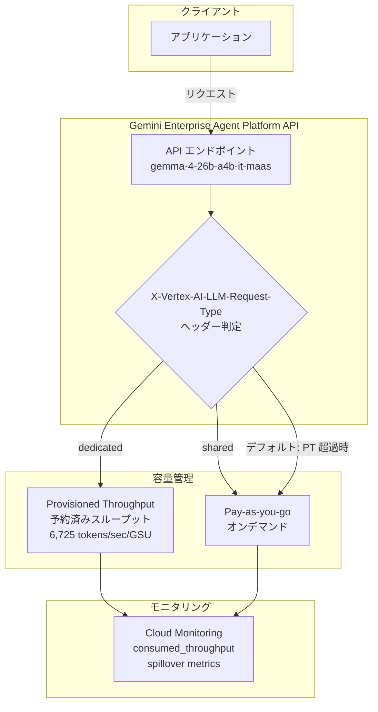

# Gemini Enterprise Agent Platform: Gemma 4 向け Provisioned Throughput の提供開始

**リリース日**: 2026-05-11

**サービス**: Gemini Enterprise Agent Platform

**機能**: Gemma 4 モデルに対する Provisioned Throughput の購入が可能に

**ステータス**: Preview (プレビュー)

[このアップデートのインフォグラフィックを見る](https://takech9203.github.io/google-cloud-news-summary/20260511-gemini-enterprise-agent-platform-gemma-4-provisioned-throughput.html)

## 概要

Gemini Enterprise Agent Platform において、Google のオープンモデルである Gemma 4 に対して Provisioned Throughput の購入が可能になりました。具体的には Gemma 4 26B A4B IT モデル (`gemma-4-26b-a4b-it-maas`) が対象で、GSU (Generative Service Unit) 単位でスループットを事前に確保することができます。

Provisioned Throughput は、API リクエストに対して一定のスループット容量を事前に予約購入する仕組みです。これにより、オンデマンド課金 (pay-as-you-go) では得られないスループットの安定性と予測可能なコスト管理を実現できます。Gemma 4 は Google が開発したオープンモデルであり、Mixture of Experts (MoE) アーキテクチャを活用した高効率なモデルです。

対象ユーザーは、Gemma 4 モデルを本番環境で大規模に利用し、安定したスループットとコストの予測可能性を必要とする企業や開発チームです。

**アップデート前の課題**

- Gemma 4 モデルの利用は Dynamic Shared Quota のみに制限されており、スループットの保証がなかった
- トラフィックが集中する時間帯にレイテンシが増加する可能性があった
- 大規模な本番ワークロードにおいて、安定したスループットを確保する手段がなかった

**アップデート後の改善**

- Gemma 4 26B A4B IT モデルに対して GSU 単位でスループットを事前購入・確保可能になった
- 1 GSU あたり 6,725 tokens/sec のスループットが保証される
- Google Cloud Console からオーダーを直接発注できるようになった
- API ヘッダーによるトラフィック制御 (dedicated / shared) が可能

## アーキテクチャ図



Gemma 4 への API リクエストは、HTTP ヘッダーの設定に基づいて Provisioned Throughput (予約済み) またはオンデマンド (pay-as-you-go) のいずれかで処理されます。デフォルトでは予約済みスループットを優先し、超過分はオンデマンドに自動的にスピルオーバーします。

## サービスアップデートの詳細

### 主要機能

1. **Provisioned Throughput for Gemma 4 26B A4B IT**
   - モデル ID: `gemma-4-26b-a4b-it-maas`
   - GSU あたりのスループット: 6,725 tokens/sec
   - 最小購入 GSU 数: 1
   - 購入単位の増分: 1 GSU

2. **バーンダウンレート**
   - 入力テキストトークン: 1 トークン = 1 トークンとしてカウント
   - 出力テキストトークン: 1 トークン = 4 トークンとしてカウント
   - 出力トークンは入力トークンの 4 倍のコストでスループットを消費

3. **トラフィック制御**
   - `X-Vertex-AI-LLM-Request-Type: dedicated` - Provisioned Throughput のみ使用
   - `X-Vertex-AI-LLM-Request-Type: shared` - pay-as-you-go のみ使用
   - ヘッダー未設定時はデフォルトで Provisioned Throughput を優先し、超過分を pay-as-you-go にスピルオーバー

## 技術仕様

### Gemma 4 26B A4B IT モデル仕様

| 項目 | 詳細 |
|------|------|
| モデル ID | `gemma-4-26b-a4b-it-maas` |
| パラメータ数 | 26B (アクティブパラメータ: 4B) |
| アーキテクチャ | Mixture of Experts (MoE) |
| 入力 | テキスト、ドキュメント、画像 |
| 出力 | テキスト |
| 最大出力トークン | 128,000 |
| コンテキスト長 | 262,144 トークン |
| リリースステージ | Experimental |
| 対応リージョン | global |

### Provisioned Throughput 仕様

| 項目 | 詳細 |
|------|------|
| GSU あたりスループット | 6,725 tokens/sec |
| 最小購入単位 | 1 GSU |
| 購入増分 | 1 GSU |
| 入力テキストバーンダウン | 1 token = 1 token |
| 出力テキストバーンダウン | 1 token = 4 tokens |
| 契約期間 | 1 週間、1 ヶ月、3 ヶ月、1 年 |
| 課金タイミング | オーダーが Active になった後 |

### API リクエスト例

```python
from google import genai
from google.genai.types import HttpOptions

client = genai.Client(
    http_options=HttpOptions(
        api_version="v1",
        headers={
            "X-Vertex-AI-LLM-Request-Type": "dedicated"
        },
    )
)

response = client.models.generate_content(
    model="gemma-4-26b-a4b-it-maas",
    contents="AIの仕組みを説明してください",
)
print(response.text)
```

## 設定方法

### 前提条件

1. Google Cloud プロジェクトが作成済みであること
2. Gemini Enterprise Agent Platform API が有効化されていること
3. 適切な IAM 権限が付与されていること

### 手順

#### ステップ 1: Provisioned Throughput オーダーの発注

Google Cloud Console で Provisioned Throughput ページにアクセスし、新しいオーダーを作成します。

1. Google Cloud Console の Provisioned Throughput ページに移動
2. "New order" をクリック
3. オーダー名を入力
4. モデルとして `gemma-4-26b-a4b-it-maas` を選択
5. リージョンを選択
6. 必要な GSU 数を設定
7. 契約期間 (1 週間/1 ヶ月/3 ヶ月/1 年) を選択
8. 確認フィールドに `CONFIRM` と入力し、オーダーを送信

#### ステップ 2: API リクエストの送信

オーダーが Active ステータスになった後、API リクエストを送信できます。

```bash
curl -X POST \
  -H "Authorization: Bearer $(gcloud auth print-access-token)" \
  -H "Content-Type: application/json" \
  -H "X-Vertex-AI-LLM-Request-Type: dedicated" \
  "https://aiplatform.googleapis.com/v1/projects/PROJECT_ID/locations/global/publishers/google/models/gemma-4-26b-a4b-it-maas:generateContent" \
  -d '{"contents": [{"role": "user", "parts": [{"text": "Hello."}]}]}'
```

## メリット

### ビジネス面

- **コストの予測可能性**: GSU 単位の事前購入により、月次のコストを正確に予測可能
- **SLA 保証**: 予約済みスループットにより、ビジネスクリティカルなアプリケーションのパフォーマンスを保証
- **柔軟な契約期間**: 1 週間から 1 年まで、ユースケースに合わせた契約が可能

### 技術面

- **安定したスループット**: 6,725 tokens/sec/GSU の保証されたスループット
- **自動スピルオーバー**: 予約量を超過した場合も自動的にオンデマンドにフォールバック
- **モニタリング統合**: Cloud Monitoring によるリアルタイムの使用量追跡とアラート設定が可能
- **効率的な MoE アーキテクチャ**: 26B パラメータ中 4B のみアクティブ化する設計により、高い推論効率を実現

## デメリット・制約事項

### 制限事項

- オーダーの途中キャンセルは不可 (コミットメントベースの契約)
- オープンモデルの Provisioned Throughput はプレビュー機能であり、サポートが限定的
- API キーによる利用は非対応 (Google モデルのみ対応)
- Supervised Fine-tuned モデルには非対応
- コンテキストキャッシング (暗黙的・明示的) は非対応
- Console からのオーダー変更は非対応 (Google Cloud 担当者への連絡が必要)
- バッチ予測には非対応

### 考慮すべき点

- モデルの起動ステージが Experimental であるため、本番利用時はサポート範囲を確認すること
- MoE アーキテクチャのため、全 26B パラメータをメモリにロードする必要がある (推論メモリ: BF16 で約 48GB)
- 出力トークンのバーンダウンレートが入力の 4 倍であるため、出力が多いワークロードではスループット消費が大きくなる

## ユースケース

### ユースケース 1: 大規模ドキュメント処理パイプライン

**シナリオ**: 企業が毎日数千件のドキュメントを Gemma 4 で分類・要約する処理パイプラインを運用しており、安定したスループットが必要。

**実装例**:
```python
from google import genai
from google.genai.types import HttpOptions

client = genai.Client(
    http_options=HttpOptions(
        api_version="v1",
        headers={"X-Vertex-AI-LLM-Request-Type": "dedicated"},
    )
)

# 大量ドキュメントの並列処理
for document in documents:
    response = client.models.generate_content(
        model="gemma-4-26b-a4b-it-maas",
        contents=f"以下のドキュメントを要約してください:\n{document}",
    )
```

**効果**: Provisioned Throughput により、ピーク時間帯でも安定した処理速度を維持し、SLA を満たすことが可能。

### ユースケース 2: マルチモーダル画像分析アプリケーション

**シナリオ**: 製造業の品質管理システムで、製品画像を Gemma 4 のマルチモーダル機能で分析し、欠陥を検出する。

**効果**: Gemma 4 はテキストと画像の両方を入力として受け付けるため、画像分析タスクに活用可能。Provisioned Throughput により、製造ラインの速度に合わせたリアルタイム処理が保証される。

## 料金

Provisioned Throughput の料金は GSU 単位で計算され、契約期間に応じた料金が適用されます。Gemma 4 の Provisioned Throughput は Google モデルと同じ SKU で課金されます。

詳細な料金については [Gemini Enterprise Agent Platform の料金ページ](https://docs.cloud.google.com/gemini-enterprise-agent-platform/pricing) を参照してください。

## 利用可能リージョン

| リージョン | 対応状況 |
|------------|----------|
| global | 対応 (モデル利用) |
| United States (Multi-region) | 対応 (ML processing) |

## 関連サービス・機能

- **[Dynamic Shared Quota](https://docs.cloud.google.com/gemini-enterprise-agent-platform/models/resources/throughput-quota)**: Provisioned Throughput を購入しない場合の標準的なスループット割り当て
- **[Cloud Monitoring](https://docs.cloud.google.com/gemini-enterprise-agent-platform/models/provisioned-throughput/use-provisioned-throughput#monitor_provisioned_throughput)**: Provisioned Throughput の使用量をモニタリングするためのメトリクスとダッシュボード
- **[Model Garden](https://console.cloud.google.com/agent-platform/publishers/google/model-garden/gemma-4-26b-a4b-it-maas)**: Gemma 4 のモデルカードと詳細情報

## 参考リンク

- [インフォグラフィック](https://takech9203.github.io/google-cloud-news-summary/20260511-gemini-enterprise-agent-platform-gemma-4-provisioned-throughput.html)
- [公式リリースノート](https://docs.cloud.google.com/release-notes#May_11_2026)
- [Provisioned Throughput 対応モデル一覧](https://docs.cloud.google.com/gemini-enterprise-agent-platform/models/provisioned-throughput/supported-models#open-models)
- [Gemma 4 26B A4B IT モデルドキュメント](https://docs.cloud.google.com/gemini-enterprise-agent-platform/models/maas/google/gemma-4-26b-a4b-it)
- [Provisioned Throughput の使用方法](https://docs.cloud.google.com/gemini-enterprise-agent-platform/models/provisioned-throughput/use-provisioned-throughput)
- [Provisioned Throughput の購入方法](https://docs.cloud.google.com/gemini-enterprise-agent-platform/models/provisioned-throughput/purchase-provisioned-throughput)

## まとめ

Gemma 4 26B A4B IT モデルへの Provisioned Throughput サポートにより、Google のオープンモデルを本番環境で安定的に大規模運用することが可能になりました。MoE アーキテクチャによる高効率な推論と、6,725 tokens/sec/GSU の保証されたスループットを組み合わせることで、コスト予測可能性の高い本番ワークロードの構築が実現できます。大規模なテキスト処理やマルチモーダル分析のユースケースを持つ組織は、Provisioned Throughput の導入を検討することを推奨します。

---

**タグ**: #GeminiEnterpriseAgentPlatform #Gemma4 #ProvisionedThroughput #OpenModels #MoE #スループット保証 #MaaS
