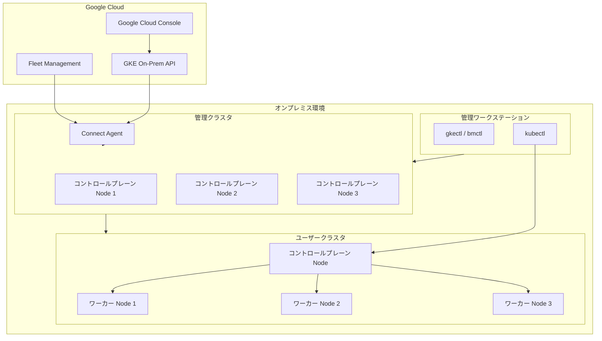

# Google Distributed Cloud (software only): バージョン 1.34.400-gke.88 リリース

**リリース日**: 2026-05-11

**サービス**: Google Distributed Cloud (software only) for VMware / bare metal

**機能**: バージョン 1.34.400-gke.88 パッチリリース

**ステータス**: 提供開始 (GA)

[このアップデートのインフォグラフィックを見る](https://takech9203.github.io/google-cloud-news-summary/20260511-google-distributed-cloud-1-34-400.html)

## 概要

Google Distributed Cloud (software only) for VMware および bare metal のバージョン 1.34.400-gke.88 がダウンロード可能になりました。本リリースは Kubernetes v1.34.6-gke.200 上で動作し、セキュリティ脆弱性の修正、クラスタアップグレードの安定性向上、およびノード管理の信頼性改善を含むパッチリリースです。

VMware 版と bare metal 版の両方が同一バージョン番号でリリースされており、共通する修正に加えて各プラットフォーム固有の改善が含まれています。リリース後、Google Cloud コンソール、gcloud CLI、Terraform などの GKE On-Prem API クライアントで利用可能になるまで約 7～14 日かかります。

本リリースは特に、etcd イベントポッドの初期化問題、containerd 再起動時の並行タスク障害、ノードアップグレードのハング問題など、運用上の重要な課題を解決しています。

**アップデート前の課題**

- VMware 環境で bundled ingress を無効化し `loadBalancer.vips.ingressVIP` を空欄にした場合、`gkectl check-config` が preflight チェックで失敗していた
- VMware 環境で非アドバンスドクラスタからアドバンスドクラスタへのアップグレードが、Hub メンバーシップの不変フィールド更新試行により停止していた
- マシン初期化フェーズで etcd-events ポッドが古いデータディレクトリを読み込み、旧メンバー ID でクラスタに再参加しようとして無限リトライループに陥っていた
- containerd の再起動時に同一ノード上の並行タスクが失敗していた
- Terminating 状態のネームスペースに完了済み Pod が存在する場合、ノードアップグレードが無期限にハングし 20 分のメンテナンスタイムアウトをバイパスしていた

**アップデート後の改善**

- `gkectl check-config` が空の VIP フィールドを正しく処理し、テスト VM 初期化エラーが解消された
- VMware クラスタオペレーターがアップグレード中に元のメンバーシップフィールドを保持するようになり、アドバンスドクラスタへの移行が正常に完了するようになった
- `/var/lib/etcd-events` ディレクトリが障害時にクリアされ、kubeadm-reset にリトライロジックが追加された
- 同一ノード上のタスクがロックされ逐次実行されるようになり、各ロックは最大 20 分間保持される
- ドレインプロセスが terminal フェーズの Pod のエビクションをスキップするようになり、アップグレードが正常に進行する
- bare metal 版で Secrets/ConfigMaps のマウント陳腐化を検出する定期ヘルスチェックが追加された

## アーキテクチャ図



Google Distributed Cloud のデプロイメントトポロジを示しています。管理ワークステーションから管理クラスタを操作し、管理クラスタがユーザークラスタのライフサイクルを管理します。Connect Agent を介して Google Cloud と接続され、Fleet Management による一元管理が可能です。

## サービスアップデートの詳細

### VMware 版の修正内容

1. **セキュリティ脆弱性の修正**
   - 公開されている脆弱性の修正が適用されました
   - 詳細は [Vulnerability fixes](https://docs.cloud.google.com/kubernetes-engine/distributed-cloud/vmware/docs/vulnerabilities) を参照

2. **gkectl check-config の preflight チェック修正**
   - bundled ingress が無効で `loadBalancer.vips.ingressVIP` が空欄の場合に発生していた問題を修正
   - 検証プロセスが空の VIP を使用してテスト VM のネットワーク構成を生成しようとし、無効なコマンド (`ip addr add /32`) が実行されていた
   - テスト VM の初期化失敗が解消された

3. **アドバンスドクラスタへのアップグレード修正**
   - 非アドバンスドクラスタからアドバンスドクラスタへの VMware クラスタアップグレードがスタックする問題を解決
   - Hub メンバーシップの不変フィールドを更新しようとしていたシステムの動作を修正
   - クラスタオペレーターがアップグレード中に元のメンバーシップフィールドを保持するようになった

### bare metal 版の修正内容

1. **セキュリティ脆弱性の修正**
   - 公開されている脆弱性の修正が適用されました
   - 詳細は [Vulnerability fixes](https://docs.cloud.google.com/kubernetes-engine/distributed-cloud/bare-metal/docs/vulnerabilities) を参照

2. **etcd-events ポッドの初期化問題の修正**
   - マシン初期化フェーズで etcd-events ポッドが古いデータディレクトリを読み取り、旧メンバー ID でクラスタに再参加しようとしていた
   - 旧メンバー ID の使用により無限リトライループが発生し、クラスタが接続を拒否していた
   - `/var/lib/etcd-events` ディレクトリが障害時にクリアされるようになり、kubeadm-reset にリトライロジックが追加された

3. **containerd 再起動時の並行タスク障害修正**
   - containerd の再起動時に同一ノード上の並行タスクが失敗する問題を修正
   - タスクがロックされ逐次実行されるようになり、各ロックは最大 20 分間または成功/失敗まで保持される
   - 並行実行が必要な場合はアノテーション `baremetal.cluster.gke.io/concurrent-machine-update: "true"` で制御可能

4. **ノードアップグレードのハング問題修正**
   - Terminating 状態のネームスペースに完了済み Pod が存在する場合、ノードアップグレードが無期限にハングする問題を解決
   - Kubernetes Eviction API が terminating ネームスペースでの操作を拒否するため、クラスタコントローラーが無限リトライループに陥っていた
   - ドレインプロセスが terminal フェーズの Pod のエビクションをスキップするように更新された

### bare metal 版の新機能

1. **Secrets/ConfigMaps の定期ヘルスチェック**
   - Pod 上の Secrets および ConfigMaps のマウントが陳腐化していないかを検出する定期ヘルスチェックが追加された
   - ノードがローテーション後に古い Secret データを提供し、認証失敗につながるレアケースを特定するのに役立つ
   - 現在は GKE Identity Service Pod で有効化されている
   - 各ノードでチェックが実行され、ローカルキャッシュされたボリュームの内容と API サーバーのライブデータを比較
   - 通常の更新遅延を考慮し、5 分間の猶予期間後にのみ不一致を報告

## 技術仕様

### バージョン情報

| 項目 | 詳細 |
|------|------|
| リリースバージョン | 1.34.400-gke.88 |
| Kubernetes バージョン | v1.34.6-gke.200 |
| 対応プラットフォーム | VMware vSphere / bare metal |
| リリース種別 | パッチリリース (1.34 系) |
| API クライアント利用可能時期 | リリースから約 7～14 日後 |

### bare metal 版の並行タスク制御

```yaml
apiVersion: baremetal.cluster.gke.io/v1
kind: Cluster
metadata:
  name: my-cluster
  namespace: cluster-my-cluster
  annotations:
    # 並行実行を有効化する場合のアノテーション
    baremetal.cluster.gke.io/concurrent-machine-update: "true"
spec:
  type: user
  anthosBareMetalVersion: 1.34.400-gke.88
```

## 設定方法

### 前提条件

1. 既存の Google Distributed Cloud 1.34.x クラスタが稼働していること
2. サードパーティのストレージベンダーを使用している場合、本リリースの認定を確認済みであること

### 手順

#### ステップ 1: VMware 版のアップグレード

```bash
# 管理ワークステーションからアップグレードを実行
gkectl upgrade cluster \
  --kubeconfig [ADMIN_CLUSTER_KUBECONFIG] \
  --config [USER_CLUSTER_CONFIG]
```

詳細な手順は [Upgrade clusters (VMware)](https://docs.cloud.google.com/kubernetes-engine/distributed-cloud/vmware/docs/how-to/upgrading) を参照してください。

#### ステップ 2: bare metal 版のアップグレード

```bash
# bmctl を使用してアップグレードを実行
bmctl upgrade cluster \
  --cluster [CLUSTER_NAME] \
  --kubeconfig [ADMIN_KUBECONFIG]
```

詳細な手順は [Upgrade clusters (bare metal)](https://docs.cloud.google.com/kubernetes-engine/distributed-cloud/bare-metal/docs/how-to/upgrade) を参照してください。

## メリット

### ビジネス面

- **運用安定性の向上**: アップグレード時のハングやスタック問題が解消され、メンテナンスウィンドウの予測可能性が向上
- **セキュリティ体制の強化**: 最新の脆弱性修正により、オンプレミス環境のセキュリティが最新状態に維持される
- **ダウンタイムの削減**: etcd 初期化やノードドレインの問題が修正され、クラスタの可用性が向上

### 技術面

- **etcd の信頼性向上**: 障害時のデータディレクトリクリーニングとリトライロジックにより、ノード参加の信頼性が大幅に改善
- **containerd の安定性**: タスクの逐次実行ロック機構により、再起動時のレースコンディションが排除される
- **Secret ローテーションの検出**: 定期ヘルスチェックにより、古い Secret データによる認証失敗を早期に発見可能
- **preflight チェックの正確性**: 正しいバリデーションにより、クラスタ構成の問題を事前に検出可能

## デメリット・制約事項

### 制限事項

- リリース後、GKE On-Prem API クライアント (Google Cloud コンソール、gcloud CLI、Terraform) で利用可能になるまで約 7～14 日かかる
- サードパーティストレージベンダーを使用している場合、ストレージパートナーが本リリースの認定を通過していることを事前に確認する必要がある

### 考慮すべき点

- bare metal 版の並行タスク制御変更により、デフォルトではタスクが逐次実行される (最大 20 分のロック) ため、大規模クラスタではアップグレード所要時間が延長される可能性がある
- 並行実行が必要な場合は明示的にアノテーションを設定する必要がある
- Secrets/ConfigMaps ヘルスチェックは現在 GKE Identity Service Pod のみで有効であり、他のワークロードには自動適用されない

## ユースケース

### ユースケース 1: アドバンスドクラスタへの移行 (VMware)

**シナリオ**: 既存の非アドバンスドクラスタをアドバンスドクラスタに移行する際に、以前のバージョンではアップグレードがスタックしていた。

**効果**: 本リリースにより、Hub メンバーシップフィールドの処理が修正され、アドバンスドクラスタへの移行が正常に完了するようになった。

### ユースケース 2: 大規模ノードプールのアップグレード (bare metal)

**シナリオ**: 多数のノードを持つクラスタで、一部のネームスペースが Terminating 状態になっている環境でのノードアップグレード。

**効果**: ドレインプロセスの改善により、Terminating ネームスペース内の完了済み Pod に起因するアップグレードハングが解消され、計画通りのメンテナンスが実行可能になった。

### ユースケース 3: Secret ローテーション後の認証問題検出 (bare metal)

**シナリオ**: GKE Identity Service で Secret ローテーションを実施した後、一部のノードが古い Secret データを使い続け、認証エラーが発生するケース。

**効果**: 定期ヘルスチェックが 5 分の猶予期間後に不一致を検出し、問題のあるノードを特定してアラートを出すことで、認証障害の早期発見と対処が可能になった。

## 料金

Google Distributed Cloud (software only) はオンプレミスの GKE クラスタの vCPU 数に基づいて課金されます。課金を有効にするには、Google Cloud プロジェクトで Anthos API を有効化する必要があります。詳細な料金情報は [GKE pricing](https://cloud.google.com/kubernetes-engine/pricing) を参照してください。

## 関連サービス・機能

- **Google Kubernetes Engine (GKE)**: Google Distributed Cloud の基盤となるマネージド Kubernetes サービス
- **Fleet Management**: 複数のクラスタを一元管理するためのフリート機能
- **Connect Agent**: オンプレミスクラスタと Google Cloud を接続するエージェント
- **GKE Identity Service**: Kubernetes クラスタの認証を管理するサービス (今回のヘルスチェック対象)
- **Binary Authorization**: コンテナイメージの信頼性を検証するセキュリティ機能

## 参考リンク

- [インフォグラフィック](https://takech9203.github.io/google-cloud-news-summary/20260511-google-distributed-cloud-1-34-400.html)
- [公式リリースノート (VMware)](https://docs.cloud.google.com/kubernetes-engine/distributed-cloud/vmware/docs/release-notes)
- [公式リリースノート (bare metal)](https://docs.cloud.google.com/kubernetes-engine/distributed-cloud/bare-metal/docs/release-notes)
- [アップグレード手順 (VMware)](https://docs.cloud.google.com/kubernetes-engine/distributed-cloud/vmware/docs/how-to/upgrading)
- [アップグレード手順 (bare metal)](https://docs.cloud.google.com/kubernetes-engine/distributed-cloud/bare-metal/docs/how-to/upgrade)
- [ドキュメント (VMware)](https://docs.cloud.google.com/kubernetes-engine/distributed-cloud/vmware/docs/overview)
- [ドキュメント (bare metal)](https://docs.cloud.google.com/kubernetes-engine/distributed-cloud/bare-metal/docs/concepts/about-bare-metal)
- [料金ページ](https://cloud.google.com/kubernetes-engine/pricing)
- [脆弱性修正 (VMware)](https://docs.cloud.google.com/kubernetes-engine/distributed-cloud/vmware/docs/vulnerabilities)
- [脆弱性修正 (bare metal)](https://docs.cloud.google.com/kubernetes-engine/distributed-cloud/bare-metal/docs/vulnerabilities)

## まとめ

Google Distributed Cloud 1.34.400-gke.88 は、VMware と bare metal の両プラットフォームにおいてクラスタの安定性とセキュリティを向上させる重要なパッチリリースです。特に、アップグレードプロセスのハングやスタック問題の修正は、運用チームの負担を大幅に軽減します。サードパーティストレージベンダーの認定状況を確認の上、計画的なアップグレードを推奨します。

---

**タグ**: #GoogleDistributedCloud #GKE #OnPremises #VMware #BareMetal #Kubernetes #PatchRelease #SecurityFix #ClusterUpgrade
