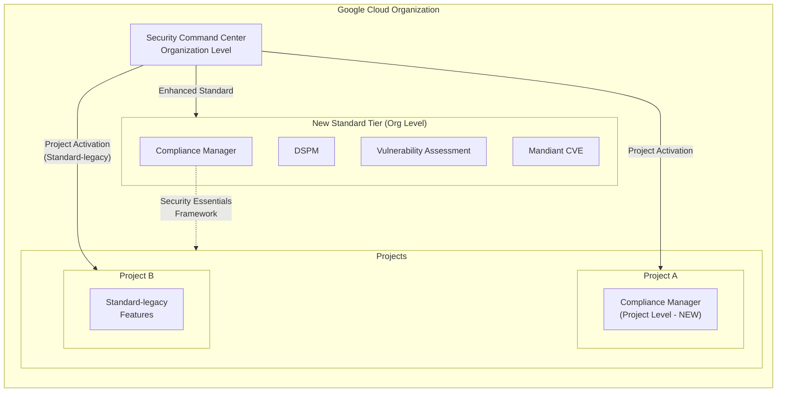

# Security Command Center: Compliance Manager プロジェクトレベル有効化と Standard ティア拡張

**リリース日**: 2026-05-11

**サービス**: Security Command Center

**機能**: Compliance Manager プロジェクトレベル有効化 / Enhanced Standard ティア

**ステータス**: GA (一般提供)

[このアップデートのインフォグラフィックを見る](https://takech9203.github.io/google-cloud-news-summary/20260511-security-command-center-compliance-manager-standard-tier.html)

## 概要

Security Command Center に2つの重要な変更が加えられた。1つ目は、Compliance Manager が単一プロジェクトに対して有効化できるようになったこと。これまで Compliance Manager は組織レベルでのみ有効化が可能だったが、今回のアップデートにより、プロジェクト単位でのきめ細かなコンプライアンス管理が可能になった。

2つ目は、組織レベルでの新規 Standard ティアのアクティベーションが、拡張された Standard ティア機能をサポートするようになったこと。一方、プロジェクトレベルでの新規 Standard ティアのアクティベーションは、引き続き Standard-legacy ティアの機能をサポートする。これは 2026年2月11日から開始された Standard ティアの段階的マイグレーションプロセスの一環である。

これらの変更は、組織全体でのセキュリティ管理を柔軟にしつつ、プロジェクト単位でのコンプライアンス対応ニーズに応える重要なアップデートである。

**アップデート前の課題**

- Compliance Manager は組織レベルでのみ有効化可能であり、特定プロジェクトのみにコンプライアンス管理を適用したい場合でも組織全体に影響を与えていた
- 組織レベルの Standard ティアを新規にアクティベートした場合、Standard-legacy ティアの機能のみが利用可能で、拡張機能を使うには手動でのマイグレーションを待つ必要があった
- プロジェクト単位でのコンプライアンスフレームワーク適用ができず、マルチプロジェクト環境での段階的導入が困難だった

**アップデート後の改善**

- Compliance Manager を単一プロジェクトに対して有効化可能になり、プロジェクト単位でのコンプライアンス管理が実現
- 組織レベルでの新規 Standard ティアのアクティベーションで、直ちに拡張 Standard ティア機能 (Compliance Manager、DSPM、Vulnerability Assessment for Google Cloud、Mandiant CVE assessments) が利用可能に
- 段階的なコンプライアンス導入が容易になり、特定プロジェクトでの試験運用から組織全体への展開がスムーズに

## アーキテクチャ図



組織レベルでの新規 Standard ティアのアクティベーションは拡張機能をサポートし、Compliance Manager はプロジェクト単位でも有効化可能になった。プロジェクトレベルでの新規 Standard ティアのアクティベーションは引き続き Standard-legacy ティア機能を提供する。

## サービスアップデートの詳細

### 主要機能

1. **Compliance Manager のプロジェクトレベル有効化**
   - 単一プロジェクトに対して Compliance Manager を有効化可能に
   - 組織全体に影響を与えずに特定プロジェクトのコンプライアンス管理を開始できる
   - プロジェクトレベルで有効化した場合、そのプロジェクトのリソースに対するコンプライアンス評価が可能

2. **Enhanced Standard ティア (組織レベル新規アクティベーション)**
   - 組織レベルでの新規 Standard ティアのアクティベーションで以下の機能が利用可能:
     - Compliance Manager (Security Essentials フレームワーク自動適用)
     - Data Security Posture Management (DSPM)
     - Vulnerability Assessment for Google Cloud
     - Mandiant CVE assessments
   - 以下の Standard-legacy ティア機能は Enhanced Standard ティアではサポートされない:
     - Sensitive Data Protection discovery service
     - Web Security Scanner custom scans

3. **Standard ティアのマイグレーション継続**
   - 2026年2月11日に開始されたマイグレーションプロセスの一環
   - 既存の Standard ティアユーザーはバックエンドアップグレードを通じて段階的にマイグレーション
   - Security Health Analytics の検出機能の多くが Compliance Manager コントロールに移行

## 技術仕様

### Standard ティアと Standard-legacy ティアの機能比較

| 機能 | Standard (Enhanced) | Standard-legacy |
|------|:---:|:---:|
| Compliance Manager | 対応 | 非対応 |
| Data Security Posture Management (DSPM) | 対応 | 非対応 |
| Vulnerability Assessment for Google Cloud | 対応 | 非対応 |
| Mandiant CVE assessments | 対応 | 非対応 |
| Sensitive Data Protection discovery | 非対応 | 対応 |
| Web Security Scanner custom scans | 非対応 | 対応 |
| Security Health Analytics | 一部 (Compliance Manager に移行) | 対応 |
| Sensitive Actions Service | 対応 | 対応 |

### アクティベーションレベルとティアの関係

| アクティベーションレベル | 新規アクティベーション時のティア |
|---|---|
| 組織レベル | Enhanced Standard ティア機能をサポート |
| プロジェクトレベル | Standard-legacy ティア機能をサポート |

### Compliance Manager 有効化時に連携されるサービス

- **Data Security Posture Management (DSPM)**: データセキュリティフレームワーク用
- **Sensitive Data Protection** (Premium/Enterprise のみ): デフォルトデータリスク評価用
- **Event Threat Detection** (Premium/Enterprise のみ): 組織レベルでの脅威検知
- **AI Protection** (Premium/Enterprise のみ): AI セキュリティフレームワーク用

## 設定方法

### 前提条件

1. 対象プロジェクトまたは組織に対する適切な IAM 権限
2. Security Command Center が未アクティベートの場合は、まずアクティベーションが必要

### 手順

#### ステップ 1: 組織レベルでの Standard ティア有効化 (新規の場合)

```bash
# Google Cloud Console で Security Command Center を開く
# Organization を選択し、Standard ティアをアクティベート
# 新規アクティベーションのため、Enhanced Standard ティア機能が自動的に有効化される
```

Google Cloud Console の Security Command Center 概要ページから、組織を選択して Standard ティアを有効化する。新規アクティベーションの場合、Compliance Manager は自動的に有効化され、Security Essentials フレームワークが組織に自動適用される。

#### ステップ 2: プロジェクトレベルでの Compliance Manager 有効化

```bash
# Google Cloud Console で Security Command Center の Settings ページを開く
# 対象プロジェクトを選択
# Compliance Manager を有効化
```

プロジェクトレベルで Compliance Manager を有効化する場合は、Settings ページからプロジェクトを選択して有効化する。

## メリット

### ビジネス面

- **段階的導入の実現**: 特定プロジェクトから始めて組織全体に展開するアプローチが可能になり、導入リスクを低減
- **コスト最適化**: 必要なプロジェクトのみに Compliance Manager を適用することで、運用コストを抑制
- **コンプライアンス対応の迅速化**: プロジェクト単位でのフレームワーク適用により、規制対応の初動が早まる

### 技術面

- **スコープの柔軟性**: 組織全体ではなくプロジェクト単位でのセキュリティ評価が可能
- **拡張機能の即時利用**: 組織レベルの新規アクティベーションで Compliance Manager、DSPM、Vulnerability Assessment が直ちに利用可能
- **自動フレームワーク適用**: Standard ティアでは Security Essentials フレームワークが自動適用され、初期設定の手間を削減

## デメリット・制約事項

### 制限事項

- プロジェクトレベルでの新規 Standard ティアのアクティベーションは Standard-legacy ティア機能のみをサポートし、Enhanced Standard ティア機能は利用不可
- Compliance Manager は Customer-Managed Encryption Keys (CMEK) をサポートしない
- Compliance Manager を有効化した後に無効化することはできない
- プロジェクトレベルのアクティベーションでは、データレジデンシーがサポートされない

### 考慮すべき点

- 既存の Standard ティアユーザーは段階的にマイグレーションされるが、タイミングは Google 側で制御される
- Security Health Analytics と Compliance Manager を同じリソースで有効化すると、重複した findings が発生する可能性がある
- 組織に Premium ティアがプロジェクトレベルでアクティベートされている場合、Standard ティアの自動マイグレーション対象外となる

## ユースケース

### ユースケース 1: マルチプロジェクト環境での段階的コンプライアンス導入

**シナリオ**: 複数のプロジェクトを持つ組織で、本番環境プロジェクトから順次コンプライアンス管理を導入したい場合

**効果**: まず本番環境プロジェクトのみに Compliance Manager を有効化し、Security Essentials フレームワークでセキュリティベースラインを確立。問題なければ他プロジェクトにも順次展開できる。

### ユースケース 2: 新規組織でのセキュリティ基盤構築

**シナリオ**: 新しく Google Cloud 組織を作成し、セキュリティ対策の基盤を構築したい場合

**効果**: 組織レベルで Standard ティアを新規アクティベートすることで、追加費用なしで Compliance Manager、DSPM、Vulnerability Assessment for Google Cloud が利用可能になる。Security Essentials フレームワークが自動適用され、即座にコンプライアンス監視を開始できる。

### ユースケース 3: 規制対応が必要な特定プロジェクトの分離管理

**シナリオ**: 組織全体では Standard-legacy ティアを使用しているが、特定のプロジェクトで規制準拠の証跡が必要な場合

**効果**: 該当プロジェクトのみに Compliance Manager を有効化し、コンプライアンス状況の可視化と証跡管理を実現。組織全体のアップグレードを待たずに対応可能。

## 料金

Security Command Center Standard ティアは追加料金なしで提供される。Compliance Manager は Standard、Premium、Enterprise の各ティアで利用可能だが、Standard ティアでは機能が制限される。

Premium ティアは Pay-as-you-go またはサブスクリプションモデルで提供され、Enterprise ティアは組織レベルのみで利用可能。

詳細な料金情報は [Security Command Center pricing](https://cloud.google.com/security-command-center/pricing) を参照。

## 関連サービス・機能

- **Data Security Posture Management (DSPM)**: Compliance Manager 有効化時に自動的に連携。データセキュリティフレームワークの管理に使用
- **Security Health Analytics**: Standard ティアの多くの検出器が Compliance Manager コントロールに移行。重複 findings に注意
- **Sensitive Data Protection**: Premium/Enterprise ティアで Compliance Manager と連携し、データリスク評価に使用
- **Vulnerability Assessment for Google Cloud**: Enhanced Standard ティアで新たに利用可能になった脆弱性評価サービス
- **Event Threat Detection**: Premium/Enterprise ティアで組織レベルの脅威検知を提供

## 参考リンク

- [インフォグラフィック](https://takech9203.github.io/google-cloud-news-summary/20260511-security-command-center-compliance-manager-standard-tier.html)
- [公式リリースノート](https://docs.google.com/release-notes#May_11_2026)
- [Compliance Manager 有効化ガイド](https://docs.cloud.google.com/security-command-center/docs/compliance-manager-enable)
- [Standard ティアのマイグレーションと有効化](https://docs.cloud.google.com/security-command-center/docs/migrate-standard-legacy)
- [Security Command Center サービスティア](https://docs.cloud.google.com/security-command-center/docs/service-tiers)
- [Security Command Center の料金](https://cloud.google.com/security-command-center/pricing)
- [Compliance Manager 概要](https://docs.cloud.google.com/security-command-center/docs/compliance-manager-overview)
- [プロジェクトレベルでの Security Command Center 有効化](https://docs.cloud.google.com/security-command-center/docs/activate-scc-for-a-project)

## まとめ

今回のアップデートにより、Security Command Center の Compliance Manager がプロジェクトレベルで有効化可能になり、組織レベルでの新規 Standard ティアのアクティベーションが拡張機能をサポートするようになった。これにより、コンプライアンス管理の柔軟性が大幅に向上し、特にマルチプロジェクト環境での段階的導入が容易になる。組織は Standard ティア (無料) を新規にアクティベートするだけで、Compliance Manager、DSPM、Vulnerability Assessment などの拡張機能を即座に利用開始できるため、早期のアクティベーションを推奨する。

---

**タグ**: #SecurityCommandCenter #ComplianceManager #Standard #SecurityPosture #Compliance #DSPM
