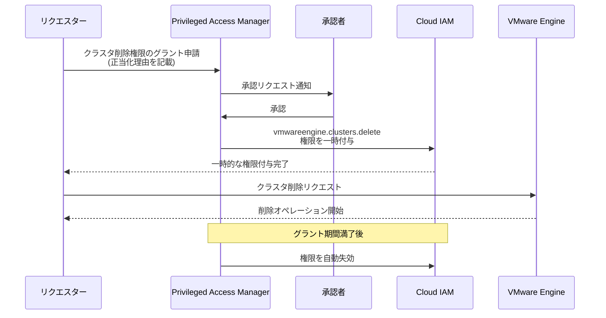

# Google Cloud VMware Engine: Privileged Access Manager (PAM) によるクラスタ削除機能

**リリース日**: 2026-05-11

**サービス**: Google Cloud VMware Engine

**機能**: Privileged Access Manager (PAM) を使用したプライベートクラウド内クラスタの削除

**ステータス**: GA (一般提供)

📊 [このアップデートのインフォグラフィックを見る](https://takech9203.github.io/google-cloud-news-summary/20260511-vmware-engine-pam-cluster-deletion.html)

## 概要

Google Cloud VMware Engine において、Privileged Access Manager (PAM) を使用してプライベートクラウド内のクラスタを削除できるようになりました。これにより、特権アクセスの一時的な昇格を通じて、クラスタ削除操作をより安全かつ制御された方法で実行できます。

PAM は Just-In-Time (JIT) アクセスを提供するサービスであり、クラスタ削除のような破壊的操作に対して、承認ベースの一時的な権限付与を実現します。これにより、常時権限を保持することなく、必要な時にのみクラスタ削除権限を取得できるようになります。

この機能は、セキュリティを重視する組織や、VMware Engine 環境の厳格なアクセス管理が求められるエンタープライズユーザーに特に有用です。

**アップデート前の課題**

- クラスタ削除権限 (`vmwareengine.clusters.delete`) を持つロールを常時付与する必要があり、意図しない削除のリスクがあった
- 削除操作に対する承認ワークフローが IAM レベルで組み込まれていなかった
- 特権操作の監査証跡が限定的で、誰がいつアクセスしたかの追跡が困難だった

**アップデート後の改善**

- PAM を通じて一時的なクラスタ削除権限の付与が可能になり、常時権限保持が不要になった
- 承認者による承認ワークフローを組み込んだ削除プロセスが実現された
- 監査ログにより、権限の付与、アクセス期間、正当化理由が記録されるようになった

## アーキテクチャ図



PAM を介したクラスタ削除の承認フローを示しています。リクエスターが権限を申請し、承認者の承認後に一時的な権限が付与され、期間満了後に自動的に失効します。

## サービスアップデートの詳細

### 主要機能

1. **PAM エンタイトルメントによるクラスタ削除権限管理**
   - `vmwareengine.clusters.delete` 権限を含むロールをエンタイトルメントとして定義
   - `roles/vmwareengine.vmwareenginePrivilegedUser` ロールがこの権限を含む
   - エンタイトルメントでリクエスター、承認者、最大期間を設定可能

2. **承認ベースのアクセス制御**
   - グラント申請時に正当化理由 (justification) の記載が必要
   - 指定された承認者による承認後にのみ権限が付与される
   - 承認されない場合、24時間後にリクエストが自動失効

3. **時間制限付きアクセス**
   - グラントは指定された期間のみ有効
   - 期間満了後に PAM が自動的に権限を失効
   - 1ユーザーあたり1エンタイトルメントにつき最大10の同時グラントが可能

## 技術仕様

### 必要な IAM 権限

| 項目 | 詳細 |
|------|------|
| クラスタ削除権限 | `vmwareengine.clusters.delete` |
| 含まれるロール | `roles/vmwareengine.vmwareenginePrivilegedUser`、`roles/vmwareengine.admin`、`roles/vmwareengine.editor` |
| OAuth スコープ | `https://www.googleapis.com/auth/cloud-platform` |
| API エンドポイント | `DELETE https://vmwareengine.googleapis.com/v1/{name=projects/*/locations/*/privateClouds/*/clusters/*}` |

### クラスタ削除の制約

| 項目 | 詳細 |
|------|------|
| 管理クラスタの削除 | 不可 (管理クラスタは削除できない) |
| ワークロードの移行 | 削除前にワークロードの移行またはシャットダウンが必要 |
| 操作タイプ | 長時間実行オペレーション (1時間以上かかる場合あり) |

## 設定方法

### 前提条件

1. Google Cloud プロジェクトで Privileged Access Manager API が有効化されていること
2. PAM エンタイトルメントが作成されていること
3. リクエスターがエンタイトルメントに追加されていること
4. 承認者が指定されていること

### 手順

#### ステップ 1: PAM エンタイトルメントの作成

クラスタ削除権限を含むエンタイトルメントを作成します。エンタイトルメントには、リクエスト可能なユーザー、承認者、付与されるロール、最大期間を定義します。

#### ステップ 2: グラントの申請

```bash
# PAM グラントの申請
gcloud alpha pam grants create \
  --entitlement=ENTITLEMENT_ID \
  --requested-duration=3600s \
  --justification="クラスタ縮小に伴う不要クラスタの削除" \
  --location=global \
  --project=PROJECT_ID
```

正当化理由を含めてグラントを申請します。

#### ステップ 3: 承認の待機

承認者がグラントを承認するまで待機します。承認されると、一時的に権限が付与されます。

#### ステップ 4: クラスタの削除

```bash
# クラスタの削除 (PAM グラントがアクティブな状態で実行)
gcloud vmware private-clouds clusters delete CLUSTER_ID \
  --location=ZONE \
  --private-cloud=PRIVATE_CLOUD_ID
```

PAM グラントがアクティブな状態でクラスタ削除コマンドを実行します。

## メリット

### ビジネス面

- **コンプライアンス強化**: 破壊的操作に対する承認ワークフローにより、規制要件やコンプライアンスポリシーへの準拠が容易になる
- **インシデントリスク軽減**: 意図しないクラスタ削除を防止し、ビジネス継続性を保護する

### 技術面

- **最小権限の原則の実現**: クラスタ削除権限を常時保持する必要がなくなり、攻撃対象領域を縮小
- **監査証跡の充実**: 誰がいつ、どのような理由でクラスタ削除権限を取得したかを完全に追跡可能
- **自動化対応**: サービスアカウントやエージェント ID を承認者として設定し、ITSM システムと連携した自動承認が可能

## デメリット・制約事項

### 制限事項

- 管理クラスタ (management cluster) はこの方法では削除できない
- グラントの承認が得られない場合、24時間後にリクエストが失効する
- 1ユーザーあたり1エンタイトルメントにつき同時に最大10グラントまで

### 考慮すべき点

- PAM エンタイトルメントの設計 (承認者、期間、ロール) を事前に計画する必要がある
- 削除前にクラスタ上のワークロードを移行またはシャットダウンする必要がある
- クラスタ削除は長時間実行オペレーションであり、完了まで1時間以上かかる場合がある

## ユースケース

### ユースケース 1: 環境縮小時のクラスタ削除

**シナリオ**: 開発チームがプロジェクト終了に伴い、テスト用プライベートクラウドの不要クラスタを削除する必要がある。インフラ管理者が PAM を通じて一時的な削除権限を取得し、承認を経てクラスタを安全に削除する。

**効果**: 常時削除権限を保持せずに、承認プロセスを経た安全なクラスタ削除が可能。監査ログにより操作の正当性を証明できる。

### ユースケース 2: コスト最適化のためのリソース整理

**シナリオ**: FinOps チームがコスト削減のため未使用クラスタの特定と削除を実施。PAM のグラント申請で正当化理由にコスト分析結果を記載し、承認者がビジネスインパクトを確認した上で承認する。

**効果**: コスト最適化活動において、適切なガバナンスを維持しながら迅速にリソースを整理できる。

## 関連サービス・機能

- **Privileged Access Manager (PAM)**: Just-In-Time アクセスを提供するIAM機能。一時的な特権昇格と監査を実現
- **Google Cloud VMware Engine**: VMware ワークロードを Google Cloud 上でネイティブに実行するサービス
- **Cloud Audit Logs**: PAM のグラント操作を含む全ての操作を記録する監査ログサービス
- **IAM Recommender**: 過剰な権限を特定し、PAM エンタイトルメントへの移行を推奨する機能

## 参考リンク

- 📊 [インフォグラフィック](https://takech9203.github.io/google-cloud-news-summary/20260511-vmware-engine-pam-cluster-deletion.html)
- [公式リリースノート](https://docs.google.com/release-notes#May_11_2026)
- [ドキュメント: プライベートクラウドの管理](https://docs.cloud.google.com/vmware-engine/docs/private-clouds/howto-manage-private-cloud#delete-cluster)
- [Privileged Access Manager 概要](https://docs.cloud.google.com/iam/docs/pam-overview)
- [PAM エンタイトルメントの作成](https://docs.cloud.google.com/iam/docs/pam-create-entitlements)
- [一時的な権限昇格のリクエスト](https://docs.cloud.google.com/iam/docs/pam-request-temporary-elevated-access)

## まとめ

Google Cloud VMware Engine で PAM を使用したクラスタ削除が可能になったことで、破壊的操作に対する最小権限の原則をより厳格に適用できるようになりました。承認ベースの一時的権限付与により、セキュリティリスクを最小化しつつ運用効率を維持できます。VMware Engine を運用する組織は、クラスタ削除を含む特権操作に対して PAM エンタイトルメントの設定を検討することを推奨します。

---

**タグ**: #GoogleCloud #VMwareEngine #PrivilegedAccessManager #PAM #IAM #セキュリティ #クラスタ管理 #最小権限
