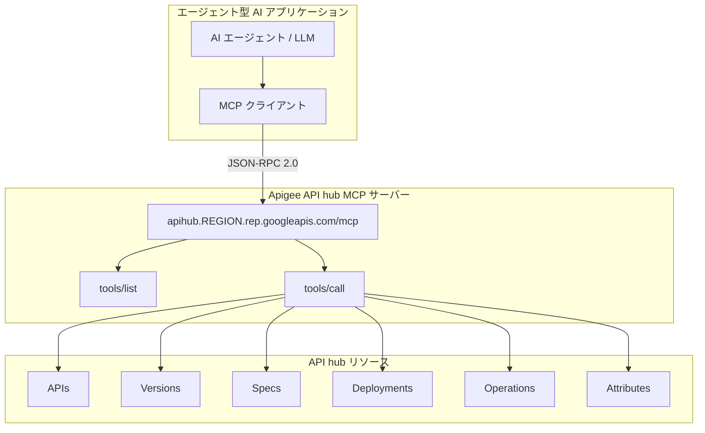

# Apigee API hub: MCP ツールによるエージェント型 AI ワークフロー対応 (Preview)

**リリース日**: 2026-05-12

**サービス**: Apigee API hub

**機能**: MCP tools support for Agentic AI workflows

**ステータス**: Public Preview

[このアップデートのインフォグラフィックを見る](https://takech9203.github.io/google-cloud-news-summary/20260512-apigee-api-hub-mcp-tools-agentic-ai.html)

## 概要

Apigee API hub が読み取り専用 API を Model Context Protocol (MCP) ツールとして公開する機能が Public Preview としてリリースされました。これにより、エージェント型 AI アプリケーションが標準的な MCP の `tools/list` および `tools/call` メソッドを使用して、API hub に登録された API、スペック、バージョン、デプロイメントなどのリソースを一覧・検査できるようになります。

この機能は、AI エージェントが API カタログを自律的に探索し、必要な API を発見・理解するためのインターフェースを提供するものです。MCP サーバーのエンドポイント (`apihub.REGION.rep.googleapis.com/mcp`) を通じて、AI アプリケーションは API hub のリソースに対してプログラム的にアクセスできます。

対象ユーザーは、エージェント型 AI アプリケーションを構築している開発者、および API ガバナンスを担当するプラットフォームチームです。AI エージェントが組織内の API 資産を動的に発見し活用できるようになるため、API ファーストのアプローチと AI ファーストのアプローチを統合する基盤となります。

**アップデート前の課題**

- AI エージェントが組織内の利用可能な API を発見するには、手動でドキュメントを参照するか、カスタム統合を構築する必要があった
- API カタログ情報を AI アプリケーションに提供する標準的なプロトコルが存在しなかった
- API のバージョン情報やデプロイメント状況を AI エージェントがプログラム的に取得する手段が限られていた

**アップデート後の改善**

- AI エージェントが MCP 標準プロトコルを使って API hub のリソースを自律的に探索可能になった
- `tools/list` で利用可能なツール一覧を取得し、`tools/call` で個別のリソース情報を取得できるようになった
- API、スペック、バージョン、デプロイメント、オペレーション、属性、依存関係など幅広いリソースに対する読み取りアクセスが標準化された

## アーキテクチャ図



AI エージェントが MCP クライアントを通じて API hub の MCP サーバーに接続し、標準的な MCP メソッドで API カタログ内の各種リソースを検索・取得するフローを示しています。

## サービスアップデートの詳細

### 主要機能

1. **MCP ツール一覧の公開**
   - `apihub.googleapis.com` MCP サーバーが 16 種類の読み取り専用ツールを提供
   - `tools/list` メソッドで利用可能な全ツールとそのスキーマを取得可能
   - JSON-RPC 2.0 プロトコルに準拠した標準的なインターフェース

2. **API リソースの検索・取得**
   - `search_resources`: API hub 内のリソースをセマンティック検索
   - `list_apis` / `get_api`: API リソースの一覧取得・詳細取得
   - `list_versions` / `get_version`: API バージョンの一覧・詳細取得

3. **スペックとデプロイメントの参照**
   - `list_specs` / `get_spec` / `get_spec_contents`: API スペックの一覧・詳細・内容取得
   - `list_deployments` / `get_deployment`: デプロイメント情報の一覧・詳細取得
   - `list_api_operations` / `get_api_operation`: API オペレーションの一覧・詳細取得

4. **メタデータと依存関係の参照**
   - `list_attributes` / `get_attribute`: カスタム属性の一覧・詳細取得
   - `list_dependencies` / `get_dependency`: API 間の依存関係情報の取得

## 技術仕様

### 利用可能な MCP ツール一覧

| ツール名 | 説明 |
|---------|------|
| `search_resources` | API hub 内のリソースを検索 |
| `get_api` | API リソースの詳細を取得 |
| `list_apis` | API リソースの一覧を取得 |
| `get_version` | API バージョンの詳細を取得 |
| `list_versions` | API バージョンの一覧を取得 |
| `get_spec` | スペックの解析情報を取得 |
| `get_spec_contents` | スペックの内容を取得 |
| `list_specs` | スペックの一覧を取得 |
| `get_api_operation` | API オペレーションの詳細を取得 |
| `list_api_operations` | API オペレーションの一覧を取得 |
| `get_deployment` | デプロイメントの詳細を取得 |
| `list_deployments` | デプロイメントの一覧を取得 |
| `get_attribute` | 属性の詳細を取得 |
| `list_attributes` | 全属性の一覧を取得 |
| `get_dependency` | 依存関係の詳細を取得 |
| `list_dependencies` | 依存関係の一覧を取得 |

### エンドポイント形式

MCP サーバーはリージョナルエンドポイント (REP) のみをサポートしています。グローバルエンドポイント (`apihub.googleapis.com`) は MCP リクエストには対応していません。

```
https://apihub.REGION.rep.googleapis.com/mcp
```

## 設定方法

### 前提条件

1. Apigee API hub インスタンスがプロビジョニング済みであること
2. API hub がサポートされているリージョンにデプロイされていること
3. 適切な IAM 権限が設定されていること

### 手順

#### ステップ 1: MCP ツール一覧の取得

```bash
curl --location 'https://apihub.REGION.rep.googleapis.com/mcp' \
  --header 'content-type: application/json' \
  --header 'accept: application/json, text/event-stream' \
  --header 'Authorization: Bearer $(gcloud auth print-access-token)' \
  --data '{
    "method": "tools/list",
    "jsonrpc": "2.0",
    "id": 1
  }'
```

`REGION` には対応するリージョン名を指定します (例: `us-east1`)。

#### ステップ 2: MCP ツールの呼び出し

```bash
curl --location 'https://apihub.us-east1.rep.googleapis.com/mcp' \
  --header 'content-type: application/json' \
  --header 'accept: application/json, text/event-stream' \
  --header 'Authorization: Bearer $(gcloud auth print-access-token)' \
  --data '{
    "method": "tools/call",
    "jsonrpc": "2.0",
    "id": 2,
    "params": {
      "name": "list_apis",
      "arguments": {
        "project": "YOUR_PROJECT_ID",
        "location": "us-east1"
      }
    }
  }'
```

特定の API リソースの詳細を取得するには、`get_api` ツールを使用し、API リソース名を引数として渡します。

## メリット

### ビジネス面

- **API 資産の活用促進**: AI エージェントが組織内の API を自動発見することで、既存 API の再利用率が向上し、重複した API 開発を防止
- **エージェント型 AI の迅速な構築**: 標準プロトコルによる API 発見メカニズムにより、AI エージェントの開発期間を短縮
- **API ガバナンスの強化**: 全ての API アクセスが API hub を経由することで、一元的な可視性とコントロールを維持

### 技術面

- **標準プロトコル準拠**: MCP 標準に準拠しているため、MCP 対応の任意の AI フレームワークやツールと互換性がある
- **読み取り専用の安全性**: 全ツールが読み取り専用であるため、意図しない変更のリスクなくエージェントに API 探索権限を付与可能
- **セマンティック検索**: 自然言語クエリによる API 検索が可能で、エージェントが適切な API を効率的に発見可能

## デメリット・制約事項

### 制限事項

- グローバルエンドポイント (`apihub.googleapis.com`) は MCP リクエストに非対応。リージョナルエンドポイントの使用が必須
- 読み取り専用のツールのみ提供。API の作成・更新・削除は MCP 経由では不可
- MCP 依存関係分析 (Dependency analysis) は現時点で MCP ツールに対して非対応

### 考慮すべき点

- Public Preview 段階であるため、GA までに仕様が変更される可能性がある
- リージョナルエンドポイントのみサポートのため、マルチリージョン構成では各リージョンごとにエンドポイントを管理する必要がある
- AI エージェントからのアクセスに対して適切な認証・認可の設計が必要

## ユースケース

### ユースケース 1: AI エージェントによる API 自動発見と統合

**シナリオ**: 社内の AI アシスタントが、ユーザーのリクエストに応じて適切な社内 API を自動的に発見し、その仕様を理解してコード生成や API 呼び出しを行う。

**実装例**:
```json
{
  "method": "tools/call",
  "jsonrpc": "2.0",
  "id": 1,
  "params": {
    "name": "search_resources",
    "arguments": {
      "project": "my-project",
      "location": "us-east1",
      "query": "customer order management"
    }
  }
}
```

**効果**: 開発者が手動で API ドキュメントを検索する必要がなくなり、AI エージェントが自律的に最適な API を選択して利用できる。

### ユースケース 2: API カタログの自動監査とコンプライアンスチェック

**シナリオ**: AI エージェントが定期的に API hub の全 API を巡回し、スペックの整合性、バージョン管理状況、デプロイメントの健全性をチェックするガバナンスワークフロー。

**効果**: API ライフサイクル管理の自動化により、ガバナンスチームの負荷を軽減し、ポリシー違反の早期発見が可能になる。

## 利用可能リージョン

MCP エンドポイントは以下の 9 リージョンで利用可能です:

| リージョン | ロケーション |
|-----------|-------------|
| asia-east1 | 台湾 |
| asia-south1 | ムンバイ |
| asia-southeast1 | シンガポール |
| europe-north1 | フィンランド |
| europe-west1 | ベルギー |
| europe-west9 | パリ |
| us-central1 | アイオワ |
| us-east1 | サウスカロライナ |
| us-west1 | オレゴン |

## 関連サービス・機能

- **Apigee MCP in Apigee (Private Preview)**: 既存の Apigee API を MCP ツールとして公開し、エージェント型アプリケーションからアクセス可能にする機能
- **Unified MCP Proxy Configuration (Public Preview, 2026-05-07)**: API hub から MCP ディスカバリプロキシを作成・デプロイする機能
- **Agent Registry 統合 (Public Preview, 2026-04-06)**: API hub と Agent Registry 間で MCP サーバー・ツールメタデータを自動同期する機能
- **Google Cloud MCP servers**: BigQuery、Cloud Storage、Compute Engine など多数の Google Cloud サービスが提供するリモート MCP サーバー群

## 参考リンク

- [インフォグラフィック](https://takech9203.github.io/google-cloud-news-summary/20260512-apigee-api-hub-mcp-tools-agentic-ai.html)
- [公式リリースノート](https://docs.cloud.google.com/release-notes#May_12_2026)
- [API hub MCP リファレンス](https://docs.cloud.google.com/apigee/docs/reference/apis/apihub/mcp)
- [MCP in Apigee 概要](https://docs.cloud.google.com/apigee/docs/api-platform/apigee-mcp/apigee-mcp-overview)
- [MCP in Apigee クイックスタート](https://docs.cloud.google.com/apigee/docs/api-platform/apigee-mcp/apigee-mcp-quickstart)
- [MCP API の登録](https://docs.cloud.google.com/apigee/docs/apihub/register-mcp-apis)
- [Google Cloud MCP servers 概要](https://docs.cloud.google.com/mcp/overview)

## まとめ

Apigee API hub の MCP ツール対応は、API 管理とエージェント型 AI を橋渡しする重要な機能です。AI エージェントが標準プロトコルを通じて組織の API カタログを自律的に探索できるようになることで、API ファーストの開発アプローチと AI 駆動の自動化を統合する基盤が整いました。API hub を利用中の組織は、リージョナルエンドポイントを MCP クライアントに設定するだけで、この機能を試すことができます。

---

**タグ**: #Apigee #APIHub #MCP #ModelContextProtocol #AgenticAI #APIManagement #Preview #AIAgent
