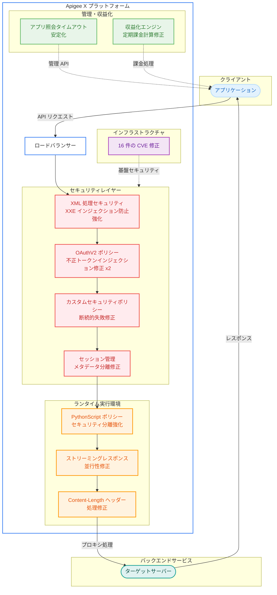

# Apigee X: セキュリティアップデート バージョン 1-17-0-apigee-7

**リリース日**: 2026-05-12

**サービス**: Apigee X

**機能**: セキュリティ修正およびバグ修正 (バージョン 1-17-0-apigee-7)

**ステータス**: Security + Bug Fixes

[このアップデートのインフォグラフィックを見る](https://takech9203.github.io/google-cloud-news-summary/20260512-apigee-x-security-update-1-17-0-apigee-7.html)

## 概要

2026 年 5 月 12 日、Google Cloud は Apigee の更新バージョン 1-17-0-apigee-7 をリリースした。本リリースは、16 件のセキュリティ脆弱性 (CVE) を修正するとともに、XML 外部エンティティインジェクション防止の強化、OAuthV2 ポリシーの不正トークンインジェクション修正、PythonScript ポリシーのセキュリティ分離強化など、複数の重要なセキュリティおよびバグ修正を含む大規模なセキュリティアップデートである。

本リリースは 1-17-0 系列の 7 番目のリリースであり、XML 処理、OAuth トークン管理、スクリプトポリシー実行環境、ストリーミングレスポンス処理、収益化機能など、Apigee X の広範なコンポーネントにわたる修正を提供する。特に OAuthV2 ポリシーにおける不正トークンインジェクションの 2 件の修正は、API セキュリティの根幹に関わる重要な脆弱性対応であり、早期のロールアウト完了確認が推奨される。

ロールアウトは 2026 年 5 月 12 日に開始され、すべての Google Cloud ゾーンへの展開には 4 営業日以上かかる可能性がある。Apigee X を利用するすべての組織に自動的に適用され、ユーザー側でのアクションは不要である。

**アップデート前の課題**

本アップデート適用前には、以下の課題が存在していた。

- XML 処理において外部エンティティインジェクション (XXE) に対する防御が不十分であり、悪意あるペイロードによるデータ漏洩やサービス拒否のリスクがあった
- 無関係なクライアントセッション間でメタデータが共有される問題があり、情報漏洩のリスクがあった
- OAuthV2 ポリシーにおいて不正なトークンインジェクションが可能な脆弱性が 2 件存在し、認証・認可のバイパスリスクがあった
- PythonScript ポリシーの実行環境でセキュリティ分離が不十分であり、権限昇格のリスクがあった
- カスタムセキュリティポリシーが断続的に失敗する問題があった
- ストリーミングレスポンス処理における並行性の問題でデータの整合性が損なわれる可能性があった
- 外部処理における content-length ヘッダーの不整合があった
- アプリケーション照会時のタイムアウトが不安定であった
- 収益化機能における定期課金の計算が不正確であった
- レスポンス本文のサイズと content-length ヘッダーが一致しないケースがあった

**アップデート後の改善**

今回のアップデートにより、以下の改善が実現した。

- XML 処理のセキュリティが強化され、外部エンティティインジェクション攻撃に対する防御が向上した
- セッション間のメタデータ分離が修正され、クライアント間の情報漏洩リスクが解消された
- OAuthV2 ポリシーの 2 件のトークンインジェクション脆弱性が修正され、認証・認可の信頼性が回復した
- PythonScript ポリシーの実行サンドボックスが強化され、スクリプト実行時の権限昇格リスクが低減された
- カスタムセキュリティポリシーの断続的失敗が解消され、ポリシー実行の安定性が向上した
- ストリーミングレスポンスの並行処理が修正され、高負荷時のデータ整合性が確保された
- content-length ヘッダーの処理が正確になり、プロキシ通信の信頼性が向上した
- アプリケーション照会時のタイムアウトが安定し、管理 API の応答性が改善された
- 収益化の定期課金計算が正確になり、課金の信頼性が向上した

## アーキテクチャ図

この図は、Apigee X バージョン 1-17-0-apigee-7 で修正された主要コンポーネントを示している。セキュリティレイヤー (XML 処理、OAuthV2、カスタムポリシー、セッション管理)、ランタイム実行環境 (PythonScript、ストリーミング、Content-Length)、管理・収益化 (タイムアウト、課金計算)、およびインフラストラクチャ (16 件の CVE) の各層にわたる包括的な修正が適用されている。

## サービスアップデートの詳細

### セキュリティ修正

1. **XML 処理セキュリティ強化 (XXE インジェクション防止)**
   - XML パーサーにおける外部エンティティ参照の処理を強化
   - 悪意ある DTD (Document Type Definition) を含む XML ペイロードによるデータ漏洩やサービス拒否攻撃を防止
   - XMLThreatProtection ポリシーとの連携により、多層防御を実現

2. **OAuthV2 ポリシー: 不正トークンインジェクション修正 (2 件)**
   - 攻撃者が不正なトークンを注入して認証・認可を迂回できる脆弱性を修正
   - トークン検証プロセスの強化により、正規のトークンのみがリクエスト処理に使用されることを保証
   - OAuth 2.0 フローの整合性が回復し、API セキュリティの信頼性が向上

3. **PythonScript ポリシー: セキュリティ分離強化**
   - スクリプト実行環境のサンドボックスを強化し、権限昇格攻撃のリスクを低減
   - GCP-2025-023 セキュリティ速報で報告された JavaCallout/PythonScript ポリシーのセキュリティ対策の延長線上にある改善
   - 内部認可ユーザーによるプロキシデプロイを通じた不正コード実行リスクを軽減

4. **セッション間メタデータ分離修正**
   - 無関係なクライアントセッション間でメタデータが共有される問題を修正
   - セッション分離の強化により、マルチテナント環境での情報漏洩リスクを解消

5. **カスタムセキュリティポリシーの断続的失敗修正**
   - カスタムセキュリティポリシーが不定期に実行失敗する問題を修正
   - ポリシー実行の信頼性が向上し、セキュリティ制御のギャップが解消

### バグ修正

6. **ストリーミングレスポンス処理の並行性問題修正**
   - 複数のストリーミングレスポンスを同時に処理する際の競合状態を修正
   - 高負荷環境でのデータ整合性と信頼性が向上

7. **外部処理における content-length ヘッダー処理修正**
   - 外部処理 (External Processing) 時の content-length ヘッダーの不整合を修正
   - プロキシとバックエンド間の通信信頼性が向上

8. **content-length ヘッダーのレスポンス本文サイズ反映修正**
   - レスポンスの content-length ヘッダーが実際のレスポンス本文サイズを正確に反映するよう修正
   - クライアント側でのレスポンス処理の信頼性が向上

9. **アプリケーション照会時のタイムアウト安定化**
   - 管理 API でアプリケーション情報を照会する際のタイムアウトが不安定になる問題を修正
   - 管理操作の応答性と予測可能性が向上

10. **収益化: 定期課金計算修正**
    - Monetization (収益化) 機能における定期課金 (Fixed Recurring Fee) の計算ロジックを修正
    - 課金の正確性が向上し、API プロダクトの収益化における信頼性が改善

## 技術仕様

### CVE 一覧

以下の表は、本リリースで対処された 16 件のセキュリティ脆弱性の一覧である。

| CVE / アドバイザリ番号 | 説明 |
|------------------------|------|
| [CVE-2026-42587](https://nvd.nist.gov/vuln/detail/CVE-2026-42587) | Apigee インフラストラクチャのセキュリティ修正 |
| [CVE-2026-5588](https://nvd.nist.gov/vuln/detail/CVE-2026-5588) | Apigee インフラストラクチャのセキュリティ修正 |
| [CVE-2026-34480](https://nvd.nist.gov/vuln/detail/CVE-2026-34480) | Apigee インフラストラクチャのセキュリティ修正 |
| [GHSA-72hv-8253-57qq](https://github.com/advisories/GHSA-72hv-8253-57qq) | GitHub Security Advisory に基づく修正 |
| [CVE-2026-33870](https://nvd.nist.gov/vuln/detail/CVE-2026-33870) | Apigee インフラストラクチャのセキュリティ修正 |
| [CVE-2026-33871](https://nvd.nist.gov/vuln/detail/CVE-2026-33871) | Apigee インフラストラクチャのセキュリティ修正 |
| [CVE-2026-35611](https://nvd.nist.gov/vuln/detail/CVE-2026-35611) | Apigee インフラストラクチャのセキュリティ修正 |
| [CVE-2026-33170](https://nvd.nist.gov/vuln/detail/CVE-2026-33170) | Apigee インフラストラクチャのセキュリティ修正 |
| [CVE-2026-33169](https://nvd.nist.gov/vuln/detail/CVE-2026-33169) | Apigee インフラストラクチャのセキュリティ修正 |
| [CVE-2026-33176](https://nvd.nist.gov/vuln/detail/CVE-2026-33176) | Apigee インフラストラクチャのセキュリティ修正 |
| [CVE-2026-33210](https://nvd.nist.gov/vuln/detail/CVE-2026-33210) | Apigee インフラストラクチャのセキュリティ修正 |
| [CVE-2026-33186](https://nvd.nist.gov/vuln/detail/CVE-2026-33186) | Apigee インフラストラクチャのセキュリティ修正 |
| [CVE-2026-42499](https://nvd.nist.gov/vuln/detail/CVE-2026-42499) | Apigee インフラストラクチャのセキュリティ修正 |
| [CVE-2026-35469](https://nvd.nist.gov/vuln/detail/CVE-2026-35469) | Apigee インフラストラクチャのセキュリティ修正 |
| [CVE-2026-32281](https://nvd.nist.gov/vuln/detail/CVE-2026-32281) | Apigee インフラストラクチャのセキュリティ修正 |
| [CVE-2026-27144](https://nvd.nist.gov/vuln/detail/CVE-2026-27144) | Apigee インフラストラクチャのセキュリティ修正 |

### バグ修正一覧

| 修正カテゴリ | 説明 |
|-------------|------|
| XML 処理 | 外部エンティティインジェクション防止のための XML 処理セキュリティ強化 |
| セッション管理 | 無関係なクライアントセッション間でのメタデータ共有問題を修正 |
| OAuthV2 ポリシー | 不正トークンインジェクション脆弱性の修正 (2 件) |
| PythonScript ポリシー | セキュリティ分離の強化 |
| カスタムポリシー | カスタムセキュリティポリシーの断続的失敗を修正 |
| ストリーミング | ストリーミングレスポンス処理の並行性問題を修正 |
| Content-Length | 外部処理における content-length ヘッダー処理を修正 |
| タイムアウト | アプリケーション照会時の不安定なタイムアウトを修正 |
| 収益化 | 定期課金計算の不正確さを修正 |
| Content-Length | レスポンス本文サイズを正確に反映するよう content-length ヘッダーを修正 |

### バージョン履歴 (1-17-0 系列)

| リリース日 | バージョン | 主な内容 |
|-----------|-----------|----------|
| 2026-01-21 | 1-17-0-apigee-1 | 13 件の CVE 修正、TLS 検証強化、SSE クォータ更新 |
| 2026-02-10 | 1-17-0-apigee-2 | 5 件の CVE 修正、メモリリーク修正、URI 解析修正 |
| 2026-02-24 | 1-17-0-apigee-3 | セキュリティ修正、バグ修正 |
| 2026-05-12 | 1-17-0-apigee-7 | 16 件の CVE 修正、XXE 防止強化、OAuthV2 修正、PythonScript 分離強化 |

## メリット

### ビジネス面

- **API セキュリティの大幅な向上**: 16 件の CVE 修正と複数のセキュリティ強化により、API プラットフォーム全体のセキュリティ態勢が大幅に強化される。金融、医療、公共セクターなどのコンプライアンス要件の厳しい業界での信頼性が向上する
- **収益化の正確性向上**: 定期課金計算の修正により、API プロダクトの収益化における課金の正確性が保証され、パートナーや開発者との信頼関係が維持される
- **サービス可用性の改善**: ストリーミングレスポンスの並行性問題修正およびカスタムポリシーの断続的失敗修正により、API サービスの安定性が向上する

### 技術面

- **多層防御の強化**: XML 処理、OAuth トークン管理、スクリプト実行環境のそれぞれでセキュリティが強化され、攻撃対象面が大幅に縮小された
- **セッション分離の信頼性**: マルチテナント環境においてクライアント間のデータ漏洩リスクが解消された
- **HTTP レスポンス処理の正確性**: content-length ヘッダーの修正により、プロキシ通信の信頼性が向上し、クライアント側でのレスポンス解析エラーが解消された
- **PythonScript サンドボックスの強化**: スクリプト実行環境のセキュリティ分離が改善され、カスタムスクリプトによる権限昇格リスクが軽減された

## デメリット・制約事項

### 制限事項

- ロールアウトはすべての Google Cloud ゾーンへの展開に 4 営業日以上かかる場合がある
- ロールアウトが完了するまで、一部のインスタンスには修正が適用されない

### 考慮すべき点

- 自動ロールアウトのため、ユーザー側での適用タイミングの制御はできない
- Apigee Hybrid を利用している場合は、本リリースの対象外であるため、別途 Hybrid リリースノートを確認する必要がある
- PythonScript ポリシーのセキュリティ分離強化により、既存のスクリプトが一部制限される可能性がある。アップデート後に PythonScript ポリシーの動作を検証することが推奨される
- OAuthV2 ポリシーの修正により、トークン処理のロジックが変更されているため、カスタム OAuth フローを実装している場合は動作確認が推奨される

## ユースケース

### ユースケース 1: 金融 API のセキュリティ強化

**シナリオ**: 金融機関が Apigee X を通じて口座情報 API や決済 API を公開しており、XML ベースのリクエスト (SOAP/XML) と OAuth 2.0 による認証を組み合わせて利用している。

**効果**: XML 外部エンティティインジェクション防止の強化と OAuthV2 トークンインジェクション修正により、API を通じた不正アクセスやデータ漏洩のリスクが大幅に低減される。金融規制要件 (PCI-DSS、SOX) への準拠が強化される。

### ユースケース 2: マルチテナント SaaS プラットフォームのデータ分離

**シナリオ**: SaaS プロバイダーが Apigee X を使用して複数のテナント向け API を提供しており、各テナントのデータが厳密に分離されている必要がある。

**効果**: セッション間メタデータ分離の修正により、テナント A のセッションデータがテナント B に漏洩するリスクが解消される。マルチテナント環境での情報セキュリティが保証される。

### ユースケース 3: API マーケットプレイスの収益化

**シナリオ**: API プロバイダーが Apigee の Monetization 機能を使用して API プロダクトの定期課金 (月額サブスクリプション) を設定し、開発者パートナーに課金している。

**効果**: 定期課金計算の修正により、パートナーへの請求金額が正確に計算されるようになり、課金に関するトラブルや信頼性の問題が解消される。

## 料金

Apigee X のセキュリティアップデートは追加費用なしで自動的に適用される。Apigee X の通常の料金体系は変更されない。

### 料金例

以下は Apigee Pay-as-you-go の代表的な料金である (公式ドキュメントより)。

| 項目 | 料金 |
|------|------|
| Standard API Proxy 呼び出し (100 万回あたり、最大 5,000 万回) | $20 |
| Extensible API Proxy 呼び出し (100 万回あたり、最大 5,000 万回) | $100 |
| Base 環境使用量 (1 時間あたり、1 リージョン) | $0.5 |
| Intermediate 環境使用量 (1 時間あたり、1 リージョン) | $2.0 |
| Comprehensive 環境使用量 (1 時間あたり、1 リージョン) | $4.7 |

## 関連サービス・機能

- **Apigee Hybrid**: Apigee のハイブリッドデプロイメントモデル。本リリース (1-17-0-apigee-7) は Apigee X のみが対象であり、Hybrid ユーザーは別途リリースノートを確認する必要がある
- **Apigee Advanced API Security**: Apigee の高度な API セキュリティ機能を提供するアドオン。セキュリティアクション、ボット検出、セキュリティスコアリングなどの機能で、本アップデートによる修正を補完する形で API の保護をさらに強化できる
- **Cloud Armor**: Google Cloud の DDoS 防御・WAF サービス。Apigee X と組み合わせることで、ネットワーク層からアプリケーション層まで包括的な API 保護を実現できる
- **Cloud Monitoring**: Apigee のメトリクスを監視するサービス。ストリーミングレスポンスのエラー率やタイムアウトの発生状況をモニタリングし、修正の効果を確認するために活用できる
- **Cloud Logging**: Apigee のログを収集・分析するサービス。XML 処理エラーや OAuth トークン検証の問題を追跡し、セキュリティイベントの監査に利用可能
- **XMLThreatProtection ポリシー**: Apigee の組み込みポリシーで、XML ペイロードに対する脅威保護を提供する。今回の XXE インジェクション防止強化と連携して多層防御を構成する

## 参考リンク

- [インフォグラフィック](https://takech9203.github.io/google-cloud-news-summary/20260512-apigee-x-security-update-1-17-0-apigee-7.html)
- [公式リリースノート](https://cloud.google.com/release-notes#May_12_2026)
- [Apigee セキュリティ速報](https://cloud.google.com/apigee/docs/security-bulletins/security-bulletins)
- [Apigee セキュリティパッチ適用について](https://cloud.google.com/apigee/docs/hybrid/security-patching)
- [Apigee OAuthV2 ポリシー](https://cloud.google.com/apigee/docs/api-platform/reference/policies/oauthv2-policy)
- [Apigee PythonScript ポリシー](https://cloud.google.com/apigee/docs/api-platform/reference/policies/python-script-policy)
- [Apigee XMLThreatProtection ポリシー](https://cloud.google.com/apigee/docs/api-platform/reference/policies/xml-threat-protection-policy)
- [Apigee Monetization (収益化)](https://cloud.google.com/apigee/docs/api-platform/monetization/manage-rate-plans)
- [Apigee ドキュメント](https://cloud.google.com/apigee/docs)
- [Apigee Pay-as-you-go 料金](https://cloud.google.com/apigee/docs/api-platform/reference/pay-as-you-go-updated-overview)

## まとめ

Apigee X バージョン 1-17-0-apigee-7 は、16 件の CVE 修正を含む大規模なセキュリティアップデートである。XML 外部エンティティインジェクション防止の強化、OAuthV2 ポリシーにおける不正トークンインジェクション修正 (2 件)、PythonScript ポリシーのセキュリティ分離強化など、API セキュリティの根幹に関わる重要な修正が含まれている。加えて、ストリーミングレスポンスの並行性問題、content-length ヘッダーの不整合、収益化の定期課金計算など、運用上の信頼性に関わるバグ修正も包括的に提供される。Apigee X を利用するすべての組織は、ロールアウト完了後に PythonScript ポリシーおよびカスタム OAuth フローの動作を確認し、Cloud Monitoring を活用してセキュリティ修正の効果を検証することが推奨される。

---

**タグ**: Apigee, Security, CVE-2026-42587, CVE-2026-5588, CVE-2026-34480, CVE-2026-33870, CVE-2026-33871, CVE-2026-35611, OAuthV2, PythonScript, XXE, XML, Monetization, Bug Fix, Content-Length, Streaming
