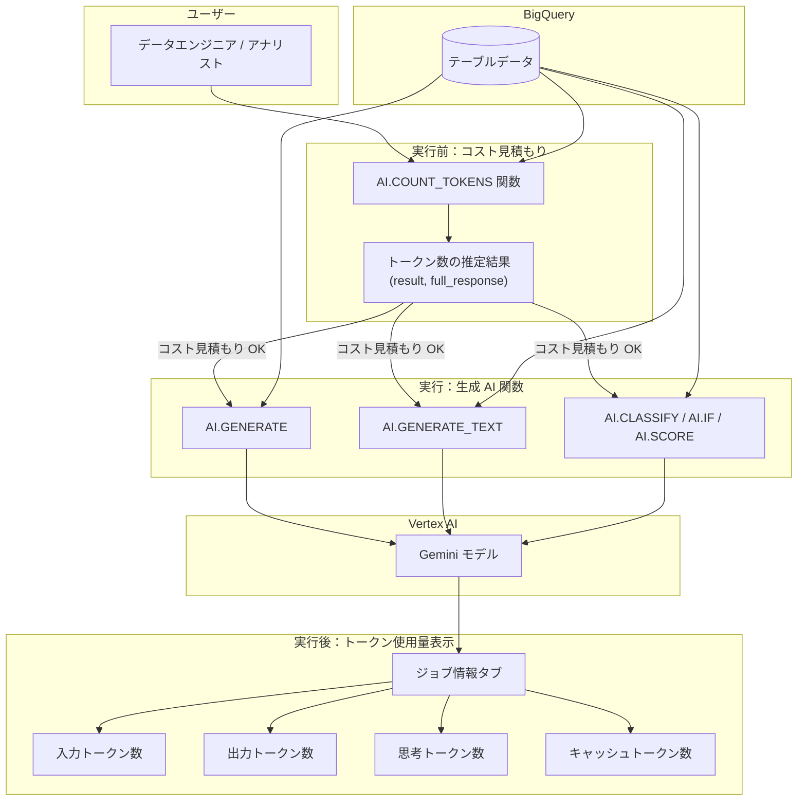

# BigQuery: AI.COUNT_TOKENS 関数およびトークン使用量表示

**リリース日**: 2026-05-12

**サービス**: BigQuery

**機能**: AI.COUNT_TOKENS 関数およびトークン使用量表示

**ステータス**: Preview

[このアップデートのインフォグラフィックを見る](https://takech9203.github.io/google-cloud-news-summary/20260512-bigquery-ai-count-tokens.html)

## 概要

BigQuery に AI.COUNT_TOKENS 関数が追加され、テキスト入力のトークン数を SQL クエリ内で直接見積もることが可能になった。トークンは生成 AI モデルが入力を処理する際の基本単位であり、Vertex AI の課金はトークン数に基づいて行われる。この関数により、AI.GENERATE などの生成 AI 関数を実行する前にコストを事前に見積もることができる。トークンカウント処理は BigQuery 内で行われるため、Vertex AI 側の課金は発生しない。

さらに、生成 AI 関数（埋め込みモデルを除く Gemini モデルを使用するもの）の実行後に、クエリ結果ペインの「ジョブ情報」タブから、入力トークン数・出力トークン数・思考トークン数・キャッシュトークン数をモダリティ別に確認できるようになった。これにより、クエリ実行後の実際のトークン消費量を可視化し、コスト管理と最適化が容易になる。

これらの機能は Preview ステータスであり、BigQuery で生成 AI 関数を活用するデータエンジニア・データサイエンティスト・アナリストにとって、コスト予測と管理の精度を大幅に向上させるものである。

**アップデート前の課題**

- BigQuery SQL 内でプロンプトのトークン数を事前に見積もる手段がなく、AI.GENERATE 等の実行コストを事前に把握できなかった
- 生成 AI 関数の実行後に、入力・出力・思考・キャッシュの各トークン消費量の内訳を確認する方法がなかった
- コスト管理のためには Cloud Billing のレポートを事後的に確認するしかなく、クエリ単位でのリアルタイムなトークン消費の把握が困難だった

**アップデート後の改善**

- AI.COUNT_TOKENS 関数により、任意のテキスト入力のトークン数を SQL クエリで即座に見積もれるようになった
- トークンカウントは BigQuery 内で処理され、Vertex AI の追加課金なしに利用可能
- クエリ実行後のジョブ情報タブで入力・出力・思考・キャッシュトークンの使用量がモダリティ別に表示されるようになった

## アーキテクチャ図



## サービスアップデートの詳細

### AI.COUNT_TOKENS 関数

AI.COUNT_TOKENS は、テキスト入力のトークン数を見積もるユーティリティ関数である。BigQuery 内でトークンカウントが処理されるため、Vertex AI 側の課金は発生しない。

**構文:**
```sql
AI.COUNT_TOKENS(INPUT [, endpoint => ENDPOINT])
```

**引数:**
- `INPUT`: トークン数をカウントするテキストプロンプト（STRING 型）
- `ENDPOINT`（オプション）: トークナイゼーションルールに使用する生成 AI モデル名。省略時は AI.GENERATE 関数のデフォルトモデルが使用される

**戻り値（STRUCT 型）:**
- `result`: 入力の合計トークン数（INT64）。入力が NULL またはエラー発生時は NULL
- `full_response`: モダリティ別のトークン数を含む JSON 値。入力が NULL またはエラー発生時は NULL

### トークン使用量表示

生成 AI 関数（埋め込みモデルを除く Gemini モデル使用時）の実行後、クエリ結果ペインの「ジョブ情報」タブで以下のトークン数が確認可能:

- **入力トークン数**: クエリ内のすべての生成 AI 関数に入力されたトークンの合計
- **出力トークン数**: クエリが生成したすべての候補レスポンスのトークン合計
- **思考トークン数**: モデルが生成した思考プロセスのトークン合計（該当する場合）
- **キャッシュトークン数**: クエリで暗黙的にキャッシュされた入力トークンの合計

## 技術仕様

| 項目 | 詳細 |
|------|------|
| 関数名 | `AI.COUNT_TOKENS` |
| ステータス | Preview |
| 入力型 | STRING |
| 出力型 | STRUCT<result INT64, full_response JSON> |
| トークンカウント処理場所 | BigQuery 内 |
| Vertex AI 課金 | なし（AI.COUNT_TOKENS 自体は無料） |
| 対応モデル | Gemini モデル（endpoint パラメータで指定可能） |
| 思考トークン | AI.COUNT_TOKENS の結果には含まれない |

## 設定方法

### AI.COUNT_TOKENS の基本的な使用例

```sql
-- シンプルなテキストのトークン数カウント
SELECT AI.COUNT_TOKENS("Token count isn't always equal to word count.").result AS num_tokens;
-- 結果: 約 11

-- 特定のモデルを指定してカウント
SELECT
  review,
  AI.COUNT_TOKENS(review, endpoint => 'gemini-2.5-flash').*
FROM `bigquery-public-data.imdb.reviews`
LIMIT 2;
```

### テーブルデータに対するトークン数の事前見積もり

```sql
-- プロンプトのトークン数を事前に確認してからAI.GENERATEを実行
SELECT
  prompt_text,
  AI.COUNT_TOKENS(prompt_text).result AS estimated_tokens
FROM `my_project.my_dataset.prompts_table`
WHERE AI.COUNT_TOKENS(prompt_text).result < 1000;
```

### トークン使用量の確認手順

1. BigQuery コンソールで生成 AI 関数を含むクエリを実行
2. クエリ結果ペインの「ジョブ情報」タブをクリック
3. 入力・出力・思考・キャッシュの各トークン数がモダリティ別に表示される

## メリット

### ビジネス面

- **コスト予測の精度向上**: クエリ実行前にトークン数を見積もることで、Vertex AI 利用コストを事前に把握できる
- **予算管理の改善**: 大量データに対する生成 AI 処理のコストを事前検証し、予算超過を防止
- **ROI の可視化**: 実行後のトークン使用量表示により、AI 関数の投資対効果を定量的に評価可能

### 技術面

- **クエリ最適化**: トークン数に基づいてプロンプトの最適化やバッチサイズの調整が可能
- **SQL ネイティブ**: 追加の API コールやツールを使わず、SQL のみでトークン見積もりが完結
- **追加コストなし**: AI.COUNT_TOKENS 自体は BigQuery 内で処理され、Vertex AI 課金が発生しない
- **モダリティ別分析**: テキスト・画像等のモダリティ別にトークン消費を把握可能

## デメリット・制約事項

- **Preview ステータス**: 本番環境での利用にはリスクが伴う。Pre-GA の提供条件が適用され、サポートが限定的
- **入力トークンのみ推定**: AI.COUNT_TOKENS は入力トークン数のみを推定し、出力トークン数や思考トークン数は含まれない
- **テキスト入力のみ対応**: AI.COUNT_TOKENS の INPUT は STRING 型のみであり、画像・音声・動画等のマルチモーダル入力のトークンカウントには直接対応しない
- **推定値**: 実際のトークン数とは若干の差異が生じる可能性がある
- **モデル依存**: トークナイゼーションルールはモデルによって異なるため、endpoint の指定が重要

## ユースケース

### 1. 大規模テキスト処理のコスト事前見積もり

数百万行のテキストデータに対して AI.GENERATE を実行する前に、AI.COUNT_TOKENS で総トークン数を見積もり、コストを事前に算出する。

```sql
SELECT
  SUM(AI.COUNT_TOKENS(review_text).result) AS total_estimated_tokens,
  COUNT(*) AS total_rows
FROM `my_project.reviews.product_reviews`;
```

### 2. トークン数に基づくデータフィルタリング

トークン数が多すぎるプロンプトを除外し、モデルのコンテキストウィンドウ超過を防止する。

```sql
SELECT *
FROM `my_project.my_dataset.documents`
WHERE AI.COUNT_TOKENS(content, endpoint => 'gemini-2.5-flash').result <= 8192;
```

### 3. コスト追跡と最適化

クエリ実行後にジョブ情報タブでトークン使用量を確認し、キャッシュトークンの割合を分析してプロンプト設計を最適化する。

## 料金

- **AI.COUNT_TOKENS 関数自体**: BigQuery 内で処理されるため、Vertex AI の追加課金なし。BigQuery の標準的なクエリ処理料金（オンデマンドまたはスロット）のみ
- **生成 AI 関数（AI.GENERATE 等）**: Vertex AI モデルへのリクエストが発生し、入力・出力トークン数に基づいて Vertex AI の料金が課金される
- **コスト追跡**: Cloud Billing のレポートで Vertex AI のサービスフィルタを使用し、bigquery_job_id_prefix ラベルでジョブ単位の課金を確認可能
- **Provisioned Throughput**: 大量処理時は Vertex AI Provisioned Throughput を購入することで安定したスループットを確保可能

## 関連サービス・機能

| サービス・機能 | 関連性 |
|------|------|
| BigQuery AI 関数（AI.GENERATE, AI.GENERATE_TEXT） | AI.COUNT_TOKENS でトークン数を事前推定する対象 |
| BigQuery マネージド AI 関数（AI.IF, AI.CLASSIFY, AI.SCORE） | トークン使用量表示の対象 |
| Vertex AI Gemini モデル | トークナイゼーションルールの提供元、推論実行先 |
| Vertex AI CountTokens API | AI.COUNT_TOKENS と同等の機能を REST API / SDK で提供 |
| BigQuery ML（BQML） | BigQuery 内での ML 機能の基盤 |
| Cloud Billing | 生成 AI 関数のコスト追跡 |
| Vertex AI 暗黙的キャッシュ | キャッシュトークン数としてトークン使用量に反映 |

## 参考リンク

- [インフォグラフィック](https://takech9203.github.io/google-cloud-news-summary/20260512-bigquery-ai-count-tokens.html)
- [公式リリースノート](https://cloud.google.com/release-notes#May_12_2026)
- [AI.COUNT_TOKENS 関数リファレンス](https://docs.cloud.google.com/bigquery/docs/reference/standard-sql/bigqueryml-syntax-ai-count-tokens)
- [BigQuery 生成 AI 関数の概要](https://docs.cloud.google.com/bigquery/docs/generative-ai-overview)
- [トークン使用量の追跡](https://docs.cloud.google.com/bigquery/docs/generative-ai-overview#token_usage)
- [BigQuery AI 関数の紹介](https://docs.cloud.google.com/bigquery/docs/ai-introduction)
- [Vertex AI CountTokens API](https://docs.cloud.google.com/vertex-ai/generative-ai/docs/model-reference/count-tokens)

## まとめ

BigQuery の AI.COUNT_TOKENS 関数とトークン使用量表示機能（共に Preview）の追加により、BigQuery 内で生成 AI 関数を使用する際のコスト管理が大幅に改善される。AI.COUNT_TOKENS により、クエリ実行前にプロンプトのトークン数を SQL のみで見積もることができ、Vertex AI の追加課金なしにコスト予測が可能になる。また、実行後のジョブ情報タブでは入力・出力・思考・キャッシュの各トークン数をモダリティ別に確認でき、クエリ単位でのコスト分析と最適化が容易になる。大規模データに対する生成 AI 処理を計画する組織にとって、予算管理とクエリ最適化の両面で有用な機能である。

---
**タグ**: #BigQuery #AI関数 #AI.COUNT_TOKENS #トークン管理 #生成AI #VertexAI #コスト最適化 #Preview
