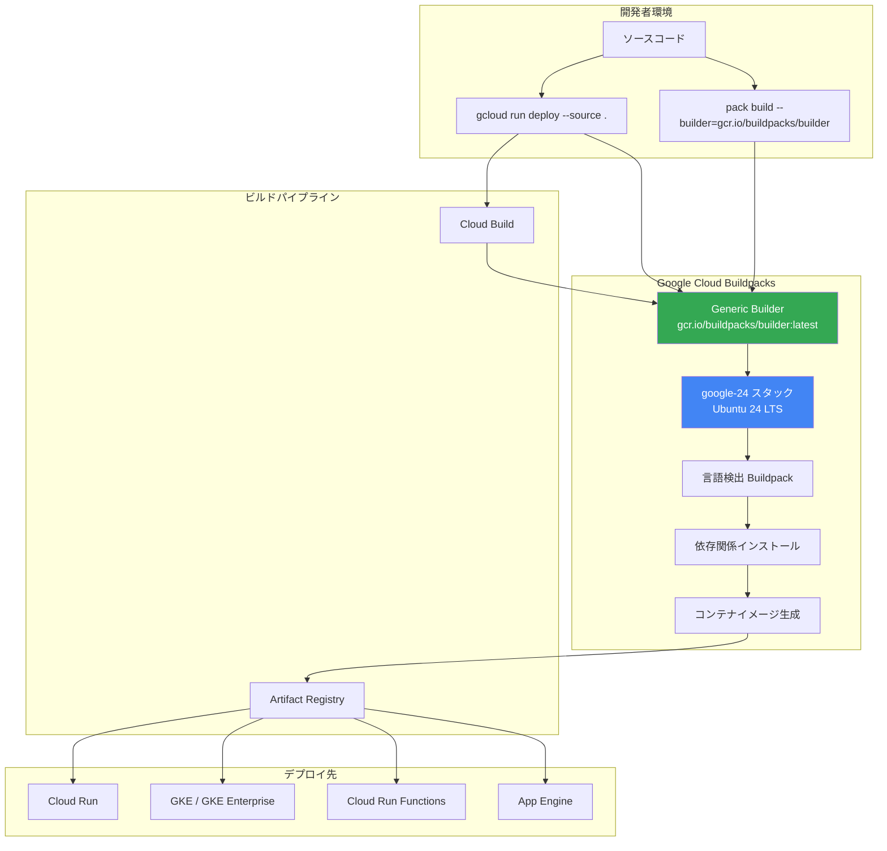

# Buildpacks: Generic Builder が google-24 スタックを使用

**リリース日**: 2026-05-12

**サービス**: Google Cloud Buildpacks

**機能**: Generic Builder の `latest` タグが `google-24` スタックをデフォルトで使用

**ステータス**: GA (一般提供)

[このアップデートのインフォグラフィックを見る](https://takech9203.github.io/google-cloud-news-summary/20260512-buildpacks-generic-builder-google-24.html)

## 概要

Google Cloud Buildpacks の Generic Builder において、`latest` タグが `google-24` スタック（Ubuntu 24 ベース）をデフォルトで使用するようになりました。これにより、`gcloud run deploy` コマンドや `pack build --builder=gcr.io/buildpacks/builder` を実行した際に、自動的に Ubuntu 24 LTS ベースのビルド環境が使用されます。

`google-24` スタックは 2025 年 9 月に初回リリースされ、2026 年 2 月に Cloud Run ソースデプロイメントでの GA を達成しています。今回の変更により、明示的にバージョンを指定しないすべてのユーザーが最新の Ubuntu 24 ベース環境でビルドを行うことになります。

この変更は、セキュリティパッチの適用範囲拡大、最新言語ランタイムのサポート、およびパフォーマンス向上を目的としています。Ubuntu 24 LTS は 2029 年 4 月までサポートされるため、長期的な安定性も確保されます。

**アップデート前の課題**
- `latest` タグは `google-22`（Ubuntu 22）スタックを使用しており、一部の最新言語バージョン（Python 3.14、Java 25、Ruby 4.0、Node.js 24 など）が利用できなかった
- Ubuntu 22 ベースのシステムライブラリやパッケージが古くなりつつあった
- 新しい OS レベルのセキュリティ機能を活用できなかった

**アップデート後の改善**
- `latest` タグが Ubuntu 24 LTS ベースの `google-24` スタックを使用し、最新のシステムパッケージとセキュリティパッチを自動的に適用
- Python 3.14、Node.js 24、Java 25、Ruby 4.0、PHP 8.5、.NET 10、Go 1.x など最新言語ランタイムをサポート
- 2029 年 4 月まで非推奨化されない長期サポート基盤を確保
- `gcloud run deploy --source .` を実行するだけで、特別な設定なしに最新環境を利用可能

## アーキテクチャ図



## サービスアップデートの詳細

### 主要機能

| タグ | イメージ URL | OS |
|------|-------------|-----|
| `latest` | `gcr.io/buildpacks/builder:latest` | Ubuntu 24 (google-24) |
| `google-24` | `gcr.io/buildpacks/builder:google-24` | Ubuntu 24 |
| `google-22` | `gcr.io/buildpacks/builder:google-22` | Ubuntu 22 |
| `v1` | `gcr.io/buildpacks/builder:v1` | Ubuntu 18 (非推奨) |

### google-24 でサポートされるランタイム

| 言語 | サポートバージョン | アプリケーション | Functions |
|------|-------------------|----------------|-----------|
| Python | 3.13.x, 3.14.x | 対応 | 対応 |
| Node.js | 22.x, 24.x | 対応 | 対応 |
| Go | 1.x | 対応 | 対応 |
| Java | 17, 21, 25 | 対応 | 対応 |
| Ruby | 3.2.x, 3.3.x, 3.4.x, 4.0.x | 対応 | 対応 |
| PHP | 8.2.x, 8.3.x, 8.4.x, 8.5.x | 対応 | 対応 |
| .NET | 8.x, 10.x | 対応 | 対応 |
| OS only | - | 対応 | - |

## 技術仕様

- **ベース OS**: Ubuntu 24.04 LTS
- **ビルダーイメージ**: `gcr.io/buildpacks/builder:latest` (= `gcr.io/buildpacks/builder:google-24`)
- **仕様準拠**: Cloud Native Buildpack (CNB) 仕様
- **自動言語検出**: ソースコード内の設定ファイル（package.json、requirements.txt、go.mod など）から言語とバージョンを自動判定
- **非推奨予定日**: 2029 年 4 月
- **サンセット予定日**: 2030 年 4 月

## 設定方法

### Cloud Run ソースデプロイ（デフォルトで google-24 を使用）

```bash
# ソースコードから直接デプロイ（自動的に google-24 を使用）
gcloud run deploy SERVICE_NAME --source .
```

### 特定のビルダーバージョンを明示的に指定

```bash
# pack CLI でローカルビルド
pack build --builder=gcr.io/buildpacks/builder:google-24 IMAGE_NAME

# Cloud Build でリモートビルド
gcloud builds submit --pack builder=gcr.io/buildpacks/builder:google-24,image=REGION-docker.pkg.dev/PROJECT_ID/REPO/IMAGE
```

### project.toml でビルダーを固定

```toml
[build]
builder = "gcr.io/buildpacks/builder:google-24"
```

### 旧バージョンにピン留めする場合

```bash
# google-22 を継続使用する場合
pack build --builder=gcr.io/buildpacks/builder:google-22 IMAGE_NAME
```

## メリット

### ビジネス面
- 最新のセキュリティパッチが自動適用され、コンプライアンス要件への対応が容易になる
- Ubuntu 24 LTS の長期サポート（2029 年 4 月まで）により、安定した運用基盤を確保
- 最新言語ランタイムの利用により、開発者の生産性向上とエコシステムへの追従が可能

### 技術面
- 最新のシステムライブラリとカーネル機能の恩恵を受けられる
- Python 3.14、Node.js 24、Java 25 など最新ランタイムを即座に利用可能
- OS レベルのセキュリティ強化（カーネルハードニング、メモリ保護機能の改善）
- パッケージ依存関係の解決がより高速かつ信頼性の高いものになる

## デメリット・制約事項

- **互換性の問題**: 一部のシステムライブラリのバージョンが変更されるため、Ubuntu 22 固有の動作に依存しているアプリケーションは動作しなくなる可能性がある
- **移行コスト**: `latest` タグを使用していたユーザーは意図せず環境が変更されるため、テストが必要
- **一部ランタイム非対応**: google-22 で利用可能だった古い言語バージョン（Node.js 12-20、Python 3.10-3.12、Java 8/11 など）は google-24 では提供されない
- **回避策**: 互換性問題が発生する場合は `gcr.io/buildpacks/builder:google-22` を明示的に指定することで旧環境を継続利用可能

## ユースケース

1. **新規 Cloud Run サービスのデプロイ**: `gcloud run deploy --source .` を実行するだけで、最新の Ubuntu 24 ベース環境で自動ビルド・デプロイされる
2. **CI/CD パイプラインでのコンテナビルド**: Cloud Build と組み合わせて、最新のセキュリティパッチが適用されたコンテナイメージを自動生成
3. **マルチ言語プロジェクト**: ソースコードの言語を自動検出し、適切なランタイムでビルドするため、Dockerfile の管理が不要
4. **セキュリティ重視のワークロード**: 最新の OS セキュリティ機能とパッチが適用された環境でコンテナを構築

## 料金

Buildpacks 自体の利用に追加料金は発生しません。ただし、以下の関連サービスの利用料金が適用されます：

- **Cloud Build**: ビルド時間に応じた課金（1 日あたり 120 分の無料枠あり）
- **Artifact Registry**: コンテナイメージのストレージ料金
- **Cloud Run / GKE**: デプロイ先サービスの通常料金

## 関連サービス・機能

- **Cloud Run**: ソースデプロイ時に Buildpacks を使用してコンテナイメージを自動生成
- **Cloud Build**: リモートビルドのパイプライン実行基盤
- **Artifact Registry**: 生成されたコンテナイメージの保存先
- **Cloud Run Functions**: Functions のソースコードをコンテナ化する際に使用
- **App Engine（第 2 世代）**: アプリケーションのコンテナ化に Buildpacks を使用
- **GKE / GKE Enterprise**: ビルドされたコンテナイメージのデプロイ先

## 参考リンク

- [インフォグラフィック](https://takech9203.github.io/google-cloud-news-summary/20260512-buildpacks-generic-builder-google-24.html)
- [公式リリースノート](https://cloud.google.com/release-notes#May_12_2026)
- [Buildpacks ビルダー一覧](https://cloud.google.com/docs/buildpacks/builders)
- [特定のビルダーを使用する](https://cloud.google.com/docs/buildpacks/use-a-specific-builder)
- [Buildpacks 概要](https://cloud.google.com/docs/buildpacks/overview)
- [Buildpacks サポートポリシー](https://cloud.google.com/docs/buildpacks/support-policy)
- [Buildpacks リリースノート](https://cloud.google.com/docs/buildpacks/release-notes)
- [Cloud Run ソースデプロイ](https://cloud.google.com/run/docs/deploying-source-code)
- [Cloud Native Buildpacks 仕様](https://buildpacks.io/)

## まとめ

Google Cloud Buildpacks の Generic Builder `latest` タグが `google-24` スタック（Ubuntu 24 LTS）をデフォルトで使用するようになりました。この変更により、`gcloud run deploy --source .` や `pack build` で明示的なバージョン指定なしにビルドを行うすべてのユーザーが、最新の Ubuntu 24 ベースのビルド環境を利用することになります。Python 3.14、Node.js 24、Java 25、Ruby 4.0 など最新の言語ランタイムがサポートされ、セキュリティと長期サポートの観点でも大きな改善です。既存の google-22 環境に依存しているワークロードがある場合は、`gcr.io/buildpacks/builder:google-22` を明示的に指定することで引き続き旧環境を利用できます。

---
**タグ**: #GoogleCloud #Buildpacks #CloudRun #CloudBuild #Ubuntu24 #コンテナ #サーバーレス #CI/CD
