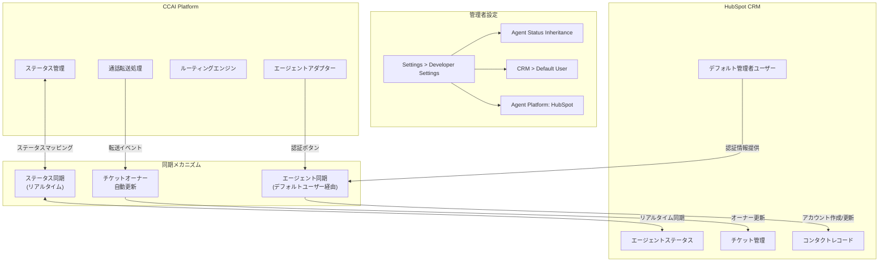

# Google Cloud CCaaS: HubSpot 連携機能の強化（エージェントステータス同期・チケットオーナー自動更新・エージェント同期）

**リリース日**: 2026-05-12

**サービス**: Google Cloud Contact Center as a Service (CCaaS)

**機能**: HubSpot 連携機能の強化（エージェントステータス継承・チケットオーナー自動更新・エージェント同期）

**ステータス**: Feature / Fixed (Multiple)

[このアップデートのインフォグラフィックを見る](https://takech9203.github.io/google-cloud-news-summary/20260512-ccaas-hubspot-integration-features.html)

## 概要

Google Cloud CCaaS（Contact Center AI Platform）において、HubSpot CRM との連携を大幅に強化する 3 つの新機能がリリースされた。エージェントステータスのリアルタイム同期、通話転送時のチケットオーナー自動更新、およびデフォルト管理者ユーザーを使用したエージェント同期の 3 機能が追加され、HubSpot を CRM として利用するコンタクトセンターの運用効率が大幅に向上する。

これらの機能は、CCAI Platform と HubSpot 間のデータ整合性を維持し、管理者の手動作業を削減することを目的としている。特にエージェントステータス継承機能は、既に Kustomer 連携で提供されていた同等機能を HubSpot ユーザーにも拡張するものであり、マルチ CRM 対応の一環として重要な位置づけとなる。

本リリースには上記の新機能に加え、iOS アプリのクラッシュ修正や通話トランスクリプトの文字化け修正など、複数の重要なバグフィックスも含まれている。

**アップデート前の課題**

- HubSpot のエージェントステータスと CCAI Platform のエージェントステータスが独立して管理されており、リアルタイムでの同期ができなかった
- 通話がエージェント間で転送された場合、HubSpot チケットのオーナーが自動更新されず、手動での変更が必要だった
- HubSpot に対応するプロファイルが存在しないエージェントについて、CCAI Platform から HubSpot アカウントの作成・更新ができなかった
- CX Agent Studio 経由の通話トランスクリプトが CRM レコードに文字化けした状態で記録される問題があった

**アップデート後の改善**

- HubSpot エージェントステータスと CCAI Platform ステータスのリアルタイム双方向マッピングが可能になった
- 通話転送時に HubSpot チケットオーナーが自動的に新しいエージェントに更新されるようになった（設定不要）
- デフォルト管理者ユーザーを使用して、HubSpot プロファイルが存在しないエージェントのアカウント作成・レコード更新が可能になった
- 通話トランスクリプトの文字化けや画面フリーズなど複数のバグが修正された

## アーキテクチャ図

CCAI Platform と HubSpot 間の 3 つの連携メカニズム（ステータス同期、チケットオーナー自動更新、エージェント同期）の全体アーキテクチャを示す。管理者は Developer Settings から各機能を設定し、リアルタイムでのデータ同期が実現される。

## サービスアップデートの詳細

### 主要機能

1. **エージェントステータス継承（Agent Status Inheritance for HubSpot）**
   - CCAI Platform と HubSpot 間でエージェントステータスをリアルタイムに同期する機能
   - HubSpot のエージェントステータスを CCAI Platform のステータスにマッピング可能（多対一のマッピングをサポート）
   - 異なるステータス命名規則に対応するため、双方向のカスタムマッピングが可能
   - 管理者は Settings > Developer Settings > Agent Platform で HubSpot を選択後、Agent Status Inheritance ペインから設定
   - 既存の Kustomer 向け同等機能と同様のアーキテクチャで実装されている

2. **通話転送時のチケットオーナー自動更新**
   - HubSpot 連携環境で通話がエージェント間で転送された場合、HubSpot チケットのオーナーが自動的に新しいエージェントに更新される
   - インタラクションのライフサイクル全体を通じて正確なオーナーシップ記録を維持
   - 追加の設定は不要で、HubSpot 連携が有効な環境で自動的に動作する

3. **エージェント同期（Agent Synchronization for HubSpot）**
   - デフォルト管理者ユーザーを使用して CCAI Platform と HubSpot のエージェントを同期する機能
   - HubSpot に対応するプロファイルが見つからないエージェントについても、デフォルト管理者ユーザーを使用してアカウント作成・レコード更新が可能
   - 管理者は Settings > Developer Settings > CRM ペインの新しい Default User セクションで設定
   - エージェント同期が設定されると、エージェントアダプターに新しい Authorize ボタンが表示される

### バグフィックス

本リリースでは以下の問題が修正された：

| 修正内容 | 影響範囲 |
|----------|----------|
| チャット中にタスク仮想アシスタントを起動するとエージェント画面がフリーズする問題 | チャットチャネル |
| CX Agent Studio の通話トランスクリプトが CRM レコードに文字化けして記録される問題 | CRM 連携 |
| Zendesk チケットの Wait Time カスタムフィールドが不正な値を表示する問題 | Zendesk 連携 |
| ダイレクト SMS 回線のエージェントが Unavailable 時に SMS チャットの視覚通知を受信できない問題 | SMS チャネル |
| 完了チャットページからチャットトランスクリプトがダウンロードできない問題 | チャットチャネル |
| DTMF 入力時に決済トランザクション中の顧客通話が予期せず切断される問題 | 音声チャネル・決済 |
| アクティブ通話中に新規通話が割り当てられていないにもかかわらず通話通知音が繰り返し鳴る問題 | 音声チャネル |
| エージェント固有のデフレクション設定時に英語 IVR キューのみが表示される問題 | IVR 設定 |

## 設定方法

### 前提条件

1. CCAI Platform インスタンスが HubSpot 連携用に設定されていること
2. HubSpot Domain ID および API Key が取得済みであること
3. 管理者権限を持つユーザーアカウント

### 手順

#### ステップ 1: Agent Platform の設定

Settings > Developer Settings に移動し、Agent Platform として HubSpot を選択する。

#### ステップ 2: エージェントステータス継承の設定

1. Settings > Developer Settings > Agent Status Inheritance ペインを開く
2. Agent Status Inheritance トグルを On に切り替える
3. Status Mapping セクションで HubSpot ステータスを CCAI Platform ステータスにマッピングする
4. Save をクリックして保存

#### ステップ 3: エージェント同期の設定

1. Settings > Developer Settings > CRM ペインを開く
2. Default User セクションでデフォルト管理者ユーザーを設定する
3. エージェントアダプターに表示される Authorize ボタンで認証を完了する

## メリット

### ビジネス面

- **運用効率の向上**: エージェントステータスの手動同期が不要になり、管理者のオペレーション負荷が大幅に軽減される
- **正確なチケット管理**: 通話転送時のチケットオーナー自動更新により、顧客対応の責任所在が常に正確に記録される
- **オンボーディングの簡素化**: HubSpot プロファイルが未作成のエージェントも即座に CCAI Platform から連携を開始できる

### 技術面

- **リアルタイム同期**: ステータス変更が即座に反映されるため、ルーティング判定の精度が向上する
- **設定不要の自動化**: チケットオーナー更新は追加設定なしで動作し、実装コストがゼロ
- **柔軟なマッピング**: 多対一のステータスマッピングにより、組織固有のステータス体系に柔軟に対応可能

## デメリット・制約事項

### 制限事項

- HubSpot 連携では、ブレンド SMS/MMS メッセージ経由のメディアファイル保存は現時点でサポートされていない
- エージェントステータス同期は HubSpot を Agent Platform として選択している場合のみ利用可能

### 考慮すべき点

- ステータスマッピングの設計には、組織のワークフローに合わせた慎重な検討が必要
- エージェント同期のデフォルト管理者ユーザーには適切な権限設定が求められる
- 既存の HubSpot 連携設定がある場合、新機能有効化前に互換性の確認を推奨

## ユースケース

### ユースケース 1: マルチチャネルコンタクトセンターのステータス統合管理

**シナリオ**: 大規模コンタクトセンターで HubSpot CRM を使用しており、エージェントが HubSpot 側で「メール対応中」に設定した場合、CCAI Platform 側でも自動的に「取り込み中」ステータスに変更し、新規通話の着信を防止したい。

**効果**: エージェントのステータス管理が一元化され、不適切なタイミングでの着信割り当てが防止される。エージェントは CRM 側のステータス変更だけで両プラットフォームの状態が同期されるため、操作負荷が軽減される。

### ユースケース 2: エスカレーション時のチケット追跡

**シナリオ**: 一次対応エージェントが技術的な問題を解決できず、専門チームのエージェントに通話を転送する。転送完了後、HubSpot チケットのオーナーが自動的に新しいエージェントに更新され、対応責任の移行が正確に記録される。

**効果**: チケットオーナーシップの正確な追跡により、SLA 管理やパフォーマンスレポートの精度が向上する。手動でのチケット更新忘れによる管理上の混乱を防止できる。

### ユースケース 3: 新規エージェントの迅速なオンボーディング

**シナリオ**: 繁忙期に臨時エージェントを追加する必要があるが、HubSpot 側のプロファイル作成が間に合わない。デフォルト管理者ユーザーを使用したエージェント同期により、HubSpot プロファイルがなくても CCAI Platform からアカウント作成・レコード更新が可能。

**効果**: エージェントのオンボーディング時間が短縮され、繁忙期の迅速な要員追加が実現する。HubSpot 管理者の作業待ちによるボトルネックが解消される。

## 関連サービス・機能

- **Dialogflow CX**: CCAI Platform 上の仮想エージェント構築基盤。CX Agent Studio 経由のエージェント会話トランスクリプト修正もこのリリースに含まれる
- **Agent Assist**: CCAI Platform のリアルタイムエージェント支援機能。ステータス同期によりエージェントの可用性が正確に把握される
- **HubSpot CRM**: 本リリースの連携先 CRM プラットフォーム。ドメイン ID と API Key による接続が必要
- **Gemini Enterprise for CX**: CCAI Platform を含む Google Cloud のコンタクトセンター AI 製品スイート

## 参考リンク

- [インフォグラフィック](https://takech9203.github.io/google-cloud-news-summary/20260512-ccaas-hubspot-integration-features.html)
- [公式リリースノート](https://cloud.google.com/release-notes#May_12_2026)
- [CCAI Platform HubSpot 連携ドキュメント](https://cloud.google.com/contact-center/ccai-platform/docs/hubspot)
- [CCAI Platform 概要](https://cloud.google.com/contact-center/ccai-platform/docs)

## まとめ

本リリースにより、Google Cloud CCaaS と HubSpot CRM の連携が大幅に強化され、エージェントステータスのリアルタイム同期、チケット管理の自動化、エージェントプロビジョニングの柔軟性向上が実現された。HubSpot を CRM として利用するコンタクトセンターは、管理者設定から各機能を有効化し、ステータスマッピングの設計を行うことで、運用効率の向上とデータ整合性の確保が期待できる。

---

**タグ**: #GoogleCloudCCaaS #ContactCenterAI #HubSpot #CRM連携 #エージェントステータス #コンタクトセンター #バグフィックス
