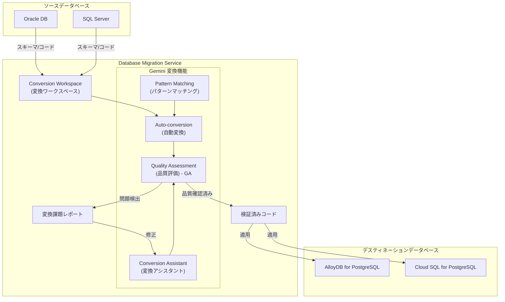

# Cloud Database Migration Service: Gemini を活用した変換品質評価が GA

**リリース日**: 2026-05-12

**サービス**: Cloud Database Migration Service

**機能**: Gemini-powered Conversion Quality Assessments (GA)

**ステータス**: GA (一般提供)

[このアップデートのインフォグラフィックを見る](https://takech9203.github.io/google-cloud-news-summary/20260512-cloud-dms-gemini-conversion-quality-ga.html)

## 概要

Google Cloud Database Migration Service において、異種データベース間のマイグレーションにおける Gemini を活用した変換品質評価機能が一般提供 (GA) となりました。この機能は、Oracle や SQL Server などのソースデータベースから PostgreSQL 互換のデスティネーションデータベースへの移行時に、変換されたコードの品質と機能的等価性を AI が自動的に検証するものです。

Gemini 変換品質評価は、変換されたコードがソースコードと同じ結果を生成するか (機能的等価性) を検証し、変換品質に関する詳細なフィードバックを提供します。問題が見つかった場合は新しい変換課題として自動的に報告されるため、移行の信頼性が大幅に向上します。

本機能は、Gemini Auto-conversion および Conversion Assistant と連携して動作し、異種データベース移行の全体的な変換品質を保証するエンドツーエンドのソリューションを提供します。GA リリースにより、本番環境での利用が SLA によってサポートされ、エンタープライズ規模のデータベース移行プロジェクトで安心して活用できるようになりました。

**アップデート前の課題**

- 異種データベース間の SQL 変換品質を手動でレビュー・検証する必要があり、膨大な時間とエキスパートの労力が必要だった
- 数千オブジェクトを含む大規模データベースの変換において、機能的等価性の保証が困難だった
- 変換されたコードのバグや論理的な差異が移行後まで発見されないリスクがあった
- プレビュー段階では本番ワークロードでの利用に SLA が適用されず、ミッションクリティカルな移行での採用に制約があった

**アップデート後の改善**

- Gemini が変換されたコードの品質と機能的等価性を自動的に評価し、詳細なレポートを生成
- 変換プロセスの一部として自動実行するか、特定のオブジェクトに対して手動で実行するかを選択可能
- 発見された問題は変換課題として自動登録され、修正ワークフローにシームレスに統合
- GA リリースにより SLA が適用され、本番環境のミッションクリティカルな移行で安心して利用可能

## アーキテクチャ図

Database Migration Service の異種マイグレーションにおける Gemini 変換品質評価のフローを示しています。ソースデータベースのスキーマとコードが Conversion Workspace に取り込まれ、Gemini の各機能 (Auto-conversion、Conversion Assistant、Quality Assessment、Pattern Matching) が連携して高品質な変換を実現します。

## サービスアップデートの詳細

### 主要機能

1. **自動品質評価 (Automatic Quality Assessment)**
   - Conversion Workspace の設定で「Conversion quality assessment」チェックボックスを有効にすることで、変換されたオブジェクトに対して自動的に品質評価レポートが作成される
   - Gemini Auto-conversion が有効であることが前提条件
   - 変換プロセスの一部としてバックグラウンドで実行される

2. **手動品質評価 (Manual Quality Assessment)**
   - Gemini Auto-conversion で変換された任意のコードオブジェクトに対して、オンデマンドで品質評価を実行可能
   - Conversion Workspace エディターからオブジェクトを選択し、「Quality assessment report」タブから「Assess the quality of this code」をクリックして実行
   - 「Augmented by Gemini」フィルターを使用して対象オブジェクトを効率的に検索可能

3. **機能的等価性の検証**
   - 変換後の PostgreSQL コードがソースコード (Oracle/SQL Server) と同じ結果を生成するかを検証
   - 変換品質に関する包括的なフィードバックを提供
   - 問題が発見された場合は新しい変換課題として自動的に登録

4. **Gemini 変換機能群との統合**
   - Auto-conversion: 決定論的変換を Gemini が自動的に強化し、手動調整の必要性を削減
   - Conversion Assistant: 変換ロジックの説明、課題の修正提案、コード最適化を支援
   - Pattern Matching: 手動修正のパターンを学習し、他のオブジェクトへの修正を提案

## 技術仕様

### 対応するマイグレーションシナリオ

| ソースデータベース | デスティネーションデータベース |
|------|------|
| Oracle 11g (11.2.0.4), 12c, 18c, 19c, 21c | AlloyDB for PostgreSQL 12-18 |
| SQL Server (Enterprise 2008+, Standard 2016 SP1+) | AlloyDB for PostgreSQL 14-18 |
| SQL Server (Amazon RDS, Azure SQL Managed Instance) | AlloyDB for PostgreSQL 14-18 |
| SQL Server | Cloud SQL for PostgreSQL |

### 品質評価の制限事項

| 項目 | 詳細 |
|------|------|
| 前提条件 | Gemini Auto-conversion が有効であること |
| 対象オブジェクト | Auto-conversion で変換されたコードオブジェクトのみ |
| 非対応オブジェクト | スキーマオブジェクト (テーブル定義等) は非対応 |
| 評価範囲 | 機能的等価性と全体的な品質 (パフォーマンステストは含まない) |

## 設定方法

### 前提条件

1. Google Cloud プロジェクトで Database Migration Service API が有効化されていること
2. Conversion Workspace が作成済みであること
3. Gemini Auto-conversion が有効であること

### 手順

#### ステップ 1: Gemini Auto-conversion の有効化

Google Cloud Console で Conversion Workspace を開き、Gemini パネルから Auto-conversion を有効化します。

1. Google Cloud Console で「Conversion workspaces」に移動し、ワークスペースを選択
2. 「Gemini」アイコンをクリックして Gemini サイドパネルを開く
3. 「Auto-conversion」チェックボックスを選択し、「Save settings」をクリック

#### ステップ 2: 品質評価の自動実行を有効化

同じ Gemini サイドパネルから品質評価を有効化します。

1. Gemini サイドパネルで「Conversion quality assessment」チェックボックスを選択
2. 「Save settings」をクリック
3. ソーススキーマの変換を実行すると、自動的に品質評価レポートが生成される

#### ステップ 3: 手動で品質評価を実行 (オプション)

特定のオブジェクトに対して個別に品質評価を実行する場合:

1. Conversion Workspace エディターでソースパネルからオブジェクトを選択
2. 「Augmented by Gemini」フィルターで Gemini 変換済みオブジェクトを絞り込み
3. 「Conversion details」パネルで「Quality assessment report」タブを選択
4. 「Assess the quality of this code」をクリック

## メリット

### ビジネス面

- **移行リスクの大幅低減**: AI による自動品質検証により、変換エラーが本番環境に到達するリスクを最小化
- **移行プロジェクトの加速**: 手動コードレビューの負荷を削減し、大規模データベースの移行スケジュールを短縮
- **GA による本番利用の信頼性**: SLA が適用されることで、エンタープライズのミッションクリティカルなワークロードでも安心して採用可能
- **専門人材への依存度低減**: Oracle/SQL Server と PostgreSQL の両方に精通したエキスパートが不足している環境でも品質を担保

### 技術面

- **機能的等価性の自動検証**: 変換後のコードがソースと同じビジネスロジックを実行することを体系的に確認
- **変換ワークフローへのシームレスな統合**: Auto-conversion および Conversion Assistant と連携し、検出された問題を即座に修正フローに接続
- **スケーラブルな品質保証**: 数千オブジェクトを含む大規模データベースでも自動的に品質評価を適用可能
- **継続的な品質改善**: Pattern Matching との組み合わせにより、修正パターンが蓄積され品質が向上

## デメリット・制約事項

### 制限事項

- Gemini Auto-conversion で変換されたオブジェクトのみが品質評価の対象 (決定論的変換のみのオブジェクトは非対応)
- スキーマオブジェクト (テーブル定義、インデックス等) は品質評価の対象外
- パフォーマンステストは含まれないため、実行速度の検証は別途必要

### 考慮すべき点

- 品質評価は機能的等価性に焦点を当てているため、パフォーマンス最適化は別途検討が必要
- 大量のオブジェクトに対する自動評価は処理時間がかかる場合がある
- 評価結果は AI による判定であり、重要なオブジェクトについては最終的な人間によるレビューが推奨される

## ユースケース

### ユースケース 1: Oracle から AlloyDB への大規模エンタープライズ移行

**シナリオ**: 金融機関が数千のストアドプロシージャと関数を含む Oracle データベースを AlloyDB for PostgreSQL に移行する。PL/SQL から PL/pgSQL への変換において、ビジネスロジックの等価性を保証する必要がある。

**効果**: Gemini 品質評価により、各ストアドプロシージャが Oracle と同じ計算結果を返すことを自動検証。手動レビューが必要なオブジェクトを優先的に特定でき、移行チームの効率が向上。

### ユースケース 2: SQL Server から Cloud SQL for PostgreSQL へのマルチクラウド統合

**シナリオ**: 製造業企業が Azure SQL Managed Instance 上で稼働する ERP システムのデータベースを Google Cloud に移行。T-SQL の複雑なビジネスロジックが正しく PostgreSQL に変換されることを確認する必要がある。

**効果**: 自動品質評価により変換品質を継続的に監視し、問題のあるオブジェクトを早期に特定。Conversion Assistant と連携して修正提案を受けることで、T-SQL 固有の構文に起因する変換課題を効率的に解決。

### ユースケース 3: 段階的な移行における品質ゲート

**シナリオ**: 小売業企業が Oracle RAC 環境を段階的に AlloyDB に移行。各フェーズで変換されたオブジェクトの品質を確認してから次のフェーズに進むゲートプロセスを確立したい。

**効果**: 各フェーズの完了時に品質評価レポートを実行し、変換品質スコアが基準を満たしていることを確認してから次のフェーズに進行。GA により SLA が保証されるため、このプロセスを本番移行計画に組み込むことが可能。

## 関連サービス・機能

- **AlloyDB for PostgreSQL**: Database Migration Service の主要なデスティネーションデータベース。PostgreSQL 互換の高性能マネージドデータベース
- **Cloud SQL for PostgreSQL**: もう一つのデスティネーションオプション。SQL Server からの移行に対応
- **Gemini for Google Cloud**: Database Migration Service の AI 機能を提供する基盤モデル
- **Database Migration Service Conversion Workspace**: スキーマとコードの変換を行うインタラクティブなエディター環境

## 参考リンク

- [インフォグラフィック](https://takech9203.github.io/google-cloud-news-summary/20260512-cloud-dms-gemini-conversion-quality-ga.html)
- [公式リリースノート](https://cloud.google.com/release-notes#May_12_2026)
- [ドキュメント: Convert SQL with Gemini in Database Migration Service](https://docs.cloud.google.com/database-migration/docs/convert-sql-with-dms)
- [ドキュメント: Oracle to AlloyDB 移行シナリオ](https://docs.cloud.google.com/database-migration/docs/oracle-to-alloydb/scenario-overview)
- [ドキュメント: SQL Server to AlloyDB 移行シナリオ](https://docs.cloud.google.com/database-migration/docs/sqlserver-to-alloydb/scenario-overview)

## まとめ

Database Migration Service の Gemini 変換品質評価機能が GA となったことで、異種データベース移行 (Oracle/SQL Server から PostgreSQL) における変換品質の自動検証が本番レベルで利用可能になりました。この機能は Auto-conversion や Conversion Assistant と組み合わせることで、大規模なデータベース移行プロジェクトの信頼性と効率を大幅に向上させます。Oracle や SQL Server から Google Cloud のマネージド PostgreSQL サービスへの移行を計画している組織は、この機能を活用して移行リスクの低減と品質保証の自動化を実現することを推奨します。

---

**タグ**: #DatabaseMigrationService #Gemini #GA #異種データベース移行 #変換品質評価 #Oracle #SQLServer #PostgreSQL #AlloyDB #CloudSQL
