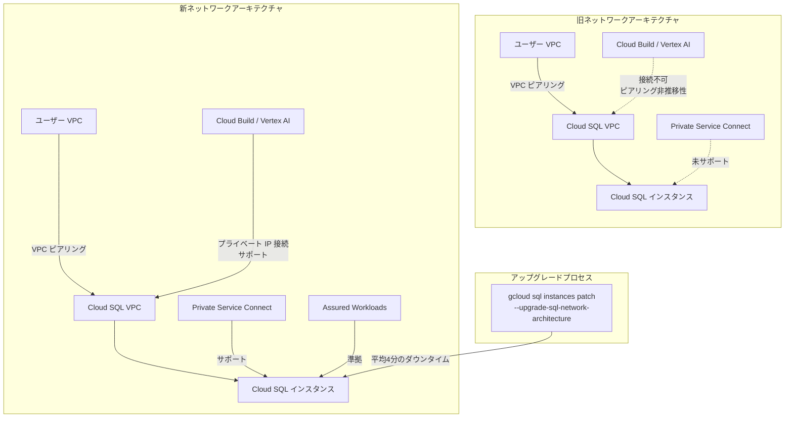

# Cloud SQL: ネットワークアーキテクチャアップグレードコマンド再有効化

**リリース日**: 2026-05-12

**サービス**: Cloud SQL (MySQL, PostgreSQL, SQL Server)

**機能**: ネットワークアーキテクチャアップグレードコマンドの再有効化

**ステータス**: Change (変更)

[このアップデートのインフォグラフィックを見る](https://takech9203.github.io/google-cloud-news-summary/20260512-cloud-sql-network-architecture-upgrade.html)

## 概要

Cloud SQL インスタンスを新しいネットワークアーキテクチャにアップグレードするためのコマンドが再有効化されました。このアップデートは Cloud SQL for MySQL、Cloud SQL for PostgreSQL、Cloud SQL for SQL Server の全エンジンに適用されます。

新しいネットワークアーキテクチャは、2021年8月以降に作成されたプロジェクトではデフォルトで使用されていますが、それ以前に作成されたプロジェクトのインスタンスは旧アーキテクチャを使用している可能性があります。今回の変更により、一時的に無効化されていた `gcloud sql instances patch --upgrade-sql-network-architecture` コマンドが再び利用可能となり、ユーザーは自身のスケジュールでインスタンスのネットワークアーキテクチャを新しいものにアップグレードできるようになりました。

新しいネットワークアーキテクチャへの移行は、Private Service Connect のサポート、Assured Workloads への準拠、プロジェクトあたりのインスタンスクォータの増加（100から1000へ）など、多くの機能的メリットをもたらします。

**アップデート前の課題**
- ネットワークアーキテクチャアップグレードコマンドが一時的に無効化されており、手動でのアップグレードが実行不可能だった
- 旧アーキテクチャのインスタンスでは Private Service Connect が利用できなかった
- VPC ピアリングの非推移性により、Cloud Build や Vertex AI などのプライベートサービスへのプライベート IP 接続が制限されていた
- プロジェクトあたりのインスタンスクォータが100に制限されていた

**アップデート後の改善**
- `gcloud sql instances patch --upgrade-sql-network-architecture` コマンドが再び利用可能
- ユーザーが自身のタイミングでインスタンスを新しいネットワークアーキテクチャに移行可能
- アップグレード完了後、Private Service Connect、Assured Workloads、Knowledge Catalog などの新機能が利用可能に
- プロジェクトあたりのインスタンスクォータが1000に増加

## アーキテクチャ図



## サービスアップデートの詳細

### 主要機能

新しいネットワークアーキテクチャでは以下の機能が利用可能になります：

| 機能 | 旧アーキテクチャ | 新アーキテクチャ |
|------|-----------------|-----------------|
| Database Migration Service による AlloyDB への移行 | プライベート IP 設定が必要 | 追加のネットワーク設定不要 |
| Cloud Build / Vertex AI へのプライベート IP 接続 | 非対応（ピアリング非推移性） | 対応 |
| Assured Workloads 準拠 | 非対応 | 対応 |
| Knowledge Catalog | 非対応 | 対応 |
| Private Service Connect | 非対応 | 対応 |
| プロジェクトあたりのインスタンスクォータ | 100 | 1000 |

### アップグレードの制約事項

- アップグレード中は平均4分のダウンタイムが発生
- データ移行中のソースインスタンスはアップグレード不可
- 同一ネットワーク内に300以上の Cloud SQL インスタンスがある場合はアップグレード不可
- レガシー高可用性（HA）インスタンス（フェイルオーバーレプリカ使用）は非対応
- レプリカは個別にアップグレードが必要（プライマリのアップグレードで自動的にはアップグレードされない）

## 技術仕様

| 項目 | 詳細 |
|------|------|
| 対象サービス | Cloud SQL for MySQL, PostgreSQL, SQL Server |
| アップグレードコマンド | `gcloud sql instances patch INSTANCE_NAME --upgrade-sql-network-architecture` |
| ダウンタイム | 平均4分 |
| アーキテクチャ確認コマンド | `gcloud sql instances describe INSTANCE_NAME` |
| 複数インスタンス確認 | `gcloud sql instances list --show-sql-network-architecture` |
| API メソッド | `instances.patch` または `instances.update` |
| ネットワークアーキテクチャフィールド | `sqlNetworkArchitecture: NEW_NETWORK_ARCHITECTURE` |

## 設定方法

### 1. 現在のネットワークアーキテクチャの確認

```bash
# 単一インスタンスの確認
gcloud sql instances describe INSTANCE_NAME

# プロジェクト内の全インスタンスを確認
gcloud sql instances list --show-sql-network-architecture
```

出力例：
```
NAME              DATABASE_VERSION  LOCATION           SQL_NETWORK_ARCHITECTURE
instance_1        POSTGRES_13       asia-northeast1-b  OLD_NETWORK_ARCHITECTURE
instance_2        MYSQL_5_7         europe-west1-d     NEW_NETWORK_ARCHITECTURE
```

### 2. アップグレード前の確認事項

- VPN 経由の外部接続がある場合、全てのピアリング接続でカスタムルートのエクスポートが有効であることを確認
- サービス境界を使用している場合、共有 VPC ホストプロジェクトが含まれていることを確認
- プライベート IP インスタンスの場合、`import-custom-routes` フラグの設定を確認

### 3. アップグレードの実行

```bash
# インスタンスのネットワークアーキテクチャをアップグレード
gcloud sql instances patch INSTANCE_NAME --upgrade-sql-network-architecture
```

### 4. REST API によるアップグレード

```bash
curl -X PATCH \
  -H "Authorization: Bearer $(gcloud auth print-access-token)" \
  -H "Content-Type: application/json; charset=utf-8" \
  "https://sqladmin.googleapis.com/v1/projects/PROJECT_ID/instances/INSTANCE_NAME"
```

## メリット

### ビジネス面
- **スケーラビリティの向上**: プロジェクトあたりのインスタンスクォータが100から1000に増加し、大規模なデータベース運用が可能に
- **コンプライアンス対応**: Assured Workloads への準拠により、規制産業（金融、医療、政府機関）での利用が容易に
- **移行の簡素化**: AlloyDB への移行時に追加のネットワーク設定が不要となり、移行プロジェクトのコスト削減

### 技術面
- **Private Service Connect サポート**: よりセキュアで柔軟なネットワーク接続が可能
- **VPC 間接続の改善**: ピアリングの非推移性の制約が解消され、Cloud Build や Vertex AI との統合が容易に
- **Knowledge Catalog 対応**: データガバナンスの強化
- **IP アドレス効率化**: PostgreSQL インスタンスで追加の IP アドレスレンジが不要に（新アーキテクチャ）

## デメリット・制約事項

- **ダウンタイムの発生**: アップグレード中は平均4分のダウンタイムが発生するため、メンテナンスウィンドウの計画が必要
- **一方向の変更**: アップグレード後に旧アーキテクチャへのロールバックは不可
- **個別アップグレードが必要**: プロジェクト内の全インスタンスを一括でアップグレードするコマンドは存在せず、各インスタンスを個別にアップグレードする必要がある
- **レプリカの個別対応**: プライマリをアップグレードしてもレプリカは自動的にアップグレードされないため、個別に実施が必要
- **IP アドレスレンジの追加消費**: 同一リージョンにプライベート IP を使用する複数インスタンスがある場合、追加の /24 レンジが必要になる可能性あり
- **レガシー HA 非対応**: フェイルオーバーレプリカを使用するレガシー高可用性構成のインスタンスはアップグレード不可
- **ネットワーク内インスタンス数制限**: 300以上の Cloud SQL インスタンスが同一ネットワークにある場合はアップグレード不可

## ユースケース

### 1. Private Service Connect への移行準備
旧ネットワークアーキテクチャのプロジェクトでは Private Service Connect インスタンスを作成できないため、PSC を利用したい場合は事前に全インスタンスのアップグレードが必要です。

### 2. AlloyDB への段階的移行
Database Migration Service を使用して Cloud SQL から AlloyDB for PostgreSQL への移行を計画している組織は、新アーキテクチャにアップグレードすることで、追加のネットワーク設定なしに移行を実行できます。

### 3. マルチサービス統合環境
Cloud Build、Vertex AI、その他の Google Cloud サービスと Cloud SQL をプライベート IP で接続する必要がある環境では、新アーキテクチャが必須です。

### 4. 大規模データベース環境
100以上のインスタンスを必要とするプロジェクトでは、新アーキテクチャへのアップグレードによりクォータが1000に拡大されます。

## 料金

ネットワークアーキテクチャのアップグレード自体に追加料金は発生しません。Cloud SQL の料金体系（インスタンスの vCPU、メモリ、ストレージ、ネットワーク利用量による課金）は、アーキテクチャの変更により影響を受けません。ただし、Private Service Connect を利用する場合は、別途 Private Service Connect の料金が適用される可能性があります。

## 関連サービス・機能

| サービス | 関連性 |
|----------|--------|
| **VPC (Virtual Private Cloud)** | Cloud SQL のプライベート IP 接続の基盤となるネットワーク |
| **Private Service Connect** | 新アーキテクチャで利用可能になる高度な接続オプション |
| **Private Services Access** | Cloud SQL プライベート IP 接続に使用される VPC ピアリングベースの接続 |
| **Database Migration Service** | AlloyDB への移行が新アーキテクチャで簡素化 |
| **Assured Workloads** | 新アーキテクチャでコンプライアンス準拠が可能に |
| **Knowledge Catalog (Dataplex)** | 新アーキテクチャでデータカタログ統合が可能に |
| **Cloud Build** | 新アーキテクチャでプライベート IP 接続が可能に |
| **Vertex AI** | 新アーキテクチャでプライベート IP 接続が可能に |
| **AlloyDB for PostgreSQL** | 移行先データベースとして新アーキテクチャとの親和性が高い |

## 参考リンク

- [インフォグラフィック](https://takech9203.github.io/google-cloud-news-summary/20260512-cloud-sql-network-architecture-upgrade.html)
- [公式リリースノート](https://cloud.google.com/release-notes#May_12_2026)
- [Upgrade an instance to the new network architecture (MySQL)](https://docs.cloud.google.com/sql/docs/mysql/upgrade-cloud-sql-instance-new-network-architecture)
- [Upgrade an instance to the new network architecture (PostgreSQL)](https://docs.cloud.google.com/sql/docs/postgres/upgrade-cloud-sql-instance-new-network-architecture)
- [Upgrade an instance to the new network architecture (SQL Server)](https://docs.cloud.google.com/sql/docs/sqlserver/upgrade-cloud-sql-instance-new-network-architecture)
- [Cloud SQL Private IP の設定](https://docs.cloud.google.com/sql/docs/mysql/private-ip)
- [Private Service Connect の設定](https://docs.cloud.google.com/sql/docs/mysql/configure-private-service-connect)
- [gcloud sql instances patch リファレンス](https://docs.cloud.google.com/sdk/gcloud/reference/sql/instances/patch)

## まとめ

今回のアップデートにより、Cloud SQL インスタンスの新しいネットワークアーキテクチャへのアップグレードコマンドが再有効化されました。このコマンド（`gcloud sql instances patch --upgrade-sql-network-architecture`）は MySQL、PostgreSQL、SQL Server の全エンジンで利用可能です。新しいネットワークアーキテクチャは Private Service Connect のサポート、Assured Workloads 準拠、インスタンスクォータの10倍増加など、多くのメリットを提供します。2021年8月以前に作成されたプロジェクトを使用している組織は、この機会にアップグレード計画を策定し、段階的に新アーキテクチャへの移行を進めることを推奨します。

---
**タグ**: #CloudSQL #MySQL #PostgreSQL #SQLServer #NetworkArchitecture #PrivateServiceConnect #VPC #ネットワーク #アップグレード #インフラストラクチャ
