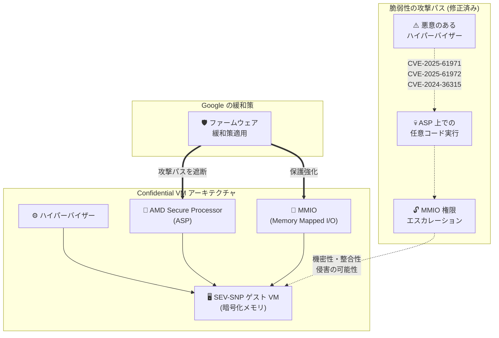

# Compute Engine: AMD SEV-SNP セキュリティ脆弱性対応 (GCP-2026-031)

**リリース日**: 2026-05-12

**サービス**: Compute Engine / Confidential VM

**機能**: AMD SEV-SNP セキュリティ修正

**ステータス**: 対応済み (緩和策適用完了)

:bar_chart: [このアップデートのインフォグラフィックを見る](https://takech9203.github.io/google-cloud-news-summary/20260512-compute-engine-sev-snp-security-gcp-2026-031.html)

## 概要

Google は、AMD ファームウェアに存在する脆弱性 (CVE-2025-61971、CVE-2025-61972、CVE-2024-36315) に対する緩和策を適用したことを発表した。この脆弱性は、保護機能の欠如により悪意のあるハイパーバイザーが AMD Secure Processor (ASP) 上で任意のコードを実行できる可能性があるもので、Memory Mapped I/O (MMIO) の読み書き権限のエスカレーションを許し、AMD SEV-SNP ゲストの機密性と整合性を侵害する恐れがあった。

Google は既に Confidential VM インスタンス (AMD SEV-SNP 対応) に対して緩和策を適用済みであり、ユーザー側での対応は不要である。本脆弱性の深刻度は「Medium」と評価されている。

**アップデート前の課題**

- AMD ファームウェアに保護機能の欠如があり、悪意のあるハイパーバイザーが AMD Secure Processor 上で任意コードを実行できる可能性があった
- MMIO の読み書き権限がエスカレーションされ、SEV-SNP ゲストの機密性と整合性が侵害される恐れがあった
- Confidential VM で保護されているはずのワークロードが、ハイパーバイザーレベルの攻撃に対して潜在的に脆弱であった

**アップデート後の改善**

- Google が緩和策を適用し、上記の攻撃パスを遮断
- AMD SEV-SNP を使用する Confidential VM インスタンスが本脆弱性から保護された状態に
- ユーザー側での対応は不要であり、サービスへの影響なく保護が完了

## アーキテクチャ図

AMD SEV-SNP アーキテクチャにおいて、AMD Secure Processor (ASP) はゲスト VM のメモリ暗号化と整合性保護を担う。本脆弱性では ASP 上での任意コード実行により MMIO 権限のエスカレーションが可能であったが、Google が緩和策を適用し攻撃パスを遮断した。

## サービスアップデートの詳細

### 主要機能

1. **脆弱性の内容**
   - AMD ファームウェアにおける保護機能の欠如
   - 悪意のあるハイパーバイザーが AMD Secure Processor (ASP) 上で任意のコードを実行可能
   - MMIO (Memory Mapped I/O) の読み書き権限のエスカレーションが発生
   - SEV-SNP ゲストの機密性 (Confidentiality) と整合性 (Integrity) が侵害される可能性

2. **対象 CVE**
   - CVE-2025-61971
   - CVE-2025-61972
   - CVE-2024-36315

3. **緩和策の適用**
   - Google が全対象インスタンスに緩和策を自動適用
   - ユーザー側でのアクション不要
   - AMD アドバイザリ AMD-SB-3030 に準拠した対応

## 技術仕様

### 脆弱性の詳細

| 項目 | 詳細 |
|------|------|
| セキュリティ情報 ID | GCP-2026-031 |
| 公開日 | 2026-05-12 |
| 深刻度 | Medium |
| CVE | CVE-2025-61971, CVE-2025-61972, CVE-2024-36315 |
| AMD アドバイザリ | AMD-SB-3030 |
| 影響を受ける技術 | AMD SEV-SNP |
| 影響を受ける構成 | Confidential VM (AMD SEV-SNP 有効) |

### AMD SEV-SNP の保護メカニズム

AMD SEV-SNP (Secure Encrypted Virtualization - Secure Nested Paging) は以下の保護を提供する:

| 保護機能 | 説明 |
|----------|------|
| ハードウェアベースのメモリ暗号化 | VM メモリを暗号化し、使用中のデータを保護 |
| 整合性保護 | データリプレイやメモリリマッピング攻撃を防止 |
| ハードウェアアテステーション | AMD Secure Processor が VCEK で署名したアテステーションレポートを提供 |
| ネステッドページング保護 | ハイパーバイザーによる悪意のあるページテーブル操作を防止 |

### 影響を受ける構成

| マシンタイプ | CPU プラットフォーム | Confidential Computing 技術 |
|-------------|---------------------|---------------------------|
| N2D | AMD EPYC Milan | AMD SEV-SNP |

### 利用可能ゾーン (AMD SEV-SNP)

- asia-southeast1-a, asia-southeast1-b, asia-southeast1-c
- europe-west3-a, europe-west3-b, europe-west3-c
- europe-west4-a, europe-west4-b, europe-west4-c
- us-central1-a, us-central1-b, us-central1-c

## メリット

### セキュリティ面

- **自動緩和**: ユーザー操作なしで全対象インスタンスが保護された
- **継続的保護**: Google のインフラレベルでの対応により、新規・既存インスタンスともに保護
- **透明性**: セキュリティ情報が公開され、対応状況が明確

### 運用面

- **ダウンタイムなし**: ユーザー側での再起動やメンテナンスウィンドウが不要
- **アクション不要**: パッチ適用やイメージ更新などのユーザー操作が不要

## デメリット・制約事項

### 考慮すべき点

- AMD SEV-SNP はハードウェアベースの保護であるため、ファームウェアレベルの脆弱性は根本的なリスクとなり得る
- 今後も同様のファームウェア脆弱性が発見される可能性があるため、セキュリティ情報の継続的な監視が推奨される
- アテステーションレポートの TCB バージョンを定期的に検証することで、緩和策の適用状況を確認可能

## ユースケース

### ユースケース 1: 規制対象ワークロードの保護確認

**シナリオ**: 金融機関が Confidential VM (AMD SEV-SNP) 上で機密データ処理を実行しており、コンプライアンス監査のために保護状態を確認する必要がある。

**効果**: Google が自動で緩和策を適用済みであるため、追加のコンプライアンスアクションは不要。アテステーションレポートの TCB バージョンを確認することで、保護状態を証明可能。

### ユースケース 2: マルチテナント環境でのデータ保護

**シナリオ**: SaaS プロバイダーが複数顧客のデータを Confidential VM 上で処理しており、ハイパーバイザーレベルの攻撃からの保護を保証する必要がある。

**効果**: 本脆弱性の緩和によりハイパーバイザー経由の攻撃パスが遮断され、テナント間のデータ分離が維持される。

## 関連サービス・機能

- **Confidential VM**: AMD SEV-SNP を使用したハードウェアベースのメモリ暗号化を提供するサービス。本脆弱性の直接的な影響対象
- **Confidential Computing**: Confidential VM、Confidential GKE Nodes、Confidential Dataflow などを含む Google Cloud の機密コンピューティングポートフォリオ
- **Cloud Monitoring**: Confidential VM インスタンスの稼働状況やセキュリティイベントの監視
- **Security Command Center**: Google Cloud 環境全体のセキュリティ態勢管理とセキュリティ情報の通知

## 参考リンク

- :bar_chart: [インフォグラフィック](https://takech9203.github.io/google-cloud-news-summary/20260512-compute-engine-sev-snp-security-gcp-2026-031.html)
- [公式リリースノート](https://docs.cloud.google.com/release-notes#May_12_2026)
- [GCP-2026-031 セキュリティ情報](https://cloud.google.com/compute/docs/security-bulletins#gcp-2026-031)
- [Confidential VM セキュリティ情報一覧](https://cloud.google.com/confidential-computing/confidential-vm/docs/security-bulletins)
- [Confidential VM 概要](https://cloud.google.com/confidential-computing/confidential-vm/docs/confidential-vm-overview)
- [AMD SEV-SNP ホワイトペーパー](https://www.amd.com/content/dam/amd/en/documents/epyc-business-docs/white-papers/SEV-SNP-strengthening-vm-isolation-with-integrity-protection-and-more.pdf)
- [AMD セキュリティアドバイザリ AMD-SB-3030](https://www.amd.com/en/resources/product-security/bulletin/amd-sb-3030.html)
- [Confidential VM サポート構成](https://cloud.google.com/confidential-computing/confidential-vm/docs/supported-configurations)

## まとめ

AMD ファームウェアの脆弱性 (CVE-2025-61971、CVE-2025-61972、CVE-2024-36315) に対し、Google が Confidential VM インスタンス (AMD SEV-SNP) への緩和策を既に適用完了した。ユーザー側でのアクションは不要であるが、Confidential VM を使用している組織は本セキュリティ情報を認識し、今後のセキュリティ情報を継続的に監視することが推奨される。

---

**タグ**: #ComputeEngine #ConfidentialVM #SEV-SNP #Security #AMD #脆弱性対応 #GCP-2026-031
