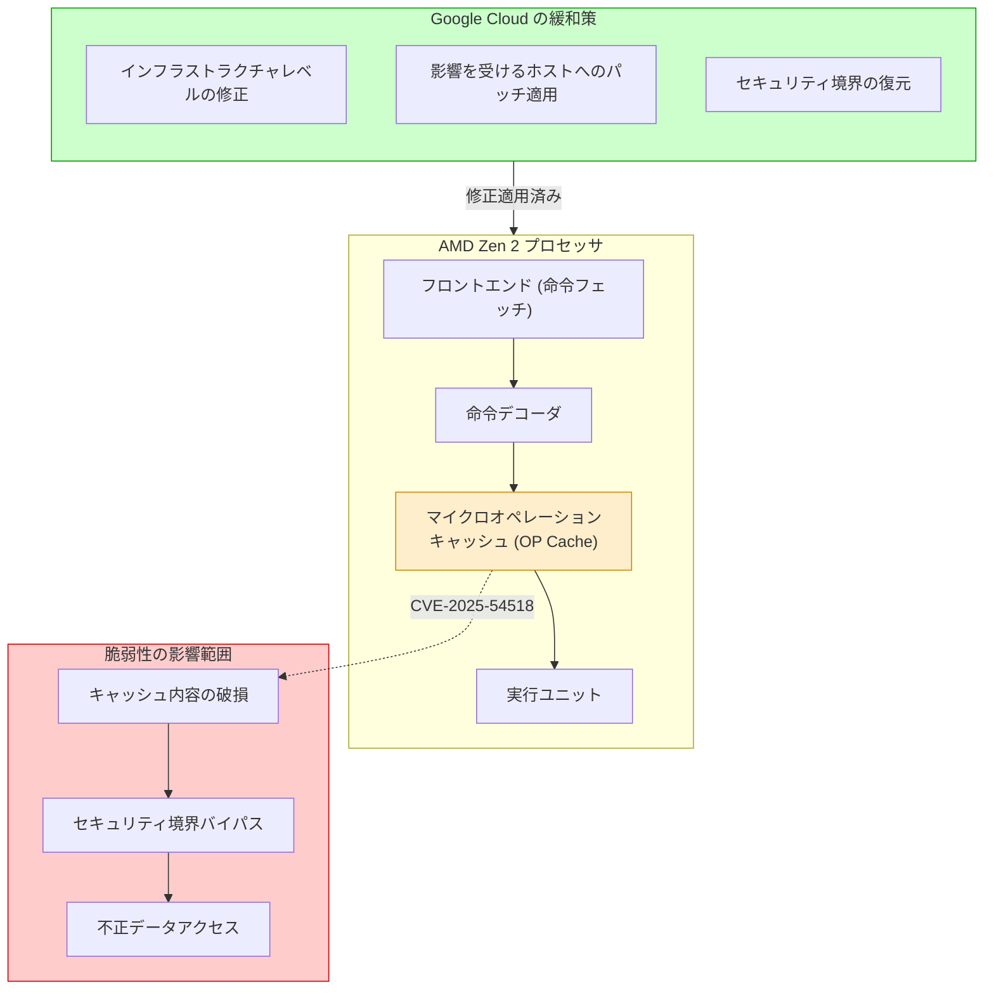

# Compute Engine: AMD Zen 2 マイクロオペレーションキャッシュ脆弱性対応 (GCP-2026-032)

**リリース日**: 2026-05-12

**サービス**: Compute Engine

**機能**: セキュリティ脆弱性修正 (CVE-2025-54518)

**ステータス**: 対応済み (修正適用完了)

📊 [このアップデートのインフォグラフィックを見る](https://takech9203.github.io/google-cloud-news-summary/20260512-compute-engine-zen2-security-gcp-2026-032.html)

## 概要

AMD は、Zen 2 マイクロアーキテクチャプロセッサ (EPYC Rome シリーズおよび Ryzen シリーズを含む) において、マイクロオペレーション (OP) キャッシュ内で潜在的な破損が発生する可能性があるハードウェアレベルの脆弱性を特定しました。この脆弱性は AMD-SN-7052 / CVE-2025-54518 として追跡されており、特定の条件下でセキュリティ境界のバイパスや不正なデータアクセスにつながる可能性があります。

Google は Google Cloud インフラストラクチャ全体にこの問題を軽減するための修正を展開済みです。本セキュリティブレティン GCP-2026-032 は重大度「高 (High)」と評価されており、ユーザー側での追加対応は不要です。マイクロオペレーションキャッシュは CPU の命令デコードパイプラインにおいて性能を向上させるためのキャッシュ機構ですが、この脆弱性により、キャッシュ内容の破損を通じてプロセッサ内部のセキュリティ境界が侵害される可能性がありました。

この脆弱性は、Google Cloud 上で Zen 2 ベースのプロセッサを使用するインスタンス (主に N2D マシンタイプの一部) に影響を与える可能性がありましたが、Google のインフラストラクチャチームが迅速に修正を適用したため、顧客のワークロードへの影響はありません。

**アップデート前の課題**

- Zen 2 マイクロアーキテクチャプロセッサのマイクロオペレーションキャッシュに、特定条件下で破損が発生する脆弱性が存在していた
- この脆弱性を悪用されると、セキュリティ境界のバイパスが可能になる恐れがあった
- 不正なデータアクセスのリスクが存在していた

**アップデート後の改善**

- Google Cloud インフラストラクチャ全体に修正が展開済み
- マイクロオペレーションキャッシュの破損を通じたセキュリティ境界バイパスのリスクが解消された
- 顧客側での追加対応は不要

## アーキテクチャ図

Zen 2 プロセッサのマイクロオペレーションキャッシュにおける脆弱性の影響範囲と、Google Cloud による緩和策の適用を示しています。

## サービスアップデートの詳細

### 主要機能

1. **脆弱性の概要 (CVE-2025-54518)**
   - AMD Zen 2 マイクロアーキテクチャのマイクロオペレーション (OP) キャッシュにおける潜在的な破損の問題
   - AMD セキュリティノート AMD-SN-7052 として公開
   - 重大度: 高 (High)

2. **影響を受けるプロセッサ**
   - AMD EPYC 7002 シリーズ (コードネーム: Rome) - Zen 2 アーキテクチャ
   - AMD Ryzen シリーズ (Zen 2 世代)
   - Google Cloud では主に N2D マシンタイプで使用

3. **Google Cloud での対応**
   - Google インフラストラクチャ全体に修正を展開済み
   - 顧客側でのアクション不要
   - サービスの中断なく修正を適用

## 技術仕様

### 脆弱性の詳細

| 項目 | 詳細 |
|------|------|
| CVE ID | CVE-2025-54518 |
| AMD セキュリティノート | AMD-SN-7052 |
| GCP ブレティン ID | GCP-2026-032 |
| 重大度 | High |
| 影響を受けるアーキテクチャ | AMD Zen 2 (EPYC Rome, Ryzen 3000 シリーズ) |
| 攻撃ベクトル | マイクロオペレーションキャッシュの破損 |
| 潜在的影響 | セキュリティ境界バイパス、不正データアクセス |
| 対応ステータス | Google Cloud インフラストラクチャに修正適用済み |

### マイクロオペレーションキャッシュとは

マイクロオペレーション (OP) キャッシュは、x86 命令をデコードした結果のマイクロオペレーション (uOP) を保持するキャッシュです。CPU のフロントエンドにおいて、既にデコードされた命令を再利用することで、命令デコードステージをバイパスし、パイプラインの効率を向上させる役割を果たします。この脆弱性では、特定の条件下でこのキャッシュの内容が破損し、意図しない動作が発生する可能性がありました。

## メリット

### ビジネス面

- **サービス継続性**: 顧客側でのダウンタイムや対応作業なしに脆弱性が修正された
- **透明性の確保**: セキュリティブレティンを通じて脆弱性情報と対応状況が公開されている
- **コスト影響なし**: インフラストラクチャレベルの修正のため、追加コストは発生しない

### 技術面

- **プロアクティブな対応**: Google のインフラストラクチャチームが事前に修正を展開
- **ハードウェアレベルの保護**: マイクロアーキテクチャの脆弱性に対してインフラストラクチャレベルで対処
- **セキュリティ境界の維持**: マルチテナント環境におけるデータ分離の信頼性を維持

## デメリット・制約事項

### 考慮すべき点

- 修正による性能への影響については、Google から具体的な数値は公開されていない
- マイクロオペレーションキャッシュに対する修正は、一般的に CPU パイプラインの効率にわずかな影響を与える可能性がある
- Zen 2 世代のプロセッサは比較的古い世代であり、新しいマシンタイプへの移行を検討することでリスクを低減できる

## ユースケース

### ユースケース 1: マルチテナント環境でのセキュリティ確保

**シナリオ**: 複数のテナントが同一の物理ホスト上で VM を実行している環境において、あるテナントが脆弱性を悪用して別テナントのデータにアクセスすることを防止する。

**効果**: Google のインフラストラクチャ修正により、マイクロオペレーションキャッシュを通じたテナント間のセキュリティ境界バイパスが防止される。

### ユースケース 2: 機密データ処理ワークロード

**シナリオ**: Zen 2 ベースの N2D インスタンスで機密データを処理しているワークロードにおいて、ハードウェアレベルの脆弱性による情報漏洩リスクが懸念される。

**効果**: インフラストラクチャレベルの修正により、追加のアプリケーション変更なしにセキュリティリスクが軽減される。

## 関連サービス・機能

- **Compute Engine**: 直接影響を受けるサービス。Zen 2 プロセッサを使用する VM インスタンスが対象
- **Confidential VM**: AMD SEV 技術を使用する機密 VM。本脆弱性とは別に GCP-2026-031 で SEV-SNP の脆弱性も同日に対応済み
- **N2D マシンタイプ**: AMD EPYC プロセッサ (Milan/Rome) を使用する汎用マシンシリーズ
- **Cloud Security**: Google Cloud のセキュリティブレティンシステムを通じた脆弱性の通知と対応

## 参考リンク

- 📊 [インフォグラフィック](https://takech9203.github.io/google-cloud-news-summary/20260512-compute-engine-zen2-security-gcp-2026-032.html)
- [公式リリースノート](https://cloud.google.com/release-notes#May_12_2026)
- [Compute Engine セキュリティブレティン](https://docs.cloud.google.com/compute/docs/security-bulletins#gcp-2026-032)
- [Google Cloud セキュリティブレティン](https://docs.cloud.google.com/support/bulletins#gcp-2026-032)
- [CVE-2025-54518](https://www.cve.org/CVERecord?id=CVE-2025-54518)

## まとめ

本アップデートは、AMD Zen 2 マイクロアーキテクチャプロセッサにおけるマイクロオペレーションキャッシュの脆弱性 (CVE-2025-54518) に対する Google Cloud の対応を示すセキュリティブレティンです。重大度「高」と評価されていますが、Google のインフラストラクチャチームが既に修正を展開済みであり、顧客側での追加対応は不要です。Zen 2 ベースのインスタンスを使用している場合は、将来的なリスク低減のために新しい世代のマシンタイプへの移行も検討してください。

---

**タグ**: #ComputeEngine #Security #AMD #Zen2 #CVE-2025-54518 #GCP-2026-032 #MicroOpCache #HardwareSecurity #InfrastructurePatch
