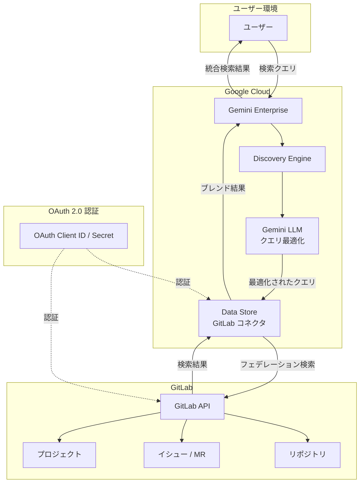

# Gemini Enterprise: GitLab データストア接続 (Preview)

**リリース日**: 2026-05-12

**サービス**: Gemini Enterprise

**機能**: GitLab データストア接続

**ステータス**: Public Preview

[このアップデートのインフォグラフィックを見る](https://takech9203.github.io/google-cloud-news-summary/20260512-gemini-enterprise-gitlab-data-store.html)

## 概要

Gemini Enterprise に GitLab データストアコネクタが Public Preview として追加されました。これにより、企業が GitLab で管理しているソースコードリポジトリやプロジェクト情報を Gemini Enterprise の検索対象として統合できるようになります。

本機能はデータフェデレーション方式を採用しており、GitLab のデータを Google Cloud 側にインジェスト（取り込み）することなく、リアルタイムで GitLab API を通じて検索クエリを実行します。これにより、GitLab 上のデータは元のシステムに保持されたまま、Gemini Enterprise の統合検索体験の中で他のデータソースの結果とブレンドして表示されます。

既に GitHub コネクタが Public Preview で提供されていましたが、今回の GitLab コネクタの追加により、主要なソースコード管理プラットフォームの両方から企業の技術ナレッジを横断検索できるようになりました。

**アップデート前の課題**
- GitLab で管理されているコード・ドキュメント・イシュー等は Gemini Enterprise の検索対象外だった
- 開発者は GitLab と Gemini Enterprise を別々に検索する必要があった
- GitLab に蓄積された技術的知見を企業全体のナレッジ検索に統合する標準的な手段がなかった

**アップデート後の改善**
- GitLab のプロジェクトデータを Gemini Enterprise の統合検索に含められるようになった
- データフェデレーション方式により、データを移動させることなくリアルタイム検索が可能
- 他のデータソース（Confluence、Jira、SharePoint 等）と横断的に検索結果をブレンド表示
- OAuth 2.0 による安全な認証連携でセキュリティを確保

## アーキテクチャ図

## サービスアップデートの詳細

### 主要機能

| 項目 | 内容 |
|------|------|
| コネクタタイプ | サードパーティ データフェデレーション |
| 認証方式 | OAuth 2.0 (Client ID / Client Secret) |
| 検索対象エンティティ | Project |
| サポートリージョン | global, us, eu |
| 暗号化オプション | Google マネージド暗号鍵 / Cloud KMS 鍵 |

### データフェデレーションの仕組み

GitLab コネクタはデータフェデレーション方式を採用しています。

1. ユーザーが Gemini Enterprise で検索クエリを入力
2. LLM がクエリを最適化（セッション履歴を考慮してリライト）
3. 最適化されたクエリが GitLab API に直接送信される
4. GitLab API から返された結果を他のデータソースの結果とブレンド
5. 統合された検索結果をユーザーに表示

## 技術仕様

| 仕様項目 | 詳細 |
|----------|------|
| ステータス | Public Preview |
| 必要な GitLab スコープ | `read_api`（API への読み取りアクセス） |
| 必要な IAM ロール | Discovery Engine Editor (`roles/discoveryengine.editor`) |
| データ保存場所 | GitLab 側に保持（Google Cloud にインジェストしない） |
| 対応リージョン | global, us, eu |
| VPC Service Controls | 既存データストアへの適用は非対応（再作成が必要） |
| CMEK サポート | us / eu リージョンで Cloud KMS 鍵を利用可能 |

## 設定方法

### 前提条件

1. **IAM 権限の付与**: Discovery Engine Editor ロール (`roles/discoveryengine.editor`) をユーザーに付与
2. **GitLab アプリの作成**: GitLab 上で OAuth アプリケーションを作成し、Client ID と Client Secret を取得
3. **スコープの設定**: OAuth 設定で `read_api` スコープを選択

### データストア作成手順

1. Google Cloud コンソールで Gemini Enterprise ページに移動
2. ナビゲーションメニューから「Data stores」をクリック
3. 「Create data store」をクリック
4. Source セクションで「GitLab」を検索し選択
5. Authentication settings で以下を入力:
   - **Client ID**: OAuth クライアント ID
   - **Client Secret**: OAuth クライアントシークレット
6. GitLab へのサインインと認証を完了
7. Destinations セクションで GitLab インスタンス URL を入力
8. Advanced options で組織名（Owner login）を入力
9. Entities to search で「Project」を選択
10. Configuration セクションでマルチリージョンとコネクタ名を設定
11. 暗号化設定（us / eu の場合）を選択
12. Billing セクションで料金プランを選択
13. 「Create」をクリック

データストアのステータスが「Creating」から「Active」に変わると利用可能になります。

## メリット

### ビジネス面

- **技術ナレッジの統合検索**: 開発チームの知見を全社的な検索基盤に統合し、組織横断のナレッジ共有を促進
- **生産性向上**: 複数ツールを横断して検索する手間を削減し、必要な情報への到達時間を短縮
- **既存投資の活用**: GitLab への既存投資を活かしつつ、AI 搭載の企業検索基盤に統合

### 技術面

- **データフェデレーション**: データ移動不要でセキュリティリスクを最小化
- **OAuth 2.0 認証**: 標準的な認証プロトコルによる安全な接続
- **CMEK サポート**: 顧客管理暗号鍵による追加のデータ保護
- **LLM によるクエリ最適化**: 検索精度の向上

## デメリット・制約事項

- **Public Preview**: 本番環境での利用には注意が必要。SLA 対象外であり、サポートが限定的な場合がある
- **リージョン制限**: global、us、eu のみ対応。アジア太平洋リージョンでの単独利用は不可
- **VPC Service Controls の制限**: 既存のデータストアに VPC Service Controls を後から適用する場合、データストアの削除と再作成が必要
- **データストア単一タイプ推奨**: 1つのアプリまたはデータストアには単一のコネクタタイプのみを関連付けることが推奨される
- **クエリ履歴の共有**: LLM によるクエリリライト時にセッション履歴の一部が GitLab API に送信される可能性がある
- **検索エンティティの制限**: 現時点では「Project」エンティティのみが検索対象

## ユースケース

### 1. 開発チームのナレッジ統合検索
GitLab のリポジトリ、イシュー、マージリクエストの情報を Confluence や Jira のデータと合わせて横断検索し、プロジェクトに関連する全情報を一元的に取得する。

### 2. コードベースの技術調査
特定の技術スタックや実装パターンについて、社内の GitLab リポジトリから関連コードや設計ドキュメントを検索し、既存の実装を参照しながら新規開発を進める。

### 3. オンボーディング支援
新規メンバーが Gemini Enterprise を通じて GitLab 上のプロジェクト構造やドキュメントを効率的に検索し、プロジェクトへの理解を加速する。

### 4. インシデント対応
障害発生時に関連するコード変更やイシューを GitLab から迅速に検索し、他のデータソース（監視ツール、ドキュメント等）の情報と組み合わせて原因調査を行う。

## 料金

GitLab データストアコネクタの利用には Gemini Enterprise のサブスクリプションが必要です。

- **サブスクリプション形態**: 月額または年額のサブスクリプション（自動更新設定可能）
- **エディション**: Standard、Plus、Frontline、Business の各エディションで利用可能（Business は一部コネクタのみ）
- **データストア料金**: データストア作成時に「General pricing」または「Configurable pricing」を選択

具体的な料金については、Google Cloud の営業担当または公式料金ページを参照してください。

## 関連サービス・機能

| サービス | 関連性 |
|----------|--------|
| Gemini Enterprise GitHub コネクタ | 同様のソースコード管理プラットフォーム向けコネクタ（Public Preview） |
| Gemini Enterprise Confluence コネクタ | ドキュメント管理ツール向けコネクタ（GA） |
| Gemini Enterprise Jira コネクタ | プロジェクト管理ツール向けコネクタ（GA） |
| Cloud Source Repositories | Google Cloud ネイティブのソースコード管理 |
| Discovery Engine | Gemini Enterprise の検索基盤エンジン |
| VPC Service Controls | ネットワークセキュリティ境界の制御 |
| Cloud KMS | 顧客管理暗号鍵によるデータ保護 |

## 参考リンク

- [インフォグラフィック](https://takech9203.github.io/google-cloud-news-summary/20260512-gemini-enterprise-gitlab-data-store.html)
- [公式リリースノート](https://cloud.google.com/release-notes#May_12_2026)
- [Connect GitLab - 公式ドキュメント](https://docs.cloud.google.com/gemini/enterprise/docs/connectors/gitlab)
- [Set up a GitLab data store](https://docs.cloud.google.com/gemini/enterprise/docs/connectors/gitlab/set-up-data-store)
- [Connect a third-party data source](https://docs.cloud.google.com/gemini/enterprise/docs/connectors/connect-third-party-data-source)
- [Gemini Enterprise エディション比較](https://docs.cloud.google.com/gemini/enterprise/docs/editions)
- [Gemini Enterprise ライセンス管理](https://docs.cloud.google.com/gemini/enterprise/docs/licenses)

## まとめ

Gemini Enterprise に GitLab データストアコネクタが Public Preview として追加されたことで、GitLab を利用する企業は自社の技術ナレッジを Gemini Enterprise の AI 搭載統合検索基盤に組み込めるようになりました。データフェデレーション方式の採用により、GitLab 上のデータを移動させることなく、OAuth 2.0 による安全な認証を通じてリアルタイムに検索できます。既に GA となっている GitHub、Confluence、Jira 等のコネクタと組み合わせることで、開発チームの情報源を網羅的にカバーする企業検索環境の構築が可能です。ただし、Public Preview 段階であるため、本番環境への導入は制約事項を十分に確認した上で検討することを推奨します。

---

**タグ**: #GeminiEnterprise #GitLab #DataStore #コネクタ #フェデレーション検索 #PublicPreview #OAuth #エンタープライズ検索
