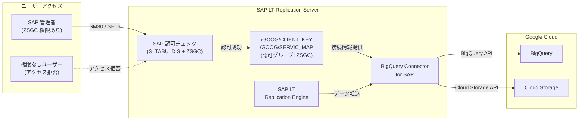

# SAP on Google Cloud: BigQuery Connector for SAP バージョン 2.14 が GA

**リリース日**: 2026-05-12

**サービス**: SAP on Google Cloud

**機能**: BigQuery Connector for SAP v2.14 - 構成テーブルのセキュリティ強化

**ステータス**: GA (一般提供)

[このアップデートのインフォグラフィックを見る](https://takech9203.github.io/google-cloud-news-summary/20260512-sap-bigquery-connector-v2-14.html)

## 概要

BigQuery Connector for SAP のバージョン 2.14 が一般提供 (GA) されました。本バージョンでは、セキュリティファーストのアプローチに基づき、コネクタの構成テーブル `/GOOG/CLIENT_KEY` および `/GOOG/SERVIC_MAP` にカスタム認可グループ `ZSGC` が割り当てられるようになりました。

この変更により、BigQuery Connector for SAP の接続設定やサービスマッピング情報など、機密性の高い構成データへのアクセスが SAP 標準の認可メカニズムによって保護されます。アップグレード後にこれらのテーブルへのアクセスを維持するためには、既存のユーザーロールに `ZSGC` 認可グループの権限を付与する必要があります。

本アップデートの対象ユーザーは、SAP LT Replication Server を使用して SAP システムから BigQuery または Cloud Storage へのデータレプリケーションを運用している SAP Basis 管理者およびセキュリティ管理者です。

**アップデート前の課題**

- 構成テーブル `/GOOG/CLIENT_KEY` と `/GOOG/SERVIC_MAP` に専用の認可グループが設定されておらず、テーブルレベルでのアクセス制御が限定的だった
- 認証情報や接続先エンドポイントなどの機密情報を含む構成テーブルへのアクセス制御を、テーブル固有の認可グループで細かく管理することが困難だった
- SAP 標準の `S_TABU_DIS` 認可オブジェクトによるテーブルグループベースのアクセス制御が構成テーブルに適用されていなかった

**アップデート後の改善**

- 構成テーブルがカスタム認可グループ `ZSGC` に割り当てられ、SAP 標準の認可メカニズムによるアクセス制御が可能になった
- `S_TABU_DIS` 認可オブジェクトを使用して、構成テーブルへのアクセスをロールベースで厳密に管理できるようになった
- セキュリティファーストのアプローチにより、意図しないユーザーによる構成データの閲覧・変更リスクが低減された

## アーキテクチャ図

この図は、バージョン 2.14 で導入された認可グループ `ZSGC` による構成テーブルのアクセス制御フローを示しています。管理者が構成テーブルにアクセスする際、SAP の認可チェック (`S_TABU_DIS`) により `ZSGC` グループへの権限が検証されます。

## サービスアップデートの詳細

### 主要機能

1. **構成テーブルへの認可グループ割り当て**
   - 構成テーブル `/GOOG/CLIENT_KEY` と `/GOOG/SERVIC_MAP` にカスタム認可グループ `ZSGC` が割り当てられた
   - `/GOOG/CLIENT_KEY`: Google Cloud への接続に必要なクライアントキー情報 (サービスアカウント、プロジェクト ID、認証方式など) を格納するテーブル
   - `/GOOG/SERVIC_MAP`: Google Cloud API への RFC 接続先マッピング情報を格納するテーブル

2. **SAP 標準認可メカニズムとの統合**
   - SAP の `S_TABU_DIS` 認可オブジェクトと連携し、テーブルグループベースのアクセス制御を実現
   - 既存の SAP セキュリティポリシーやロール管理フレームワークとシームレスに統合可能

3. **セキュリティファーストアプローチの採用**
   - デフォルトで構成テーブルが保護される設計に変更
   - 明示的に `ZSGC` 認可グループへのアクセスを付与しない限り、テーブルの閲覧・変更が不可

## 技術仕様

### 対象テーブルと認可グループ

| 項目 | 詳細 |
|------|------|
| 対象テーブル 1 | `/GOOG/CLIENT_KEY` (クライアントキー設定) |
| 対象テーブル 2 | `/GOOG/SERVIC_MAP` (サービスマッピング設定) |
| 認可グループ | `ZSGC` |
| 認可オブジェクト | `S_TABU_DIS` |
| アクティビティ | 02 (変更) / 03 (表示) |

### 関連するカスタムトランザクション

| トランザクション | 用途 |
|------|------|
| `/GOOG/SLT_SETTINGS` | BigQuery Connector 設定管理 |
| `/GOOG/REPLIC_VALID` | レプリケーション検証 |
| `/GOOG/SLT_SETT_DISP` | 設定の読み取り専用表示 |
| `/GOOG/LOAD_SIMULATE` | 負荷シミュレーションツール |

## 設定方法

### 前提条件

1. BigQuery Connector for SAP がバージョン 2.14 にアップグレード済みであること
2. SAP トランザクション `PFCG` へのアクセス権限を持つ SAP Basis 管理者であること
3. 既存のユーザーロール構成を把握していること

### 手順

#### ステップ 1: 認可グループ ZSGC のロールへの割り当て

SAP トランザクション `PFCG` を使用して、BigQuery Connector for SAP を利用するユーザーロールに `ZSGC` 認可グループへのアクセス権を追加します。

1. トランザクション `PFCG` で対象ロールを開く
2. 「認可」タブを選択
3. 認可オブジェクト `S_TABU_DIS` に以下を設定:
   - アクティビティ: `02` (変更) または `03` (表示)
   - 認可グループ: `ZSGC`

#### ステップ 2: ロールプロファイルの生成と割り当て

1. ロールプロファイルを生成する
2. 対象ユーザーにロールを割り当てる
3. ユーザーの権限バッファをリフレッシュする (トランザクション `SU56` で確認可能)

#### ステップ 3: アクセス確認

1. 対象ユーザーでログインし、トランザクション `SM30` から `/GOOG/CLIENT_KEY` テーブルにアクセスできることを確認
2. 同様に `/GOOG/SERVIC_MAP` テーブルへのアクセスを確認

## メリット

### ビジネス面

- **コンプライアンス強化**: 構成データへのアクセス制御が強化されることで、監査要件やセキュリティポリシーへの準拠が容易になる
- **運用リスクの低減**: 意図しないユーザーによる構成変更を防止し、データレプリケーション環境の安定性を向上

### 技術面

- **きめ細かいアクセス制御**: SAP 標準の認可メカニズムを活用し、構成テーブルへのアクセスをロール単位で管理可能
- **既存セキュリティ基盤との統合**: SAP の `S_TABU_DIS` 認可オブジェクトを利用するため、既存のセキュリティ運用フローに自然に統合できる

## デメリット・制約事項

### 制限事項

- アップグレード後、`ZSGC` 認可グループがユーザーロールに設定されていない場合、構成テーブルへのアクセスが即座にブロックされる
- 認可グループの変更は SAP のテーブル認可メカニズムに依存するため、カスタマイズの柔軟性は SAP 標準の制約に従う

### 考慮すべき点

- バージョン 2.14 へのアップグレード前に、現在構成テーブルにアクセスしている全ユーザーロールを特定し、事前に `ZSGC` 認可グループを付与する計画を立てる必要がある
- アップグレード直後にアクセス不能になることを避けるため、変更管理プロセスに沿った計画的なロールアウトが推奨される
- 本番環境でのアップグレード前に、開発環境またはテスト環境で認可設定の動作確認を行うことを推奨

## ユースケース

### ユースケース 1: マルチチームでの SAP-BigQuery 連携管理

**シナリオ**: 大規模な SAP 環境で、複数のチーム (データエンジニアリングチーム、SAP Basis チーム、セキュリティチーム) が BigQuery Connector for SAP を運用している。各チームのアクセス範囲を適切に制限したい。

**効果**: `ZSGC` 認可グループにより、構成テーブルの閲覧・変更権限を必要なチームメンバーのみに限定でき、最小権限の原則に従ったアクセス管理が実現される。

### ユースケース 2: セキュリティ監査対応

**シナリオ**: 定期的なセキュリティ監査において、Google Cloud への接続情報 (サービスアカウント、エンドポイント情報) を含む構成テーブルへのアクセス制御の証跡を求められている。

**効果**: SAP 標準の認可ログ (`SM20` / Security Audit Log) を通じて、`ZSGC` 認可グループによるアクセス制御の監査証跡を提供でき、コンプライアンス要件を満たすことが可能になる。

## 関連サービス・機能

- **BigQuery**: SAP からのデータレプリケーション先として、高パフォーマンスな分析基盤を提供
- **Cloud Storage**: ファイルベースレプリケーションのターゲットとして、SAP データを JSON ファイルとして格納
- **SAP LT Replication Server**: BigQuery Connector for SAP のホスト環境。変更データキャプチャ (CDC) 機能を提供
- **Cloud Interconnect / Cloud VPN**: オンプレミス SAP システムと Google Cloud 間の安全なネットワーク接続を提供

## 参考リンク

- [インフォグラフィック](https://takech9203.github.io/google-cloud-news-summary/20260512-sap-bigquery-connector-v2-14.html)
- [公式リリースノート](https://docs.cloud.google.com/release-notes#May_12_2026)
- [What's new with BigQuery Connector for SAP](https://docs.cloud.google.com/sap/docs/bq-connector/whats-new#version-2-14)
- [構成テーブルの認可管理ドキュメント](https://docs.cloud.google.com/sap/docs/bq-connector/latest/config-with-bq-streaming-api#manage-authorizations-config-tables)
- [BigQuery Connector for SAP 概要](https://docs.cloud.google.com/sap/docs/bq-connector/latest/overview)
- [インストールガイド](https://docs.cloud.google.com/sap/docs/bq-connector/latest/install)

## まとめ

BigQuery Connector for SAP バージョン 2.14 は、セキュリティファーストのアプローチに基づき、構成テーブルのアクセス制御を強化する重要なアップデートです。アップグレードを計画する際は、事前に既存ユーザーロールの認可設定を確認し、`ZSGC` 認可グループの付与を忘れずに実施してください。本番環境への適用前に、テスト環境での動作確認を強く推奨します。

---

**タグ**: #SAP #BigQuery #BigQueryConnectorForSAP #Security #Authorization #GA #DataReplication #SAPonGoogleCloud
