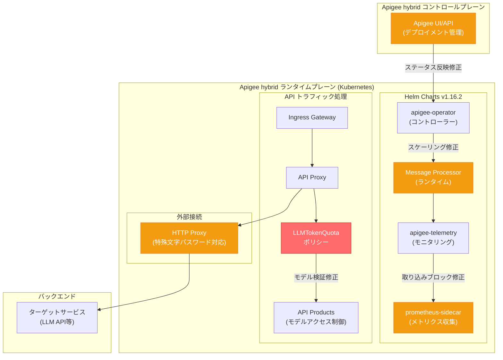

# Apigee hybrid: v1.16.2 パッチリリース

**リリース日**: 2026-05-13

**サービス**: Apigee hybrid

**機能**: v1.16.2 パッチリリース (バグ修正・セキュリティ修正)

**ステータス**: Announcement / Fixed / Security

[このアップデートのインフォグラフィックを見る](https://takech9203.github.io/google-cloud-news-summary/20260513-apigee-hybrid-v1-16-2.html)

## 概要

2026年5月13日、Apigee hybrid ソフトウェアの更新バージョン v1.16.2 がリリースされた。これはパッチリリースであり、5件の重要なバグ修正と複数のセキュリティ/CVE修正が含まれている。

特に注目すべきは、LLMTokenQuota オペレーションにおけるモデルベースのアクセス制限が正しく適用されていなかった問題の修正である。この問題により、API プロダクトに登録されていないモデルへのリクエストがオペレーションチェックをバイパスできる状態にあった。LLM API のアクセス制御を行っている環境では、セキュリティ上の重要な修正となる。

コンテナイメージは Apigee hybrid Helm チャートに統合されているため、Helm チャートを通じたアップグレードにより自動的にイメージが更新される。手動でのイメージ変更は通常不要である。

**アップデート前の課題**

- LLMTokenQuota オペレーションを持つ API プロダクトで、モデルベースのアクセス制限が適用されず、未登録モデルへのリクエストがバイパス可能だった
- プロキシデプロイメント後、Apigee UI および API でデプロイメントステータスの反映に10分以上の遅延が報告されていた
- Apigee hybrid 1.16.0-hotfix-1 環境において、HTTP プロキシパスワードに特殊文字が含まれる場合にランタイムが処理できなかった
- Message Processor (MP) の過剰なスケールアップが発生し、適切にスケールダウンできない問題があった
- Apigee hybrid 1.16.1 の apigee-stackdriver-prometheus-sidecar でデータ取り込みがブロックされる問題があった

**アップデート後の改善**

- LLMTokenQuota オペレーションのモデルベースアクセス制限が正しく適用され、未登録モデルへの不正アクセスが防止される
- プロキシデプロイメント後のステータス反映が正常なタイミングで行われるようになった
- HTTP プロキシパスワードの特殊文字が正しくハンドリングされ、プロキシ経由の通信が安定した
- Message Processor のオートスケーリングが適切に動作し、リソースの無駄遣いが解消された
- テレメトリデータの取り込みが正常に行われるようになった

## アーキテクチャ図



赤色のコンポーネントはセキュリティ修正、オレンジ色のコンポーネントはバグ修正が適用された箇所を示す。v1.16.2 パッチはランタイム、テレメトリ、コントロールプレーン連携の各レイヤーに修正が及んでいる。

## サービスアップデートの詳細

### バグ修正

1. **Bug 485738013: LLMTokenQuota モデルアクセス制限のバイパス修正**
   - LLMTokenQuota オペレーションを設定した API プロダクトにおいて、モデルベースのアクセス制限が正しく適用されていなかった
   - API プロダクトに登録されていないモデルへのリクエストがオペレーションチェックをバイパスし、アクセスが許可されていた
   - この修正により、LLM Operations で指定されたモデルのみがアクセス可能となり、意図しないモデルへのアクセスが正しくブロックされる
   - **セキュリティ影響**: AI/LLM API のアクセス制御に依存している環境では、未承認モデルへのアクセスが可能だったため、早急なアップグレードを推奨

2. **Bug 479288727: デプロイメントステータス反映遅延の修正**
   - プロキシデプロイメント実行後、Apigee UI および API でデプロイメントステータスの表示に10分以上の遅延が発生していた
   - オペレーション担当者がデプロイメントの成否を即座に確認できず、運用効率に影響していた
   - 修正後はデプロイメントステータスがリアルタイムに近い形で反映される

3. **Bug 499223890: HTTP プロキシパスワード特殊文字対応**
   - Apigee hybrid 1.16.0-hotfix-1 の構成で、HTTP プロキシのパスワードに特殊文字 (例: `@`, `#`, `%` など) が含まれる場合にランタイムが正常に処理できなかった
   - エンタープライズ環境でプロキシサーバー経由の外部通信を行う際に問題となっていた
   - パスワードエンコーディングの処理が修正され、特殊文字を含むパスワードが正しくハンドリングされるようになった

4. **Bug 500861814: Message Processor のオートスケーリング異常修正**
   - Message Processor (MP) が過剰にスケールアップされ、トラフィック減少後も適切にスケールダウンしない問題があった
   - 不要な MP Pod が残留することでクラスターリソースが無駄に消費されていた
   - Apigee hybrid の MP は `targetCPUUtilizationPercentage` (デフォルト75%) に基づく HPA でスケーリングされるが、このスケーリングロジックの不具合が修正された

5. **Bug 510438578: Prometheus サイドカーの取り込みブロック修正**
   - Apigee hybrid 1.16.1 の apigee-stackdriver-prometheus-sidecar でデータ取り込み (ingestion) がブロックされる問題があった
   - テレメトリデータ (メトリクス) が Cloud Monitoring に送信されず、モニタリングに空白期間が発生していた
   - 修正によりメトリクスの継続的な収集・送信が復旧した

### セキュリティ修正

本リリースには、上記の LLMTokenQuota アクセス制限修正に加え、複数のセキュリティおよび CVE 修正が含まれている。

## 技術仕様

### LLMTokenQuota とモデルアクセス制御の仕組み

LLMTokenQuota は Apigee の API プロダクトに設定される LLM Operations の一部で、以下の仕組みでモデルアクセスを制御する:

| 項目 | 詳細 |
|------|------|
| LLM Operations | API プロダクトに設定。プロキシ、パス、許可モデル、HTTP メソッド、トークンクォータを定義 |
| モデルアクセス制御 | LLM Operations で指定されたモデルのみがアクセス許可される |
| トークンクォータ | 分/時/日/月単位でトークン消費量を制限 |
| 認証連携 | VerifyAPIKey または VerifyAccessToken ポリシーと組み合わせて使用 |
| SSE 対応 | EventFlow 内で LLMTokenQuota カウントポリシーを実行可能 |

### Message Processor スケーリング設定

| パラメータ | デフォルト値 | 説明 |
|-----------|-------------|------|
| `runtime.replicaCountMin` | 1 | オートスケーリングの最小レプリカ数 |
| `runtime.replicaCountMax` | (環境依存) | オートスケーリングの最大レプリカ数 |
| `runtime.targetCPUUtilizationPercentage` | 75 | スケールアップのCPU使用率閾値 |
| `runtime.resources.requests.cpu` | 500m | 推奨上限: 2000m (スムーズなスケーリングのため) |
| `runtime.resources.requests.memory` | 512Mi | 本番環境では1Gi以上推奨、スケーリングには2.5Gi以下推奨 |

## 設定方法

### 前提条件

1. 既存の Apigee hybrid 環境が v1.15.x 以上で稼働していること
2. Helm v3.14.2 以上がインストールされていること
3. 対応する Kubernetes バージョンが稼働していること (GKE: 1.31.x - 1.33.x)

### 手順

#### ステップ 1: Helm チャートの取得

```bash
export CHART_REPO=oci://us-docker.pkg.dev/apigee-release/apigee-hybrid-helm-charts
export CHART_VERSION=1.16.2

helm pull $CHART_REPO/apigee-operator --version $CHART_VERSION --untar
helm pull $CHART_REPO/apigee-datastore --version $CHART_VERSION --untar
helm pull $CHART_REPO/apigee-env --version $CHART_VERSION --untar
helm pull $CHART_REPO/apigee-ingress-manager --version $CHART_VERSION --untar
helm pull $CHART_REPO/apigee-org --version $CHART_VERSION --untar
helm pull $CHART_REPO/apigee-redis --version $CHART_VERSION --untar
helm pull $CHART_REPO/apigee-telemetry --version $CHART_VERSION --untar
helm pull $CHART_REPO/apigee-virtualhost --version $CHART_VERSION --untar
```

#### ステップ 2: CRD の更新

```bash
kubectl apply -k apigee-operator/etc/crds/default/ \
  --server-side \
  --force-conflicts \
  --validate=false
```

#### ステップ 3: Apigee Operator のアップグレード

```bash
helm upgrade operator apigee-operator/ \
  --install \
  --namespace APIGEE_NAMESPACE \
  -f OVERRIDES_FILE
```

#### ステップ 4: 各コンポーネントのアップグレード

以下の順序でアップグレードを実行する:

1. apigee-datastore
2. apigee-telemetry
3. apigee-redis
4. apigee-ingress-manager
5. apigee-org
6. apigee-env (環境ごとに1つずつ)
7. apigee-virtualhost (環境グループごとに1つずつ)

各コンポーネントのアップグレード後、`kubectl get` で状態が `running` であることを確認する。

## メリット

### セキュリティ面

- **LLM API アクセス制御の強化**: LLMTokenQuota のモデルベースアクセス制限が正しく動作し、AI API の不正利用を防止
- **CVE 修正の適用**: 複数のセキュリティ脆弱性が修正され、全体的なセキュリティポスチャが改善

### 運用面

- **正確なデプロイメントステータス**: UI/API でのステータス反映遅延が解消され、デプロイメントの成否を迅速に判断可能
- **安定したオートスケーリング**: MP の過剰スケールアップ・スケールダウン不能の問題が解消され、リソースコスト最適化に寄与
- **テレメトリの安定性**: Prometheus サイドカーの取り込みブロックが修正され、モニタリングの空白期間が発生しなくなった
- **プロキシ互換性の向上**: 特殊文字を含む HTTP プロキシパスワードに対応し、エンタープライズネットワーク環境での互換性が向上

## デメリット・制約事項

### 制限事項

- v1.16.2 へのアップグレード時にはローリングリスタートが発生するため、本番環境ではダウンタイム回避のために最低2クラスター構成を推奨
- v1.14 以前からの直接アップグレードは不可。先に v1.15 へアップグレードが必要
- v1.16.2 で導入された拡張環境プロキシ制限機能は新規作成組織のみ対象。既存組織には適用不可

### 考慮すべき点

- アップグレード中は Cassandra バックアップ/リストアが混合バージョンで動作しないため、すべてのクラスターを速やかにアップグレードすることを推奨
- cert-manager 1.18 以上を使用する場合は、apigee-ca 証明書の rotationPolicy を事前に `Never` に設定する必要がある

## ユースケース

### ユースケース 1: LLM API ゲートウェイのセキュリティ強化

**シナリオ**: 企業が Apigee hybrid を LLM API のゲートウェイとして利用し、API プロダクトごとにアクセス可能なモデルを制限している環境。

**影響**: v1.16.2 以前では、LLMTokenQuota オペレーションにモデルベースの制限を設定していても、API プロダクトに登録されていないモデルへのリクエストがオペレーションチェックをバイパスしてアクセス可能だった。例えば、`gemini-pro` のみを許可したプロダクトで `gemini-ultra` にもアクセスできてしまう状態。

**効果**: v1.16.2 適用後は、LLM Operations で明示的に許可されたモデルのみがアクセス可能となり、AI API の不正利用やコスト超過のリスクが排除される。

### ユースケース 2: 大規模トラフィック環境でのコスト最適化

**シナリオ**: トラフィックの変動が大きい環境で Apigee hybrid を運用しており、ピーク後に MP がスケールダウンせず不要なコンピューティングリソースが消費されている。

**効果**: MP のオートスケーリング修正により、トラフィック減少時に適切にスケールダウンが行われ、GKE ノードプールのリソース使用率が最適化される。

## 関連サービス・機能

- **Apigee X (クラウドマネージド版)**: Apigee のフルマネージド版。hybrid はオンプレミスおよびマルチクラウド環境向け
- **Cloud Monitoring / Cloud Logging**: Apigee hybrid のテレメトリデータの送信先。prometheus-sidecar 修正により安定した連携が復旧
- **GKE (Google Kubernetes Engine)**: Apigee hybrid の推奨実行プラットフォーム。MP のオートスケーリングは GKE の HPA と連携
- **Vertex AI**: LLMTokenQuota ポリシーで保護される LLM API のバックエンドとして利用されることが多い
- **Pub/Sub**: v1.16 以降のデータ収集メカニズム。UDCA に替わりアナリティクス・トレース・デプロイメントステータスデータを送信

## 参考リンク

- [インフォグラフィック](https://takech9203.github.io/google-cloud-news-summary/20260513-apigee-hybrid-v1-16-2.html)
- [公式リリースノート](https://cloud.google.com/release-notes#May_13_2026)
- [Apigee hybrid v1.16 アップグレードガイド](https://docs.cloud.google.com/apigee/docs/hybrid/v1.16/upgrade)
- [LLMTokenQuota ポリシーリファレンス](https://docs.cloud.google.com/apigee/docs/api-platform/reference/policies/llm-token-quota-policy)
- [API プロダクトの LLM Operations 設定](https://docs.cloud.google.com/apigee/docs/api-platform/publish/create-api-products)
- [Apigee hybrid サポートプラットフォーム](https://docs.cloud.google.com/apigee/docs/hybrid/supported-platforms)

## まとめ

Apigee hybrid v1.16.2 は、LLM API のアクセス制御バイパス問題の修正を含む重要なパッチリリースである。AI API ゲートウェイとして Apigee を利用している環境では、セキュリティ上の理由から早急な適用を推奨する。また、MP のオートスケーリング修正やテレメトリ取り込みブロック修正により、運用の安定性とコスト効率も改善される。Helm チャート経由のアップグレードで自動的にコンテナイメージが更新されるため、適用手順はシンプルである。

---

**タグ**: #Apigee #Hybrid #PatchRelease #Security #LLM #LLMTokenQuota #AI #APIManagement #BugFix #HelmChart #Kubernetes
