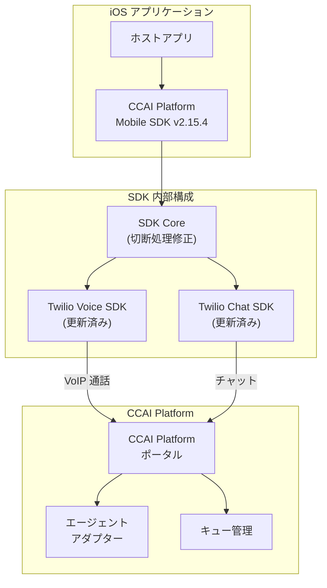

# CCAI Platform: Mobile SDK for iOS v2.15.4 パッチリリース

**リリース日**: 2026-05-13

**サービス**: Google Cloud Contact Center as a Service (CCaaS) / CCAI Platform

**機能**: Mobile SDK for iOS v2.15.4

**ステータス**: パッチリリース (Patch)

[このアップデートのインフォグラフィックを見る](https://takech9203.github.io/google-cloud-news-summary/20260513-ccaas-mobile-sdk-ios-v2-15-4.html)

## 概要

Google Cloud の Contact Center AI Platform (CCAI Platform) の iOS 向け Mobile SDK がバージョン 2.15.4 にアップデートされた。本パッチは安定性の向上を目的としたバグ修正リリースであり、新機能の追加は含まれない。

主な修正内容として、iOS アプリが通話切断時にクラッシュする問題の解消、および Twilio Voice SDK と Twilio Chat SDK の更新が含まれる。CCAI Platform の Mobile SDK を利用してカスタマーサポート機能を iOS アプリに組み込んでいる開発者が対象となる。

**アップデート前の課題**

- iOS アプリが VoIP 通話の切断処理中にクラッシュする不具合が発生していた
- 利用している Twilio Voice SDK および Chat SDK が旧バージョンのままであった

**アップデート後の改善**

- 切断時のクラッシュ問題が解消され、通話終了時の安定性が向上した
- Twilio Voice SDK および Chat SDK が最新バージョンに更新され、基盤ライブラリの安定性とセキュリティが改善された

## アーキテクチャ図



iOS アプリ内に組み込まれた CCAI Platform Mobile SDK が Twilio Voice/Chat SDK を通じてバックエンドの CCAI Platform と通信する構成を示す。今回のパッチでは SDK Core の切断処理と Twilio SDK の更新が行われた。

## サービスアップデートの詳細

### 修正内容

1. **切断時クラッシュの修正**
   - iOS アプリが VoIP 通話の切断処理中にクラッシュする問題を修正
   - 通話終了時のリソース解放処理が正常に完了するようになった

2. **Twilio SDK の更新**
   - Twilio Voice SDK を最新バージョンに更新
   - Twilio Chat SDK を最新バージョンに更新
   - 基盤通信ライブラリのセキュリティ修正と安定性改善を反映

## 技術仕様

| 項目 | 詳細 |
|------|------|
| SDK バージョン | 2.15.4 |
| 対応 OS | iOS 12.0 以上 |
| リリース種別 | パッチ (バグ修正) |
| 依存ライブラリ更新 | Twilio Voice SDK, Twilio Chat SDK |

## 設定方法

### 前提条件

1. CCAI Platform Mobile SDK が既にプロジェクトに統合されていること
2. CocoaPods、Swift Package Manager、または Carthage による依存関係管理を使用していること

### 手順

#### CocoaPods を使用する場合

```ruby
# Podfile
pod 'UJET', :podspec => 'https://sdk.ujet.co/ios/2.15.4/ujet.podspec'
```

```bash
pod update UJET
```

#### Swift Package Manager を使用する場合

Xcode のパッケージ依存関係で CCAI Platform iOS SDK パッケージを最新バージョン (2.15.4) に更新する。

## メリット

### 技術面

- **安定性向上**: 通話切断時のクラッシュが解消され、アプリの安定性が向上
- **基盤ライブラリの最新化**: Twilio SDK の更新によりセキュリティと信頼性が改善

### ビジネス面

- **ユーザー体験の改善**: 通話終了時にアプリが強制終了しなくなり、エンドユーザーの体験が向上
- **サポート負荷の軽減**: クラッシュ関連の問い合わせやバグレポートの減少が期待できる

## 関連サービス

- **CCAI Platform (Contact Center AI Platform)**: Google Cloud が提供するクラウドベースのコンタクトセンターソリューション
- **Twilio Voice SDK**: VoIP 通話機能を提供する基盤ライブラリ
- **Twilio Chat SDK (Conversations)**: チャット機能を提供する基盤ライブラリ

## 参考リンク

- [このアップデートのインフォグラフィック](https://takech9203.github.io/google-cloud-news-summary/20260513-ccaas-mobile-sdk-ios-v2-15-4.html)
- [公式リリースノート](https://cloud.google.com/release-notes#May_13_2026)
- [iOS SDK ガイド](https://docs.cloud.google.com/contact-center/ccai-platform/docs/ios-sdk-guide)
- [Mobile SDK 概要](https://docs.cloud.google.com/contact-center/ccai-platform/docs/mobileSDK-overview)

## まとめ

本パッチリリースは CCAI Platform iOS Mobile SDK の安定性を改善する重要なバグ修正である。特に通話切断時のクラッシュ問題は本番環境のエンドユーザーに直接影響を与える深刻な不具合であったため、SDK を利用しているプロジェクトでは早期のアップデートを推奨する。

---

**タグ**: #CCaaS #CCAI-Platform #iOS #MobileSDK #パッチ #バグ修正 #Twilio #VoIP
