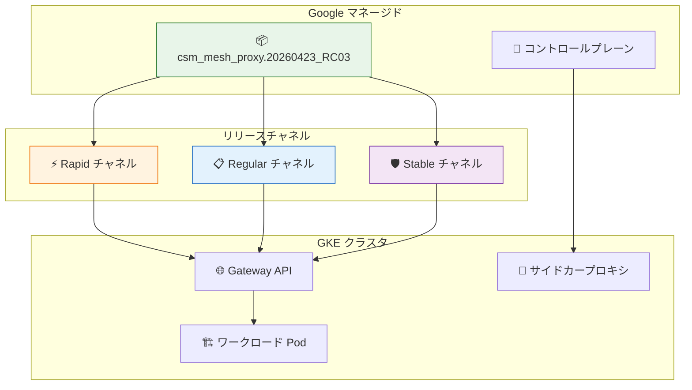

# Cloud Service Mesh: セキュリティプロキシバージョン更新 (csm_mesh_proxy.20260423_RC03)

**リリース日**: 2026-05-13

**サービス**: Cloud Service Mesh

**機能**: Managed Data Plane プロキシバージョン更新

**ステータス**: ロールアウト中

📊 [このアップデートのインフォグラフィックを見る](https://takech9203.github.io/google-cloud-news-summary/20260513-cloud-service-mesh-security-proxy-update.html)

## 概要

Managed Cloud Service Mesh において、新しいプロキシバージョン `csm_mesh_proxy.20260423_RC03` が全てのリリースチャネル (Rapid、Regular、Stable) に対してロールアウトされています。このロールアウトは今後 1 週間かけて段階的に展開されます。

Cloud Service Mesh のマネージドデータプレーンでは、Google がプロキシのアップグレードを完全に管理します。サイドカープロキシおよびインジェクトされたゲートウェイは、マネージドコントロールプレーンと連動して自動的に更新されます。今回のプロキシバージョン更新は Gateway API on GKE クラスタを対象としたセキュリティ関連の更新であり、全リリースチャネルに同時に展開されることから、優先度の高いセキュリティ修正が含まれていると考えられます。

**アップデート前の状態**

- 以前のプロキシバージョンで Gateway API on GKE クラスタが動作していた
- セキュリティパッチが適用されていない状態のプロキシが稼働中

**アップデート後の改善**

- `csm_mesh_proxy.20260423_RC03` により最新のセキュリティ修正が適用される
- 全リリースチャネルで統一的にセキュリティレベルが向上する
- マネージドデータプレーンが有効な場合、ユーザーの手動操作なしで自動的に更新される

## アーキテクチャ図



今回の更新では、新しいプロキシバージョンが全リリースチャネルに同時に展開されます。これはセキュリティ関連の更新であるため、通常の Rapid → Regular → Stable という段階的な昇格プロセスではなく、全チャネルに対して並行してロールアウトされます。

## サービスアップデートの詳細

### 主要機能

1. **プロキシバージョンの更新**
   - 新バージョン: `csm_mesh_proxy.20260423_RC03`
   - 対象: Gateway API on GKE クラスタ
   - 全リリースチャネル (Rapid、Regular、Stable) に同時ロールアウト

2. **自動ロールアウトメカニズム**
   - マネージドデータプレーンが有効な場合、Pod の再起動により新しいプロキシが自動的にインジェクトされる
   - Pod Disruption Budget (PDB) を尊重した段階的な更新
   - セキュリティ関連の更新のため、GKE メンテナンスウィンドウを待たずに即時開始

3. **リリースチャネル連動**
   - Cloud Service Mesh のリリースチャネルは GKE クラスタのリリースチャネルに連動
   - Rapid: 最新版を最も早く取得
   - Regular: Rapid で検証された安定版 (推奨)
   - Stable: Regular で十分に検証された最も安定したバージョン

## 技術仕様

### リリースチャネルとプロキシ更新の動作

| 項目 | 詳細 |
|------|------|
| プロキシバージョン | `csm_mesh_proxy.20260423_RC03` |
| 対象コンポーネント | Gateway API on GKE |
| ロールアウト期間 | 約 1 週間 |
| 対象チャネル | Rapid、Regular、Stable (全チャネル) |
| 更新優先度 | 高 (セキュリティ関連) |
| メンテナンスウィンドウ | 非遵守 (CVE 関連ロールアウトのため) |

### マネージドデータプレーンの更新トリガー

| トリガー | マネージドデータプレーン有効時 | マネージドデータプレーン無効時 |
|----------|-------------------------------|-------------------------------|
| Cloud Service Mesh アクティブ更新 | 自動で Pod 置換 | 更新なし (手動トリガー必要) |
| 新規 Pod 作成 | 新バージョンをインジェクト | 新バージョンをインジェクト |
| GKE メンテナンスウィンドウ | ノード交換時に更新 | ノード交換時に更新 |

### マネージドデータプレーンの制限事項

マネージドデータプレーンによる自動更新の対象外:

- インジェクトされていない Pod
- 手動でインジェクトされた Pod
- Jobs
- StatefulSets
- DaemonSets

## ロールアウト中のユーザー対応

### マネージドデータプレーンが有効な場合

特別な対応は不要です。Google が自動的にプロキシを更新します。

- Pod Disruption Budget を適切に設定していれば、サービスの可用性は維持される
- セキュリティ更新のため、GKE メンテナンスウィンドウの設定に関わらず更新が開始される
- 通常 2 週間以内に完了

### マネージドデータプレーンが無効な場合

手動でのプロキシ更新が必要です。

```bash
# コントロールプレーンとプロキシのバージョンを確認
# コントロールプレーンが新しい場合、以下のコマンドでプロキシを更新

kubectl rollout restart deployment -n NAMESPACE
```

### Pod Disruption Budget の推奨設定

ロールアウト中のサービス可用性を確保するため、適切な PDB を設定することを推奨します。

```yaml
apiVersion: policy/v1
kind: PodDisruptionBudget
metadata:
  name: my-service-pdb
spec:
  minAvailable: "50%"
  selector:
    matchLabels:
      app: my-service
```

## メリット

### セキュリティ面

- **最新のセキュリティ修正の適用**: 既知の脆弱性に対するパッチが自動的に展開される
- **全チャネル同時適用**: セキュリティ修正が全環境に迅速に行き渡る
- **運用負荷の軽減**: マネージドデータプレーン有効時はユーザー操作不要

### 運用面

- **段階的ロールアウト**: PDB を尊重した安全な更新プロセス
- **自動管理**: Google によるプロキシライフサイクルの完全管理
- **透明性**: リリースノートによる事前通知

## デメリット・制約事項

### 制限事項

- マネージドデータプレーンは StatefulSets、Jobs、DaemonSets を自動更新しない
- 手動でインジェクトされた Pod は自動更新の対象外
- セキュリティ更新は GKE メンテナンスウィンドウを無視して実行される

### 考慮すべき点

- ロールアウト中に Pod の再起動が発生するため、短時間の接続断が起こる可能性がある
- PDB が適切に設定されていない場合、一時的にサービスの可用性が低下する可能性がある
- マネージドデータプレーンが無効な環境では、手動での対応が必要

## 関連サービス・機能

- **Google Kubernetes Engine (GKE)**: Cloud Service Mesh のリリースチャネルは GKE のリリースチャネルと連動
- **Gateway API**: 今回のプロキシ更新の直接的な対象コンポーネント
- **Cloud Monitoring**: プロキシバージョンの確認やメッシュの健全性監視に使用
- **Cloud Service Mesh セキュリティ情報**: セキュリティ脆弱性の詳細と対応策を公開

## 参考リンク

- 📊 [インフォグラフィック](https://takech9203.github.io/google-cloud-news-summary/20260513-cloud-service-mesh-security-proxy-update.html)
- [公式リリースノート](https://cloud.google.com/release-notes#May_13_2026)
- [Cloud Service Mesh リリースノート](https://cloud.google.com/service-mesh/docs/release-notes)
- [マネージドデータプレーンのプロビジョニング](https://cloud.google.com/service-mesh/docs/onboarding/provision-control-plane)
- [リリースチャネルの選択](https://cloud.google.com/service-mesh/docs/managed/select-a-release-channel)
- [Cloud Service Mesh セキュリティ情報](https://cloud.google.com/service-mesh/docs/security-bulletins)

## まとめ

Managed Cloud Service Mesh のプロキシバージョン `csm_mesh_proxy.20260423_RC03` が全リリースチャネルにロールアウト中です。セキュリティ関連の更新であるため、GKE メンテナンスウィンドウに関わらず自動的に展開されます。マネージドデータプレーンが有効な環境ではユーザーの対応は不要ですが、無効な環境では `kubectl rollout restart` による手動更新を推奨します。Pod Disruption Budget が適切に設定されていることを確認し、ロールアウト期間中のサービス可用性を確保してください。

---

**タグ**: #CloudServiceMesh #Security #ManagedDataPlane #ProxyUpdate #GKE #GatewayAPI #ServiceMesh
