# Google Kubernetes Engine (GKE): クラスタバージョンアップデート 2026-R19

**リリース日**: 2026-05-13

**サービス**: Google Kubernetes Engine (GKE)

**機能**: クラスタバージョンアップデート (2026-R19)

**ステータス**: Change

:bar_chart: [このアップデートのインフォグラフィックを見る](https://takech9203.github.io/google-cloud-news-summary/20260513-gke-version-updates-2026-r19.html)

## 概要

GKE クラスタバージョンが 2026-R19 として更新された。全リリースチャネル (Rapid、Regular、Stable、Extended) において新しいバージョンが利用可能になり、新規クラスタ作成およびアップグレードに使用できる。

Rapid チャネルでは v1.35.3-gke.1993000 が新規クラスタ作成時のデフォルトバージョンとなり、Kubernetes 1.36 系の新バージョンも利用可能になった。Stable チャネルでは v1.34.6-gke.1154000 がデフォルトに設定され、安定性を重視する本番環境向けに新たな選択肢が提供されている。

このバージョンアップデートは、セキュリティパッチ、バグ修正、および新機能を含む定期的なリリースサイクルの一部であり、すべての GKE ユーザーに影響する。自動アップグレードターゲットも更新されており、メンテナンスウィンドウに従って順次適用される。

## アーキテクチャ図

```mermaid
flowchart LR
    subgraph Rapid["Rapid チャネル"]
        R1["v1.36.0-gke.1759000"]
        R2["v1.35.3-gke.2190000"]
        R3["v1.34.7-gke.1499000"]
        R4["v1.33.11-gke.1197000"]
    end

    subgraph Regular["Regular チャネル"]
        Reg1["v1.34.7-gke.1055000"]
        Reg2["v1.33.11-gke.1074000"]
    end

    subgraph Stable["Stable チャネル"]
        S1["v1.35.3-gke.1389000"]
        S2["v1.34.6-gke.1237000"]
        S3["v1.33.10-gke.1176000"]
    end

    subgraph Extended["Extended チャネル"]
        E1["v1.30 - v1.34 系"]
    end

    Rapid -->|"検証後に昇格"| Regular
    Regular -->|"安定性確認後"| Stable
    Stable -->|"長期サポート"| Extended
```



GKE のリリースチャネルはバージョンの成熟度に応じて段階的に昇格する。Rapid で最初に利用可能になったバージョンは、十分な使用実績と安定性が確認された後、Regular、Stable へと順次展開される。

## サービスアップデートの詳細

### Rapid チャネル

| 項目 | 詳細 |
|------|------|
| 新規クラスタのデフォルト | v1.35.3-gke.1993000 |
| 新規利用可能バージョン | 1.33.11-gke.1197000, 1.34.7-gke.1499000, 1.35.3-gke.2190000, 1.36.0-gke.1759000 |

**自動アップグレードターゲット:**

| 現在のマイナーバージョン | アップグレード先 |
|--------------------------|------------------|
| 1.34.x | 1.35.3-gke.1993000 |
| 1.35.x | 1.35.3-gke.1993000 |
| 1.36.x | 1.36.0-gke.1575000 |

### Regular チャネル

| 項目 | 詳細 |
|------|------|
| 新規利用可能バージョン | 1.33.11-gke.1074000, 1.34.7-gke.1055000 |

**自動アップグレードターゲット:**

| 現在のマイナーバージョン | アップグレード先 |
|--------------------------|------------------|
| 1.32.x | 1.33 系 |
| 1.33.x | 1.34 系 |

### Stable チャネル

| 項目 | 詳細 |
|------|------|
| 新規クラスタのデフォルト | v1.34.6-gke.1154000 |
| 新規利用可能バージョン | 1.33.10-gke.1176000, 1.34.6-gke.1237000, 1.35.3-gke.1234002, 1.35.3-gke.1389000 |

**自動アップグレードターゲット:**

| 現在のマイナーバージョン | アップグレード先 |
|--------------------------|------------------|
| 1.32.x | 1.33 系 |

### Extended チャネル

| 項目 | 詳細 |
|------|------|
| 新規利用可能バージョン | 1.30 - 1.34 系の複数バージョン |

Extended チャネルでは、マイナーバージョンごとに最大 24 か月の長期サポートが提供される。標準サポート期間 (14 か月) 終了後も、約 10 か月間のセキュリティパッチが継続される。

## 技術仕様

### リリースチャネルの特性比較

| チャネル | バージョン提供時期 | 自動アップグレード開始 | 推奨用途 |
|----------|-------------------|----------------------|----------|
| Rapid | upstream OSS GA 後 1-2 週間 | リリース後 1-2 か月 | プレプロダクション環境、最新機能の早期検証 |
| Regular | Rapid リリース後 約 2 か月 | Regular リリース後 約 3 か月 | 大多数のユーザー向けバランス型 |
| Stable | Regular リリース後 3-4 か月 | Stable リリース後 約 2 か月 | 安定性を最優先する本番環境 |
| Extended | Regular と同期 | Regular と同期 | 長期サポートが必要な環境 |

### バージョニングスキーム

GKE バージョンは `{major}.{minor}.{patch}-gke.{gke_patch}` の形式で管理される。

- **メジャーバージョン**: Kubernetes のメジャーリリース (現在は 1)
- **マイナーバージョン**: 機能追加を含むリリース (年 3 回程度)
- **パッチバージョン**: バグ修正とセキュリティパッチ
- **GKE パッチ**: GKE 固有の修正

## 設定方法

### クラスタのリリースチャネル確認

```bash
# クラスタの現在のバージョンとリリースチャネルを確認
gcloud container clusters describe CLUSTER_NAME \
  --location=LOCATION \
  --format="table(name, currentMasterVersion, releaseChannel.channel)"
```

### 利用可能なバージョンの確認

```bash
# 特定のリリースチャネルで利用可能なバージョンを一覧表示
gcloud container get-server-config \
  --location=LOCATION \
  --format="yaml(channels)"
```

### 手動アップグレードの実行

```bash
# コントロールプレーンのアップグレード
gcloud container clusters upgrade CLUSTER_NAME \
  --location=LOCATION \
  --master \
  --cluster-version=VERSION

# ノードプールのアップグレード
gcloud container clusters upgrade CLUSTER_NAME \
  --location=LOCATION \
  --node-pool=NODE_POOL_NAME \
  --cluster-version=VERSION
```

### メンテナンスウィンドウの設定

```bash
# メンテナンスウィンドウを設定 (自動アップグレードの実行時間帯を制御)
gcloud container clusters update CLUSTER_NAME \
  --location=LOCATION \
  --maintenance-window-start="2026-05-14T02:00:00Z" \
  --maintenance-window-end="2026-05-14T06:00:00Z" \
  --maintenance-window-recurrence="FREQ=WEEKLY;BYDAY=SA,SU"
```

## メリット

### ビジネス面

- **セキュリティ強化**: 最新のセキュリティパッチにより、既知の脆弱性に対するリスクを低減
- **コンプライアンス維持**: サポートされたバージョンを使用することで、セキュリティ監査要件への対応が容易

### 技術面

- **最新機能の利用**: Kubernetes 1.36 系 (Rapid) では最新の API や機能が利用可能
- **バグ修正の恩恵**: パッチバージョンの更新により既知のバグが修正され、クラスタの安定性が向上
- **自動アップグレードによる運用負荷軽減**: リリースチャネルに登録されたクラスタは自動的に最新バージョンに更新

## デメリット・制約事項

### 制限事項

- 自動アップグレードはメンテナンスウィンドウ内でのみ実行される (設定している場合)
- マイナーバージョンの自動アップグレード後、30 日間は次のマイナーバージョンへの自動アップグレードが行われない
- Extended チャネルは Autopilot クラスタ、Alpha クラスタ、Windows Server ノードプールなどでは利用不可

### 考慮すべき点

- **バージョンスキューポリシー**: コントロールプレーンとノード間のバージョン差は 2 マイナーバージョン以内に維持する必要がある
- **API 廃止**: マイナーバージョンアップグレード時に廃止された Kubernetes API が削除される可能性がある。事前に `kubectl deprecations` で確認を推奨
- **ワークロードへの影響**: ノードアップグレード時にはワークロードの再スケジュールが発生するため、PodDisruptionBudget の適切な設定が重要

## ユースケース

### ユースケース 1: 本番環境の計画的アップグレード

**シナリオ**: Stable チャネルを使用している本番クラスタで、v1.34.6-gke.1154000 (新デフォルト) へのアップグレードを計画的に実施したい。

**実装例**:
```bash
# 1. 現在のバージョンを確認
gcloud container clusters describe prod-cluster \
  --location=asia-northeast1 \
  --format="value(currentMasterVersion)"

# 2. メンテナンスウィンドウを設定
gcloud container clusters update prod-cluster \
  --location=asia-northeast1 \
  --maintenance-window-start="2026-05-17T18:00:00+09:00" \
  --maintenance-window-end="2026-05-18T06:00:00+09:00" \
  --maintenance-window-recurrence="FREQ=WEEKLY;BYDAY=SA"

# 3. 手動で特定バージョンにアップグレード
gcloud container clusters upgrade prod-cluster \
  --location=asia-northeast1 \
  --master \
  --cluster-version=1.34.6-gke.1237000
```

**効果**: 営業時間外にアップグレードを実行することで、サービスへの影響を最小限に抑えられる。

### ユースケース 2: 最新機能の早期検証

**シナリオ**: 開発環境で Kubernetes 1.36 系の新機能を早期に検証したい。

**実装例**:
```bash
# Rapid チャネルで新規クラスタを作成し、1.36 を指定
gcloud container clusters create dev-cluster \
  --location=asia-northeast1 \
  --release-channel=rapid \
  --cluster-version=1.36.0-gke.1759000
```

**効果**: 本番適用前に新しい Kubernetes バージョンの機能検証や互換性テストが可能になる。

## 料金

GKE クラスタバージョンのアップグレード自体に追加料金は発生しない。GKE の料金は以下の通り:

| 項目 | 料金 |
|------|------|
| GKE Standard (クラスタ管理料金) | $0.10/時間/クラスタ |
| GKE Autopilot | vCPU、メモリ、ストレージの使用量に基づく |
| Extended サポート期間 (マイナーバージョンの標準サポート終了後) | 追加料金が発生 |

詳細は [GKE 料金ページ](https://cloud.google.com/kubernetes-engine/pricing) を参照。

## 関連サービス・機能

- **Cloud Monitoring**: クラスタのアップグレード状況やヘルスステータスの監視
- **Cloud Logging**: アップグレードイベントのログ記録とクラスタ通知の確認
- **Binary Authorization**: アップグレード後のコンテナイメージのデプロイポリシー適用
- **GKE Rollout Sequencing**: 複数環境にまたがる自動アップグレードの順序制御

## 参考リンク

- :bar_chart: [インフォグラフィック](https://takech9203.github.io/google-cloud-news-summary/20260513-gke-version-updates-2026-r19.html)
- [公式リリースノート](https://cloud.google.com/release-notes#May_13_2026)
- [GKE リリースチャネルのドキュメント](https://cloud.google.com/kubernetes-engine/docs/concepts/release-channels)
- [GKE クラスタアップグレードの概要](https://cloud.google.com/kubernetes-engine/docs/concepts/cluster-upgrades)
- [GKE バージョニングとサポート](https://cloud.google.com/kubernetes-engine/versioning)
- [GKE リリーススケジュール](https://cloud.google.com/kubernetes-engine/docs/release-schedule)
- [料金ページ](https://cloud.google.com/kubernetes-engine/pricing)

## まとめ

2026-R19 バージョンアップデートにより、全リリースチャネルで新しいバージョンが利用可能になった。特に Rapid チャネルでは Kubernetes 1.36 系が利用可能になり、Stable チャネルでは v1.34.6 がデフォルトに昇格している。クラスタ管理者は、自動アップグレードの対象バージョンを確認し、メンテナンスウィンドウの設定やバージョンスキューポリシーの遵守を確認することを推奨する。

---

**タグ**: #GKE #Kubernetes #VersionUpdate #ReleaseChannel #ClusterUpgrade #AutoUpgrade
