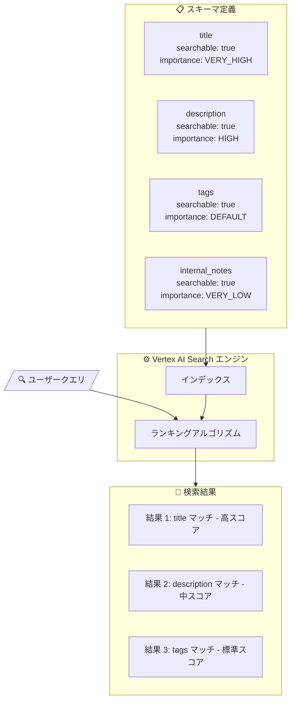

# Vertex AI Search: Weight searchable fields (Preview)

**リリース日**: 2026-05-13

**サービス**: Vertex AI Search

**機能**: Weight searchable fields (検索可能フィールドの重み付け)

**ステータス**: Public Preview

📊 [このアップデートのインフォグラフィックを見る](https://takech9203.github.io/google-cloud-news-summary/20260513-vertex-ai-search-weight-searchable-fields.html)

## 概要

Vertex AI Search に検索可能フィールドの重み付け機能が Public Preview として追加された。この機能により、スキーマ内の searchable フィールドに対して相対的な重要度（weight）を指定できるようになり、検索結果のランキングにおいてどのフィールドがより重要であるかをシステムに伝えることが可能になった。

従来、Vertex AI Search では複数のフィールドを searchable に設定できたが、すべての searchable フィールドは同等の重みで検索ランキングに寄与していた。例えば、商品データベースで「title」と「description」の両方を searchable にした場合、タイトルに含まれるキーワードマッチも説明文に含まれるキーワードマッチも同じ影響力を持っていた。今回の機能追加により、`SearchableFieldImportance` enum を使用してフィールドごとに 5 段階の重要度を設定できるようになった。

この機能は、構造化データ、非構造化データ（メタデータ付き）、ウェブサイトデータを持つデータストアにおいて、検索精度をスキーマレベルで制御したいユーザーに向けた改善である。

**アップデート前の課題**

- すべての searchable フィールドが同等の重みで検索ランキングに影響し、フィールドごとの重要度を区別できなかった
- 検索精度を向上させるには、クエリ時の boost や custom ranking expression で対応する必要があり、スキーマレベルでの制御ができなかった
- 過剰に多くのフィールドを searchable にすると、ランキングアルゴリズムが飽和し検索精度が低下する問題に対して、フィールドの重要度で緩和する手段がなかった

**アップデート後の改善**

- スキーマ定義時にフィールドごとの検索重要度を 5 段階（VERY_LOW, LOW, DEFAULT, HIGH, VERY_HIGH）で指定可能になった
- タイトルや商品名などの重要フィールドに高い重みを付けることで、検索結果の関連性が向上する
- クエリ時の rankingExpression に頼らず、スキーマレベルで恒久的な検索品質の改善が可能になった

## アーキテクチャ図



フィールドの重み付けがスキーマレベルで定義され、検索エンジンのランキングアルゴリズムに反映される仕組みを示す。重要度の高いフィールドでのマッチほど検索結果のスコアが高くなる。

## サービスアップデートの詳細

### 主要機能

1. **SearchableFieldImportance による重要度設定**
   - スキーマの各 searchable フィールドに対して `SearchableFieldImportance` enum で重要度を指定
   - 5 段階の重要度レベルが利用可能
   - 未指定の場合は `DEFAULT_IMPORTANCE` として動作（従来と同じ挙動）

2. **スキーマレベルでの永続的な設定**
   - 一度スキーマに設定すれば、すべての検索クエリに自動的に適用される
   - クエリごとに rankingExpression を指定する必要がない
   - Google Cloud コンソールまたは REST API から設定可能

3. **既存の検索機能との互換性**
   - Custom Ranking（rankingExpression）と併用可能
   - Boost、フィルタリング、ファセットなど他の機能に影響しない
   - 既存のスキーマに対して後から重要度を追加設定可能

## 技術仕様

### SearchableFieldImportance enum

| 値 | 説明 |
|------|------|
| `SEARCHABLE_FIELD_IMPORTANCE_UNSPECIFIED` | 未設定。searchable フィールドの場合 DEFAULT_IMPORTANCE として動作 |
| `VERY_LOW_IMPORTANCE` | 検索に対して非常に小さいシグナルを提供 |
| `LOW_IMPORTANCE` | 検索に使用されるが、デフォルトより重要度が低い |
| `DEFAULT_IMPORTANCE` | デフォルトの重要度。従来の動作と同等 |
| `HIGH_IMPORTANCE` | デフォルトフィールドより重要 |
| `VERY_HIGH_IMPORTANCE` | 検索において最も重要なフィールド |

### 対象データタイプ

| 項目 | 詳細 |
|------|------|
| 対象フィールドタイプ | `string` 型のフィールドのみ（searchable 設定と同じ制約） |
| 最大 searchable フィールド数 | 50 フィールド |
| API バージョン | v1alpha（Preview） |
| 設定方法 | スキーマ定義内で指定 |

### スキーマ定義例

```json
{
  "$schema": "https://json-schema.org/draft/2020-12/schema",
  "type": "object",
  "properties": {
    "title": {
      "type": "string",
      "keyPropertyMapping": "title",
      "searchable": true,
      "searchableFieldImportance": "VERY_HIGH_IMPORTANCE"
    },
    "description": {
      "type": "string",
      "keyPropertyMapping": "description",
      "searchable": true,
      "searchableFieldImportance": "HIGH_IMPORTANCE"
    },
    "tags": {
      "type": "string",
      "searchable": true,
      "searchableFieldImportance": "DEFAULT_IMPORTANCE"
    },
    "internal_notes": {
      "type": "string",
      "searchable": true,
      "searchableFieldImportance": "VERY_LOW_IMPORTANCE"
    }
  }
}
```

## 設定方法

### 前提条件

1. Google Cloud プロジェクトで Vertex AI Search（AI Applications）が有効化されていること
2. 構造化データ、非構造化データ（メタデータ付き）、またはウェブサイトデータのデータストアが作成済みであること
3. 対象フィールドが `string` 型であり、`searchable` に設定されていること

### 手順

#### ステップ 1: 現在のスキーマを確認

```bash
curl -X GET \
  -H "Authorization: Bearer $(gcloud auth print-access-token)" \
  "https://discoveryengine.googleapis.com/v1alpha/projects/PROJECT_ID/locations/global/collections/default_collection/dataStores/DATA_STORE_ID/schemas/default_schema"
```

現在のスキーマ定義を確認し、searchable に設定されているフィールドを特定する。

#### ステップ 2: スキーマを更新して重み付けを追加

```bash
curl -X PATCH \
  -H "Authorization: Bearer $(gcloud auth print-access-token)" \
  -H "Content-Type: application/json" \
  "https://discoveryengine.googleapis.com/v1alpha/projects/PROJECT_ID/locations/global/collections/default_collection/dataStores/DATA_STORE_ID/schemas/default_schema" \
  -d '{
    "structSchema": {
      "$schema": "https://json-schema.org/draft/2020-12/schema",
      "type": "object",
      "properties": {
        "title": {
          "type": "string",
          "keyPropertyMapping": "title",
          "searchable": true,
          "searchableFieldImportance": "VERY_HIGH_IMPORTANCE"
        },
        "description": {
          "type": "string",
          "keyPropertyMapping": "description",
          "searchable": true,
          "searchableFieldImportance": "HIGH_IMPORTANCE"
        }
      }
    }
  }'
```

スキーマの更新はデータの再インデックスをトリガーする。大規模なデータストアでは数時間かかる場合がある。

#### ステップ 3: 再インデックスの完了を確認

```bash
curl -X GET \
  -H "Authorization: Bearer $(gcloud auth print-access-token)" \
  "https://discoveryengine.googleapis.com/v1alpha/projects/PROJECT_ID/locations/global/operations/OPERATION_ID"
```

スキーマ更新のオペレーションが完了するまで待機し、検索結果に重み付けが反映されることを確認する。

## メリット

### ビジネス面

- **検索精度の向上**: タイトルや商品名など重要なフィールドを優先することで、ユーザーが求める結果を上位に表示できる
- **運用コストの削減**: クエリ時に毎回 rankingExpression を調整する必要がなく、スキーマ設定だけで恒久的に検索品質を改善できる
- **カスタマーエクスペリエンスの改善**: 検索結果の関連性向上により、ユーザーの離脱率低下やコンバージョン率向上が期待できる

### 技術面

- **宣言的な設定**: スキーマに重要度を宣言するだけで、ランキングアルゴリズムが自動的に考慮する
- **段階的な導入**: 既存のスキーマに対して後から重み付けを追加でき、未設定のフィールドは従来通り動作する
- **Custom Ranking との併用**: フィールドレベルの重要度と、クエリレベルの rankingExpression を組み合わせてさらに精密なランキング制御が可能

## デメリット・制約事項

### 制限事項

- Public Preview のため、SLA の対象外であり本番環境での利用は推奨されない
- `string` 型のフィールドのみが対象（数値型フィールドには設定不可）
- searchable フィールドの最大数は従来通り 50 フィールドまで
- スキーマ更新時にデータの再インデックスが発生し、大規模データストアでは数時間かかる場合がある
- API バージョンは v1alpha であり、GA 時に仕様変更の可能性がある

### 考慮すべき点

- 重み付けの最適なバランスを見つけるにはテストと検証が必要
- 過度に高い重要度を多くのフィールドに設定すると、重み付けの効果が薄れる可能性がある
- スキーマ更新中はサービスが一時的に遅延する可能性がある（特に大規模データストア）

## ユースケース

### ユースケース 1: EC サイトの商品検索

**シナリオ**: 数百万点の商品を持つ EC サイトで、ユーザーが商品名で検索した際に正確な結果を上位に表示したい。

**実装例**:
```json
{
  "product_name": { "searchableFieldImportance": "VERY_HIGH_IMPORTANCE" },
  "brand": { "searchableFieldImportance": "HIGH_IMPORTANCE" },
  "description": { "searchableFieldImportance": "DEFAULT_IMPORTANCE" },
  "review_text": { "searchableFieldImportance": "LOW_IMPORTANCE" }
}
```

**効果**: 商品名やブランド名に一致する商品が優先的に上位表示され、レビュー文中の偶発的なキーワードマッチによるノイズが軽減される。

### ユースケース 2: 社内ナレッジベース検索

**シナリオ**: 社内ドキュメントの検索で、ドキュメントのタイトルや要約を重視し、本文中の付随的な言及よりも優先したい。

**実装例**:
```json
{
  "document_title": { "searchableFieldImportance": "VERY_HIGH_IMPORTANCE" },
  "summary": { "searchableFieldImportance": "HIGH_IMPORTANCE" },
  "body_text": { "searchableFieldImportance": "DEFAULT_IMPORTANCE" },
  "metadata_comments": { "searchableFieldImportance": "VERY_LOW_IMPORTANCE" }
}
```

**効果**: タイトルや要約でマッチするドキュメントが優先的に返され、検索の精度と業務効率が向上する。

### ユースケース 3: サポートチケット検索

**シナリオ**: カスタマーサポートのチケットシステムで、問題の概要や解決策を重視した検索を実現したい。

**効果**: `issue_title` や `resolution_notes` に高い重要度を設定し、`internal_comments` や `log_data` に低い重要度を設定することで、サポート担当者が関連チケットを素早く見つけられるようになる。

## 料金

Vertex AI Search の料金体系は検索可能フィールドの重み付け機能自体に追加料金は発生しない。ただし、スキーマ更新に伴う再インデックスにより、レイアウトパーサーや OCR パーサーを使用している場合は Document AI の処理料金が発生する可能性がある。

Vertex AI Search には以下の 2 つの料金モデルがある:
- **General（従量課金）**: 使用量に応じた従量課金
- **Configurable（サブスクリプション）**: ストレージと検索クエリ（QPM）のサブスクリプション + アドオン

詳細は [Vertex AI Search の料金ページ](https://cloud.google.com/generative-ai-app-builder/pricing) を参照。

## 関連サービス・機能

- **Custom Ranking（カスタムランキング）**: クエリ時に rankingExpression を指定してランキングを制御する機能。フィールド重み付けと併用することで、より精密な検索結果の制御が可能
- **Boost/Bury**: 検索結果の特定条件に基づいてスコアを上下させる機能。フィールド重み付けはスキーマレベル、Boost はクエリレベルでの制御
- **Natural Language Query Filters**: 自然言語クエリを自動的にフィルタと残余クエリに分解する機能。フィールド重み付けとの組み合わせで構造化データの検索品質がさらに向上
- **Key Property Mapping**: title、description、uri などのキープロパティにフィールドをマッピングする機能。キープロパティとフィールド重要度を組み合わせることで最適な検索体験を構築

## 参考リンク

- 📊 [インフォグラフィック](https://takech9203.github.io/google-cloud-news-summary/20260513-vertex-ai-search-weight-searchable-fields.html)
- [公式リリースノート](https://cloud.google.com/release-notes#May_13_2026)
- [Weight searchable fields ドキュメント](https://docs.cloud.google.com/generative-ai-app-builder/docs/configure-field-settings)
- [スキーマの更新](https://docs.cloud.google.com/generative-ai-app-builder/docs/update-schemas)
- [Custom Ranking](https://docs.cloud.google.com/generative-ai-app-builder/docs/custom-ranking)
- [スキーマ API リファレンス](https://docs.cloud.google.com/generative-ai-app-builder/docs/reference/rest/v1alpha/projects.locations.collections.dataStores.schemas)
- [料金ページ](https://cloud.google.com/generative-ai-app-builder/pricing)

## まとめ

Vertex AI Search の検索可能フィールド重み付け機能は、スキーマレベルで検索ランキングにおけるフィールドの重要度を制御できる待望の機能である。従来はすべての searchable フィールドが同等に扱われていたが、本機能により「タイトルは最重要、説明は重要、補足情報は低重要度」といった直感的な設定が可能になった。現在は Public Preview であるため本番利用は慎重に検討すべきだが、GA に向けて早期にテスト環境で重み付けの最適な設定を検証しておくことを推奨する。

---

**タグ**: #VertexAISearch #SearchableFieldImportance #検索ランキング #スキーマ設定 #PublicPreview #AIApplications #検索精度向上
