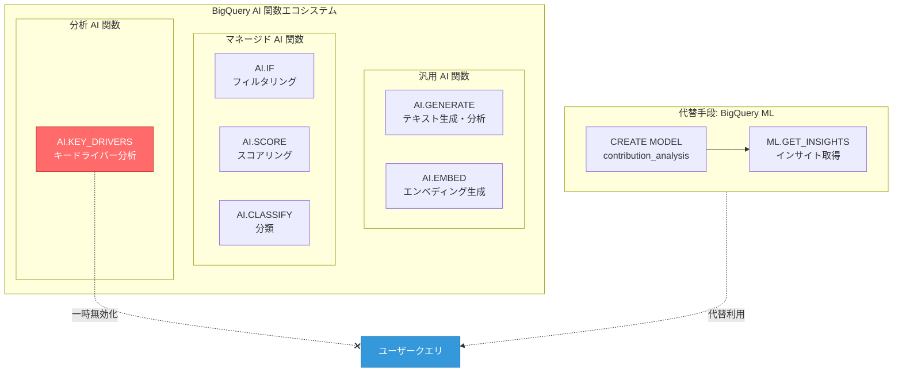

# BigQuery: AI.KEY_DRIVERS 関数のプレビューが一時的に無効化

**リリース日**: 2026-05-14

**サービス**: BigQuery

**機能**: AI.KEY_DRIVERS 関数のプレビューサポートが一時的に無効化

**ステータス**: Issue

:bar_chart: [このアップデートのインフォグラフィックを見る](https://takech9203.github.io/google-cloud-news-summary/20260514-bigquery-ai-key-drivers-disabled.html)

## 概要

2026 年 5 月 14 日、Google Cloud は BigQuery の AI.KEY_DRIVERS 関数のプレビューサポートを一時的に無効化したことを発表しました。公式リリースノートでは「この機能をできるだけ早く復旧するよう取り組んでいる」と記載されており、一時的な措置であることが強調されています。

AI.KEY_DRIVERS 関数は、BigQuery の AI 関数エコシステムの一部として、多次元データにおけるメトリクスの変化を引き起こした主要な要因（キードライバー）を自動的に特定する機能です。これは「貢献分析（Contribution Analysis）」とも呼ばれる分析手法を SQL 関数として簡潔に利用できるようにしたもので、Preview（プレビュー）段階にありました。

この無効化は、現在 AI.KEY_DRIVERS 関数を使用しているクエリやワークフローに直接影響します。プレビュー機能であるため SLA の対象外ですが、分析パイプラインに組み込んでいるユーザーは代替手段を検討する必要があります。

**アップデート前の状態**

- AI.KEY_DRIVERS 関数がプレビューとして利用可能で、SQL クエリ内でメトリクスの変動要因を直接分析できた
- 多次元データのセグメント別分析を AI 関数の簡潔な構文で実行可能だった
- BigQuery ML の CREATE MODEL によるコントリビューション分析モデルと並行して利用可能だった

**アップデート後の影響**

- AI.KEY_DRIVERS 関数を含むクエリが実行不可となる
- 同機能を利用していたダッシュボードや自動分析パイプラインが停止する
- 代替として BigQuery ML のコントリビューション分析モデル（CREATE MODEL + ML.GET_INSIGHTS）を使用する必要がある

## アーキテクチャ図



AI.KEY_DRIVERS 関数は BigQuery AI 関数群の分析カテゴリに属し、現在一時的に無効化されています。代替手段として BigQuery ML のコントリビューション分析モデルが利用可能です。

## サービスアップデートの詳細

### 主要機能

1. **AI.KEY_DRIVERS 関数の役割**
   - 多次元データにおけるメトリクス変動の主要因を自動特定
   - テストデータとコントロールデータを比較し、変化を駆動したセグメントをランク付け
   - SQL の SELECT 句内で直接呼び出し可能な簡潔な構文を提供

2. **コントリビューション分析（Key Driver Analysis）の概念**
   - 収益や KPI の変化に最も寄与したデータセグメントを特定する分析手法
   - 「拡張分析（Augmented Analytics）」の一形態で、AI によるデータパターンの自動発見を目指す
   - 例: 四半期間の売上変動を地域・製品・顧客セグメント別に分解して原因を特定

3. **プレビュー機能としてのステータス**
   - GA（一般提供）前のプレビュー段階で提供されていた
   - SLA の対象外であり、機能の変更や無効化が行われる可能性がある
   - 本番ワークロードでの使用は推奨されていない状態だった

## 技術仕様

### AI.KEY_DRIVERS と BigQuery ML コントリビューション分析の比較

| 項目 | AI.KEY_DRIVERS (無効化中) | BigQuery ML コントリビューション分析 |
|------|---------------------------|--------------------------------------|
| ステータス | Preview（一時無効化） | GA |
| 構文 | AI 関数（SELECT 句内で呼び出し） | CREATE MODEL + ML.GET_INSIGHTS |
| 設定の柔軟性 | 簡潔・自動最適化 | 詳細なパラメータ設定が可能 |
| メトリクスタイプ | 自動判定 | Summable / Summable Ratio / Summable by Category |
| SLA | なし | あり |

### BigQuery ML コントリビューション分析の設定例

```sql
-- コントリビューション分析モデルの作成（代替手段）
CREATE MODEL `project.dataset.revenue_analysis`
OPTIONS (
  MODEL_TYPE = 'CONTRIBUTION_ANALYSIS',
  CONTRIBUTION_METRIC = 'SUM(revenue)',
  DIMENSION_ID_COLS = ['product', 'region', 'channel'],
  IS_TEST_COL = 'is_current_quarter'
) AS
SELECT
  product,
  region,
  channel,
  revenue,
  is_current_quarter
FROM `project.dataset.sales_data`;

-- インサイトの取得
SELECT *
FROM ML.GET_INSIGHTS(MODEL `project.dataset.revenue_analysis`)
ORDER BY contribution_score DESC
LIMIT 10;
```

## 設定方法

### 代替手段: BigQuery ML コントリビューション分析への移行

#### ステップ 1: テスト/コントロールデータの準備

```sql
-- テスト期間と比較期間のデータを統合
CREATE OR REPLACE TABLE `project.dataset.analysis_input` AS
SELECT
  dimension_col_1,
  dimension_col_2,
  metric_column,
  CASE
    WHEN date BETWEEN '2026-04-01' AND '2026-04-30' THEN TRUE  -- テスト期間
    WHEN date BETWEEN '2026-03-01' AND '2026-03-31' THEN FALSE -- コントロール期間
  END AS is_test
FROM `project.dataset.source_table`
WHERE date BETWEEN '2026-03-01' AND '2026-04-30';
```

テスト期間（分析対象）とコントロール期間（比較基準）を `is_test` カラムで区別します。

#### ステップ 2: コントリビューション分析モデルの作成

```sql
CREATE MODEL `project.dataset.key_driver_model`
OPTIONS (
  MODEL_TYPE = 'CONTRIBUTION_ANALYSIS',
  CONTRIBUTION_METRIC = 'SUM(metric_column)',
  DIMENSION_ID_COLS = ['dimension_col_1', 'dimension_col_2'],
  IS_TEST_COL = 'is_test'
) AS
SELECT * FROM `project.dataset.analysis_input`;
```

モデル作成時にアプリオリサポート閾値を指定すると、小さなセグメントを除外して処理時間を短縮できます。

#### ステップ 3: インサイトの取得

```sql
SELECT *
FROM ML.GET_INSIGHTS(MODEL `project.dataset.key_driver_model`)
ORDER BY unexpected_difference DESC;
```

各セグメントの寄与度、予期しない差異、全体に対する割合などの指標を取得できます。

## メリット

### ビジネス面

- **分析の自動化**: メトリクス変動の原因を手動で調査する時間を大幅に削減
- **データドリブンな意思決定**: 直感ではなく統計的に有意なドライバーを特定

### 技術面

- **SQL ネイティブ**: BigQuery 内で完結するため、外部ツールへのデータ移動が不要
- **スケーラブル**: BigQuery のインフラストラクチャにより大規模データセットにも対応

## デメリット・制約事項

### 制限事項

- AI.KEY_DRIVERS 関数は現在一時的に無効化されており、復旧時期は未定
- プレビュー機能のため SLA の対象外であり、突然の無効化リスクがあった
- 代替の BigQuery ML コントリビューション分析はより冗長な構文が必要

### 考慮すべき点

- プレビュー機能を本番ワークフローに組み込んでいた場合、即座に影響を受ける
- BigQuery ML のコントリビューション分析への移行にはクエリの書き換えが必要
- 復旧後も、GA になるまでは同様のリスクが存在する

## ユースケース

### ユースケース 1: EC サイトの売上変動分析

**シナリオ**: 前四半期と比較して売上が 20% 低下した場合、どの地域・商品カテゴリ・顧客セグメントが主要因かを特定したい。

**実装例**:
```sql
-- BigQuery ML を使用した代替実装
CREATE MODEL `ecommerce.revenue_drivers`
OPTIONS (
  MODEL_TYPE = 'CONTRIBUTION_ANALYSIS',
  CONTRIBUTION_METRIC = 'SUM(revenue)',
  DIMENSION_ID_COLS = ['region', 'product_category', 'customer_segment'],
  IS_TEST_COL = 'is_current_quarter'
) AS
SELECT region, product_category, customer_segment, revenue, is_current_quarter
FROM `ecommerce.quarterly_sales`;
```

**効果**: 売上低下の原因セグメントを定量的に特定し、ターゲットを絞った施策立案が可能になる。

### ユースケース 2: 広告キャンペーンの効果分析

**シナリオ**: 広告費用対効果（CPC）が悪化した原因を、ブラウザ・デバイス・地域別に分析したい。

**効果**: 広告費の最適配分を行い、効果の低いセグメントへの支出を削減できる。

## 料金

AI.KEY_DRIVERS 関数自体は現在無効化されているため、料金は発生しません。代替の BigQuery ML コントリビューション分析モデルの料金は以下の通りです。

- BigQuery ML のモデル作成・推論は、BigQuery のコンピューティング料金に基づきます
- オンデマンド料金の場合、処理したデータ量に応じた課金
- 詳細は [BigQuery ML の料金ページ](https://cloud.google.com/bigquery/pricing#bigquery-ml-pricing) を参照

## 利用可能リージョン

BigQuery ML のコントリビューション分析は、BigQuery が利用可能なすべてのリージョンで使用できます。AI.KEY_DRIVERS 関数（復旧後）のリージョン対応状況については、Gemini モデルのサポートリージョンに依存する可能性があります。

## 関連サービス・機能

- **BigQuery ML コントリビューション分析**: AI.KEY_DRIVERS の代替手段。CREATE MODEL + ML.GET_INSIGHTS を使用してキードライバーを特定
- **AI.CLASSIFY**: BigQuery マネージド AI 関数の一つ。テキストやデータをカテゴリに分類
- **AI.SCORE**: 入力をスコアリングし、ランク付けするマネージド AI 関数
- **AI.IF**: 自然言語条件に基づいてデータをフィルタリングするマネージド AI 関数
- **AI.GENERATE**: 汎用テキスト生成・分析を行う AI 関数
- **Looker Key Driver Analysis API**: Looker 上での類似のキードライバー分析機能

## 参考リンク

- :bar_chart: [インフォグラフィック](https://takech9203.github.io/google-cloud-news-summary/20260514-bigquery-ai-key-drivers-disabled.html)
- [公式リリースノート](https://docs.cloud.google.com/release-notes#May_14_2026)
- [BigQuery AI 関数 概要ドキュメント](https://docs.cloud.google.com/bigquery/docs/generative-ai-overview)
- [コントリビューション分析 概要](https://docs.cloud.google.com/bigquery/docs/contribution-analysis)
- [CREATE MODEL (コントリビューション分析)](https://docs.cloud.google.com/bigquery/docs/reference/standard-sql/bigqueryml-syntax-create-contribution-analysis)
- [BigQuery ML 料金](https://cloud.google.com/bigquery/pricing#bigquery-ml-pricing)

## まとめ

BigQuery の AI.KEY_DRIVERS 関数はプレビュー段階で一時的に無効化されました。この機能を使用していたユーザーは、GA で安定的に提供されている BigQuery ML のコントリビューション分析（CREATE MODEL + ML.GET_INSIGHTS）への移行を検討してください。復旧時期は未定ですが、Google Cloud は早期復旧に取り組んでいると表明しています。プレビュー機能を本番環境で使用するリスクを改めて認識し、重要な分析パイプラインには GA 機能を使用することを推奨します。

---

**タグ**: #BigQuery #AI関数 #KEY_DRIVERS #コントリビューション分析 #Preview #一時無効化 #BigQueryML
