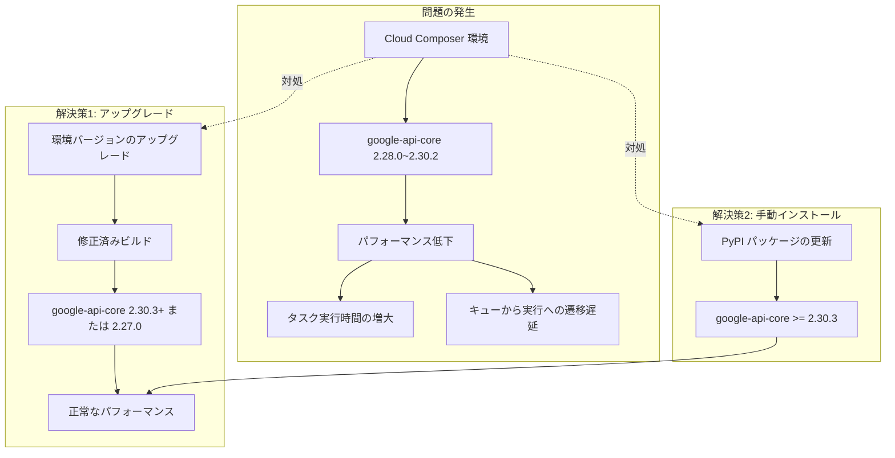

# Cloud Composer: google-api-core パッケージによるパフォーマンス低下問題

**リリース日**: 2026-05-14

**サービス**: Cloud Composer

**種別**: Issue (既知の問題)

**ステータス**: 修正版リリース済み

[このアップデートのインフォグラフィックを見る](https://takech9203.github.io/google-cloud-news-summary/20260514-cloud-composer-google-api-core-performance-issue.html)

## 概要

Cloud Composer 環境にプリインストールされている `google-api-core` パッケージのバージョン 2.28.0 から 2.30.2 において、環境パフォーマンスの低下を引き起こす問題が確認されました。この問題により、タスクの実行時間が長くなるほか、タスクがキュー状態から実行状態に遷移するまでの時間が増大します。

この問題は Managed Airflow (Gen 3) および Managed Airflow (Gen 2) の広範なビルドバージョンに影響しており、ワークフローのスケジューリングと実行の両面でパフォーマンスに影響を与えます。Google Cloud は修正版のビルドをリリース済みであり、環境のアップグレードまたはパッケージの手動更新による対処が推奨されています。

**問題の影響**

- タスクの実行時間が通常より長くなる
- タスクがキュー（queued）状態から実行（executing）状態に移行するまでの待機時間が増大する
- 環境全体のパフォーマンスが低下する

**推奨される対処**

- 修正済みビルドへのアップグレード
- または `google-api-core >= 2.30.3` の手動インストール

## アーキテクチャ図



この図は、問題の発生メカニズムと 2 つの解決策（環境アップグレードまたはパッケージの手動更新）のフローを示しています。

## 影響を受けるバージョン

### Managed Airflow (Gen 3)

| Airflow バージョン | 影響を受けるビルド範囲 |
|---|---|
| Airflow 3.1.7 | composer-3-airflow-3.1.7-build.0 ~ build.5 |
| Airflow 3.1.0 | composer-3-airflow-3.1.0-build.5 ~ build.10 |
| Airflow 2.11.1 | composer-3-airflow-2.11.1-build.0 |
| Airflow 2.10.5 | composer-3-airflow-2.10.5-build.22 ~ build.33 |
| Airflow 2.9.3 | composer-3-airflow-2.9.3-build.42 ~ build.53 |

### Managed Airflow (Gen 2)

| Airflow バージョン | 影響を受けるビルド範囲 |
|---|---|
| Airflow 2.11.1 | composer-2.16.10-airflow-2.11.1 |
| Airflow 2.10.5 | composer-2.16.0-airflow-2.10.5 ~ composer-2.16.10-airflow-2.10.5 |
| Airflow 2.9.3 | composer-2.16.0-airflow-2.9.3 ~ composer-2.16.10-airflow-2.9.3 |

## 推奨アップグレード先

### Managed Airflow (Gen 3)

| Airflow バージョン | 推奨ビルド | 備考 |
|---|---|---|
| Airflow 3.1.7 | composer-3-airflow-3.1.7-build.7 以降 | google-api-core 2.30.3+ を含む |
| Airflow 2.11.1 | composer-3-airflow-2.11.1-build.3 以降 | google-api-core 2.30.3+ を含む |
| Airflow 2.10.5 | composer-3-airflow-2.10.5-build.36 以降 | google-api-core 2.30.3+ を含む |
| Airflow 2.9.3 | composer-3-airflow-2.9.3-build.54 | google-api-core 2.27.0 を含む |

### Managed Airflow (Gen 2)

| Airflow バージョン | 推奨ビルド | 備考 |
|---|---|---|
| Airflow 2.11.1 | composer-2.17.0-airflow-2.11.1 以降 | google-api-core 2.30.3+ を含む |
| Airflow 2.10.5 | composer-2.17.0-airflow-2.10.5 以降 | google-api-core 2.30.3+ を含む |
| Airflow 2.11.1 | composer-2.16.11-airflow-2.11.1 | google-api-core 2.27.0 を含む |
| Airflow 2.10.5 | composer-2.16.11-airflow-2.10.5 | google-api-core 2.27.0 を含む |
| Airflow 2.9.3 | composer-2.16.11-airflow-2.9.3 | google-api-core 2.27.0 を含む |

## 対処方法

### 方法 1: 環境バージョンのアップグレード（推奨）

#### 前提条件

1. 対象の Cloud Composer 環境に対する `composer.environments.update` 権限を持つこと
2. アップグレード前に全ての DAG を一時停止し、実行中のタスクの完了を待つこと

#### 手順

##### ステップ 1: 現在のバージョンを確認

```bash
gcloud composer environments describe ENVIRONMENT_NAME \
  --location LOCATION \
  --format="value(config.softwareConfig.imageVersion)"
```

##### ステップ 2: 利用可能なアップグレード先を確認

```bash
gcloud composer environments list-upgrades \
  ENVIRONMENT_NAME \
  --location LOCATION
```

##### ステップ 3: 環境をアップグレード

```bash
gcloud composer environments update ENVIRONMENT_NAME \
  --location LOCATION \
  --image-version TARGET_VERSION
```

例（Gen 2 の場合）:

```bash
gcloud composer environments update my-composer-env \
  --location us-central1 \
  --image-version composer-2.17.0-airflow-2.11.1
```

### 方法 2: google-api-core の手動インストール（ワークアラウンド）

環境バージョンのアップグレードがすぐに実施できない場合、`google-api-core` パッケージを手動で更新することで問題を回避できます。

#### gcloud CLI を使用する場合

```bash
gcloud composer environments update ENVIRONMENT_NAME \
  --location LOCATION \
  --update-pypi-package "google-api-core>=2.30.3"
```

#### Google Cloud コンソールを使用する場合

1. Google Cloud コンソールで「Environments」ページに移動
2. 対象の環境名をクリック
3. 「PyPI packages」タブに移動
4. 「Edit」をクリック
5. 「Add package」をクリック
6. パッケージ名に `google-api-core`、バージョンに `>=2.30.3` を入力
7. 「Save」をクリック

## 影響の確認方法

以下の兆候が見られる場合、この問題の影響を受けている可能性があります:

- Airflow UI でタスクが「queued」状態に長時間留まる
- タスクの実行時間が以前よりも明らかに長い
- スケジューラのパフォーマンスメトリクスに低下が見られる

現在の `google-api-core` のバージョンを確認するには:

```bash
gcloud beta composer environments list-packages \
  ENVIRONMENT_NAME \
  --location LOCATION | grep google-api-core
```

## 考慮すべき点

- アップグレード操作中は DAG の実行を一時停止する必要がある
- Managed Airflow のリリースは段階的にリージョンに展開されるため、最新バージョンがすぐに利用できない場合がある
- 以前のバージョンへのダウングレードはサポートされていない
- PyPI パッケージの手動インストールは Cloud Build を使用するため、追加のビルド時間が発生する
- `google-api-core` のバージョンを更新する際、依存関係の競合がないか事前に確認すること

## 関連サービス・機能

- **Apache Airflow**: Cloud Composer の基盤となるワークフロー管理プラットフォーム
- **google-api-core**: Google API クライアントライブラリの共通基盤パッケージ。API リクエストの実行、リトライロジック、認証などを担当
- **Cloud Build**: PyPI パッケージの手動インストール時に使用されるビルドサービス

## 参考リンク

- [このアップデートのインフォグラフィック](https://takech9203.github.io/google-cloud-news-summary/20260514-cloud-composer-google-api-core-performance-issue.html)
- [公式リリースノート](https://cloud.google.com/release-notes#May_14_2026)
- [Cloud Composer 環境のアップグレード](https://docs.cloud.google.com/composer/docs/composer-2/upgrade-environments)
- [Cloud Composer PyPI パッケージのインストール](https://docs.cloud.google.com/composer/docs/composer-2/install-python-dependencies)
- [Cloud Composer の既知の問題](https://docs.cloud.google.com/composer/docs/composer-2/known-issues)
- [Cloud Composer バージョン一覧](https://docs.cloud.google.com/composer/docs/composer-versions)

## まとめ

`google-api-core` バージョン 2.28.0 ~ 2.30.2 を含む Cloud Composer ビルドにおいて、タスク実行とスケジューリングのパフォーマンスが低下する問題が確認されています。影響を受ける環境を使用している場合は、修正済みビルドへのアップグレード、または `google-api-core >= 2.30.3` の手動インストールを速やかに実施してください。本番ワークロードへの影響を最小限にするため、早急な対応が推奨されます。

---

**タグ**: #CloudComposer #Airflow #google-api-core #パフォーマンス #既知の問題 #アップグレード #ManagedAirflow
