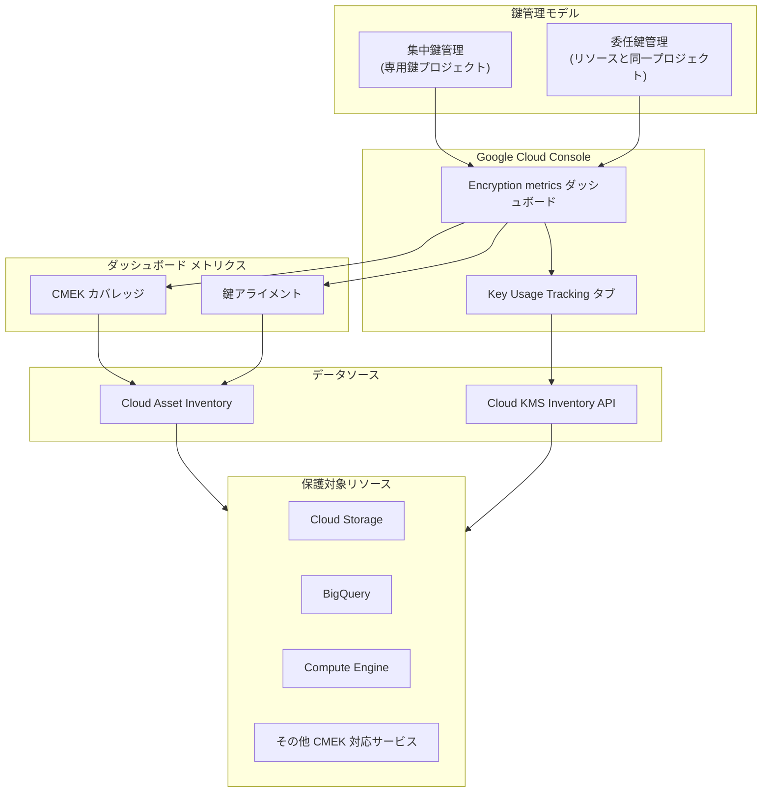

# Cloud Key Management Service (Cloud KMS): Encryption metrics ダッシュボードおよびプロジェクトレベルの鍵追跡が GA

**リリース日**: 2026-05-14

**サービス**: Cloud Key Management Service (Cloud KMS)

**機能**: Encryption metrics ダッシュボードおよびプロジェクトレベルの鍵追跡

**ステータス**: GA (一般提供)

[このアップデートのインフォグラフィックを見る](https://takech9203.github.io/google-cloud-news-summary/20260514-cloud-kms-encryption-metrics-dashboard-ga.html)

## 概要

Cloud KMS の Encryption metrics ダッシュボードおよびプロジェクトレベルの鍵使用状況追跡 (Key Usage Tracking) が一般提供 (GA) となった。これにより、顧客管理暗号鍵 (CMEK) の統合状況や、CMEK が保護しているリソースの概要と詳細を一元的に把握できるようになる。

Encryption metrics ダッシュボードでは、CMEK カバレッジ (どのリソースが CMEK で保護されているか) と鍵アライメント (鍵が推奨されるセキュリティプラクティスに準拠しているか) の 2 つの主要メトリクスを可視化する。プロジェクトレベルの鍵追跡では、個別の鍵がどのリソースを保護しているかを確認できる。

本機能は、専用の鍵プロジェクトを使用する集中鍵管理モデルと、リソースと同じプロジェクトに鍵を保存する委任鍵管理モデルの両方をサポートしている。GA リリースにより、本番ワークロードでの使用が正式にサポートされ、SLA の対象となる。

**アップデート前の課題**

- CMEK の使用状況を組織全体で把握するには、Cloud Asset Inventory API を直接クエリするか、独自のスクリプトを構築する必要があった
- どのリソースが Google デフォルト暗号化のままで、どのリソースが CMEK で保護されているかを一目で確認する手段がなかった
- 鍵がセキュリティベストプラクティス (ローテーション周期、粒度、職務分離、ロケーション一致) に準拠しているかどうかを個別に確認する必要があった
- Preview 段階では本番環境での利用に対する SLA 保証がなかった

**アップデート後の改善**

- Google Cloud コンソールから Encryption metrics ダッシュボードで CMEK カバレッジと鍵アライメントを即座に確認可能になった
- プロジェクトレベルの鍵使用状況追跡により、個々の鍵がどのリソースを保護しているかを詳細に確認できるようになった
- GA リリースにより SLA が適用され、本番環境での信頼性が保証される
- 集中鍵管理と委任鍵管理の両モデルで統一的なダッシュボード体験が提供される

## アーキテクチャ図



Encryption metrics ダッシュボードは Cloud Asset Inventory と Cloud KMS Inventory API からデータを取得し、CMEK カバレッジ、鍵アライメント、鍵使用状況の 3 つの観点でメトリクスを提供する。

## サービスアップデートの詳細

### 主要機能

1. **CMEK カバレッジ メトリクス**
   - プロジェクト内のリソースが「Google マネージド暗号化」「Cloud KMS (手動)」「Cloud KMS (Autokey)」のいずれで保護されているかを可視化
   - サービスごとの保護タイプの内訳を表示
   - CMEK に移行すべきリソースの特定が容易になる

2. **鍵アライメント メトリクス**
   - **ローテーション周期**: 鍵に適切なローテーション周期が設定されているか
   - **粒度 (Granularity)**: 鍵が単一プロジェクト・単一サービスのリソースのみを保護しているか
   - **職務分離 (Separation of Duties)**: サービスアカウントのみが暗号化・復号権限を持っているか
   - **ロケーション**: 鍵が同じクラウドロケーションのリソースのみを保護しているか

3. **プロジェクトレベルの鍵使用状況追跡**
   - 個別の鍵がどのリソースを保護しているかの詳細ビュー
   - 保護されているリソース数、プロジェクト数、使用プロダクト数のサマリー
   - 組織レベルまたはプロジェクトレベルでのスコープ選択が可能

4. **集中・委任両鍵管理モデルのサポート**
   - 集中鍵管理: Cloud KMS Organization Service Agent ロールを使用して組織横断のメトリクスを表示
   - 委任鍵管理: プロジェクトスコープでの鍵使用データを表示

## 技術仕様

### 必要な IAM ロール

| ロール | 目的 |
|--------|------|
| `roles/cloudkms.encryptionDashboardViewer` | Encryption metrics ダッシュボードの閲覧 |
| `roles/cloudasset.viewer` | CMEK カバレッジ詳細の閲覧 |
| `roles/cloudkms.viewer` | 鍵使用状況サマリーの閲覧 |
| `roles/cloudkms.protectedResourcesViewer` | 鍵使用状況の詳細閲覧 (プロジェクトまたは組織レベル) |
| `roles/cloudkms.orgServiceAgent` | 組織横断データの集約 (Cloud KMS サービスアカウントに付与) |

### 集中鍵管理モデルでの組織サービスエージェント設定

```bash
gcloud organizations add-iam-policy-binding ORGANIZATION_ID \
  --member=serviceAccount:service-org-ORGANIZATION_ID@gcp-sa-cloudkms.iam.gserviceaccount.com \
  --role=roles/cloudkms.orgServiceAgent
```

## 設定方法

### 前提条件

1. Cloud KMS API が有効化されたプロジェクト
2. 適切な IAM ロール (`roles/cloudkms.encryptionDashboardViewer` および `roles/cloudasset.viewer`)
3. 集中鍵管理モデルの場合: Cloud KMS Organization Service Agent ロールの設定

### 手順

#### ステップ 1: Encryption metrics ダッシュボードへのアクセス

Google Cloud コンソールで Key Management ページに移動し、**Overview** タブをクリックしてから **Encryption metrics** をクリックする。

#### ステップ 2: プロジェクトの選択

プロジェクトピッカーを使用してメトリクスを確認したいプロジェクトを選択する。ダッシュボードにそのプロジェクトの暗号化メトリクスが表示される。

#### ステップ 3: 鍵使用状況の確認

Key Inventory ページで鍵を選択し、**Usage tracking** タブをクリックして、その鍵が保護しているリソースの詳細を確認する。

#### ステップ 4: gcloud CLI での鍵使用状況サマリー取得

```bash
gcloud kms inventory get-protected-resources-summary \
  --keyname projects/PROJECT_ID/locations/LOCATION/keyRings/KEY_RING/cryptoKeys/KEY_NAME
```

#### ステップ 5: gcloud CLI での鍵使用状況詳細取得

```bash
gcloud kms inventory search-protected-resources \
  --keyname projects/PROJECT_ID/locations/LOCATION/keyRings/KEY_RING/cryptoKeys/KEY_NAME \
  --scope=organizations/ORGANIZATION_ID
```

## メリット

### ビジネス面

- **コンプライアンスの可視化**: 規制要件に対する暗号化状況を即座に把握でき、監査対応が容易になる
- **リスク管理の強化**: CMEK 未適用のリソースを特定し、暗号化ポリシーのギャップを迅速に解消できる
- **GA による信頼性保証**: SLA が適用されるため、本番環境でのセキュリティ運用ツールとして安心して利用可能

### 技術面

- **一元的な可視性**: プロジェクト単位で全ての暗号化メトリクスを集約し、分散した情報を統合
- **ベストプラクティスへの準拠確認**: ローテーション、粒度、職務分離、ロケーション一致の 4 つの観点で自動評価
- **API によるプログラマティックアクセス**: Cloud KMS Inventory API を通じて自動化やカスタムダッシュボードの構築が可能

## デメリット・制約事項

### 制限事項

- ダッシュボードは一度に 1 プロジェクトのみ表示可能
- プロジェクトあたりリソースまたは鍵が 10,000 件を超える場合、部分的なメトリクスのみ表示される
- 対称鍵のみが鍵アライメントと CMEK カバレッジの対象
- 鍵使用状況追跡がサポートされているリソースタイプのみが対象
- Cloud Asset Inventory のデータが最新でない場合、不正確または不完全な情報が表示される可能性がある

### 考慮すべき点

- 集中鍵管理モデルでは Cloud KMS Organization Service Agent ロールの設定が必須。未設定の場合、組織横断のデータが不完全になる
- 鍵使用状況追跡の情報は参考目的であり、鍵バージョンの無効化や破棄の判断は他のソースと合わせて行うべき
- データの反映に遅延が発生する場合がある (新しいリソース作成後、即座に Usage tracking タブに反映されない)
- Cloud Storage の鍵使用データは、オブジェクトレベルではなくバケットレベルで集約される

## ユースケース

### ユースケース 1: 組織全体の CMEK 導入状況の監査

**シナリオ**: セキュリティチームが組織内の全プロジェクトについて、CMEK の導入状況を定期的に確認し、暗号化ポリシーへの準拠を検証したい。

**効果**: Encryption metrics ダッシュボードで各プロジェクトの CMEK カバレッジを確認し、Google デフォルト暗号化のままのリソースを特定して、CMEK への移行計画を策定できる。

### ユースケース 2: 鍵のセキュリティベストプラクティス準拠確認

**シナリオ**: 鍵管理者が、作成された全ての CMEK が組織のセキュリティポリシー (90 日以内のローテーション、プロジェクト・サービス単位の粒度、職務分離) に準拠しているか確認したい。

**効果**: 鍵アライメントメトリクスにより、推奨プラクティスに準拠していない鍵を一覧で把握し、個別に対処できる。Autokey で作成された鍵と手動作成の鍵を区別してフィルタリングすることも可能。

### ユースケース 3: 鍵の無効化前の影響範囲確認

**シナリオ**: 不要になった鍵を無効化または破棄する前に、その鍵がどのリソースを保護しているかを確認し、データ損失を防ぎたい。

**効果**: Key Usage Tracking タブで当該鍵が保護している全リソース (プロジェクト、サービス、ロケーション) を確認し、安全に鍵のライフサイクル操作を実行できる。

## 関連サービス・機能

- **Cloud KMS Autokey**: CMEK の自動プロビジョニングと割り当てを行い、ベストプラクティスに準拠した鍵を自動生成
- **Cloud Asset Inventory**: Encryption metrics ダッシュボードのデータソースとして使用される
- **Cloud KMS Inventory API**: 鍵使用状況追跡のプログラマティックアクセスを提供
- **組織ポリシー (CMEK)**: CMEK の使用を強制する組織ポリシー制約との連携

## 参考リンク

- [インフォグラフィック](https://takech9203.github.io/google-cloud-news-summary/20260514-cloud-kms-encryption-metrics-dashboard-ga.html)
- [公式リリースノート](https://cloud.google.com/release-notes#May_14_2026)
- [Encryption metrics の確認 - ドキュメント](https://cloud.google.com/kms/docs/view-encryption-metrics)
- [鍵の使用状況の確認 - ドキュメント](https://cloud.google.com/kms/docs/view-key-usage)
- [CMEK ベストプラクティス](https://cloud.google.com/kms/docs/cmek-best-practices)
- [Cloud KMS 料金](https://cloud.google.com/kms/pricing)

## まとめ

Cloud KMS Encryption metrics ダッシュボードとプロジェクトレベルの鍵追跡の GA リリースにより、CMEK の運用状況を本番環境で信頼性をもって可視化・管理できるようになった。セキュリティチームや鍵管理者は、このダッシュボードを活用して暗号化ポリシーへの準拠状況を継続的に監視し、鍵のライフサイクル管理を効率化することが推奨される。

---

**タグ**: #CloudKMS #暗号化 #CMEK #セキュリティ #鍵管理 #GA #ダッシュボード #コンプライアンス
