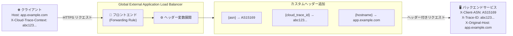

# Cloud Load Balancing: カスタムヘッダー変数の追加 (asn, cloud_trace_id, hostname)

**リリース日**: 2026-05-14

**サービス**: Cloud Load Balancing

**機能**: カスタムリクエスト/レスポンスヘッダーに新しい変数 (asn, cloud_trace_id, hostname) を追加

**ステータス**: Feature (GA)

📊 [このアップデートのインフォグラフィックを見る](https://takech9203.github.io/google-cloud-news-summary/20260514-cloud-load-balancing-custom-header-variables.html)

## 概要

Google Cloud は Application Load Balancer のカスタムリクエスト/レスポンスヘッダーで使用できる新しい変数として `asn`、`cloud_trace_id`、`hostname` の 3 つを追加した。これらの変数により、ロードバランサーがバックエンドにリクエストを転送する際、またはクライアントにレスポンスを返す際に、ネットワーク識別情報、分散トレーシング ID、オリジナルのホスト名をヘッダーに自動的に埋め込むことが可能になった。

この機能は、グローバル外部 Application Load Balancer およびクラシック Application Load Balancer の両方で利用可能であり、セキュリティ分析、分散トレーシング、マルチテナントルーティングなど幅広いユースケースに対応する。既存のカスタムヘッダー変数 (client_region, client_city, client_ip_address など) と組み合わせることで、より高度なトラフィック制御とオブザーバビリティを実現できる。

**アップデート前の課題**

- ASN (自律システム番号) をバックエンドに伝達するには、外部のジオ IP データベースを使用してクライアント IP から ASN を逆引きする必要があった
- Cloud Trace のトレース ID をバックエンドに伝達するには、アプリケーション側で `X-Cloud-Trace-Context` ヘッダーや `traceparent` ヘッダーを自前でパースして転送する必要があった
- クライアントが指定したオリジナルの Host ヘッダーの値をバックエンドで参照するには、`X-Forwarded-Host` ヘッダーを別途設定するか、アプリケーション側で処理する必要があった

**アップデート後の改善**

- `{asn}` 変数を使用することで、ロードバランサーが自動的にクライアント IP に関連付けられた ASN を解決し、カスタムヘッダーに埋め込めるようになった
- `{cloud_trace_id}` 変数を使用することで、HTTP リクエストヘッダーからトレース ID を抽出 (または生成) し、バックエンドサービスに一貫して伝達できるようになった
- `{hostname}` 変数を使用することで、クライアントが Host ヘッダーで指定したオリジナルのホスト名を保持し、バックエンドに転送できるようになった (X-Forwarded-Host 相当の機能)

## アーキテクチャ図



ロードバランサーがクライアントからのリクエストを受信すると、設定されたカスタムヘッダー変数を展開し、バックエンドへの転送リクエストに自動的に付加する。

## サービスアップデートの詳細

### 主要機能

1. **asn (Autonomous System Number)**
   - クライアントの IP アドレスに関連付けられた自律システム番号 (ASN) を提供
   - ISP やクラウドプロバイダー、組織のネットワークを識別可能
   - セキュリティポリシーの強化やトラフィック分析に活用できる
   - 例: `{asn}` → `AS15169` (Google)、`AS16509` (Amazon) など

2. **cloud_trace_id (Cloud Trace ID)**
   - HTTP リクエストヘッダーからトレース ID を抽出、またはトレースコンテキストがない場合は新規生成
   - Cloud Trace との統合により、エンドツーエンドの分散トレーシングを実現
   - `X-Cloud-Trace-Context` ヘッダーおよび W3C `traceparent` ヘッダーとの互換性
   - ロードバランサー層でのトレース ID の一元管理が可能

3. **hostname (オリジナルホスト名)**
   - クライアントが Host HTTP リクエストヘッダーで指定したオリジナルのホスト名を保持
   - `X-Forwarded-Host` ヘッダーと同等の機能を提供
   - マルチテナント環境やリバースプロキシ構成でオリジナルのホスト情報を保持する際に有用
   - ロードバランサーによる Host ヘッダーの書き換え後も元の値を参照可能

## 技術仕様

### サポートされるロードバランサータイプ

| ロードバランサータイプ | サポート状況 | ネットワークティア |
|----------------------|-------------|------------------|
| グローバル外部 Application Load Balancer | 対応 | Premium Tier のみ |
| クラシック Application Load Balancer | 対応 | Premium / Standard Tier |
| リージョン外部 Application Load Balancer | 未記載 | - |
| 内部 Application Load Balancer | 未記載 | - |

### 変数一覧と既存変数との比較

| 変数名 | カテゴリ | 用途 | 新規/既存 |
|--------|---------|------|----------|
| `asn` | ネットワーク識別 | クライアント IP の ASN | 新規 |
| `cloud_trace_id` | オブザーバビリティ | 分散トレーシング ID | 新規 |
| `hostname` | リクエスト情報 | オリジナル Host ヘッダー | 新規 |
| `client_region` | 地理情報 | クライアントの国/地域 | 既存 |
| `client_city` | 地理情報 | クライアントの都市名 | 既存 |
| `client_ip_address` | ネットワーク識別 | クライアント IP アドレス | 既存 |
| `tls_ja3_fingerprint` | セキュリティ | TLS フィンガープリント | 既存 |

### カスタムヘッダーの制限事項

| 項目 | 制限値 |
|------|--------|
| カスタムリクエストヘッダー数上限 | 16 ヘッダー/バックエンドサービス |
| カスタムレスポンスヘッダー数上限 | 16 ヘッダー/バックエンドサービス |
| ヘッダーサイズ上限 (名前+値) | 8 KB/バックエンドサービス |

## 設定方法

### 前提条件

1. グローバル外部 Application Load Balancer またはクラシック Application Load Balancer が設定済みであること
2. gcloud CLI バージョン 309.0.0 以降がインストールされていること
3. バックエンドサービスが作成済みであること

### 手順

#### ステップ 1: バックエンドサービスにカスタムリクエストヘッダーを追加

```bash
# ASN ヘッダーの追加
gcloud compute backend-services update BACKEND_SERVICE_NAME \
  --global \
  --custom-request-header='X-Client-ASN:{asn}'

# Cloud Trace ID ヘッダーの追加
gcloud compute backend-services update BACKEND_SERVICE_NAME \
  --global \
  --custom-request-header='X-Trace-ID:{cloud_trace_id}'

# オリジナルホスト名ヘッダーの追加
gcloud compute backend-services update BACKEND_SERVICE_NAME \
  --global \
  --custom-request-header='X-Original-Host:{hostname}'
```

#### ステップ 2: 複数のヘッダーを一括設定

```bash
# 複数のカスタムヘッダーを同時に設定
gcloud compute backend-services update BACKEND_SERVICE_NAME \
  --global \
  --custom-request-header='X-Client-ASN:{asn}' \
  --custom-request-header='X-Trace-ID:{cloud_trace_id}' \
  --custom-request-header='X-Original-Host:{hostname}' \
  --custom-request-header='X-Client-Geo:{client_region},{client_city}'
```

#### ステップ 3: カスタムレスポンスヘッダーとして設定 (デバッグ用)

```bash
# レスポンスヘッダーにも追加 (デバッグやクライアント側トレーシングに有用)
gcloud compute backend-services update BACKEND_SERVICE_NAME \
  --global \
  --custom-response-header='X-Trace-ID:{cloud_trace_id}' \
  --custom-response-header='X-Served-By:{hostname}'
```

## メリット

### ビジネス面

- **セキュリティ強化**: ASN ベースのトラフィック分析により、不正アクセスの検知精度が向上し、特定の ISP やネットワークからの攻撃パターンを識別可能
- **運用コスト削減**: 分散トレーシングの設定がロードバランサー層で完結するため、アプリケーション側の実装工数を削減
- **マルチテナント対応の簡素化**: hostname 変数により、リバースプロキシ構成でのテナント識別がシンプルになり、マルチテナントアーキテクチャの構築が容易

### 技術面

- **オブザーバビリティ向上**: cloud_trace_id によりロードバランサーからバックエンドまでの一貫したトレーシングが実現し、レイテンシの原因特定が容易
- **ネットワークレベルの可視性**: ASN 情報により、トラフィックの送信元ネットワークを正確に識別でき、ジオブロッキングより精細なアクセス制御が可能
- **ヘッダー管理の一元化**: ロードバランサーのバックエンドサービス設定でヘッダーを一元管理でき、アプリケーションコードの変更が不要

## デメリット・制約事項

### 制限事項

- リージョン外部 Application Load Balancer および内部 Application Load Balancer での利用可否は現時点で明記されていない
- カスタムヘッダーはヘルスチェックプローブには追加されないため、ヘッダーベースの認証をバックエンドで使用している場合はヘルスチェックに影響する可能性がある
- バックエンドサービスあたり最大 16 ヘッダー、合計 8 KB のサイズ制限がある
- ASN の値は IP アドレスの所在が不明な場合、空文字列に展開される

### 考慮すべき点

- URL マップとバックエンドサービスの両方にカスタムヘッダーが設定されている場合、同じヘッダー名では URL マップの設定が優先される
- Cloud Armor のセキュリティポリシーで同名のカスタムヘッダーを設定した場合、ロードバランサーの値で上書きされる
- ヘッダー名として `X-Google`、`X-Goog-`、`X-GFE`、`X-Amz-` で始まる名前は使用不可

## ユースケース

### ユースケース 1: ASN ベースのセキュリティフィルタリング

**シナリオ**: 金融サービス企業が、既知の VPN プロバイダーやホスティング業者の ASN からのアクセスに対して追加認証を要求したい場合。

**実装例**:
```bash
# バックエンドサービスに ASN ヘッダーを追加
gcloud compute backend-services update financial-app-backend \
  --global \
  --custom-request-header='X-Client-ASN:{asn}' \
  --custom-request-header='X-Client-IP:{client_ip_address}'
```

```python
# バックエンド側での ASN チェック例
SUSPICIOUS_ASNS = ['AS9009', 'AS16276', 'AS14061']  # 例: VPN/ホスティング

def check_request(request):
    client_asn = request.headers.get('X-Client-ASN', '')
    if client_asn in SUSPICIOUS_ASNS:
        return require_additional_auth(request)
    return process_normally(request)
```

**効果**: 外部のジオ IP データベースを別途用意することなく、ロードバランサーが提供する正確な ASN 情報に基づいてリスクベースの認証を実装可能。

### ユースケース 2: エンドツーエンド分散トレーシング

**シナリオ**: マイクロサービスアーキテクチャで、ロードバランサーからバックエンドの各サービスまでの処理フローを Cloud Trace で一貫して追跡したい場合。

**実装例**:
```bash
# トレース ID をバックエンドに伝播
gcloud compute backend-services update api-gateway-backend \
  --global \
  --custom-request-header='X-Trace-ID:{cloud_trace_id}' \
  --custom-response-header='X-Trace-ID:{cloud_trace_id}'
```

**効果**: Cloud Trace との統合により、ロードバランサー層で生成・抽出されたトレース ID がバックエンドに一貫して伝達され、サービス間のレイテンシ分析が容易になる。クライアントがトレースヘッダーを送信しない場合でもロードバランサーが自動生成するため、トレーシングの網羅性が向上する。

### ユースケース 3: マルチテナントルーティング

**シナリオ**: SaaS プラットフォームで、単一のロードバランサーの背後にある共有バックエンドが、クライアントのオリジナルホスト名に基づいてテナントを識別し、データを分離する必要がある場合。

**実装例**:
```bash
# オリジナルホスト名をバックエンドに伝達
gcloud compute backend-services update saas-backend \
  --global \
  --custom-request-header='X-Tenant-Host:{hostname}'
```

```python
# バックエンド側でのテナント識別例
TENANT_MAP = {
    'tenant-a.example.com': 'tenant_a_db',
    'tenant-b.example.com': 'tenant_b_db',
}

def route_to_tenant(request):
    original_host = request.headers.get('X-Tenant-Host', '')
    tenant_db = TENANT_MAP.get(original_host, 'default_db')
    return connect_to_database(tenant_db)
```

**効果**: ロードバランサーが Host ヘッダーを書き換えた場合でも、オリジナルのホスト名がバックエンドに伝達されるため、テナント識別ロジックが確実に動作する。

## 料金

カスタムヘッダー変数の使用自体には追加料金は発生しない。通常の Cloud Load Balancing の料金体系が適用される。

詳細な料金情報は [Cloud Load Balancing の料金ページ](https://cloud.google.com/vpc/network-pricing#cloud-load-balancing) を参照。

## 利用可能リージョン

グローバル外部 Application Load Balancer はグローバルリソースであり、すべての Google Cloud リージョンで利用可能。クラシック Application Load Balancer も Premium Tier ではグローバルで利用可能。

## 関連サービス・機能

- **Cloud Trace**: `cloud_trace_id` 変数と直接連携し、エンドツーエンドの分散トレーシングを実現。W3C `traceparent` ヘッダーおよび `X-Cloud-Trace-Context` ヘッダーに対応
- **Cloud Armor**: カスタムヘッダーと組み合わせてセキュリティポリシーを構成可能。ASN 情報を活用した高度なアクセス制御に利用できる
- **Cloud CDN**: バックエンドバケットでもカスタムレスポンスヘッダーが設定可能。CDN キャッシュステータスとトレース ID を組み合わせたデバッグに有用
- **Cloud Logging**: ロードバランサーのアクセスログに記録されるフィールドと組み合わせることで、包括的なトラフィック分析が可能

## 参考リンク

- 📊 [インフォグラフィック](https://takech9203.github.io/google-cloud-news-summary/20260514-cloud-load-balancing-custom-header-variables.html)
- [公式リリースノート](https://docs.cloud.google.com/release-notes#May_14_2026)
- [カスタムヘッダーの作成 (バックエンドサービス)](https://docs.cloud.google.com/load-balancing/docs/https/custom-headers-global)
- [Cloud Trace コンテキスト伝播](https://docs.cloud.google.com/trace/docs/trace-context)
- [Cloud Load Balancing の料金](https://cloud.google.com/vpc/network-pricing#cloud-load-balancing)

## まとめ

今回追加された 3 つのカスタムヘッダー変数 (asn, cloud_trace_id, hostname) は、Application Load Balancer のオブザーバビリティとセキュリティ機能を大幅に強化するアップデートである。特に、ASN ベースのトラフィック分析、ロードバランサー層での分散トレーシング ID の一元管理、マルチテナント環境でのホスト名保持は、エンタープライズ環境で頻繁に求められる要件であり、アプリケーション側の実装を簡素化しつつインフラストラクチャレベルでの制御を可能にする。既存のカスタムヘッダー設定に追加する形で即座に利用可能であるため、該当する Load Balancer を使用している場合は早期の導入検討を推奨する。

---

**タグ**: #CloudLoadBalancing #ApplicationLoadBalancer #CustomHeaders #ASN #DistributedTracing #CloudTrace #Networking #Security #Observability
