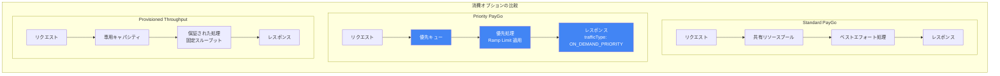

# Gemini Enterprise Agent Platform: Priority PayGo が一般提供 (GA) に

**リリース日**: 2026-05-14

**サービス**: Gemini Enterprise Agent Platform

**機能**: Priority PayGo (一般提供)

**ステータス**: GA (一般提供)

[このアップデートのインフォグラフィックを見る](https://takech9203.github.io/google-cloud-news-summary/20260514-gemini-enterprise-agent-platform-priority-paygo-ga.html)

## 概要

Gemini Enterprise Agent Platform において、Priority PayGo (Priority Pay-as-you-go) が一般提供 (GA) となりました。Priority PayGo は、Standard PayGo よりも安定したパフォーマンスを提供しつつ、Provisioned Throughput のような事前コミットメントを必要としない消費オプションです。

Priority PayGo は、トラフィックパターンが変動的または予測不可能なビジネスクリティカルなワークロードに最適化されています。顧客対応の仮想アシスタント、エージェンティックワークフロー、研究シミュレーションなど、高い可用性と安定したレイテンシが求められるユースケースに適しています。

今回の GA リリースにより、本番環境での利用が正式にサポートされ、SLA の対象となります。これまで Preview として提供されていた機能が、エンタープライズグレードの信頼性を持って利用可能になりました。

**アップデート前の課題**

- Standard PayGo ではトラフィック集中時にパフォーマンスが不安定になる可能性があった
- Provisioned Throughput は安定したパフォーマンスを提供するが、事前の容量コミットメントと固定費用が必要だった
- トラフィックが変動するワークロードでは、Provisioned Throughput の容量を適切にサイジングすることが困難だった
- Priority PayGo は Preview 段階であり、本番環境での利用にはリスクがあった

**アップデート後の改善**

- 事前コミットメントなしで Standard PayGo より安定したパフォーマンスを GA として利用可能に
- ビジネスクリティカルなワークロードにおいて、トラフィック変動に柔軟に対応しつつ一貫性のあるレスポンスを実現
- Provisioned Throughput との併用モード (スピルオーバー) により、容量超過時にも優先的な処理を維持可能
- GA リリースにより SLA の対象となり、本番環境での利用が正式にサポート

## アーキテクチャ図



Standard PayGo、Priority PayGo、Provisioned Throughput の 3 つの消費オプションにおけるリクエスト処理フローの違いを示しています。Priority PayGo は優先キューを通じて処理され、Ramp Limit の範囲内で安定したパフォーマンスを提供します。

## サービスアップデートの詳細

### 主要機能

1. **Priority PayGo の GA リリース**
   - Preview から一般提供に移行し、本番環境での利用が正式にサポート
   - Standard PayGo と比較して、より安定した一貫性のあるパフォーマンスを提供
   - 事前の容量コミットメントや固定費用は不要で、トークン使用量に基づく従量課金

2. **Provisioned Throughput とのスピルオーバー連携**
   - Provisioned Throughput のクォータを優先的に消費し、超過分を Priority PayGo にスピルオーバー
   - `X-Vertex-AI-LLM-Shared-Request-Type: priority` ヘッダーの設定で有効化
   - コスト最適化と安定パフォーマンスの両立が可能

3. **Ramp Limit によるパフォーマンス管理**
   - 組織レベルで Ramp Limit が設定され、予測可能で安定したパフォーマンスを確保
   - Flash / Flash-Lite モデル: 初期 4M tokens/min
   - Pro モデル: 初期 1M tokens/min
   - 10 分間の持続使用ごとに 50% ずつ上限が増加

4. **利用状況の検証機能**
   - レスポンスの `trafficType` フィールドで Priority PayGo が使用されたことを確認可能
   - `ON_DEMAND_PRIORITY`: Priority PayGo で処理
   - `ON_DEMAND`: Standard PayGo にダウングレードされた場合

## 技術仕様

### 対応モデル

Priority PayGo はグローバルエンドポイントのみでサポートされています。リージョナルまたはマルチリージョナルエンドポイントでは利用できません。

| モデル | サポート状況 |
|--------|------------|
| gemini-3.1-flash-lite | 対応 |
| gemini-3.1-pro-preview | 対応 |
| gemini-3-flash-preview | 対応 |
| gemini-2.5-pro | 対応 |
| gemini-2.5-flash | 対応 |
| gemini-2.5-flash-lite | 対応 |

### HTTP ヘッダー設定

| 利用パターン | 必要なヘッダー |
|------------|--------------|
| PT + Priority PayGo スピルオーバー | `X-Vertex-AI-LLM-Shared-Request-Type: priority` |
| Priority PayGo のみ | `X-Vertex-AI-LLM-Request-Type: shared` + `X-Vertex-AI-LLM-Shared-Request-Type: priority` |

### Ramp Limit

| モデルタイプ | 初期 Ramp Limit | 増加率 |
|------------|----------------|--------|
| Flash / Flash-Lite | 4M tokens/min | 10 分ごとに 50% 増加 |
| Pro | 1M tokens/min | 10 分ごとに 50% 増加 |

## 設定方法

### 前提条件

1. Google Cloud プロジェクトが有効であること
2. Gemini Enterprise Agent Platform API が有効化されていること
3. 適切な IAM 権限が付与されていること

### 手順

#### ステップ 1: Python SDK のインストール

```bash
pip install --upgrade google-genai
```

#### ステップ 2: 環境変数の設定

```bash
export GOOGLE_CLOUD_PROJECT=YOUR_PROJECT_ID
export GOOGLE_CLOUD_LOCATION=global
export GOOGLE_GENAI_USE_VERTEXAI=True
```

#### ステップ 3: Priority PayGo のみを使用する場合

```python
from google import genai
from google.genai.types import HttpOptions

client = genai.Client(
    vertexai=True,
    project='your_project_id',
    location='global',
    http_options=HttpOptions(
        api_version="v1",
        headers={
            "X-Vertex-AI-LLM-Request-Type": "shared",
            "X-Vertex-AI-LLM-Shared-Request-Type": "priority"
        },
    )
)

response = client.models.generate_content(
    model="gemini-2.5-flash",
    contents="How does AI work?",
)
print(response.text)
```

#### ステップ 4: Provisioned Throughput + Priority PayGo スピルオーバー

```python
from google import genai
from google.genai.types import HttpOptions

client = genai.Client(
    vertexai=True,
    project='your_project_id',
    location='global',
    http_options=HttpOptions(
        api_version="v1",
        headers={
            "X-Vertex-AI-LLM-Shared-Request-Type": "priority"
        },
    )
)
```

#### ステップ 5: REST API での利用

```bash
curl -X POST \
  -H "Authorization: Bearer $(gcloud auth print-access-token)" \
  -H "Content-Type: application/json; charset=utf-8" \
  -H "X-Vertex-AI-LLM-Request-Type: shared" \
  -H "X-Vertex-AI-LLM-Shared-Request-Type: priority" \
  "https://aiplatform.googleapis.com/v1/projects/PROJECT_ID/locations/global/publishers/google/models/MODEL_ID:generateContent" -d \
  '{
    "contents": {
      "role": "user",
      "parts": {
        "text": "PROMPT_TEXT"
      }
    }
  }'
```

## メリット

### ビジネス面

- **柔軟なコスト管理**: 事前コミットメントなしで従量課金のまま、安定したパフォーマンスを確保。トラフィック変動が大きいワークロードに最適
- **ビジネス継続性の向上**: ビジネスクリティカルなアプリケーションにおいて、トラフィック急増時にもサービス品質を維持
- **段階的なスケーリング**: Ramp Limit の自動増加により、使用量の増加に応じて自然にスケール

### 技術面

- **実装の容易さ**: HTTP ヘッダーの追加のみで既存コードから移行可能。SDK レベルで一度設定すれば以降のリクエストに自動適用
- **Provisioned Throughput との連携**: スピルオーバー機能により、PT の容量超過時にも Priority レベルの処理を維持
- **可観測性**: レスポンスの `trafficType` フィールドで実際の処理ティアを確認可能

## デメリット・制約事項

### 制限事項

- グローバルエンドポイントのみサポート。リージョナル / マルチリージョナルエンドポイントでは利用不可
- Ramp Limit を超過した場合、リクエストが Standard PayGo にダウングレードされる可能性あり
- すべてのモデルが対応しているわけではない (一部のプレビューモデルや特殊用途モデルは非対応)

### 考慮すべき点

- Standard PayGo 比で約 1.8 倍の料金が発生するため、コスト対効果の検討が必要
- 一貫した高スループットが常時必要な場合は、Provisioned Throughput の方がコスト効率が良い可能性がある
- Ramp Limit は組織レベルで適用されるため、複数プロジェクトでの利用時は全体の消費量を考慮する必要がある

## ユースケース

### ユースケース 1: 顧客対応バーチャルアシスタント

**シナリオ**: EC サイトのチャットボットで、セール期間中にトラフィックが通常の 5-10 倍に急増する状況

**実装例**:
```python
from google import genai
from google.genai.types import HttpOptions

client = genai.Client(
    vertexai=True,
    project='ecommerce-prod',
    location='global',
    http_options=HttpOptions(
        api_version="v1",
        headers={
            "X-Vertex-AI-LLM-Request-Type": "shared",
            "X-Vertex-AI-LLM-Shared-Request-Type": "priority"
        },
    )
)
```

**効果**: トラフィック急増時にも安定したレスポンスタイムを維持し、顧客体験を損なわない。Provisioned Throughput のような事前の容量計画が不要で、セール後は自動的にコストが下がる。

### ユースケース 2: エージェンティックワークフロー

**シナリオ**: 複数の AI エージェントが連携して業務を自動処理するシステムで、エージェント間の通信レイテンシを最小化したい

**効果**: エージェント間のクロスコール時に優先処理されるため、ワークフロー全体の処理時間が短縮される。変動するワークロードに対してもコミットメントなしで安定したパフォーマンスを実現。

### ユースケース 3: Provisioned Throughput のスピルオーバー保護

**シナリオ**: Provisioned Throughput を購入済みだが、予測困難なピーク時に容量超過が発生する場合のフォールバック

**効果**: 通常時は Provisioned Throughput の固定コストで処理し、ピーク時のみ Priority PayGo にスピルオーバー。Standard PayGo へのダウングレードを防ぎ、常に高品質な処理を維持。

## 料金

Priority PayGo は Standard PayGo に対して約 1.8 倍の料金が設定されています。

### 料金例 (Gemini 2.5 Flash)

| 項目 | Standard PayGo | Priority PayGo |
|------|---------------|----------------|
| 入力 (テキスト/画像/動画) | $0.30/1M tokens | $0.54/1M tokens |
| 音声入力 | $1.00/1M tokens | $1.80/1M tokens |
| テキスト出力 | $2.50/1M tokens | $4.50/1M tokens |

### 料金例 (Gemini 2.5 Pro)

| 項目 | Standard PayGo | Priority PayGo |
|------|---------------|----------------|
| 入力 (200K tokens 以下) | $1.25/1M tokens | $2.25/1M tokens |
| 入力 (200K tokens 超) | $2.50/1M tokens | $4.50/1M tokens |
| テキスト出力 (200K 以下) | $10.00/1M tokens | $18.00/1M tokens |
| テキスト出力 (200K 超) | $15.00/1M tokens | $27.00/1M tokens |

## 利用可能リージョン

Priority PayGo はグローバルエンドポイント (`global`) のみで利用可能です。リージョナルエンドポイント (例: `us-central1`, `europe-west4`) やマルチリージョナルエンドポイントではサポートされていません。

## 関連サービス・機能

- **Provisioned Throughput**: 固定コスト・固定期間のサブスクリプションで、スループットを予約する消費オプション。一貫した高スループットが常時必要な場合に推奨
- **Standard PayGo**: デフォルトの従量課金オプション。コスト重視でパフォーマンスの変動を許容できるワークロード向け
- **Flex/Batch**: Standard PayGo の約 50% のコストでバッチ処理向けに最適化されたオプション

## 参考リンク

- [インフォグラフィック](https://takech9203.github.io/google-cloud-news-summary/20260514-gemini-enterprise-agent-platform-priority-paygo-ga.html)
- [公式リリースノート](https://docs.cloud.google.com/release-notes#May_14_2026)
- [Priority PayGo ドキュメント](https://docs.cloud.google.com/gemini-enterprise-agent-platform/models/priority-paygo)
- [料金ページ](https://cloud.google.com/gemini-enterprise-agent-platform/generative-ai/pricing)
- [Provisioned Throughput 概要](https://docs.cloud.google.com/gemini-enterprise-agent-platform/models/provisioned-throughput/overview)

## まとめ

Priority PayGo の GA リリースにより、Gemini Enterprise Agent Platform ユーザーは事前コミットメントなしでビジネスクリティカルなワークロードに対して安定したパフォーマンスを確保できるようになりました。Standard PayGo の約 1.8 倍の料金ですが、トラフィック変動が大きく予測困難なワークロードにおいて、Provisioned Throughput の固定コストを避けつつ一貫性のあるレスポンスを実現する選択肢として有効です。まずは既存のワークロードの特性を分析し、Priority PayGo が適切かどうかを評価した上で、HTTP ヘッダーの追加という簡単な設定変更から導入を検討することを推奨します。

---

**タグ**: #GeminiEnterpriseAgentPlatform #PriorityPayGo #GA #ConsumptionOptions #VertexAI #GenerativeAI #LLM #Pricing
