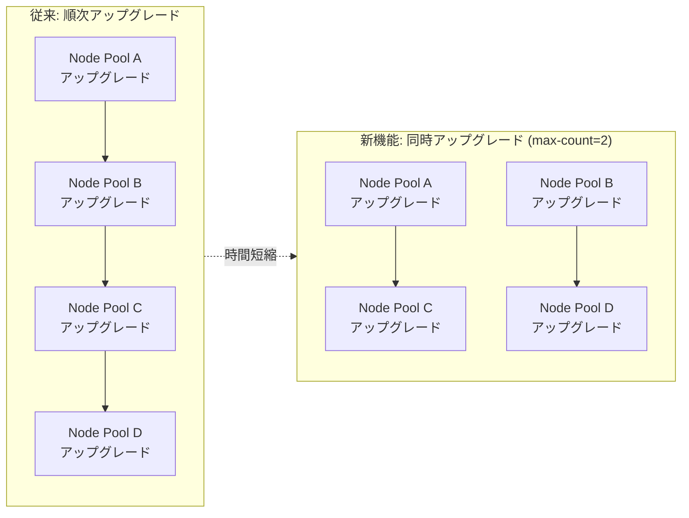

# Google Kubernetes Engine: ノードプール同時アップグレード (Concurrent Node Pool Upgrades)

**リリース日**: 2026-05-14

**サービス**: Google Kubernetes Engine (GKE)

**機能**: Concurrent node pool upgrades (Preview)

**ステータス**: Feature (Preview)

[このアップデートのインフォグラフィックを見る](https://takech9203.github.io/google-cloud-news-summary/20260514-gke-concurrent-node-pool-upgrades.html)

## 概要

Google Kubernetes Engine (GKE) において、複数のノードプールを同時にアップグレードできる「Concurrent Node Pool Upgrades」機能がプレビューとして利用可能になりました。従来、GKE はクラスタ内のノードプールを 1 つずつ順番にアップグレードしていましたが、本機能により複数のノードプールを並行してアップグレードできるようになり、クラスタ全体のアップグレード所要時間を大幅に短縮できます。

この機能は Standard クラスタと Autopilot クラスタの両方で利用可能です。Standard クラスタでは Standard ノードプールと Autopilot 管理ノードプールの同時アップグレードに、Autopilot クラスタではノードグループの同時アップグレードに適用されます。同時にアップグレードするノードプールの最大数を 1 から 100 の間で設定でき、運用要件に応じた柔軟な制御が可能です。

**アップデート前の課題**

- GKE は自動アップグレード時にノードプールを 1 つずつ順番に処理するため、多数のノードプールを持つクラスタではアップグレード完了までに非常に長い時間がかかっていた
- メンテナンスウィンドウ内にすべてのノードプールのアップグレードが完了しないリスクがあった
- クラスタ内のノードプール間でバージョンの不整合が長期間続く可能性があった

**アップデート後の改善**

- 複数のノードプールを同時にアップグレードすることで、クラスタ全体のアップグレード時間を大幅に短縮
- メンテナンスウィンドウ内でのアップグレード完了の確実性が向上
- ノードプール間のバージョン差異が存在する期間を最小化し、クラスタの一貫性を維持しやすくなった

## アーキテクチャ図



従来の順次アップグレードでは 4 つのノードプールを 1 つずつ処理するため合計時間が長くなりますが、同時アップグレード (max-count=2) を設定すると 2 つずつ並行処理され、全体の所要時間がおよそ半分に短縮されます。

## サービスアップデートの詳細

### 主要機能

1. **同時アップグレード数の制御 (max-count)**
   - 1 から 100 の間で同時にアップグレードするノードプールの最大数を指定可能
   - デフォルト値は 1 (従来の順次アップグレード動作)
   - 値を 1 に戻すことで順次アップグレードに復帰可能

2. **Standard クラスタ対応**
   - Standard ノードプールと Autopilot 管理ノードプールの両方に適用
   - 各ノードプール個別のアップグレード戦略 (Surge / Blue-Green) はそのまま維持

3. **Autopilot クラスタ対応**
   - ノードグループの同時アップグレードに対応
   - Autopilot クラスタのサージアップグレード戦略と組み合わせて動作

4. **既存クラスタへの適用**
   - 新規クラスタ作成時だけでなく、既存クラスタの更新時にも設定可能
   - 自動アップグレードが有効なノードプールに対して機能

## 技術仕様

### 設定パラメータ

| 項目 | 詳細 |
|------|------|
| パラメータ名 | `--node-pool-upgrade-concurrency-config=max-count` |
| 設定可能値 | 1 - 100 (整数) |
| デフォルト値 | 1 (順次アップグレード) |
| 対象クラスタ | Standard / Autopilot |
| API バージョン | gcloud beta |
| 前提条件 | 対象ノードプールの自動アップグレードが有効であること |

### 制約事項

| 項目 | 詳細 |
|------|------|
| ロールアウトシーケンス | カスタムステージを使用するロールアウトシーケンスに登録されたクラスタでは利用不可 |
| リソースクォータ | 同時アップグレード数に応じてサージノード用のリソースが必要 |
| 機能ステータス | Preview (Pre-GA) - サポートが限定的な場合あり |

## 設定方法

### 前提条件

1. Google Cloud SDK (gcloud CLI) がインストールされていること
2. 対象クラスタのノードプールで自動アップグレードが有効であること
3. gcloud beta コンポーネントがインストールされていること

### 手順

#### ステップ 1: 新規クラスタ作成時に同時アップグレードを設定

```bash
gcloud beta container clusters create my-cluster \
    --project=my-project \
    --location=asia-northeast1 \
    --node-pool-upgrade-concurrency-config=max-count=3
```

3 つのノードプールを同時にアップグレードする設定で新規クラスタを作成します。

#### ステップ 2: 既存クラスタの設定を更新

```bash
gcloud beta container clusters update my-cluster \
    --project=my-project \
    --location=asia-northeast1 \
    --node-pool-upgrade-concurrency-config=max-count=5
```

既存クラスタに対して、最大 5 つのノードプールを同時にアップグレードする設定に変更します。

#### ステップ 3: 順次アップグレードに戻す

```bash
gcloud beta container clusters update my-cluster \
    --project=my-project \
    --location=asia-northeast1 \
    --node-pool-upgrade-concurrency-config=max-count=1
```

max-count を 1 に設定することで、従来の順次アップグレード動作に戻ります。

#### ステップ 4: アップグレード状況の確認

```bash
gcloud container operations list \
    --location=asia-northeast1
```

実行中のアップグレード操作一覧を確認し、複数のノードプールが同時にアップグレードされていることを確認できます。

## メリット

### ビジネス面

- **メンテナンス時間の短縮**: クラスタ全体のアップグレード時間を短縮することで、メンテナンスウィンドウをより効率的に活用し、サービスへの影響時間を最小化
- **運用負荷の軽減**: 長時間のアップグレードプロセスの監視負担を軽減し、運用チームのリソースを他のタスクに振り向けることが可能
- **セキュリティパッチの迅速適用**: セキュリティ修正を含むバージョンアップをクラスタ全体により早く展開可能

### 技術面

- **バージョン一貫性の向上**: ノードプール間のバージョン差異が存在する期間を最小化し、互換性の問題リスクを軽減
- **柔軟な制御**: max-count パラメータによりリソース制約に応じた最適な同時実行数を選択可能
- **既存戦略との互換性**: 各ノードプールの Surge / Blue-Green アップグレード戦略はそのまま維持され、組み合わせて使用可能

## デメリット・制約事項

### 制限事項

- Preview ステータスのため、本番環境での利用には Pre-GA 利用規約が適用され、サポートが限定的な場合がある
- カスタムステージを使用するロールアウトシーケンスに登録されたクラスタでは利用できない
- gcloud beta コマンドのみで設定可能 (GA リリース時に安定版コマンドで利用可能になる見込み)

### 考慮すべき点

- **リソースクォータ**: 複数のノードプールを同時にアップグレードする場合、Surge ノード用の追加リソース (Compute Engine インスタンス) が同時に必要になるため、プロジェクトのクォータとリソースの可用性を事前に確認する必要がある
- **Pod Disruption Budget (PDB)**: 複数ノードプールが同時にドレインされるため、PDB の設定が適切でないとワークロードの可用性に影響する可能性がある
- **ネットワーク帯域**: 多数のノードが同時にイメージプルや初期化を行うため、ネットワーク帯域の利用状況を考慮する必要がある
- **監視の複雑化**: 同時に複数のアップグレードが進行するため、問題発生時の切り分けがやや複雑になる

## ユースケース

### ユースケース 1: 大規模マルチテナントクラスタ

**シナリオ**: 10 以上のノードプールを持つマルチテナント環境で、各テナント用のノードプールが個別に管理されているクラスタ。従来は全ノードプールのアップグレードに数時間から数日かかっていた。

**実装例**:
```bash
gcloud beta container clusters update multi-tenant-cluster \
    --project=production-project \
    --location=asia-northeast1 \
    --node-pool-upgrade-concurrency-config=max-count=5
```

**効果**: 10 個のノードプールを最大 5 つずつ同時アップグレードすることで、所要時間を約半分に短縮。メンテナンスウィンドウ (例: 深夜 2:00-6:00) 内に確実にアップグレードを完了可能。

### ユースケース 2: セキュリティパッチの緊急展開

**シナリオ**: 重大な脆弱性に対するセキュリティパッチがリリースされ、クラスタ全体のノードプールに迅速にパッチを適用する必要がある。

**実装例**:
```bash
# 一時的に max-count を高く設定して迅速にパッチ適用
gcloud beta container clusters update critical-cluster \
    --project=production-project \
    --location=us-central1 \
    --node-pool-upgrade-concurrency-config=max-count=10

# パッチ適用後、通常の設定に戻す
gcloud beta container clusters update critical-cluster \
    --project=production-project \
    --location=us-central1 \
    --node-pool-upgrade-concurrency-config=max-count=3
```

**効果**: 緊急時には同時実行数を一時的に引き上げ、すべてのノードプールに対して最速でパッチを展開可能。

### ユースケース 3: CI/CD パイプライン用クラスタ

**シナリオ**: ビルドやテスト用の複数のノードプール (CPU 用、GPU 用、高メモリ用など) を持つ CI/CD クラスタで、週末のメンテナンスウィンドウ内にアップグレードを完了させたい。

**効果**: 異なるマシンタイプのノードプールを並行してアップグレードし、限られたメンテナンスウィンドウ内でクラスタ全体を最新状態に保つ。

## 料金

本機能自体に追加料金は発生しません。ただし、同時アップグレード時には通常のノードプールアップグレードと同様に、以下のコストが発生します。

### 料金に関する考慮事項

| 項目 | 詳細 |
|------|------|
| 機能利用料 | 無料 (追加課金なし) |
| Surge ノードコスト | 同時アップグレード中に作成されるサージノードの Compute Engine 料金が同時に発生 |
| 影響の例 | max-count=5 の場合、最大 5 つのノードプールのサージノードが同時に課金対象になる |

同時アップグレード数を増やすほど、一時的に必要となるサージノードの数が増加し、瞬間的なコストが高くなる点に留意してください。ただし、合計コストは順次アップグレードと同等であり、アップグレード期間が短縮される分だけ課金時間は減少します。

## 利用可能リージョン

本機能はすべての GKE リージョンおよびゾーンで利用可能です (Preview)。GKE が利用可能なすべてのロケーションで設定できます。

## 関連サービス・機能

- **GKE Surge Upgrades**: 各ノードプール内のノードを段階的にアップグレードする戦略。同時ノードプールアップグレードと組み合わせて動作する
- **GKE Blue-Green Upgrades**: 既存ノードを保持したまま新しいノードを作成する戦略。同様に同時ノードプールアップグレードと併用可能
- **メンテナンスウィンドウ / メンテナンス除外**: 自動アップグレードのタイミングを制御する機能。同時アップグレードによりウィンドウ内での完了確率が向上
- **クラスタ Disruption Budget**: 自動アップグレード間の最小間隔を制御する機能
- **ロールアウトシーケンス**: クラスタ群に対して段階的にアップグレードを展開する機能 (カスタムステージ利用時は本機能と併用不可)

## 参考リンク

- [インフォグラフィック](https://takech9203.github.io/google-cloud-news-summary/20260514-gke-concurrent-node-pool-upgrades.html)
- [公式リリースノート](https://docs.cloud.google.com/release-notes#May_14_2026)
- [ドキュメント: Configure concurrent node pool upgrades](https://cloud.google.com/kubernetes-engine/docs/how-to/upgrading-a-cluster#concurrent-upgrades)
- [ドキュメント: Node pool upgrade strategies](https://cloud.google.com/kubernetes-engine/docs/concepts/node-pool-upgrade-strategies)
- [GKE 料金ページ](https://cloud.google.com/kubernetes-engine/pricing)

## まとめ

GKE の Concurrent Node Pool Upgrades は、多数のノードプールを持つクラスタのアップグレード時間を劇的に短縮できる重要な機能です。max-count パラメータによる柔軟な制御、Standard と Autopilot 両方のサポート、既存のアップグレード戦略との互換性により、大規模な本番環境でも安心して導入を検討できます。Preview 段階であるため、まずは非本番環境で検証を行い、リソースクォータと PDB の設定を確認した上で、段階的に本番環境への適用を進めることを推奨します。

---

**タグ**: #GKE #Kubernetes #NodePool #Upgrade #Concurrent #Preview #Standard #Autopilot #Performance #ClusterManagement
