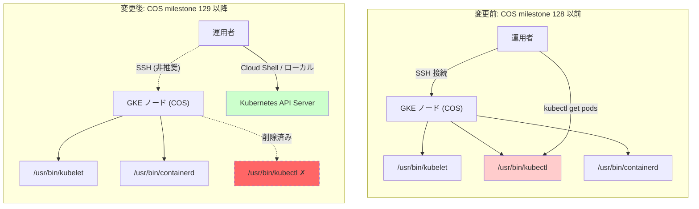

# Google Kubernetes Engine: Container-Optimized OS (COS) マイルストーン 129 以降で kubectl バイナリが削除

**リリース日**: 2026-05-14

**サービス**: Google Kubernetes Engine

**機能**: Container-Optimized OS (COS) milestone 129+ removes kubectl binary

**ステータス**: Change (Breaking)

📊 [このアップデートのインフォグラフィックを見る](https://takech9203.github.io/google-cloud-news-summary/20260514-gke-cos-129-kubectl-removal.html)

## 概要

Container-Optimized OS (COS) のマイルストーン 129 以降のノードイメージにおいて、`/usr/bin/` ディレクトリに含まれていた `kubectl` バイナリが削除されました。これは GKE ノードのセキュリティ強化と攻撃対象面の最小化を目的とした破壊的変更 (Breaking Change) です。

従来、COS ノードイメージには kubelet とともに kubectl バイナリが同梱されていましたが、ノードに SSH 接続して直接 kubectl コマンドを実行することはベストプラクティスではなく、セキュリティリスクを増大させる要因でした。この変更により、COS の「最小限の OS フットプリント」という設計原則がさらに徹底されます。

この変更は、ノードに SSH して kubectl を使用していたデバッグワークフローに影響を与えます。影響を受けるユーザーは、Cloud Shell、ローカルマシン、または toolbox ユーティリティを使用した代替手段に移行する必要があります。

**アップデート前の課題**

- COS ノードに不要なバイナリ (kubectl) が含まれており、攻撃対象面が広がっていた
- ノードへの SSH 接続経由で kubectl を直接実行できるため、不正アクセス時のリスクが高かった
- ノード上の kubectl を使ったデバッグが習慣化し、セキュリティベストプラクティスに反する運用が行われていた

**アップデート後の改善**

- ノードイメージから不要なバイナリが削除され、攻撃対象面が縮小された
- COS の「最小限の OS フットプリント」設計原則に沿った、よりセキュアなノード環境が実現
- クラスタ操作は Cloud Shell やローカル環境など、適切な場所から行う運用が促進される

## アーキテクチャ図



この図は、COS マイルストーン 129 前後での kubectl の可用性の変化を示しています。変更後は、ノード上での kubectl 実行が不可能となり、Kubernetes API Server への操作は外部クライアント (Cloud Shell やローカル環境) から行う形に移行します。

## サービスアップデートの詳細

### 主要機能

1. **kubectl バイナリの削除**
   - COS マイルストーン 129 以降のノードイメージから `/usr/bin/kubectl` が完全に削除
   - kubelet や containerd などのノード運用に必須のコンポーネントは引き続き含まれる

2. **セキュリティ強化 (攻撃対象面の縮小)**
   - COS の設計原則「Minimal OS footprint」に基づき、不要なバイナリを除去
   - ノードが侵害された場合でも、kubectl を使ったクラスタ全体への攻撃が困難に
   - イミュータブルな root ファイルシステムと組み合わせて、より堅牢なセキュリティ態勢を実現

3. **toolbox による代替デバッグ手段**
   - COS に組み込みの toolbox ユーティリティを使用して、必要に応じてデバッグツールをインストール可能
   - `/usr/bin/toolbox` を使った Debian chroot 環境でのデバッグは引き続きサポート

## 技術仕様

### 影響範囲

| 項目 | 詳細 |
|------|------|
| 対象ノードイメージ | Container-Optimized OS (cos_containerd) マイルストーン 129 以降 |
| 削除されるバイナリ | `/usr/bin/kubectl` |
| 影響を受けるクラスタ | ノードイメージとして COS を使用している全 GKE クラスタ (Standard / Autopilot) |
| 影響を受けない操作 | kubelet、containerd、ノードの正常動作、Pod のスケジューリング |
| 影響を受ける操作 | ノードに SSH して kubectl コマンドを実行するワークフロー |

### COS のセキュリティ設計原則

| 原則 | 説明 |
|------|------|
| 最小限の OS フットプリント | 不要なパッケージを排除し、攻撃対象面を最小化 |
| イミュータブルな root ファイルシステム | root ファイルシステムは読み取り専用でマウント |
| ステートレス構成 | `/etc/` は書き込み可能だが、再起動時にリセット |
| セキュリティ強化カーネル | IMA、Audit、KPTI、LSM などを有効化 |
| 自動更新 | セキュリティパッチの迅速な適用 |

## 設定方法

### 前提条件

1. GKE クラスタが COS ノードイメージを使用していること
2. 現在ノードに SSH して kubectl を実行しているワークフローが存在すること

### 手順

#### ステップ 1: 影響を受けるワークフローの特定

```bash
# 現在のノードイメージバージョンを確認
gcloud container clusters describe CLUSTER_NAME \
  --zone=ZONE \
  --format="value(nodeConfig.imageType)"

# ノードプールのバージョン情報を確認
gcloud container node-pools list \
  --cluster=CLUSTER_NAME \
  --zone=ZONE \
  --format="table(name,version,config.imageType)"
```

SSH 経由でノード上の kubectl を使用しているスクリプトや運用手順を洗い出します。

#### ステップ 2: Cloud Shell または ローカル環境からの操作に移行

```bash
# Cloud Shell からクラスタに接続
gcloud container clusters get-credentials CLUSTER_NAME \
  --zone=ZONE \
  --project=PROJECT_ID

# ローカル環境から kubectl を使用
kubectl get pods --all-namespaces
kubectl get nodes -o wide
```

Cloud Shell や ローカル環境に kubectl をインストールし、クラスタの認証情報を取得して操作を行います。

#### ステップ 3: デバッグが必要な場合の代替手段 (toolbox)

```bash
# ノードに SSH 接続した後、toolbox を使用
toolbox

# toolbox 内で必要なツールをインストール
apt-get update && apt-get install -y kubectl

# または、特定のバージョンの kubectl をインストール
curl -LO "https://dl.k8s.io/release/$(curl -L -s https://dl.k8s.io/release/stable.txt)/bin/linux/amd64/kubectl"
chmod +x kubectl
mv kubectl /usr/local/bin/
```

toolbox はデバッグ専用であり、本番運用での使用は推奨されません。

#### ステップ 4: Autopilot クラスタの場合

```bash
# Autopilot クラスタではノードへの直接アクセスが制限されているため、
# 元々影響は限定的です。以下のコマンドで操作を行います。
kubectl debug node/NODE_NAME -it --image=ubuntu
```

Autopilot クラスタではセキュリティ上の理由でノードへの直接アクセスが許可されていないため、この変更の影響は最小限です。

## メリット

### ビジネス面

- **コンプライアンス強化**: ノードからの不要なクラスタアクセス手段を排除することで、監査要件への対応が容易に
- **インシデントリスクの低減**: ノードが侵害された際の横方向移動 (lateral movement) のリスクを低減

### 技術面

- **攻撃対象面の縮小**: 不要なバイナリの削除により、ノードの攻撃対象面が減少
- **最小権限の原則**: ノード上で実行可能な操作を必要最小限に制限
- **イメージサイズの軽量化**: 不要なバイナリの削除によりノードイメージのフットプリントが縮小
- **セキュリティベストプラクティスの促進**: 適切なアクセス経路 (API Server 経由) の利用を促進

## デメリット・制約事項

### 制限事項

- COS マイルストーン 129 以降のノードでは `/usr/bin/kubectl` を直接実行できない
- ノードに SSH して kubectl を使用するスクリプトは全て修正が必要
- toolbox 経由でのインストールにはインターネット接続が必要な場合がある

### 考慮すべき点

- ノード昇格 (node upgrade) 時にマイルストーン 129 以降に自動更新される可能性がある
- DaemonSet や特権 Pod から kubectl を実行しているワークロードへの影響確認が必要
- Ubuntu ノードイメージでは apt-get で kubectl をインストール可能だが、COS では不可

## ユースケース

### ユースケース 1: ノードデバッグワークフローの移行

**シナリオ**: SRE チームがノードの問題調査時に SSH して kubectl を使用していた

**実装例**:
```bash
# 変更前: ノードに SSH して直接 kubectl を実行
gcloud compute ssh NODE_NAME --zone=ZONE
kubectl get pods -n kube-system

# 変更後: Cloud Shell からリモートで操作
gcloud container clusters get-credentials CLUSTER_NAME --zone=ZONE
kubectl get pods -n kube-system --field-selector spec.nodeName=NODE_NAME
```

**効果**: セキュリティリスクを低減しつつ、同等のデバッグ情報を取得可能

### ユースケース 2: CI/CD パイプラインの修正

**シナリオ**: ノード上で実行されるスクリプトが kubectl を使用してクラスタ状態を確認していた

**実装例**:
```yaml
# 変更後: Pod 内で kubectl を使用する DaemonSet
apiVersion: apps/v1
kind: DaemonSet
metadata:
  name: node-monitor
spec:
  selector:
    matchLabels:
      app: node-monitor
  template:
    metadata:
      labels:
        app: node-monitor
    spec:
      serviceAccountName: node-monitor-sa
      containers:
      - name: monitor
        image: bitnami/kubectl:latest
        command: ["/bin/sh", "-c", "kubectl get nodes -o wide"]
```

**効果**: ノード上の kubectl に依存せず、Pod として適切な RBAC 権限で操作を実行

## 料金

この変更はノードイメージの構成変更であり、追加料金は発生しません。

### 料金例

| 項目 | 料金 |
|------|------|
| COS ノードイメージの使用 | 無料 (GKE の通常料金に含まれる) |
| Cloud Shell からの kubectl 実行 | 無料 |
| ノードイメージの変更に伴う追加費用 | なし |

## 利用可能リージョン

この変更は COS マイルストーン 129 以降のノードイメージを使用する全てのリージョンおよびゾーンに適用されます。GKE が利用可能な全リージョンで同様にこの変更が反映されます。

## 関連サービス・機能

- **Container-Optimized OS**: GKE のデフォルトノード OS イメージ。セキュリティ強化と最小限のフットプリントを設計思想とする
- **GKE Autopilot**: ノードへの直接アクセスが制限されており、この変更の影響が限定的
- **Cloud Shell**: kubectl がプリインストールされた、ブラウザベースのシェル環境
- **CoreOS Toolbox**: COS ノードでのデバッグ用コンテナ環境 (`/usr/bin/toolbox`)
- **kubectl debug**: Kubernetes 1.25 以降で GA のエフェメラルデバッグコンテナ機能

## 参考リンク

- 📊 [インフォグラフィック](https://takech9203.github.io/google-cloud-news-summary/20260514-gke-cos-129-kubectl-removal.html)
- [公式リリースノート](https://docs.cloud.google.com/release-notes#May_14_2026)
- [Container-Optimized OS セキュリティ概要](https://cloud.google.com/container-optimized-os/docs/concepts/security)
- [Container-Optimized OS Toolbox の使用方法](https://cloud.google.com/container-optimized-os/docs/how-to/toolbox)
- [GKE ノードイメージの比較](https://cloud.google.com/kubernetes-engine/docs/concepts/node-images)

## まとめ

Container-Optimized OS マイルストーン 129 以降での kubectl バイナリ削除は、GKE ノードのセキュリティ強化を目的とした重要な変更です。ノードに SSH して kubectl を実行しているワークフローがある場合は、ノードの自動アップグレードが行われる前に、Cloud Shell やローカル環境からの操作に移行することを強く推奨します。この変更は COS の「最小限の攻撃対象面」という設計原則を徹底するものであり、クラスタ全体のセキュリティ態勢の向上に貢献します。

---

**タグ**: #GoogleKubernetesEngine #GKE #ContainerOptimizedOS #COS #kubectl #BreakingChange #SecurityHardening #NodeImage
