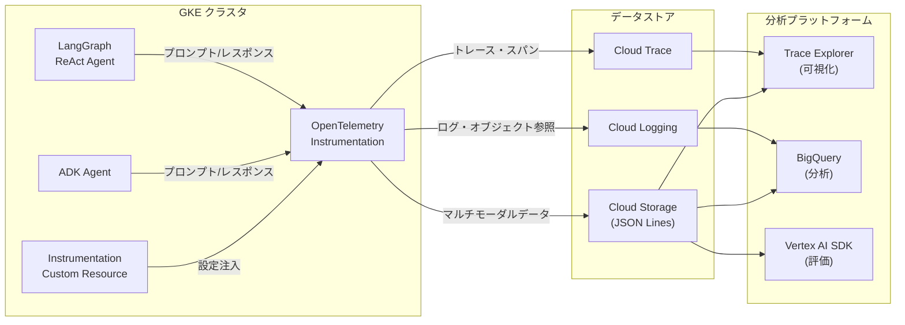

# Google Kubernetes Engine: Managed OpenTelemetry マルチモーダルプロンプト・レスポンス収集 (Preview)

**リリース日**: 2026-05-14

**サービス**: Google Kubernetes Engine (GKE)

**機能**: Managed OpenTelemetry multimodal prompts and responses collection (Preview)

**ステータス**: Feature (Preview)

[このアップデートのインフォグラフィックを見る](https://takech9203.github.io/google-cloud-news-summary/20260514-gke-managed-otel-multimodal-prompts.html)

## 概要

GKE の Managed OpenTelemetry が、LangGraph ReAct エージェントおよび Agent Development Kit (ADK) フレームワークで構築された生成 AI エージェントからのマルチモーダルプロンプトとレスポンスの収集をサポートしました (Preview)。これにより、AI/ML ワークロードのオブザーバビリティが大幅に強化され、テキスト、画像、音声、動画、ドキュメントなど多様なメディアタイプのプロンプトとレスポンスを自動的にキャプチャし、Cloud Trace Explorer および BigQuery で可視化・分析することが可能になります。

この機能は OpenTelemetry GenAI セマンティック規約 (v1.37.0 以降) に準拠しており、プロンプトとレスポンスのデータは Cloud Storage バケットに JSON Lines 形式で保存され、トレースとログデータが Google Cloud プロジェクトに送信されます。GKE 上の Instrumentation カスタムリソースを設定するだけで、アプリケーションコードの変更なしにデータ収集を開始できる点が大きな特長です。

**アップデート前の課題**

- GKE 上で稼働する AI エージェントのプロンプトやレスポンス内容を体系的に収集する仕組みがなく、デバッグや品質評価が困難だった
- マルチモーダルデータ (画像、音声、動画) を含むやり取りの記録には独自のロギング実装が必要で、開発工数がかかっていた
- エージェントの入出力データを BigQuery などの分析基盤と連携させるには複雑なパイプライン構築が必要だった

**アップデート後の改善**

- Instrumentation カスタムリソースの設定だけで、アプリケーション変更なしにマルチモーダルプロンプト・レスポンスの自動収集が可能になった
- Trace Explorer でチャット形式のプロンプト・レスポンス表示、レンダリング/ソース形式の切替、会話全体の閲覧が可能になった
- BigQuery と連携した高度な分析 (AI.GENERATE 関数による会話要約など) や Vertex AI SDK によるモデル評価が可能になった

## アーキテクチャ図



LangGraph/ADK エージェントからのプロンプトとレスポンスが OpenTelemetry インストルメンテーションを経由して Cloud Storage (実データ)、Cloud Logging (参照ログ)、Cloud Trace (スパン) に振り分けられ、Trace Explorer や BigQuery で統合的に分析される流れを示しています。

## サービスアップデートの詳細

### 主要機能

1. **マルチモーダルデータ収集**
   - テキスト、画像、音声、動画、ドキュメントの収集に対応
   - プロンプトとレスポンスの両方を自動キャプチャ
   - インラインコンテンツとリンク (公開リソースおよび Cloud Storage バケット) の両方をサポート
   - OpenTelemetry GenAI セマンティック規約 v1.37.0 以降に準拠

2. **Trace Explorer での可視化**
   - チャット形式でプロンプトとレスポンスを表示
   - レンダリング表示/ソース形式表示の切替が可能
   - 個別スパンのプロンプト・レスポンスまたは会話全体の表示
   - `generate_content` スパン名でフィルタリング可能

3. **BigQuery による高度な分析**
   - Cloud Logging のリンクデータと Cloud Storage のプロンプト・レスポンスデータを結合して分析
   - AI.GENERATE 関数による会話の自動要約
   - 外部テーブルを作成してログバケットとデータを結合
   - 大規模データの集計・統計分析が可能

4. **Vertex AI SDK による評価**
   - Google Colaboratory を使用したセンチメント分析
   - モデル出力の品質評価
   - カスタム評価メトリクスの適用

5. **GKE ネイティブ統合**
   - Instrumentation カスタムリソースによる宣言的な設定
   - ワークロードの再起動時に環境変数が自動注入
   - アプリケーションコードの変更が不要

## 技術仕様

### 対応フレームワークと依存関係

| フレームワーク | 必要パッケージ | 最小バージョン |
|------|------|------|
| ADK | google-adk | >= 1.16.0 |
| ADK | opentelemetry-instrumentation-google-genai | >= 0.4b0 |
| ADK | fsspec[gcs] | == 2025.10.0 |
| LangGraph | opentelemetry-instrumentation-vertexai | >= 2.2b0 |
| LangGraph | opentelemetry-instrumentation-google-genai | >= 0.4b0 |
| LangGraph | fsspec[gcs] | == 2025.10.0 |

### 環境変数設定

| 環境変数 | 値 | 説明 |
|------|------|------|
| OTEL_INSTRUMENTATION_GENAI_UPLOAD_FORMAT | jsonl | Cloud Storage オブジェクトを JSON Lines 形式で保存 |
| OTEL_INSTRUMENTATION_GENAI_COMPLETION_HOOK | upload | プロンプト・レスポンスデータをアップロード (スパンに埋め込まない) |
| OTEL_SEMCONV_STABILITY_OPT_IN | gen_ai_latest_experimental | 最新の GenAI セマンティック規約を使用 |
| OTEL_INSTRUMENTATION_GENAI_CAPTURE_MESSAGE_CONTENT | NO_CONTENT (推奨) | スパン属性にメッセージ内容を付加しない |
| OTEL_INSTRUMENTATION_GENAI_UPLOAD_BASE_PATH | gs://BUCKET_NAME/PATH | Cloud Storage のアップロード先パス |
| OTEL_PYTHON_LOGGING_AUTO_INSTRUMENTATION_ENABLED | true | LangGraph 用: ログデータの自動キャプチャ |

### IAM ロール要件

| 操作 | 必要な IAM ロール |
|------|------|
| Trace Explorer での閲覧 | roles/cloudtrace.user |
| ログの参照 | roles/logging.viewer |
| Cloud Storage データの読み取り | roles/storage.objectViewer |
| Cloud Storage への書き込み (アプリケーション) | storage.objects.create 権限 |
| BigQuery 分析 | roles/bigquery.dataViewer, roles/bigquery.studioUser |

## 設定方法

### 前提条件

1. GKE クラスタで Managed OpenTelemetry が有効化されていること
2. Cloud Storage バケットが作成済みであること
3. アプリケーションのサービスアカウントに Cloud Storage への書き込み権限 (`storage.objects.create`) が付与されていること

### 手順

#### ステップ 1: Instrumentation カスタムリソースの作成

```yaml
apiVersion: telemetry.googleapis.com/v1alpha1
kind: Instrumentation
metadata:
  namespace: default
  name: prompts-responses
spec:
  selector: {}
  promptsResponses:
    uploadBasePath: gs://BUCKET_NAME
```

`BUCKET_NAME` を実際の Cloud Storage バケット名に置き換えてください。

#### ステップ 2: ADK エージェントの場合の追加設定

```bash
# CLI 経由で ADK を実行する場合
adk web --otel_to_cloud

# FastAPI アプリケーションの場合は以下のようにフラグを設定
# get_fast_api_app(..., otel_to_cloud=True)
```

#### ステップ 3: ワークロードの再デプロイ

```bash
# ワークロードを再起動して環境変数の注入を適用
kubectl rollout restart deployment/<YOUR_DEPLOYMENT> -n default
```

Instrumentation カスタムリソースの更新後にワークロードを再起動すると、プロンプト・レスポンス収集用の環境変数がコンテナに自動的に注入されます。

#### ステップ 4: Trace Explorer での確認

Google Cloud コンソールの Trace Explorer ページで以下を実行:

1. スパンフィルターで `generate_content` を選択
2. 対象スパンをクリックして詳細を表示
3. 「Inputs/Outputs」ボタンからマルチモーダルデータを閲覧

## メリット

### ビジネス面

- **AI エージェントの品質管理強化**: プロンプトとレスポンスの全量記録により、エージェントの出力品質を継続的にモニタリング・改善できる
- **コンプライアンス対応**: AI エージェントのやり取りを監査可能な形で保存でき、規制要件への対応が容易になる
- **開発コスト削減**: カスタムロギング基盤の構築が不要になり、AI アプリケーションの開発に集中できる

### 技術面

- **ゼロコード計装**: アプリケーションコードの変更なしでデータ収集を開始でき、既存のエージェントにも容易に適用可能
- **標準準拠**: OpenTelemetry GenAI セマンティック規約に準拠しており、ベンダーロックインを回避
- **統合分析基盤**: Trace Explorer、BigQuery、Vertex AI SDK との連携により多角的な分析が可能
- **GKE ネイティブ**: Kubernetes のカスタムリソースとして管理でき、GitOps ワークフローとの親和性が高い

## デメリット・制約事項

### 制限事項

- Preview 段階のため、SLA の対象外であり本番環境での利用には注意が必要
- 対応フレームワークは LangGraph ReAct エージェントと ADK に限定されている
- fsspec のバージョン制約があり (2025.10.0)、全てのバージョンがサポートされるわけではない

### 考慮すべき点

- マルチモーダルデータ (画像・動画等) の Cloud Storage への保存によりストレージコストが増加する可能性がある
- 大量のプロンプト・レスポンスデータの保存はコスト面での考慮が必要
- Cloud Storage バケットへのアクセス権限管理を適切に行い、機密データの漏洩を防ぐ必要がある
- BigQuery 分析には追加の API 有効化と IAM ロール設定が必要

## ユースケース

### ユースケース 1: AI カスタマーサポートエージェントのモニタリング

**シナリオ**: GKE 上で稼働する ADK ベースのカスタマーサポートエージェントが、ユーザーから送信された画像 (製品の不具合写真など) を含むマルチモーダルなやり取りを処理している。サポート品質の継続的な改善のため、全てのやり取りを記録・分析したい。

**実装例**:
```yaml
apiVersion: telemetry.googleapis.com/v1alpha1
kind: Instrumentation
metadata:
  namespace: support-agents
  name: support-prompts-collection
spec:
  selector:
    matchLabels:
      app: customer-support-agent
  promptsResponses:
    uploadBasePath: gs://support-agent-traces
```

**効果**: 画像を含むユーザー問い合わせとエージェントの回答を全量記録し、BigQuery で回答品質の傾向分析や AI.GENERATE による要約を行い、サポート品質の改善サイクルを確立できる。

### ユースケース 2: LangGraph マルチモーダル RAG パイプラインのデバッグ

**シナリオ**: LangGraph で構築されたマルチモーダル RAG パイプラインが、ドキュメント画像から情報を抽出して回答を生成している。特定の入力画像に対して不正確な回答が返される問題を調査したい。

**効果**: Trace Explorer で問題のあるリクエストのスパンを特定し、入力画像とモデルの出力を並べて確認することで、どのステップで情報の損失や誤解釈が発生しているかを迅速に特定できる。

### ユースケース 3: エージェント出力の自動品質評価

**シナリオ**: 複数の ADK エージェントが本番環境で稼働しており、出力品質を自動的に評価して品質低下を検知したい。

**効果**: BigQuery に蓄積されたプロンプト・レスポンスデータに対して Vertex AI SDK を使用した自動評価 (センチメント分析、正確性チェック) を定期的に実行し、品質スコアの低下をアラートとして検知できる。

## 料金

本機能に直接的な追加料金は明示されていませんが、以下のコンポーネントの使用量に応じた料金が発生します。

### 料金例

| コンポーネント | 料金の発生要因 |
|--------|-----------------|
| Cloud Storage | マルチモーダルデータの保存量 (JSON Lines 形式) |
| Cloud Trace | トレーススパンの取り込み量 |
| Cloud Logging | ログエントリの取り込み・保存量 |
| BigQuery | クエリの処理データ量および保存量 |

Preview 期間中の料金については、Google Cloud の料金ページを確認してください。

## 利用可能リージョン

GKE Managed OpenTelemetry が利用可能な全リージョンで使用可能です。Cloud Storage バケットのリージョンはワークロードと同一リージョンまたはマルチリージョンを推奨します。

## 関連サービス・機能

- **Cloud Trace**: トレースデータの保存と Trace Explorer による可視化を提供
- **Cloud Logging**: プロンプト・レスポンスへの参照を含むログエントリを管理
- **Cloud Storage**: マルチモーダルプロンプト・レスポンスの実データを JSON Lines 形式で保存
- **BigQuery**: 大規模なプロンプト・レスポンスデータの分析基盤
- **Vertex AI SDK**: モデル出力の品質評価に使用
- **Agent Development Kit (ADK)**: Google が提供する AI エージェント開発フレームワーク
- **Gemini Enterprise Agent Platform**: エージェントのデプロイ基盤としてテレメトリ連携が可能

## 参考リンク

- [インフォグラフィック](https://takech9203.github.io/google-cloud-news-summary/20260514-gke-managed-otel-multimodal-prompts.html)
- [公式リリースノート](https://docs.cloud.google.com/release-notes#May_14_2026)
- [ドキュメント: Collect multimodal prompts and responses data](https://docs.cloud.google.com/kubernetes-engine/docs/how-to/managed-otel-gke#multimodal-prompts-responses)
- [ドキュメント: Collect and view multimodal prompts and responses](https://docs.cloud.google.com/trace/docs/collect-view-multimodal-prompts-responses)
- [Agent Development Kit (ADK)](https://google.github.io/adk-docs/)
- [LangGraph ReAct Agents](https://docs.langchain.com/oss/python/langchain/agents)
- [OpenTelemetry GenAI Semantic Conventions](https://github.com/open-telemetry/semantic-conventions/tree/v1.37.0/docs/gen-ai)

## まとめ

GKE Managed OpenTelemetry のマルチモーダルプロンプト・レスポンス収集機能は、GKE 上で稼働する AI エージェントのオブザーバビリティを根本的に変革するアップデートです。LangGraph や ADK で構築されたエージェントの入出力を、コード変更なしで自動収集し、Trace Explorer での可視化や BigQuery での高度な分析を可能にします。AI エージェントを本番運用しているチームは、Preview 段階から検証を開始し、品質管理やデバッグのワークフローへの組み込みを検討することを推奨します。

---

**タグ**: #GoogleKubernetesEngine #GKE #OpenTelemetry #ManagedOpenTelemetry #AI #ML #LangGraph #ADK #AgentDevelopmentKit #マルチモーダル #オブザーバビリティ #CloudTrace #BigQuery #Preview
