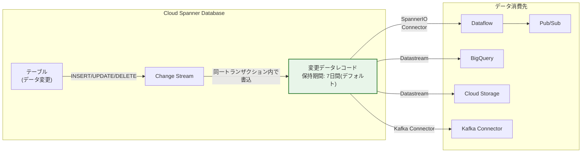

# Cloud Spanner: Change Streams デフォルト保持期間の 7 日間への拡大

**リリース日**: 2026-05-14

**サービス**: Cloud Spanner

**機能**: Change Streams デフォルトデータ保持期間の延長

**ステータス**: Announcement

[このアップデートのインフォグラフィックを見る](https://takech9203.github.io/google-cloud-news-summary/20260514-spanner-change-streams-retention-period.html)

## 概要

Cloud Spanner の Change Streams において、デフォルトのデータ保持期間（retention period）が従来の **1 日から 7 日間**に延長されました。この変更は、保持期間を明示的に設定していない新規および既存のすべての Change Streams に自動的に適用されます。

Change Streams は Spanner データベースのデータ変更（INSERT、UPDATE、DELETE）をニアリアルタイムでストリーミングする機能です。データ保持期間の延長により、変更データレコードをより長期間にわたって参照可能となり、障害復旧やデータ再処理のユースケースにおける柔軟性が大幅に向上します。

なお、DDL ステートメント（CREATE CHANGE STREAM または ALTER CHANGE STREAM）で `retention_period` を明示的に指定している場合、この変更による影響はありません。保持期間は 1 日から 30 日の範囲で自由にカスタマイズ可能です。

**アップデート前の課題**

- デフォルトの保持期間が 1 日と短く、変更データの参照可能なウィンドウが限定的だった
- 障害発生時やパイプライン再処理時に、1 日以前のデータ変更レコードに遡れなかった
- 多くのユースケースで明示的に retention_period を設定する必要があり、設定漏れのリスクがあった

**アップデート後の改善**

- デフォルトで 7 日間の変更データが保持されるようになり、設定なしでも十分な再処理ウィンドウを確保可能に
- Dataflow パイプラインや Kafka コネクタの障害からの復旧に、より余裕のある時間が確保された
- 明示的な設定がなくても、一般的なユースケースに十分なデフォルト値となった

## アーキテクチャ図



Cloud Spanner の Change Stream は、データ変更をニアリアルタイムで記録し、設定された保持期間内であれば各種コンシューマーから読み取り可能です。今回のアップデートにより、デフォルトの保持期間が 7 日間に拡大されました。

## サービスアップデートの詳細

### 主要変更点

1. **デフォルト保持期間の延長**
   - 変更前: 1 日間
   - 変更後: 7 日間（7 倍に拡大）
   - 保持期間の設定可能範囲（1 日 ~ 30 日）自体に変更なし

2. **影響範囲**
   - `retention_period` を明示的に設定していない既存の Change Streams に自動適用
   - 新規作成時にデフォルト値として 7 日間が適用
   - 明示的に `retention_period` を設定済みの Change Streams には影響なし

3. **オーバーライド方法**
   - CREATE CHANGE STREAM または ALTER CHANGE STREAM DDL ステートメントで `retention_period` を指定することで、デフォルト値を上書き可能

## 技術仕様

### 保持期間の比較

| 項目 | 変更前 | 変更後 |
|------|--------|--------|
| デフォルト保持期間 | 1 日 | **7 日** |
| 最小保持期間 | 1 日 | 1 日 |
| 最大保持期間 | 30 日 | 30 日 |
| 明示設定済み Stream への影響 | - | なし |

### 保持期間の設定（DDL）

GoogleSQL の場合:

```sql
-- 新規作成時に保持期間を指定
CREATE CHANGE STREAM MyStream FOR ALL
OPTIONS (retention_period = '3d');

-- 既存の Change Stream の保持期間を変更
ALTER CHANGE STREAM MyStream
SET OPTIONS (retention_period = '14d');
```

PostgreSQL の場合:

```sql
-- 新規作成時に保持期間を指定
CREATE CHANGE STREAM MyStream FOR ALL
WITH (retention_period = '3d');

-- 既存の Change Stream の保持期間を変更
ALTER CHANGE STREAM MyStream
SET (retention_period = '14d');
```

## 設定方法

### 前提条件

1. Cloud Spanner データベースが作成済みであること
2. `spanner.databases.updateDdl` 権限を持つ IAM ロールが付与されていること

### 手順

#### ステップ 1: 現在の保持期間を確認する

```sql
SELECT *
FROM information_schema.change_stream_options
WHERE change_stream_name = 'MyStream'
AND option_name = 'retention_period';
```

明示的に設定されていない場合は、新しいデフォルト値（7 日間）が適用されます。

#### ステップ 2: 保持期間を明示的に設定する（必要な場合）

デフォルトの 7 日間ではなく、特定の保持期間が必要な場合:

```sql
-- 例: 保持期間を 1 日に維持したい場合
ALTER CHANGE STREAM MyStream
SET OPTIONS (retention_period = '1d');

-- 例: 保持期間を 14 日に延長したい場合
ALTER CHANGE STREAM MyStream
SET OPTIONS (retention_period = '14d');
```

#### ステップ 3: 設定変更の確認

```sql
SELECT change_stream_name, option_name, option_value
FROM information_schema.change_stream_options
WHERE option_name = 'retention_period';
```

## メリット

### ビジネス面

- **障害復旧の余裕**: Dataflow パイプラインや下流システムの障害時に、7 日間のウィンドウ内でデータを再処理でき、ビジネス継続性が向上
- **運用負荷の軽減**: 多くのユースケースで明示的な設定が不要となり、設定漏れによるデータロストのリスクが低減

### 技術面

- **再処理ウィンドウの拡大**: 週末を跨いだ障害やメンテナンス後のキャッチアップ処理が、設定変更なしで対応可能に
- **CDC パイプラインの信頼性向上**: Dataflow ジョブや Kafka コネクタの一時的な停止からの復旧に余裕が生まれる

## デメリット・制約事項

### 制限事項

- 保持期間の延長により、Change Stream のストレージ使用量がデフォルトで最大 7 倍に増加する可能性がある
- 保持期間の設定可能範囲（1 日 ~ 30 日）自体は変更なし

### 考慮すべき点

- **ストレージコストへの影響**: デフォルト値に依存していた既存の Change Streams は、保持データ量が自動的に増加するため、ストレージコストが上昇する可能性がある
- **既存 Stream の動作変更**: 明示的に `retention_period` を設定していない既存の Change Streams は、自動的に 7 日間保持に変更される。従来の 1 日保持を維持したい場合は、明示的に `retention_period = '1d'` を設定する必要がある
- **保持期間短縮時の注意**: 保持期間を短縮すると、新しい期間を超える古い変更データレコードは即座に恒久的に利用不可となる

## ユースケース

### ユースケース 1: Dataflow パイプラインの障害復旧

**シナリオ**: BigQuery へのレプリケーションを行う Dataflow パイプラインが金曜日夜に障害停止し、月曜日朝に検知された場合

**実装例**:
```sql
-- デフォルトの 7 日間保持により、追加設定なしで対応可能
CREATE CHANGE STREAM OrdersStream FOR Orders;

-- Dataflow パイプラインの再起動時に、
-- 障害発生時点からの変更データを再処理可能
```

**効果**: 従来は 1 日以上前のデータが失われていたが、7 日間の保持期間により週末を跨いだ障害からも完全なデータ復旧が可能に

### ユースケース 2: コンプライアンス監査のための変更追跡

**シナリオ**: 週次の監査レポート生成のため、過去 1 週間の全データ変更を追跡する必要がある

**効果**: デフォルト設定のまま、7 日間分の変更履歴を Cloud Storage にエクスポートし、コンプライアンス要件を満たすことが可能に

### ユースケース 3: マルチリージョンでのデータ同期リカバリ

**シナリオ**: Kafka コネクタ経由で別リージョンのシステムにデータを同期している環境で、ネットワーク障害が発生

**効果**: 7 日間の保持期間内であれば、コネクタ再接続後に未処理の変更データを自動的にキャッチアップ可能

## 関連サービス・機能

- **Dataflow**: SpannerIO コネクタを使用して Change Streams のデータを処理するストリーミングパイプラインを構築
- **BigQuery**: Datastream を通じて Change Streams のデータをニアリアルタイムでレプリケーション
- **Cloud Storage**: 変更データのアーカイブ・コンプライアンス用途での保存先
- **Pub/Sub**: データ変更をトリガーとしたイベント駆動型アーキテクチャの構築
- **Datastream**: サーバーレスの CDC レプリケーションサービスとして Spanner Change Streams をサポート

## 参考リンク

- [インフォグラフィック](https://takech9203.github.io/google-cloud-news-summary/20260514-spanner-change-streams-retention-period.html)
- [公式リリースノート](https://cloud.google.com/release-notes#May_14_2026)
- [Change Streams ドキュメント](https://docs.cloud.google.com/spanner/docs/change-streams)
- [Change Streams の管理](https://docs.cloud.google.com/spanner/docs/change-streams/manage)
- [Spanner 料金](https://cloud.google.com/spanner/pricing)

## まとめ

Cloud Spanner Change Streams のデフォルト保持期間が 1 日から 7 日間に延長されたことで、明示的な設定なしでもデータパイプラインの障害復旧や週次レポートの生成に十分なウィンドウが確保されるようになりました。既存の Change Streams で `retention_period` を明示設定していない場合は自動的に 7 日間保持に切り替わるため、ストレージコストへの影響を確認し、必要に応じて明示的な保持期間設定を行うことを推奨します。

---

**タグ**: #CloudSpanner #ChangeStreams #DataRetention #CDC #リアルタイムデータ #データベース
