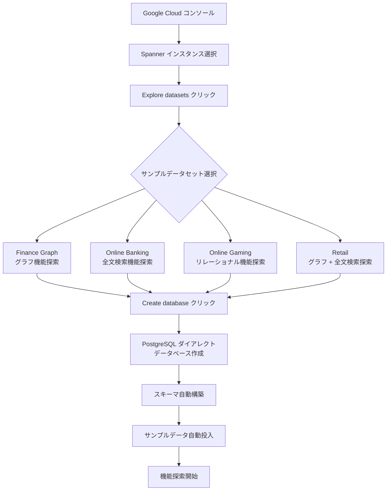

# Spanner: PostgreSQL ダイアレクト用サンプルデータセット

**リリース日**: 2026-05-14

**サービス**: Cloud Spanner

**機能**: PostgreSQL ダイアレクトデータベース用サンプルデータセット

**ステータス**: Feature (GA)

[このアップデートのインフォグラフィックを見る](https://takech9203.github.io/google-cloud-news-summary/20260514-spanner-postgresql-sample-datasets.html)

## 概要

Google Cloud は、Cloud Spanner の PostgreSQL ダイアレクトデータベースにおいて、サンプルデータセットを使用した新規データベース作成機能を一般提供 (GA) として発表しました。これにより、既存の Spanner インスタンス上に新しい PostgreSQL ダイアレクトデータベースを作成する際、事前に用意されたサンプルデータを即座に投入して Spanner の各種機能を探索できるようになります。

この機能は、Spanner を初めて評価するユーザーや、特定の高度な機能 (グラフクエリ、全文検索、ベクトル検索など) を試したい開発者にとって、オンボーディング体験を大幅に改善するものです。従来はデータベース作成後に手動でスキーマ定義とデータ投入を行う必要がありましたが、ワンクリックで実用的なデータセットを含むデータベースを構築できるようになりました。

対象ユーザーは、Spanner の導入を検討しているアーキテクト、PostgreSQL 互換環境での Spanner 機能評価を行う開発者、概念実証 (PoC) を迅速に立ち上げたいチームです。

**アップデート前の課題**

- 新しい PostgreSQL ダイアレクトデータベースを作成した後、機能を試すためのスキーマ設計とテストデータ投入を手動で行う必要があった
- Spanner のグラフ機能や全文検索、ベクトル検索といった高度な機能を試すには、適切なデータモデルとサンプルデータの準備に時間がかかった
- 初めて Spanner を評価するユーザーにとって、各機能の体験までの初期セットアップが障壁となっていた

**アップデート後の改善**

- Google Cloud コンソールから「Explore datasets」ボタンをクリックするだけで、目的に応じたサンプルデータセットを選択してデータベースを即座に作成可能になった
- 金融グラフ、オンラインバンキング、オンラインゲーミング、リテールの 4 種類のデータセットにより、Spanner の主要機能をすぐに体験できるようになった
- PostgreSQL ダイアレクトでもサンプルデータセットが利用可能になり、PostgreSQL ユーザーのオンボーディングが効率化された

## アーキテクチャ図



この図は、Google Cloud コンソールからサンプルデータセットを選択して PostgreSQL ダイアレクトデータベースを作成し、即座に機能探索を開始するまでのフローを示しています。

## サービスアップデートの詳細

### 主要機能

1. **事前構築済みサンプルデータセット**
   - 4 種類のサンプルデータセットが用意されており、それぞれ異なる Spanner 機能の探索に最適化されている
   - データセットにはスキーマ定義とサンプルデータが含まれ、作成直後から利用可能

2. **PostgreSQL ダイアレクト対応**
   - PostgreSQL ダイアレクトで新規データベースを作成する際にサンプルデータセットを選択可能
   - PostgreSQL 互換の SQL 構文でサンプルデータに対するクエリを即座に実行可能
   - PGAdapter や psql などの PostgreSQL ツールでそのまま接続・操作可能

3. **目的別データセット設計**
   - **Finance Graph**: 金融取引のグラフ構造データで、Spanner Graph 機能を探索
   - **Online Banking**: 銀行取引データで、全文検索機能を探索
   - **Online Gaming**: ゲームプレイヤーとアイテムデータで、リレーショナルデータベース機能を探索
   - **Retail**: 商品カタログとレコメンデーションデータで、グラフと全文検索の組み合わせを探索

## 技術仕様

### サンプルデータセット一覧

| データセット名 | 探索対象機能 | 想定ユースケース |
|------|------|------|
| Finance Graph | Spanner Graph | 金融取引のグラフ分析、不正検知パターン探索 |
| Online Banking | 全文検索 (Full-text Search) | トランザクション検索、テキストベースのクエリ |
| Online Gaming | リレーショナルモデル | プレイヤー管理、インターリーブテーブル、トランザクション |
| Retail | グラフ + 全文検索 | 商品レコメンデーション、カタログ検索 |

### PostgreSQL ダイアレクトで利用可能な Spanner 機能

| 機能 | 説明 |
|------|------|
| インターリーブテーブル | 親子テーブル関係の定義による効率的なデータアクセス |
| 全文検索 | テキストデータに対する高速な検索クエリ |
| ベクトル検索 | 高次元ベクトルデータの類似性検索 |
| Spanner Graph | プロパティグラフによる複雑な関係性のモデリング |
| TTL (Time to Live) | データの自動期限切れ管理 |

### データベース作成時の SQL ダイアレクト指定

```sql
-- PostgreSQL ダイアレクトでデータベースを作成
CREATE DATABASE "my-sample-db"
```

```python
# Python クライアントライブラリでの PostgreSQL ダイアレクト指定例
from google.cloud.spanner_admin_database_v1.types import spanner_database_admin
from google.cloud.spanner_admin_database_v1 import DatabaseDialect

request = spanner_database_admin.CreateDatabaseRequest(
    parent=f"projects/{project_id}/instances/{instance_id}",
    create_statement='CREATE DATABASE "my-sample-db"',
    database_dialect=DatabaseDialect.POSTGRESQL,
)
```

## 設定方法

### 前提条件

1. Google Cloud プロジェクトで Spanner API が有効化されていること
2. 既存の Spanner インスタンスが作成済みであること
3. `spanner.databases.create` 権限を持つ IAM ロールが付与されていること

### 手順

#### ステップ 1: Google Cloud コンソールから Spanner インスタンスにアクセス

```bash
# gcloud CLI でインスタンス一覧を確認
gcloud spanner instances list
```

Google Cloud コンソールで Spanner のインスタンスページに移動し、データベースを作成するインスタンスを選択します。

#### ステップ 2: サンプルデータセットを選択してデータベースを作成

```
1. インスタンスの詳細ページで「Explore datasets」をクリック
2. 以下のデータセットから目的に合ったものを選択:
   - Finance Graph (グラフ機能)
   - Online Banking (全文検索)
   - Online Gaming (リレーショナル機能)
   - Retail (グラフ + 全文検索)
3. 「Create database」をクリック
```

データベースが作成されると、スキーマとサンプルデータが自動的に投入され、すぐにクエリの実行が可能になります。

#### ステップ 3: サンプルデータに対してクエリを実行

```sql
-- PGAdapter 経由で psql から接続して確認
-- テーブル一覧の確認
\dt

-- サンプルデータの確認
SELECT * FROM <table_name> LIMIT 10;
```

## メリット

### ビジネス面

- **評価期間の短縮**: サンプルデータを使うことで、Spanner の機能評価に必要な初期セットアップ時間をほぼゼロに削減
- **意思決定の加速**: 実際のデータモデルに近いサンプルで Spanner の機能を体験し、採用判断を迅速化
- **トレーニングコストの削減**: 新しいチームメンバーが Spanner の各機能を自己学習するための教材として即座に利用可能

### 技術面

- **ベストプラクティスの学習**: サンプルデータセットのスキーマ設計から、Spanner でのデータモデリングのベストプラクティスを学べる
- **機能探索の効率化**: グラフ、全文検索、ベクトル検索などの高度な機能を、適切なデータ構造で即座に試行可能
- **PostgreSQL エコシステムとの互換性検証**: PostgreSQL ツール (psql, JDBC ドライバ, pgx など) との接続性をサンプルデータで検証可能

## デメリット・制約事項

### 制限事項

- サンプルデータセットは新規データベース作成時にのみ利用可能で、既存データベースへの追加投入はできない
- 現時点では Google Cloud コンソールからの操作に限定されている可能性がある
- サンプルデータセットの種類は 4 種類に固定されており、カスタムデータセットの追加はできない

### 考慮すべき点

- サンプルデータセットはあくまで評価・学習用であり、本番環境のデータモデル設計にはアプリケーション固有の要件分析が必要
- サンプルデータベースにも通常の Spanner 料金 (ノード料金、ストレージ料金) が適用される
- PostgreSQL ダイアレクトでは一部の PostgreSQL 機能 (トリガー、SERIAL、拡張機能など) がサポートされていない点に注意

## ユースケース

### ユースケース 1: Spanner Graph 機能の概念実証

**シナリオ**: 金融サービス企業が不正検知システムの構築に Spanner Graph を活用できるか評価したい

**実装例**:
```sql
-- Finance Graph データセットを使用
-- アカウント間の送金グラフを探索
GRAPH FinGraph
MATCH (p:Person)-[:Owns]->(a:Account)-[t:Transfers]->(dest:Account)
WHERE t.amount > 10000
RETURN p.name, a.id, dest.id, t.amount
ORDER BY t.amount DESC
LIMIT 10;
```

**効果**: 手動でグラフスキーマとデータを構築することなく、Spanner Graph の GQL クエリ構文とパフォーマンスを即座に評価可能

### ユースケース 2: 全文検索機能の評価

**シナリオ**: オンラインバンキングアプリケーションで取引履歴の検索機能を実装する前に、Spanner の全文検索性能を確認したい

**効果**: Online Banking データセットを使用して、全文検索インデックスの作成からクエリ実行までの一連のフローを体験し、レスポンス時間やクエリ構文を事前に確認できる

### ユースケース 3: PostgreSQL 移行の事前検証

**シナリオ**: 既存の PostgreSQL データベースから Spanner への移行を検討しているチームが、PostgreSQL ダイアレクトの互換性を確認したい

**効果**: Online Gaming データセットを使用して、PostgreSQL 標準の SQL 構文で Spanner にクエリを実行し、既存アプリケーションコードの互換性を事前に検証できる

## 料金

サンプルデータセットの利用自体に追加料金はかかりません。ただし、作成されたデータベースには通常の Spanner 料金が適用されます。

### 料金例

| 項目 | 月額料金 (概算) |
|--------|-----------------|
| 処理ユニット (100 PU 最小構成) | 約 $65/月 |
| ストレージ (サンプルデータ分、数 GB 想定) | 約 $0.30/GB/月 |
| ネットワーク (同一リージョン内) | 無料 |

※ 評価目的であれば、Spanner の無料トライアルインスタンス (90 日間) を活用することで費用を抑えられます。

## 利用可能リージョン

サンプルデータセット機能は、Spanner インスタンスが利用可能なすべてのリージョンおよびマルチリージョン構成で利用可能です。Spanner インスタンスを作成できる任意のロケーションで、PostgreSQL ダイアレクトのサンプルデータセット付きデータベースを作成できます。

## 関連サービス・機能

- **Spanner Graph**: プロパティグラフによるデータモデリングと GQL クエリ。Finance Graph データセットで体験可能
- **Spanner 全文検索**: テキストデータに対するインデックスベースの高速検索。Online Banking データセットで体験可能
- **Spanner ベクトル検索**: 埋め込みベクトルによる類似性検索 (KNN/ANN)。Retail データセットで関連機能を体験可能
- **PGAdapter**: PostgreSQL ワイヤプロトコルプロキシ。サンプルデータベースへの psql 接続に使用
- **BigQuery 外部データセット**: Spanner PostgreSQL ダイアレクトデータベースへのフェデレーテッドクエリ

## 参考リンク

- [インフォグラフィック](https://takech9203.github.io/google-cloud-news-summary/20260514-spanner-postgresql-sample-datasets.html)
- [公式リリースノート](https://docs.cloud.google.com/release-notes#May_14_2026)
- [ドキュメント: Create and manage databases](https://docs.cloud.google.com/spanner/docs/create-manage-databases#use-datasets)
- [PostgreSQL interface for Spanner](https://docs.cloud.google.com/spanner/docs/postgresql-interface)
- [Spanner 料金ページ](https://cloud.google.com/spanner/pricing)
- [Spanner Graph 概要](https://docs.cloud.google.com/spanner/docs/graph/overview)
- [Spanner 全文検索](https://docs.cloud.google.com/spanner/docs/full-text-search)

## まとめ

今回のアップデートにより、PostgreSQL ダイアレクトの Spanner データベースでもサンプルデータセットを活用した迅速な機能探索が可能になりました。グラフ、全文検索、リレーショナルモデルなど Spanner の主要機能を、データ準備の手間なく即座に体験できるため、Spanner の評価・導入検討を行うチームには積極的な活用を推奨します。まずは Google Cloud コンソールから「Explore datasets」をクリックし、目的に合ったデータセットで Spanner の機能を体験してみてください。

---

**タグ**: #Spanner #PostgreSQL #サンプルデータセット #GA #データベース作成 #グラフ #全文検索 #オンボーディング
