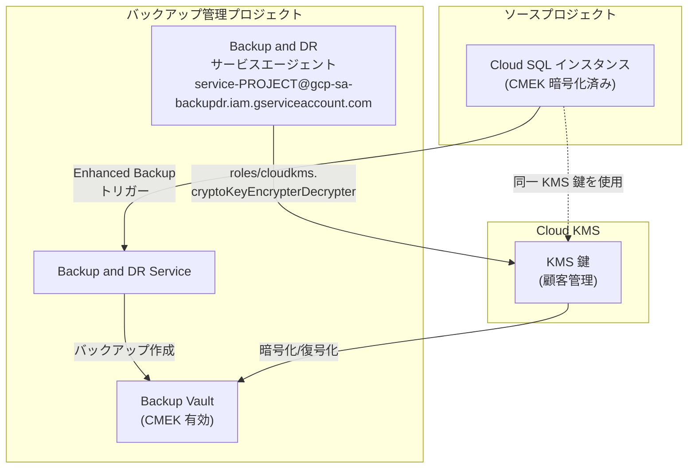

# Backup and DR Service: Cloud SQL Enhanced Backups における CMEK サポート

**リリース日**: 2026-05-15

**サービス**: Backup and DR Service

**機能**: Cloud SQL Enhanced Backups における顧客管理暗号鍵 (CMEK) サポート

**ステータス**: Feature (GA)

📊 [このアップデートのインフォグラフィックを見る](https://takech9203.github.io/google-cloud-news-summary/20260515-backup-and-dr-cmek-cloud-sql-enhanced-backups.html)

## 概要

Backup and DR Service が Cloud SQL の Enhanced Backups（拡張バックアップ）において、顧客管理暗号鍵（CMEK: Customer-Managed Encryption Keys）のサポートを開始しました。これにより、Cloud SQL のバックアップデータをソースインスタンスと同じ Cloud KMS 鍵で保護できるようになり、バックアップデータに対する暗号化の一貫性が確保されます。

本機能の最大の特徴は、IAM 権限の「分離（decoupled）」設計です。CMEK の暗号化・復号化権限は Backup and DR Service のサービスエージェントに紐付けられており、Cloud SQL のサービスアカウントとは独立して管理されます。これにより、バックアップのセキュリティ管理と Cloud SQL のオペレーション管理を明確に分離できます。

このアップデートは、規制要件やコンプライアンス要件を持つ企業にとって特に重要です。金融機関、医療機関、政府機関など、データの暗号化に対して厳格な管理を求められる組織が、Enhanced Backups の高度なバックアップ管理機能（最大 10 年の保持、強制保持期間、柔軟なスケジューリング）を CMEK と組み合わせて利用できるようになりました。

**アップデート前の課題**

これまで Cloud SQL の Enhanced Backups では CMEK がサポートされておらず、以下の制限がありました。

- Cloud SQL Enhanced Backups では Google 管理の暗号鍵のみが使用可能であり、顧客が暗号鍵のライフサイクルを制御できなかった
- CMEK を利用したい場合は Standard Backups を選択する必要があり、Enhanced Backups の高度な機能（長期保持、柔軟なスケジューリング、プロジェクト削除後のバックアップ保持など）を併用できなかった
- バックアップデータの暗号鍵がソースインスタンスと異なる管理体系になり、暗号化ポリシーの一貫性を維持することが困難だった

**アップデート後の改善**

今回のアップデートにより、以下の改善が実現されました。

- Cloud SQL Enhanced Backups で CMEK を使用してバックアップデータを暗号化できるようになり、鍵のライフサイクルを顧客が完全に制御可能になった
- ソースインスタンスと同じ KMS 鍵でバックアップを保護できるため、暗号化ポリシーの一貫性が確保された
- IAM 権限が Backup and DR Service のサービスエージェントに分離されたことで、最小権限の原則に基づいたセキュリティ設計が可能になった

## アーキテクチャ図



Backup and DR Service のサービスエージェントが Cloud KMS 鍵へのアクセス権限を保持し、Enhanced Backup で作成されるバックアップデータの暗号化・復号化を実行します。Cloud SQL ソースインスタンスと同一の KMS 鍵を使用することで、暗号化の一貫性が維持されます。

## サービスアップデートの詳細

### 主要機能

1. **ソースインスタンスと同一の KMS 鍵によるバックアップ暗号化**
   - Cloud SQL インスタンスで使用されている CMEK と同じ鍵でバックアップデータを保護
   - 暗号化ポリシーの統一管理により、コンプライアンス対応が容易に
   - 鍵の無効化・破棄により、バックアップデータへのアクセスも同時に制御可能

2. **分離された IAM 権限（Decoupled IAM Permissions）**
   - Backup and DR Service のサービスエージェントに KMS 権限を付与
   - Cloud SQL のサービスアカウントとは独立した権限管理
   - Backup Vault サービスアカウント（ワークロードアクセス用）と Backup and DR サービスエージェント（KMS アクセス用）の明確な役割分離

3. **Enhanced Backups の全機能との統合**
   - 最大 10 年間のバックアップ保持期間
   - 時間単位、日単位、週単位、月単位、年単位の柔軟なスケジューリング
   - プロジェクト削除後もバックアップを維持
   - 強制保持期間（Enforced Retention）による不変性保証

## 技術仕様

### サービスエージェントと権限構成

| 項目 | 詳細 |
|------|------|
| サービスエージェント形式 | `service-VAULT_PROJECT_NUMBER@gcp-sa-backupdr.iam.gserviceaccount.com` |
| 必要なロール | `roles/cloudkms.cryptoKeyEncrypterDecrypter` |
| 権限付与対象 | Cloud KMS 鍵（鍵レベル推奨） |
| KMS 鍵のロケーション要件 | Backup Vault と同一リージョン |

### Enhanced Backups と Standard Backups の比較（CMEK 観点）

| 機能 | Standard Backups | Enhanced Backups (今回のアップデート後) |
|------|-----------------|--------------------------------------|
| CMEK サポート | 対応済み | 対応済み（新規） |
| バックアップ保持期間 | 最大 1 年 | 最大 10 年 |
| 強制保持期間 | なし | あり |
| プロジェクト削除後の保持 | なし | あり |
| 一元管理 | なし | あり |
| スケジュール粒度 | 日次 | 時間/日/週/月/年 |

### IAM 権限の分離設計

```json
{
  "bindings": [
    {
      "role": "roles/cloudkms.cryptoKeyEncrypterDecrypter",
      "members": [
        "serviceAccount:service-PROJECT_NUMBER@gcp-sa-backupdr.iam.gserviceaccount.com"
      ],
      "condition": {
        "description": "Backup and DR Service Agent - CMEK access for backup vault encryption"
      }
    }
  ]
}
```

## 設定方法

### 前提条件

1. Cloud SQL インスタンスが CMEK で暗号化されていること
2. Cloud KMS に対象の鍵が作成済みであること
3. Backup and DR Service API が有効化されていること
4. 適切な IAM 権限（`backupdr.admin` または同等のロール）を持つユーザーであること

### 手順

#### ステップ 1: Backup and DR サービスエージェントに KMS 権限を付与

```bash
# Backup and DR サービスエージェントに CryptoKey Encrypter/Decrypter ロールを付与
gcloud kms keys add-iam-policy-binding KEY_NAME \
  --location=KMS_LOCATION \
  --keyring=KEY_RING \
  --member=serviceAccount:service-VAULT_PROJECT_NUMBER@gcp-sa-backupdr.iam.gserviceaccount.com \
  --role=roles/cloudkms.cryptoKeyEncrypterDecrypter
```

`VAULT_PROJECT_NUMBER` は Backup Vault が存在するプロジェクトの番号に置き換えてください。最小権限の原則に従い、鍵レベルでの権限付与を推奨します。

#### ステップ 2: CMEK 対応の Backup Vault を作成

```bash
# CMEK を有効化した Backup Vault の作成（作成時のみ設定可能）
gcloud backup-dr backup-vaults create VAULT_NAME \
  --location=LOCATION \
  --backup-min-enforced-retention=RETENTION_PERIOD \
  --encryption-key=projects/PROJECT_ID/locations/LOCATION/keyRings/KEY_RING/cryptoKeys/KEY_NAME
```

CMEK は Backup Vault 作成時にのみ設定可能です。既存の Vault に対して後から CMEK を有効化することはできません。

#### ステップ 3: バックアッププランの作成と Cloud SQL インスタンスへの適用

```bash
# バックアッププランを作成し、CMEK 対応 Backup Vault を指定
gcloud backup-dr backup-plans create PLAN_NAME \
  --location=LOCATION \
  --backup-vault=VAULT_NAME \
  --resource-type=cloudsql.googleapis.com/Instance
```

Cloud SQL インスタンスにバックアッププランを関連付けると、以降のバックアップは指定した CMEK 鍵で暗号化されます。

## メリット

### ビジネス面

- **コンプライアンス要件の充足**: HIPAA、PCI DSS、GDPR など、データ暗号化に対する厳格な要件を持つ規制に対応可能。バックアップデータも含めた統一的な暗号化ポリシーを証明できる
- **データ主権の確保**: 暗号鍵のライフサイクルを顧客が完全に制御できるため、データ主権要件に対応。鍵を無効化すればバックアップデータへのアクセスも即座に遮断可能
- **長期保持とセキュリティの両立**: 最大 10 年間の保持と CMEK 暗号化を組み合わせることで、長期アーカイブ要件とセキュリティ要件を同時に満たせる

### 技術面

- **暗号化の一貫性**: ソースインスタンスとバックアップで同一の KMS 鍵を使用するため、鍵管理が簡素化される
- **権限分離によるセキュリティ強化**: Backup and DR サービスエージェントへの権限分離により、最小権限の原則を実現。Cloud SQL の運用担当者がバックアップの暗号鍵に直接アクセスする必要がない
- **鍵ローテーションの自動対応**: Cloud KMS の自動鍵ローテーション機能と連携し、新しいバックアップは最新の鍵バージョンで暗号化される

## デメリット・制約事項

### 制限事項

- CMEK は Backup Vault 作成時にのみ設定可能。既存の Backup Vault に対する CMEK の有効化・無効化・変更はできない
- KMS 鍵は Backup Vault と同一リージョンに存在する必要がある（マルチリージョン Vault の場合は同一マルチリージョン）
- Enhanced Backups を使用するインスタンスではディザスタリカバリ（DR）レプリカの作成ができない
- KMS 鍵が無効化・破棄された場合、バックアップからのリストアが不可能になる

### 考慮すべき点

- KMS 鍵の可用性がバックアップのリストア可否に直接影響するため、鍵の管理ポリシーを慎重に設計する必要がある
- Backup Vault の作成時に CMEK を設定する必要があるため、既存の非 CMEK Vault を使用している場合は新規 Vault の作成とバックアッププランの再構成が必要
- Cloud KMS の追加コスト（鍵バージョンあたり月額 $0.06〜）が発生する
- 組織全体で統一的な鍵管理ポリシーを事前に策定することを推奨

## ユースケース

### ユースケース 1: 金融機関におけるデータベースバックアップの暗号化統制

**シナリオ**: 金融機関が Cloud SQL 上で顧客データを管理しており、PCI DSS 要件に基づきすべてのデータ（バックアップ含む）を顧客管理鍵で暗号化する必要がある。また、監査のためにバックアップを 7 年間保持する規制要件がある。

**実装例**:
```bash
# 7 年間の強制保持期間を持つ CMEK 対応 Backup Vault を作成
gcloud backup-dr backup-vaults create finance-vault \
  --location=asia-northeast1 \
  --backup-min-enforced-retention=2555d \
  --encryption-key=projects/my-project/locations/asia-northeast1/keyRings/finance-ring/cryptoKeys/finance-key

# バックアッププランの適用
gcloud backup-dr backup-plans create finance-daily-plan \
  --location=asia-northeast1 \
  --backup-vault=finance-vault \
  --resource-type=cloudsql.googleapis.com/Instance
```

**効果**: PCI DSS のデータ暗号化要件と長期保持要件を同時に充足。鍵の監査ログにより、暗号鍵の使用履歴を完全にトレース可能。

### ユースケース 2: マルチチーム環境での権限分離

**シナリオ**: 大規模組織で、データベース運用チーム、セキュリティチーム、バックアップ管理チームが分離されている。各チームの責務に応じた最小権限アクセスを実現したい。

**効果**: Backup and DR サービスエージェントへの KMS 権限の分離により、データベース運用チームは KMS 鍵へのアクセスなしに日常運用が可能。セキュリティチームは KMS 鍵の管理に集中でき、バックアップ管理チームはバックアッププランの運用に注力できる。IAM ポリシーの明確な分離により、セキュリティインシデント時の影響範囲を限定できる。

## 料金

Enhanced Backups の料金は Backup and DR Service の料金体系に基づきます。CMEK を使用する場合、追加で Cloud KMS の料金が発生します。

### 料金例

| 項目 | 月額料金 (概算) |
|------|-----------------|
| Cloud KMS ソフトウェア鍵（1 鍵バージョン） | $0.06 |
| Cloud KMS HSM 鍵（1 鍵バージョン） | $1.00〜$2.50 |
| Cloud KMS 暗号化オペレーション（10,000 回） | $0.03 |
| Backup and DR ストレージ | Backup and DR 料金表に準拠 |

注: Backup and DR Service のバックアップストレージ料金は、Backup Vault に格納されるデータの総サイズに基づいて計算されます。詳細は [Backup and DR pricing](https://cloud.google.com/backup-disaster-recovery/pricing) を参照してください。

## 利用可能リージョン

Cloud KMS 鍵と Backup Vault が同一リージョン（またはマルチリージョン）に存在する必要があります。Cloud SQL インスタンスがサポートされているすべてのリージョンで利用可能ですが、Backup Vault の[サポート対象ロケーション](https://docs.cloud.google.com/backup-disaster-recovery/docs/concepts/backup-vault#locations)と[ワークロードロケーション互換性](https://docs.cloud.google.com/backup-disaster-recovery/docs/concepts/backup-vault#workload-location-compatibility)を確認してください。

## 関連サービス・機能

- **Cloud KMS**: 暗号鍵のライフサイクル管理を提供。CMEK 鍵の作成、ローテーション、無効化、破棄を制御
- **Cloud SQL**: CMEK で暗号化されたデータベースインスタンスのソースワークロード
- **Backup and DR Service**: バックアップの一元管理、Backup Vault による不変性保証、強制保持期間の提供
- **Cloud KMS Autokey**: CMEK 鍵の自動プロビジョニングと割り当てを簡素化（HSM 保護レベル）
- **IAM**: サービスエージェントへの権限付与と分離を実現

## 参考リンク

- 📊 [インフォグラフィック](https://takech9203.github.io/google-cloud-news-summary/20260515-backup-and-dr-cmek-cloud-sql-enhanced-backups.html)
- [公式リリースノート](https://docs.cloud.google.com/release-notes#May_15_2026)
- [Backup and DR CMEK ドキュメント](https://docs.cloud.google.com/backup-disaster-recovery/docs/concepts/cmek)
- [Cloud SQL Enhanced Backups](https://docs.cloud.google.com/sql/docs/mysql/backup-recovery/backup-options#enhanced-backups)
- [Cloud KMS CMEK 概要](https://docs.cloud.google.com/kms/docs/cmek)
- [Backup and DR 料金](https://cloud.google.com/backup-disaster-recovery/pricing)
- [Cloud KMS 料金](https://cloud.google.com/kms/pricing)

## まとめ

今回の CMEK サポートにより、Cloud SQL Enhanced Backups は企業レベルのセキュリティ要件を完全に満たすバックアップソリューションとなりました。分離された IAM 権限設計により、最小権限の原則に基づいたセキュアな運用が可能です。CMEK による暗号化制御が必要な組織は、新規 CMEK 対応 Backup Vault の作成とバックアッププランの構成を検討してください。

---

**タグ**: #BackupAndDR #CloudSQL #CMEK #CloudKMS #セキュリティ #暗号化 #コンプライアンス #EnhancedBackups #GA
