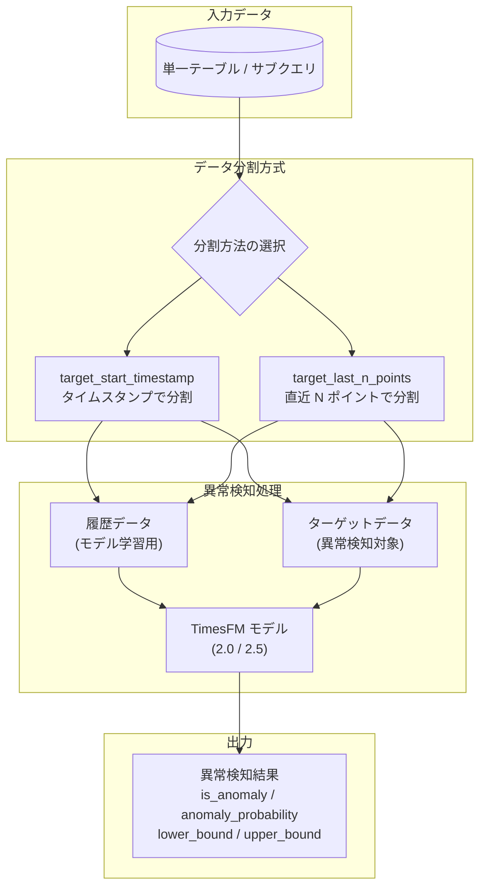

# BigQuery: AI.DETECT_ANOMALIES 関数の単一入力テーブルサポートが GA

**リリース日**: 2026-05-15

**サービス**: BigQuery

**機能**: AI.DETECT_ANOMALIES 関数 - 単一入力テーブルによる異常検知

**ステータス**: GA (一般提供)

[このアップデートのインフォグラフィックを見る](https://takech9203.github.io/google-cloud-news-summary/20260515-bigquery-ai-detect-anomalies-ga.html)

## 概要

BigQuery の `AI.DETECT_ANOMALIES` 関数において、履歴データとターゲットデータの両方を単一の入力テーブルで提供する機能が一般提供 (GA) となった。これにより、従来の 2 テーブル分離方式に加え、1 つのテーブルから `target_start_timestamp` または `target_last_n_points` 引数を使用してデータを自動分割し、異常検知を実行できるようになった。

この機能は BigQuery ML の組み込み TimesFM モデル (TimesFM 2.0 および TimesFM 2.5) を活用した時系列異常検知をよりシンプルに実行するためのもので、データパイプラインの簡素化やクエリの可読性向上に貢献する。特に、データエンジニアやデータサイエンティストが日常的に異常検知を運用する際のクエリ作成工数を削減する。

**アップデート前の課題**

- 履歴データとターゲットデータを別々のテーブルまたはサブクエリとして明示的に分離する必要があった
- 同一テーブルに格納されたデータに対して異常検知を行う場合、WHERE 句で手動にデータを分割する 2 つのサブクエリを記述する必要があった
- ローリングウィンドウでの異常検知を実装する際に、クエリが複雑になりがちだった

**アップデート後の改善**

- 単一の入力テーブル (またはサブクエリ) を渡し、`target_start_timestamp` でタイムスタンプによる分割点を指定するだけで異常検知が実行可能になった
- `target_last_n_points` を使用して「直近 N ポイントをターゲットとして扱う」という直感的な指定が可能になった
- `TIMESTAMP_SUB(CURRENT_TIMESTAMP(), INTERVAL 7 DAY)` のような式を使用し、ローリングウィンドウの異常検知を簡潔に記述できるようになった

## アーキテクチャ図



単一入力テーブルから `target_start_timestamp` または `target_last_n_points` を指定することで、BigQuery が自動的に履歴データとターゲットデータを分割し、TimesFM モデルによる異常検知を実行する。

## サービスアップデートの詳細

### 主要機能

1. **単一入力テーブルサポート**
   - 従来の 2 テーブル方式 (HISTORY_TABLE + TARGET_TABLE) に加え、1 テーブルのみでの呼び出しが GA となった
   - TARGET_TABLE / TARGET_QUERY_STATEMENT を省略した場合、HISTORY_TABLE / HISTORY_QUERY_STATEMENT が履歴とターゲットの両方のデータを提供する
   - `target_last_n_points` または `target_start_timestamp` でデータの分割点を指定する

2. **target_start_timestamp 引数**
   - TIMESTAMP 値または式で分割点を指定
   - 分割点以前のデータが履歴データ、分割点より後のデータがターゲットデータとなる
   - 式による指定が可能で、`TIMESTAMP_SUB(CURRENT_TIMESTAMP(), INTERVAL 7 DAY)` のようなローリングウィンドウに対応

3. **target_last_n_points 引数**
   - INT64 値で直近のデータポイント数を指定 (範囲: 1 ~ 10,000)
   - 指定した数の最新データポイントがターゲットデータとして使用される
   - 残りのデータポイントが履歴データとして使用される

## 技術仕様

### 構文

```sql
SELECT * FROM AI.DETECT_ANOMALIES(
  { TABLE HISTORY_TABLE | (HISTORY_QUERY_STATEMENT) },
  -- TARGET_TABLE / TARGET_QUERY_STATEMENT は省略可能
  data_col => 'DATA_COL',
  timestamp_col => 'TIMESTAMP_COL'
  [, target_last_n_points => TARGET_LAST_N_POINTS]
  [, target_start_timestamp => TARGET_START_TIMESTAMP]
  [, model => 'MODEL']
  [, id_cols => ID_COLS]
  [, anomaly_prob_threshold => ANOMALY_PROB_THRESHOLD]
  [, context_window => CONTEXT_WINDOW]
)
```

### パラメータ一覧

| パラメータ | 型 | 説明 |
|------|------|------|
| `target_start_timestamp` | TIMESTAMP | データ分割のタイムスタンプ。この値以前が履歴、以降がターゲット |
| `target_last_n_points` | INT64 | ターゲットとする直近のデータポイント数 (1 ~ 10,000) |
| `model` | STRING | 使用するモデル名 (TimesFM 2.0 / TimesFM 2.5、デフォルト: TimesFM 2.0) |
| `anomaly_prob_threshold` | FLOAT64 | 異常判定の閾値 (0 ~ 1、デフォルト: 0.95) |
| `context_window` | INT64 | コンテキストウィンドウ長 (モデルによって有効値が異なる) |
| `id_cols` | ARRAY<STRING> | 複数時系列の ID 列 (STRING または INT64 型) |
| `data_col` | STRING | データ列名 (INT64, NUMERIC, BIGNUMERIC, FLOAT64) |
| `timestamp_col` | STRING | タイムスタンプ列名 (TIMESTAMP, DATE, DATETIME) |

### 出力カラム

| カラム名 | 型 | 説明 |
|------|------|------|
| `time_series_timestamp` | STRING | タイムスタンプ |
| `time_series_data` | FLOAT64 | データ値 |
| `is_anomaly` | BOOL | 異常かどうか |
| `lower_bound` | FLOAT64 | 予測の下限値 |
| `upper_bound` | FLOAT64 | 予測の上限値 |
| `anomaly_probability` | FLOAT64 | 異常確率 |
| `ai_detect_anomalies_status` | STRING | 処理ステータス (成功時は空文字列) |

### 対応モデルとコンテキストウィンドウ

| モデル名 | 対応コンテキストウィンドウ長 | 最大データポイント数 |
|------|------|------|
| TimesFM 2.0 | 64, 128, 256, 512, 1024, 2048 | 2,048 |
| TimesFM 2.5 | 64, 128, 256, 512, 1024, 2048, 4096, 8192, 15360 | 15,360 |

## 設定方法

### 前提条件

1. BigQuery API が有効化されたプロジェクト
2. `bigquery.jobs.create` 権限を持つ IAM ロール

### 手順

#### ステップ 1: 単一テーブルで target_start_timestamp を使用した異常検知

```sql
WITH sales_data AS (
  SELECT
    DATE(transaction_date) AS sale_date,
    SUM(amount) AS daily_sales
  FROM `myproject.mydataset.transactions`
  GROUP BY sale_date
)
SELECT * FROM AI.DETECT_ANOMALIES(
  (SELECT * FROM sales_data WHERE sale_date <= CURRENT_DATE()),
  data_col => 'daily_sales',
  timestamp_col => 'sale_date',
  target_start_timestamp => DATE_SUB(CURRENT_DATE(), INTERVAL 7 DAY)
);
```

`target_start_timestamp` に指定した日付以降のデータポイントについて異常検知が実行される。それ以前のデータは TimesFM モデルの学習に使用される。

#### ステップ 2: target_last_n_points を使用した異常検知

```sql
WITH sensor_data AS (
  SELECT
    reading_timestamp,
    temperature_value
  FROM `myproject.mydataset.iot_sensors`
  WHERE sensor_id = 'sensor-001'
)
SELECT * FROM AI.DETECT_ANOMALIES(
  (SELECT * FROM sensor_data),
  data_col => 'temperature_value',
  timestamp_col => 'reading_timestamp',
  target_last_n_points => 100
);
```

直近 100 ポイントをターゲットデータとして異常検知を実行する。

#### ステップ 3: 複数時系列での異常検知 (id_cols 使用)

```sql
WITH bike_trips AS (
  SELECT
    EXTRACT(DATE FROM starttime) AS date,
    usertype,
    COUNT(*) AS num_trips
  FROM `bigquery-public-data.new_york.citibike_trips`
  GROUP BY date, usertype
)
SELECT * FROM AI.DETECT_ANOMALIES(
  (SELECT * FROM bike_trips WHERE date <= DATE('2016-09-01')),
  data_col => 'num_trips',
  timestamp_col => 'date',
  target_start_timestamp => '2016-07-01',
  id_cols => ['usertype']
);
```

`id_cols` を指定することで、ユーザータイプごとに個別の時系列として異常検知を実行する。

## メリット

### ビジネス面

- **運用コスト削減**: データの前処理やテーブル分割の手間が不要になり、異常検知パイプラインの構築・保守コストが低減
- **迅速な意思決定**: シンプルなクエリで異常検知を実行できるため、ビジネスメトリクスの監視を迅速に導入可能

### 技術面

- **クエリの簡素化**: 2 つのサブクエリを記述する必要がなくなり、SQL の可読性と保守性が向上
- **ローリングウィンドウ対応**: `TIMESTAMP_SUB(CURRENT_TIMESTAMP(), INTERVAL N DAY)` のような式を使用し、スケジュールクエリでの定期的な異常検知が容易に実装可能
- **GA による本番利用の安定性**: SLA に裏打ちされた本番環境での利用が保証される

## デメリット・制約事項

### 制限事項

- 異常検知で評価されるのは直近 1,024 タイムポイントまで (それ以上必要な場合は bqml-feedback@google.com に問い合わせが必要)
- `target_last_n_points` と `target_start_timestamp` は排他的で、同時に指定できない
- `target_last_n_points` の最大値は 10,000
- 時系列データが短すぎる場合 (最低 3 データポイント必要)、NULL 値が返される

### 考慮すべき点

- TimesFM 2.0 は最大 2,048 データポイント、TimesFM 2.5 は最大 15,360 データポイントまでの処理に対応。それ以上のデータポイントは無視される
- `anomaly_prob_threshold` のデフォルト値は 0.95 であり、ユースケースに応じた閾値のチューニングが推奨される
- 多次元の時系列 (複数の id_cols) を処理する場合、データ量に応じてクエリのコストが増加する

## ユースケース

### ユースケース 1: EC サイトの売上異常検知

**シナリオ**: EC サイトの日次売上データをリアルタイムに監視し、不正取引や異常なトラフィックスパイクを早期に検知したい。

**実装例**:
```sql
WITH daily_sales AS (
  SELECT
    DATE(order_timestamp) AS order_date,
    product_category,
    SUM(revenue) AS daily_revenue
  FROM `myproject.ecommerce.orders`
  GROUP BY order_date, product_category
)
SELECT * FROM AI.DETECT_ANOMALIES(
  (SELECT * FROM daily_sales),
  data_col => 'daily_revenue',
  timestamp_col => 'order_date',
  target_last_n_points => 7,
  id_cols => ['product_category'],
  anomaly_prob_threshold => 0.9
);
```

**効果**: カテゴリ別に直近 7 日間の売上異常を検知し、不正取引やシステム障害の早期発見が可能。

### ユースケース 2: IoT センサーデータの異常監視

**シナリオ**: 製造ラインの温度センサーや圧力センサーのデータから、設備故障の予兆を検知したい。

**実装例**:
```sql
SELECT * FROM AI.DETECT_ANOMALIES(
  TABLE `myproject.iot.sensor_readings`,
  data_col => 'temperature',
  timestamp_col => 'reading_time',
  target_start_timestamp => TIMESTAMP_SUB(CURRENT_TIMESTAMP(), INTERVAL 1 HOUR),
  id_cols => ['sensor_id'],
  model => 'TimesFM 2.5'
);
```

**効果**: 1 時間ごとのローリングウィンドウで全センサーの異常を一括検知し、予防保全を実現。

## 料金

AI.DETECT_ANOMALIES の利用料金は、BigQuery ML のオンデマンド料金における evaluation、inspection、prediction レートで課金される。詳細は [BigQuery ML 料金ページ](https://cloud.google.com/bigquery/pricing#bqml) を参照。

## 利用可能リージョン

AI.DETECT_ANOMALIES および TimesFM モデルは、[BigQuery ML がサポートするすべてのロケーション](https://docs.cloud.google.com/bigquery/docs/locations#bqml-loc)で利用可能。

## 関連サービス・機能

- **AI.FORECAST 関数**: 同じ TimesFM モデルを使用した時系列予測関数。異常検知と組み合わせて将来のトレンド予測にも活用可能
- **AI.EVALUATE 関数**: TimesFM モデルの予測精度を評価する関数。異常検知のパラメータチューニングに活用
- **ML.DETECT_ANOMALIES 関数**: ARIMA_PLUS や ARIMA_PLUS_XREG などのユーザー作成モデルを使用した従来の異常検知関数。多変量時系列に対応
- **Cloud Monitoring**: 検知した異常をアラートとして通知する際に連携
- **Looker / Looker Studio**: 異常検知結果の可視化・ダッシュボード化に活用

## 参考リンク

- [インフォグラフィック](https://takech9203.github.io/google-cloud-news-summary/20260515-bigquery-ai-detect-anomalies-ga.html)
- [公式リリースノート](https://docs.cloud.google.com/release-notes#May_15_2026)
- [AI.DETECT_ANOMALIES 関数リファレンス](https://docs.cloud.google.com/bigquery/docs/reference/standard-sql/bigqueryml-syntax-ai-detect-anomalies)
- [TimesFM 異常検知チュートリアル](https://docs.cloud.google.com/bigquery/docs/timesfm-anomaly-detection-tutorial)
- [異常検知の概要](https://docs.cloud.google.com/bigquery/docs/anomaly-detection-overview)
- [BigQuery ML 料金](https://cloud.google.com/bigquery/pricing#bqml)

## まとめ

BigQuery の `AI.DETECT_ANOMALIES` 関数が単一入力テーブルでの呼び出しを GA としてサポートしたことで、時系列異常検知のクエリがより簡潔かつ直感的に記述できるようになった。`target_start_timestamp` や `target_last_n_points` を活用することで、ローリングウィンドウによる定期的な異常検知の実装が容易になり、スケジュールクエリと組み合わせた運用監視パイプラインの構築が推奨される。

---

**タグ**: #BigQuery #BigQueryML #AnomalyDetection #TimesFM #AI #GA #MachineLearning #TimeSeries
