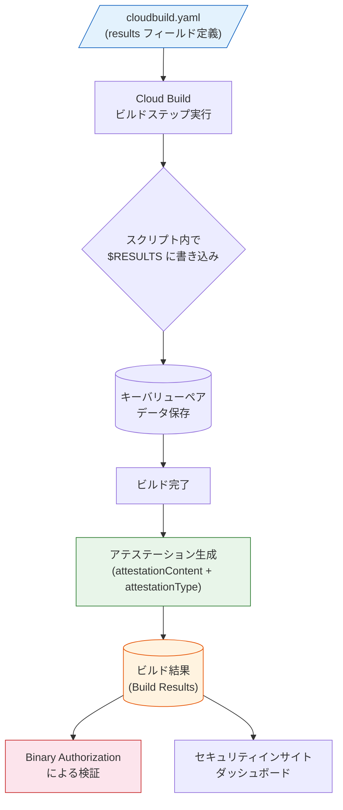

# Cloud Build: ビルド構成ファイルにおける results フィールドのサポート

**リリース日**: 2026-05-15

**サービス**: Cloud Build

**機能**: ビルドステップの results フィールドによるアテステーション生成

**ステータス**: Feature (GA)

[このアップデートのインフォグラフィックを見る](https://takech9203.github.io/google-cloud-news-summary/20260515-cloud-build-results-field-attestation.html)

## 概要

Cloud Build のビルド構成ファイル (cloudbuild.yaml / cloudbuild.json) において、ビルドステップに `results` フィールドを設定できるようになった。この機能により、ビルドステップ内でデータを保存し、ビルド完了後にそのデータをビルド結果内のアテステーション (証明書) として添付できる。

この機能は、ソフトウェアサプライチェーンセキュリティの強化に直結する重要なアップデートである。ビルドプロセス中に収集した情報 (使用したソースの許可リスト、セキュリティスキャン結果、コンプライアンスチェック結果など) を、ビルド成果物に紐づけた検証可能なアテステーションとして記録できるようになる。

**アップデート前の課題**

- ビルドステップ内で生成したデータをビルド結果のアテステーションとして直接添付する標準的な方法がなかった
- ビルドプロセスで検証した情報 (許可リスト、制約条件など) をビルド成果物と紐づけて証明するには、外部ツールや追加の構成が必要だった
- Binary Authorization との連携において、カスタムアテステーションの生成に別途ビルドステップや外部サービスの設定が必要だった

**アップデート後の改善**

- ビルド構成ファイル内で `results` フィールドを宣言するだけで、ビルドステップのデータをアテステーションとして添付可能になった
- `$RESULTS` 環境変数を通じて、スクリプト内から簡単にキーバリューペアを書き込める
- ビルド完了時に自動的にアテステーションが生成され、ビルド結果に含まれる

## アーキテクチャ図



ビルド構成ファイルで `results` フィールドを定義し、ビルドステップのスクリプトから `$RESULTS` 環境変数に書き込むことで、ビルド完了時にアテステーションが自動生成される。

## サービスアップデートの詳細

### 主要機能

1. **results フィールドの構成**
   - ビルドステップ内に `results` フィールドを定義
   - 保存するデータはキーバリューペア形式 (キーは文字列、値は JSON オブジェクト)
   - ビルド完了後にビルド結果内のアテステーションとしてデータが添付される

2. **$RESULTS 環境変数**
   - ビルドステップのスクリプト内で `$RESULTS` 環境変数にデータを書き込む
   - `echo "key=value" >> $RESULTS` の形式で追記
   - 同一ビルドステップ内で複数回の書き込みが可能

3. **アテステーションメタデータ**
   - `attestationContent`: アテステーションの名前 (任意の値、検証用に使用)
   - `attestationType`: アテステーションのタイプ (URI 形式を推奨)
   - これらのフィールドはアテステーションの検証を予定している場合に必要

## 技術仕様

### results フィールドの構造

| 項目 | 説明 | 必須 |
|------|------|------|
| `name` | 結果の名前。アテステーション内に表示され、ビルドステップ内で参照可能 | 必須 |
| `attestationContent` | アテステーションの名前。任意の値が設定可能 | 任意 (検証時に必要) |
| `attestationType` | アテステーションのタイプ。任意の値が設定可能 | 任意 (検証時に必要) |

### 設定例 (YAML)

```yaml
steps:
  - name: "gcr.io/cloud-builders/docker"
    id: "build-step"
    args: ["build", "-t", "us-docker.pkg.dev/my-project/demo/helloworld-image", "."]
  - name: "ubuntu"
    id: "check-source-fetch-urls"
    results:
      - name: "allowlisted_prefixes"
        attestationContent: "remote_fetch_allow_list"
        attestationType: "https://cloudbuild.googleapis.com/attestations/build_content_restrictions"
    script: |
      #!/bin/bash
      prefixes="[\"github.com\", \"gitlab.com\"]"
      echo "allowlisted_prefixes=$prefixes" >> $RESULTS
      cat $RESULTS
images:
  - "us-docker.pkg.dev/my-project/demo/helloworld-image"
options:
  requested_verify_option: VERIFIED
  defaultLogsBucketBehavior: REGIONAL_USER_OWNED_BUCKET
```

### 設定例 (JSON)

```json
{
  "steps": [
    {
      "name": "gcr.io/cloud-builders/docker",
      "id": "build-step",
      "args": ["build", "-t", "us-docker.pkg.dev/my-project/demo/helloworld-image", "."]
    },
    {
      "name": "ubuntu",
      "id": "check-source-fetch-urls",
      "results": [
        {
          "name": "allowlisted_prefixes",
          "attestationContent": "remote_fetch_allow_list",
          "attestationType": "https://cloudbuild.googleapis.com/attestations/build_content_restrictions"
        }
      ],
      "script": "#!/bin/bash\nprefixes=\"[\\\"github.com\\\", \\\"gitlab.com\\\"]\"\necho \"allowlisted_prefixes=$prefixes\" >> $RESULTS\ncat $RESULTS\n"
    }
  ],
  "images": ["us-docker.pkg.dev/my-project/demo/helloworld-image"],
  "options": {
    "requested_verify_option": "VERIFIED",
    "defaultLogsBucketBehavior": "REGIONAL_USER_OWNED_BUCKET"
  }
}
```

## 設定方法

### 前提条件

1. Cloud Build API が有効化されていること
2. ビルド構成ファイル (cloudbuild.yaml または cloudbuild.json) を使用したビルドであること
3. アテステーション検証を行う場合は `requested_verify_option: VERIFIED` を設定

### 手順

#### ステップ 1: results フィールドの定義

ビルド構成ファイル内の対象ビルドステップに `results` フィールドを追加する。

```yaml
steps:
  - name: "ubuntu"
    id: "my-verification-step"
    results:
      - name: "my_result_key"
        attestationContent: "my_attestation_name"
        attestationType: "https://example.com/attestation/type"
    script: |
      #!/bin/bash
      # 検証ロジックをここに記述
      result_value='{"verified": true, "timestamp": "'$(date -u +%Y-%m-%dT%H:%M:%SZ)'"}'
      echo "my_result_key=$result_value" >> $RESULTS
```

#### ステップ 2: ビルドの実行と結果の確認

```bash
# ビルドの送信
gcloud builds submit . --config=cloudbuild.yaml

# ビルド結果の確認 (アテステーションが含まれる)
gcloud builds describe BUILD_ID --format="json(results)"
```

## メリット

### ビジネス面

- **コンプライアンス強化**: ビルドプロセスで実施した検証内容を証明可能な形で記録でき、監査要件への対応が容易になる
- **サプライチェーンセキュリティの向上**: ビルド成果物の信頼性を証明するアテステーションを自動生成し、不正なデプロイのリスクを低減

### 技術面

- **宣言的な構成**: ビルド構成ファイル内で完結し、外部ツールの導入が不要
- **Binary Authorization との統合**: 生成されたアテステーションを Binary Authorization ポリシーで検証可能
- **SLSA フレームワーク対応**: Cloud Build の SLSA Level 3 ビルドサポートと組み合わせ、ソフトウェアサプライチェーンの完全性を強化
- **柔軟なデータ形式**: キーバリューペアとして任意の JSON オブジェクトを格納可能

## デメリット・制約事項

### 制限事項

- 保存データはキーバリューペア形式に限定される (キーは文字列、値は JSON オブジェクト)
- `attestationContent` と `attestationType` はアテステーション検証を予定している場合にのみ必要
- `$RESULTS` 環境変数はスクリプトフィールドを使用するビルドステップでのみ利用可能

### 考慮すべき点

- アテステーションの検証には `requested_verify_option: VERIFIED` の設定が必要
- Binary Authorization と連携する場合は、別途 Binary Authorization のポリシー設定が必要
- アテステーション内容の設計 (何を証明するか) は利用者側の責任

## ユースケース

### ユースケース 1: ソースフェッチ URL の制限検証

**シナリオ**: ビルドプロセスで使用されるソースコードリポジトリが許可リストに含まれるものだけであることを証明したい

**実装例**:
```yaml
steps:
  - name: "ubuntu"
    id: "check-source-fetch-urls"
    results:
      - name: "allowlisted_prefixes"
        attestationContent: "remote_fetch_allow_list"
        attestationType: "https://cloudbuild.googleapis.com/attestations/build_content_restrictions"
    script: |
      #!/bin/bash
      prefixes="[\"github.com\", \"gitlab.com\"]"
      echo "allowlisted_prefixes=$prefixes" >> $RESULTS
```

**効果**: ビルド成果物に「承認されたソースのみから構築された」ことを証明するアテステーションが添付され、Binary Authorization で検証可能になる

### ユースケース 2: セキュリティスキャン結果の記録

**シナリオ**: ビルドプロセス内でコンテナイメージの脆弱性スキャンを実施し、その結果をアテステーションとして記録したい

**実装例**:
```yaml
steps:
  - name: "gcr.io/cloud-builders/docker"
    args: ["build", "-t", "us-docker.pkg.dev/my-project/repo/app:latest", "."]
  - name: "ubuntu"
    id: "vulnerability-scan-attestation"
    results:
      - name: "scan_results"
        attestationContent: "vulnerability_scan"
        attestationType: "https://example.com/attestations/vulnerability_scan"
    script: |
      #!/bin/bash
      # スキャン結果を JSON として記録
      scan_data='{"critical": 0, "high": 0, "scan_tool": "trivy", "scan_date": "'$(date -u +%Y-%m-%dT%H:%M:%SZ)'"}'
      echo "scan_results=$scan_data" >> $RESULTS
```

**効果**: デプロイ前に脆弱性スキャンが実施済みであることを証明でき、セキュリティポリシーの自動適用が可能になる

## 料金

Cloud Build の料金は既存の料金体系に従う。`results` フィールドの使用自体に追加料金は発生しない。

- Cloud Build には無料枠あり (1 日あたり 120 ビルド分)
- 詳細は [Cloud Build 料金ページ](https://cloud.google.com/build/pricing) を参照

## 関連サービス・機能

- **Binary Authorization**: 生成されたアテステーションを使用して、GKE や Cloud Run へのデプロイ時にポリシーベースの検証を実施
- **Artifact Registry**: ビルド成果物 (コンテナイメージ) の保存先。アテステーションと紐づけて管理
- **Cloud Deploy**: ビルド後のデプロイパイプラインで、アテステーションを検証しながら段階的にデプロイ
- **Software Supply Chain Security**: SLSA フレームワークに基づくビルドの来歴 (provenance) と組み合わせ、包括的なサプライチェーンセキュリティを実現
- **Cloud Key Management Service (KMS)**: Binary Authorization のアテステーションに署名するための暗号鍵管理

## 参考リンク

- [このアップデートのインフォグラフィック](https://takech9203.github.io/google-cloud-news-summary/20260515-cloud-build-results-field-attestation.html)
- [公式リリースノート](https://docs.cloud.google.com/release-notes#May_15_2026)
- [Cloud Build 構成ファイルスキーマ - results](https://docs.cloud.google.com/build/docs/build-config-file-schema#results)
- [Binary Authorization と Cloud Build の連携](https://docs.cloud.google.com/binary-authorization/docs/cloud-build)
- [ソフトウェアサプライチェーンセキュリティの概要](https://docs.cloud.google.com/software-supply-chain-security/docs/overview)
- [Cloud Build 料金](https://cloud.google.com/build/pricing)

## まとめ

Cloud Build の `results` フィールドは、ビルドプロセス中に収集したデータを検証可能なアテステーションとしてビルド結果に添付する機能である。ソフトウェアサプライチェーンセキュリティの強化において、ビルドの信頼性を証明する重要な構成要素となる。Binary Authorization との組み合わせにより、「信頼されたビルドからのみデプロイを許可する」ポリシーの実装が、より宣言的かつ簡潔に実現可能になった。

---

**タグ**: #CloudBuild #SupplyChainSecurity #Attestation #BinaryAuthorization #SLSA #DevSecOps #CI/CD
