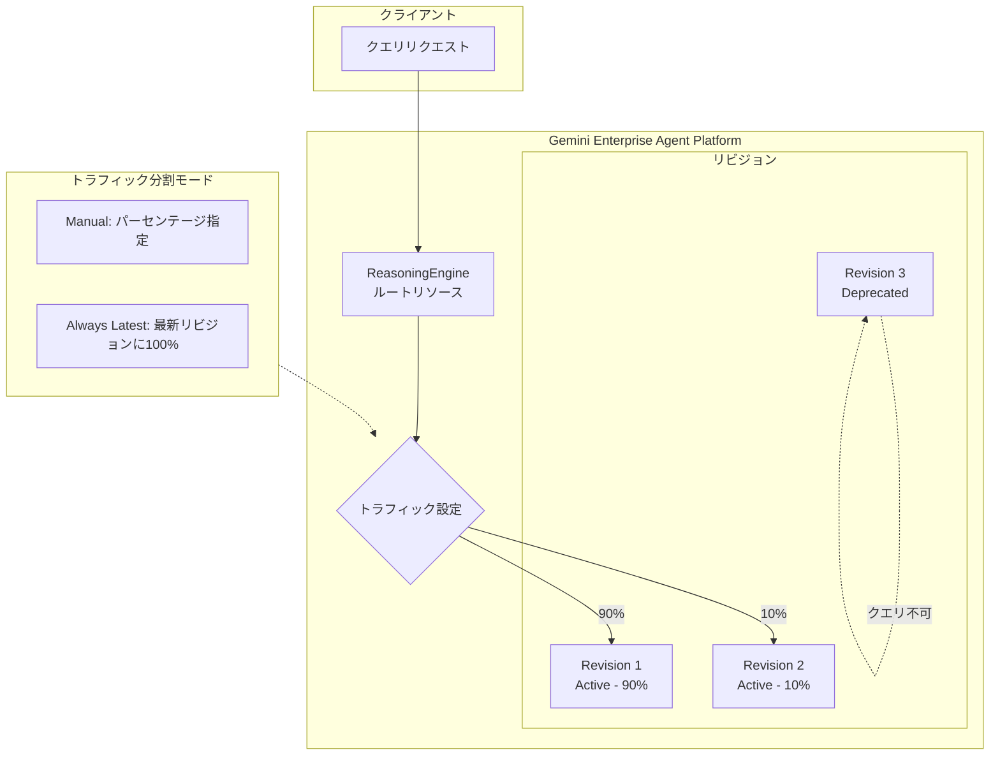

# Gemini Enterprise Agent Platform: エージェントリビジョン管理とトラフィック分割

**リリース日**: 2026-05-15

**サービス**: Gemini Enterprise Agent Platform

**機能**: Manage agent revisions and traffic splitting

**ステータス**: Preview (Public Preview)

[このアップデートのインフォグラフィックを見る](https://takech9203.github.io/google-cloud-news-summary/20260515-gemini-enterprise-agent-platform-revisions-traffic-splitting.html)

## 概要

Gemini Enterprise Agent Platform において、エージェントリビジョン管理とトラフィック分割機能が Public Preview として利用可能になりました。この機能により、デプロイされたエージェントのイミュータブル（不変）なリビジョン（バージョン）を作成し、複数のアクティブなリビジョン間でトラフィックを分割することができます。

この機能は、カナリアデプロイメントや新しいエージェントバージョンの安全なテストを可能にするもので、エージェントの本番運用における信頼性とリスク管理を大幅に向上させます。リビジョンの作成機能は常に有効であり、明示的に有効化する必要はありません。

現時点では、リビジョンとトラフィック分割は v1beta1 API を通じて利用可能です。Console、Agent Platform SDK、REST API のいずれからも設定が可能です。

**アップデート前の課題**

- エージェントの新バージョンをデプロイする際、全トラフィックが即座に新バージョンに切り替わるため、問題発生時の影響範囲が大きかった
- エージェントの以前のバージョンに迅速にロールバックする仕組みが標準で提供されていなかった
- 新しいエージェントバージョンを一部のトラフィックでテストしてから全面展開する段階的なデプロイメント戦略が取れなかった

**アップデート後の改善**

- エージェントのイミュータブルなリビジョンを作成し、バージョン管理が可能になった
- 複数リビジョン間でパーセンテージベースのトラフィック分割が可能になり、カナリアデプロイメントが実現した
- 問題発生時にトラフィック設定を変更するだけで即座にロールバックが可能になった
- 特定のリビジョンに直接クエリを送信して個別テストすることも可能になった

## アーキテクチャ図



エージェントへのクエリはルート ReasoningEngine リソースを経由し、トラフィック設定に基づいて各アクティブリビジョンに分散されます。Deprecated 状態のリビジョンにはトラフィックが送信されません。

## サービスアップデートの詳細

### 主要機能

1. **イミュータブルリビジョンの作成**
   - エージェントの versioned fields を更新すると、自動的に新しいイミュータブルリビジョンが作成される
   - リビジョンの作成機能は常に有効であり、追加の設定は不要
   - 各リビジョンは一意のリソース名で識別される

2. **トラフィック分割**
   - Manual モード: 各リビジョンに整数パーセンテージでトラフィックを配分（合計100%）
   - Always Latest モード: 全トラフィックを最新リビジョンに自動ルーティング
   - ルート ReasoningEngine リソースへのクエリのみがトラフィック分割の対象

3. **リビジョン状態管理**
   - Active: クエリ受付可能な状態（トラフィック設定に応じてリクエストを受信）
   - Deprecated: クエリ不可の状態（削除対象候補）
   - 古いリビジョンの非推奨化・削除によるリソースクォータの管理

4. **特定リビジョンへの直接クエリ**
   - 特定のリビジョンリソースパスに直接クエリを送信可能
   - トラフィック分割ルールをバイパスして個別テストが可能
   - 特定リビジョンへのクエリ権限はルートエージェントへのクエリ権限とは独立

## 技術仕様

### Versioned Fields（リビジョン作成トリガー）

以下のフィールドを更新すると新しいリビジョンが作成されます。

| カテゴリ | フィールド |
|------|------|
| PackageSpec | pickleObjectGcsUri, dependencyFilesGcsUri, requirementsGcsUri, pythonVersion |
| DeploymentSpec | env[], secretEnv[], firstPartyImageOverride, agentServerMode, pscInterfaceConfig, minInstances, maxInstances, resourceLimits, containerConcurrency |
| その他 | classMethods[], agentFramework, SourceCodeSpec (source, languageSpec), identityType, agentCard[] |

Unversioned fields の更新は全リビジョンに共通で適用され、新しいリビジョンは作成されません。

### API バージョンとエンドポイント

```
PATCH https://{LOCATION}-aiplatform.googleapis.com/v1beta1/projects/{PROJECT_ID}/locations/{LOCATION}/reasoningEngines/{RESOURCE_ID}?update_mask=traffic_config
```

## 設定方法

### 前提条件

1. Gemini Enterprise Agent Platform にエージェントがデプロイ済みであること
2. v1beta1 API へのアクセスが可能であること
3. エージェントのリソース ID を把握していること

### 手順

#### ステップ 1: リビジョンの作成

versioned fields を更新してエージェントをアップデートすると、自動的に新しいリビジョンが作成されます。

```python
import vertexai
from google.genai import types as genai_types

http_options = genai_types.HttpOptions(
    api_version="v1beta1",
)

client = vertexai.Client(
    project="PROJECT_ID",
    location="LOCATION",
    http_options=http_options,
)
```

#### ステップ 2: リビジョンの一覧確認

```python
revisions = client.agent_engines.runtimes.revisions.list(
    name="projects/PROJECT_ID/locations/LOCATION/reasoningEngines/RESOURCE_ID"
)

for revision in revisions:
    print(revision)
```

#### ステップ 3: トラフィック分割の設定（パーセンテージベース）

```python
client.agent_engines.update(
    name="projects/PROJECT_ID/locations/LOCATION/reasoningEngines/RESOURCE_ID",
    config={
        "traffic_config": {
            "trafficSplitManual": {
                "targets": [
                    {
                        "runtimeRevisionName": "projects/PROJECT_ID/locations/LOCATION/reasoningEngines/RESOURCE_ID/runtimeRevisions/REVISION_ID_1",
                        "percent": 90,
                    },
                    {
                        "runtimeRevisionName": "projects/PROJECT_ID/locations/LOCATION/reasoningEngines/RESOURCE_ID/runtimeRevisions/REVISION_ID_2",
                        "percent": 10,
                    },
                ]
            }
        }
    },
)
```

#### ステップ 4: Console からの設定（代替方法）

1. Govern > Deployments に移動
2. エージェント名をクリック
3. Revisions タブを選択
4. Manage traffic をクリック
5. Split mode で Manual または Always latest を選択
6. Save で保存

## メリット

### ビジネス面

- **リスクの最小化**: カナリアデプロイメントにより、新バージョンの問題を本番環境で一部のトラフィックのみで検知でき、全ユーザーへの影響を回避できる
- **ダウンタイムの削減**: 問題発生時にトラフィック設定の変更だけで即座にロールバックが可能
- **段階的な展開**: ビジネスクリティカルなエージェントを安全に更新でき、品質保証プロセスに組み込みやすい

### 技術面

- **イミュータブル性**: 各リビジョンが不変であるため、動作の再現性と追跡可能性が保証される
- **柔軟なトラフィック制御**: パーセンテージベースの細かな制御が可能で、A/B テストやカナリアリリースに対応
- **API 互換性**: REST API と Agent Platform SDK の両方から操作可能で、CI/CD パイプラインへの統合が容易

## デメリット・制約事項

### 制限事項

- 現時点では v1beta1 API でのみ利用可能（Preview ステータス）
- トラフィック分割はルート ReasoningEngine リソースへのクエリのみが対象（特定リビジョンへの直接クエリはバイパスされる）
- パーセンテージは整数値のみ対応し、合計が100%になる必要がある
- Pre-GA 機能のため、サポートが限定的である可能性がある

### 考慮すべき点

- 古いリビジョンを放置するとリソースクォータを消費するため、定期的な非推奨化・削除が必要
- セキュリティ脆弱性を含む古いリビジョンが残存するリスクがあるため、適切なライフサイクル管理が必要
- 特定リビジョンへのクエリ権限とルートエージェントへのクエリ権限が独立しているため、IAM 設定に注意が必要

## ユースケース

### ユースケース 1: カナリアデプロイメント

**シナリオ**: 本番環境で稼働するカスタマーサポート AI エージェントの新バージョンをリリースする際、まず10%のトラフィックで動作を確認してから全面展開したい。

**実装例**:
```python
# 新リビジョン作成後、10%のトラフィックを新リビジョンに割り当て
client.agent_engines.update(
    name="projects/my-project/locations/us-central1/reasoningEngines/my-agent",
    config={
        "traffic_config": {
            "trafficSplitManual": {
                "targets": [
                    {"runtimeRevisionName": "...runtimeRevisions/rev-1", "percent": 90},
                    {"runtimeRevisionName": "...runtimeRevisions/rev-2", "percent": 10},
                ]
            }
        }
    },
)

# 問題なければ段階的に増加: 50/50 -> 100/0
```

**効果**: 新バージョンに問題があった場合、影響を受けるのは10%のトラフィックのみ。即座にトラフィックを元のリビジョンに戻すことで迅速にロールバック可能。

### ユースケース 2: A/B テスト

**シナリオ**: 異なるプロンプト設定や処理ロジックを持つ2つのエージェントバージョンの性能を比較したい。

**効果**: 同一条件下でリアルトラフィックを使った比較テストが可能になり、データに基づいた意思決定ができる。

### ユースケース 3: 安全なロールバック

**シナリオ**: 新バージョンのエージェントをデプロイしたが、応答品質の低下が検知されたため、即座に前バージョンに戻したい。

**効果**: トラフィック設定を変更するだけで、再デプロイを待たずに即座にロールバックが完了する。

## 関連サービス・機能

- **Agent Platform Runtime**: エージェントのデプロイ・実行環境。リビジョン管理はこのランタイム上で動作する
- **Cloud Logging / Cloud Trace**: リビジョン番号をメタデータとしてログに記録し、リビジョンごとのパフォーマンス監視が可能
- **Agent Development Kit (ADK)**: エージェント開発フレームワーク。開発したエージェントをリビジョン管理付きでデプロイ可能
- **IAM**: リビジョンごとのアクセス制御と権限管理

## 参考リンク

- [インフォグラフィック](https://takech9203.github.io/google-cloud-news-summary/20260515-gemini-enterprise-agent-platform-revisions-traffic-splitting.html)
- [公式リリースノート](https://docs.cloud.google.com/release-notes#May_15_2026)
- [ドキュメント: Manage revisions and traffic](https://docs.cloud.google.com/gemini-enterprise-agent-platform/scale/runtime/manage-revisions-and-traffic)
- [ドキュメント: Deploy an agent](https://docs.cloud.google.com/gemini-enterprise-agent-platform/scale/runtime/deploy-an-agent)

## まとめ

Gemini Enterprise Agent Platform のリビジョン管理とトラフィック分割機能は、エージェントの本番運用における安全性と柔軟性を大幅に向上させる重要なアップデートです。カナリアデプロイメント、A/B テスト、即座のロールバックが可能になることで、エンタープライズ規模でのエージェント運用におけるリスク管理が標準化されます。Preview 段階ではありますが、本番環境でエージェントを運用している組織は早期に評価を開始し、デプロイメントプロセスへの組み込みを検討することを推奨します。

---

**タグ**: #GeminiEnterpriseAgentPlatform #AgentRevisions #TrafficSplitting #CanaryDeployment #Preview #AgentRuntime #ReasoningEngine
