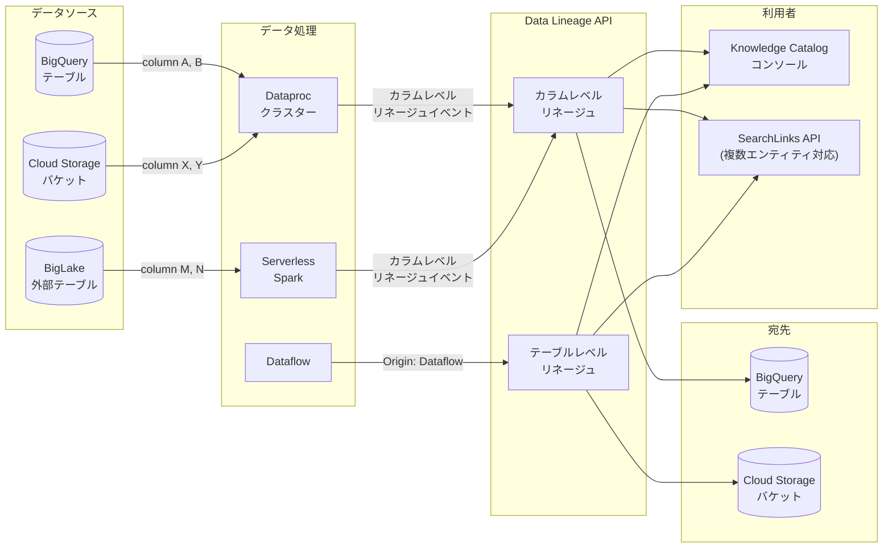

# Knowledge Catalog (Data Lineage): Dataproc カラムレベルリネージュ GA および Data Lineage API アップデート

**リリース日**: 2026-05-15

**サービス**: Knowledge Catalog (Data Lineage)

**機能**: Column-level lineage for Dataproc GA / Data Lineage API updates

**ステータス**: GA (一般提供)

[このアップデートのインフォグラフィックを見る](https://takech9203.github.io/google-cloud-news-summary/20260515-knowledge-catalog-column-level-lineage-ga.html)

## 概要

Knowledge Catalog (旧 Dataplex Universal Catalog) のデータリネージュ機能に関する 2 つの重要なアップデートが一般提供 (GA) となった。1 つ目は、Dataproc (Managed Service for Apache Spark) におけるカラムレベルリネージュの GA 化であり、BigQuery、BigLake 外部テーブル、Cloud Storage バケットなどのリソース間で個別カラム単位のデータフローを追跡できるようになった。2 つ目は、Data Lineage API の機能強化であり、SearchLinks メソッドの複数エンティティ検索対応、カラムレベルリネージュ情報のサポート、および Dataflow の Origin レポートが追加された。

これらのアップデートにより、データエンジニアやデータガバナンス担当者は、Spark ベースのデータパイプラインにおけるカラム単位の影響分析や根本原因分析をより詳細に実行できるようになる。特に、BigQuery と Dataproc/Spark を組み合わせた ETL パイプラインにおいて、どのソースカラムがどの宛先カラムに変換されているかを正確に把握できる点が大きな価値となる。

**アップデート前の課題**

- Dataproc/Spark ジョブにおけるリネージュはテーブルレベルのみで、個別カラムの依存関係を追跡できなかった
- SearchLinks API で複数のソース/ターゲットエンティティを同時に検索できず、1 回の API 呼び出しにつき 1 エンティティしか指定できなかった
- Dataflow がリネージュ情報の Origin (起源) として明示的にレポートされなかった
- カラムレベルの影響分析を行うには、BigQuery ジョブに限定されていた (2025 年 9 月 GA)

**アップデート後の改善**

- Dataproc クラスターおよび Serverless for Apache Spark からのカラムレベルリネージュが GA として利用可能になった
- SearchLinks メソッドで `sources` / `targets` パラメータにより最大 20 エンティティを一括検索可能になった
- Data Lineage API がカラムレベルリネージュ情報の受け渡しと返却をサポートするようになった
- Process リソースが Dataflow を Origin として報告するようになり、パイプラインの可視性が向上した

## アーキテクチャ図



Dataproc/Serverless Spark からのカラムレベルリネージュイベントが Data Lineage API に送信され、Knowledge Catalog コンソールや SearchLinks API を通じて可視化・検索できるアーキテクチャを示す。

## サービスアップデートの詳細

### 主要機能

1. **Dataproc カラムレベルリネージュ (GA)**
   - Dataproc クラスターおよび Serverless for Apache Spark ジョブからのカラムレベルリネージュを自動収集
   - BigQuery、BigLake 外部テーブル、Cloud Storage バケット間の個別カラムのデータフローを追跡
   - テーブルレベルリネージュに加え、カラム間の変換関係を可視化
   - 2025 年 9 月の BigQuery カラムレベルリネージュ GA に続く、Dataproc 向けの拡張

2. **SearchLinks メソッドの複数エンティティ対応**
   - `sources` パラメータで複数のソースエンティティ参照を指定可能 (最大 20 エンティティ)
   - `targets` パラメータで複数のターゲットエンティティ参照を指定可能 (最大 20 エンティティ)
   - 1 回の API 呼び出しで複数アセットのリネージュリンクを効率的に検索

3. **カラムレベルリネージュの API サポート**
   - Data Lineage API でカラムレベルリネージュ情報の送信と取得が可能
   - Link リソースに `dependencyInfo` フィールドが追加され、カラム間の依存関係タイプを記録
   - カスタムデータソースからのカラムレベルリネージュのインポートにも対応

4. **Dataflow Origin レポート**
   - Process リソースが Dataflow をリネージュ生成元として報告
   - Dataflow パイプラインによるデータ変換の出所を明確に識別可能

## 技術仕様

### SearchLinks API の新しいリクエスト形式

| 項目 | 詳細 |
|------|------|
| エンドポイント | `POST https://datalineage.googleapis.com/v1/{parent}:searchLinks` |
| 新パラメータ (sources) | 複数のソースエンティティ参照を一括指定 |
| 新パラメータ (targets) | 複数のターゲットエンティティ参照を一括指定 |
| 最大エンティティ数 | MultipleEntityReference 内で最大 20 エンティティ |
| 制約 | 同一 MultipleEntityReference 内のすべてのエンティティは同じ fullyQualifiedName を持つ必要がある |

### MultipleEntityReference の JSON 構造

```json
{
  "pageSize": 100,
  "sources": {
    "entities": [
      {"fullyQualifiedName": "bigquery:project.dataset.table1"},
      {"fullyQualifiedName": "bigquery:project.dataset.table2"}
    ]
  }
}
```

### カラムレベルリネージュの制限事項

| 項目 | 制限 |
|------|------|
| リンク数上限 | 1 ジョブあたり 1,500 カラムレベルリンクまで (超過時はテーブルレベルのみ) |
| サポートカラム | トップレベルカラムのみ (STRUCT/JSON のネストフィールドは非対応) |
| 保持期間 | 30 日間 |
| グラフ深度 | コンソールで最大 20 レベル、10,000 リンク/方向 |
| パーティションカラム | `_PARTITIONDATE`、`_PARTITIONTIME` は非対応 |
| 検索制約 | column-to-column の明示的リンクのみ検索可能 (テーブルレベルとの横断検索不可) |

## 設定方法

### 前提条件

1. Data Lineage API が有効化されていること
2. Dataproc クラスターまたは Serverless for Apache Spark が対象プロジェクトで利用可能であること
3. 適切な IAM ロール (`roles/datalineage.viewer`) が付与されていること

### 手順

#### ステップ 1: Data Lineage API の有効化

```bash
gcloud services enable datalineage.googleapis.com --project=PROJECT_ID
```

Data Lineage API を有効化すると、Managed Service for Apache Spark のリネージュ収集はデフォルトで有効になる。

#### ステップ 2: リネージュ収集の制御 (オプション)

```bash
# プロジェクトレベルでリネージュ収集を無効化する場合
gcloud dataplex lineage config update \
  --project=PROJECT_ID \
  --location=LOCATION \
  --managed-spark-lineage=disabled
```

組織、フォルダ、プロジェクトの各レベルで制御可能。評価順序はプロジェクト → 最も近い親フォルダ → 組織 → システムデフォルト。

#### ステップ 3: SearchLinks API でのカラムレベルリネージュ検索

```bash
curl -X POST \
  "https://datalineage.googleapis.com/v1/projects/PROJECT_ID/locations/LOCATION:searchLinks" \
  -H "Authorization: Bearer $(gcloud auth print-access-token)" \
  -H "Content-Type: application/json" \
  -d '{
    "source": {
      "fullyQualifiedName": "bigquery:project.dataset.table"
    },
    "pageSize": 50
  }'
```

レスポンスの `dependencyInfo` フィールドでカラムレベルの依存関係を確認できる。

## メリット

### ビジネス面

- **データガバナンスの強化**: カラム単位でデータの来歴を追跡でき、コンプライアンス要件への対応が容易になる
- **影響分析の精度向上**: スキーマ変更やカラム削除の影響範囲をカラム単位で正確に把握できる
- **データ品質の可視化**: カラム単位のデータフローにより、品質問題の根本原因を迅速に特定できる

### 技術面

- **API 効率の向上**: SearchLinks の複数エンティティ対応により、バッチ検索が可能になり API 呼び出し回数を削減
- **Spark パイプラインの透明性**: Dataproc/Serverless Spark ジョブのカラムレベル変換を自動追跡
- **マルチサービス対応**: BigQuery (2025 年 9 月 GA) に加え Dataproc にも拡張され、エンドツーエンドのカラムリネージュが実現
- **Dataflow の識別性向上**: Process リソースの Origin として Dataflow が明示されることで、パイプライン管理が容易に

## デメリット・制約事項

### 制限事項

- リネージュ情報の保持期間は 30 日間のみ
- 1 ジョブあたり 1,500 カラムレベルリンクを超える場合、カラムレベルリネージュは収集されずテーブルレベルのみとなる
- STRUCT や JSON 型のネストフィールドはカラムレベルリネージュの対象外
- パーティションカラム (`_PARTITIONDATE`、`_PARTITIONTIME`) はリネージュグラフで認識されない
- BigQuery ロードジョブおよびルーティンではカラムレベルリネージュは収集されない

### 考慮すべき点

- Data Lineage API はプロジェクト単位で有効化されるため、有効化すると複数サービスからリネージュが自動的に収集され始め、課金に影響する可能性がある
- カラムレベルリネージュの検索は明示的な column-to-column リンクのみ対象であり、テーブルレベルリンクとの横断検索は不可
- リネージュ収集の制御機能 (組織/フォルダ/プロジェクトレベル) は現在 Preview 段階

## ユースケース

### ユースケース 1: ETL パイプラインのカラム影響分析

**シナリオ**: データエンジニアが BigQuery のソーステーブルのカラム定義を変更する前に、Dataproc Spark ジョブを経由した下流への影響を確認したい。

**実装例**:
```bash
# 特定カラムを含むテーブルのリネージュリンクを検索
curl -X POST \
  "https://datalineage.googleapis.com/v1/projects/my-project/locations/us-central1:searchLinks" \
  -H "Authorization: Bearer $(gcloud auth print-access-token)" \
  -H "Content-Type: application/json" \
  -d '{
    "source": {
      "fullyQualifiedName": "bigquery:my-project.raw_data.customer_events"
    },
    "pageSize": 100
  }'
```

**効果**: カラム `customer_id` の変更が、Spark 変換後のどの宛先テーブル・カラムに影響するかを即座に把握でき、変更リスクを定量的に評価できる。

### ユースケース 2: コンプライアンス対応のためのデータ系統追跡

**シナリオ**: GDPR/個人情報保護の観点から、個人を特定できるカラム (PII) がどのシステムに伝播しているかを監査する必要がある。

**効果**: SearchLinks API の複数エンティティ対応を活用し、複数の PII カラムを含むテーブルを一括検索することで、監査プロセスを効率化できる。最大 20 エンティティを 1 回の API 呼び出しで検索可能。

### ユースケース 3: データ品質問題の根本原因分析

**シナリオ**: BI ダッシュボードの特定カラムに異常値が検出された際、Dataproc Spark パイプラインを遡って原因となるソースカラムを特定する。

**効果**: Knowledge Catalog コンソールでカラムレベルリネージュグラフを辿ることで、異常値の発生源を迅速に特定し、修正すべき Spark ジョブとカラム変換ロジックを明確にできる。

## 料金

Knowledge Catalog は premium processing SKU を使用してデータリネージュの課金を行う。

- Cloud Billing レポートでリネージュの課金を他の Knowledge Catalog 課金と分離するには、ラベル `goog-dataplex-workload-type` の値 `LINEAGE` を使用する
- Data Lineage API の Origin `sourceType` に `CUSTOM` 以外の値を指定すると追加コストが発生する
- 詳細な料金体系は [Knowledge Catalog 料金ページ](https://cloud.google.com/dataplex/pricing) を参照

## 関連サービス・機能

- **BigQuery**: カラムレベルリネージュの最初の GA 対象 (2025 年 9 月)。今回の Dataproc 対応と合わせてエンドツーエンドの追跡が可能
- **Managed Service for Apache Spark (Dataproc)**: リネージュイベントの生成元。クラスターおよび Serverless 両方でカラムレベルリネージュをサポート
- **Dataflow**: Process リソースの Origin として新たにサポート。ストリーミング/バッチパイプラインのリネージュ可視化
- **Cloud Data Fusion**: テーブルレベルリネージュをサポートする統合 ETL サービス
- **Managed Service for Apache Airflow (Cloud Composer)**: ワークフローオーケストレーションにおけるリネージュ統合
- **BigLake (Google Cloud Lakehouse)**: 外部テーブルのリネージュ追跡対象
- **Vertex AI**: パイプライン、Feature Store のリネージュ追跡

## 参考リンク

- [インフォグラフィック](https://takech9203.github.io/google-cloud-news-summary/20260515-knowledge-catalog-column-level-lineage-ga.html)
- [公式リリースノート](https://docs.cloud.google.com/release-notes#May_15_2026)
- [About data lineage](https://docs.cloud.google.com/dataplex/docs/about-data-lineage)
- [Data Lineage API (REST)](https://docs.cloud.google.com/dataplex/docs/reference/data-lineage/rest)
- [Data Lineage API (RPC)](https://docs.cloud.google.com/dataplex/docs/reference/data-lineage/rpc)
- [SearchLinks API リファレンス](https://docs.cloud.google.com/dataplex/docs/reference/data-lineage/rest/v1/projects.locations/searchLinks)
- [Lineage views in the console](https://docs.cloud.google.com/dataplex/docs/lineage-views)
- [Using Spark data lineage](https://docs.cloud.google.com/managed-spark/docs/guides/spark-lineage)
- [料金ページ](https://cloud.google.com/dataplex/pricing)

## まとめ

今回のアップデートにより、Dataproc/Serverless Spark パイプラインにおけるカラムレベルのデータリネージュが GA となり、2025 年 9 月の BigQuery 対応に続いてエンドツーエンドのカラム追跡が実現した。Data Lineage API の SearchLinks メソッド強化 (複数エンティティ対応) と Dataflow Origin サポートにより、大規模データ基盤におけるガバナンスと影響分析の効率が大幅に向上する。データガバナンスやコンプライアンス対応を強化したい組織は、Data Lineage API を有効化し、Spark パイプラインのカラムレベルリネージュ可視化を活用することを推奨する。

---

**タグ**: #KnowledgeCatalog #DataLineage #Dataproc #ColumnLevelLineage #GA #DataGovernance #Spark #BigQuery #DataLineageAPI
